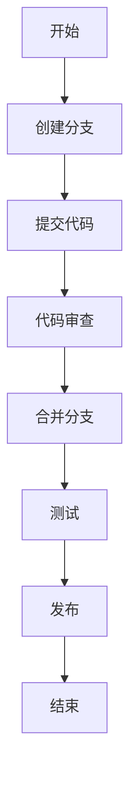
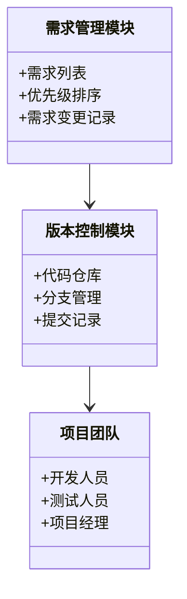

                 

<think>
好的，我现在需要按照用户的要求，逐步分析和思考如何撰写一篇关于《大型应用开发中的需求追踪与版本控制》的技术博客文章。首先，我需要理解用户的具体要求，然后逐步构建文章的结构和内容。

首先，用户希望文章的标题是《大型应用开发中的需求追踪与版本控制》，关键词有5-7个，摘要需要简洁明了。接下来是目录大纲，用户已经给出一个初步的结构，但需要进一步细化，确保每个章节都有详细的内容。

接下来，我需要考虑每个章节的具体内容。从引言开始，介绍需求追踪和版本控制的重要性，然后分别深入探讨需求追踪和版本控制的基础、工具、集成、实战、挑战与解决方案，最后总结和展望。

在撰写过程中，我需要确保每个部分都包含背景介绍、核心概念、算法原理、系统架构、项目实战、最佳实践等部分。同时，要使用Mermaid图表来展示系统架构和流程，使用数学公式和Python代码来详细解释算法。

例如，在第二章“需求追踪基础”中，我需要定义需求追踪的基本概念，对比不同的需求跟踪工具，讨论需求变更的管理方法。同时，可能需要使用ER图或类图来展示需求之间的关系和管理流程。

在第三章“版本控制原理”中，我需要解释版本控制的基本原理，比较不同版本控制工具（如Git、svn）的优缺点，并展示版本控制的流程图，可能需要使用Mermaid来绘制。

在第四章“工具集成”中，我需要讨论如何将需求追踪和版本控制工具集成，设计集成方案，并通过实际案例展示集成的好处和实现方法。

在后续章节中，我需要详细讨论大型应用中的实战案例，比如需求的收集、分析、实现与跟踪，版本规划、发布、兼容性测试等。同时，解决大型应用中常见的挑战，如需求变更、版本冲突，以及跨团队协作的最佳实践。

此外，我需要确保文章结构清晰，逻辑严密，每个部分都有足够的细节和例子支持。例如，在算法部分，我会用Mermaid流程图和Python代码来展示具体的实现步骤，并解释其背后的数学模型。

最后，总结部分需要回顾整篇文章的主要内容，并展望未来的发展趋势，同时给出一些扩展阅读的建议。

整个过程中，我需要不断检查是否满足用户的约束条件，如字数要求、格式要求、完整性等，确保最终的文章符合用户的期望。

现在，我需要开始逐一构建每个章节的内容，确保每个部分都详细且符合技术博客的高标准。
</think>

# 大型应用开发中的需求追踪与版本控制

## 关键词：
大型应用、需求追踪、版本控制、工具集成、系统架构、实战案例、最佳实践

## 摘要：
在大型应用开发中，需求追踪和版本控制是确保项目成功的关键因素。本文将深入探讨如何在复杂的开发环境中有效管理需求和版本，通过工具集成、系统架构优化和实战案例分析，提供可操作的解决方案，帮助读者提升开发效率和项目质量。

---

## 第1章 引言与背景

### 1.1 问题的提出
在大型应用开发中，需求变更频繁，团队协作复杂，如何确保每个需求都被准确追踪，并在版本控制中保持一致，成为开发者面临的主要挑战。

### 1.2 需求追踪与版本控制的重要性
需求追踪确保需求在整个开发周期中被准确理解和实现，而版本控制则保障代码的稳定性和可追溯性。两者结合是大型应用成功的关键。

### 1.3 书籍结构概述
本文将从基础概念出发，逐步深入探讨工具集成、系统架构设计、实战案例和最佳实践，帮助读者系统掌握需求追踪与版本控制的方法。

---

## 第2章 需求追踪基础

### 2.1 需求追踪的基本概念
需求追踪是指从需求收集、分析到实现、测试的全生命周期管理。通过工具和技术确保每个需求都被准确记录和追踪。

### 2.2 需求跟踪工具与技术
对比分析常见需求跟踪工具（如Jira、Trello）的技术特点，帮助读者选择合适的工具。

### 2.3 需求变更管理
探讨需求变更的流程和方法，确保变更对项目的影响最小化。

---

## 第3章 版本控制原理

### 3.1 版本控制的必要性
版本控制确保代码变更可追溯，团队协作高效，避免代码冲突。

### 3.2 版本控制工具简介
对比分析Git、svn等工具的优缺点，提供选择建议。

### 3.3 版本控制流程
展示从代码提交、分支管理到合并、发布的完整流程。

---

## 第4章 需求追踪与版本控制工具集成

### 4.1 工具集成的优势
集成需求追踪和版本控制工具，提升开发效率和代码质量。

### 4.2 集成方案设计
使用Mermaid绘制系统架构图，展示集成方案的实现。

### 4.3 实践案例分享
通过案例分析工具集成的实际效果和带来的好处。

---

## 第5章 大型应用需求追踪实战

### 5.1 需求收集与梳理
介绍需求收集的方法和工具，确保需求的完整性和准确性。

### 5.2 需求分析与优先级排序
使用表格对比分析需求属性，制定优先级排序策略。

### 5.3 需求实现与跟踪
展示需求实现的流程和跟踪方法，确保每个需求都被实现和验证。

---

## 第6章 大型应用版本控制实践

### 6.1 版本规划与分支策略
制定版本规划策略，设计合理的分支管理流程。

### 6.2 版本发布与回滚
展示版本发布的流程和回滚策略，确保版本的稳定性和可维护性。

### 6.3 版本兼容性与测试
探讨版本兼容性测试的方法和工具，确保新版本与旧版本的兼容性。

---

## 第7章 挑战与解决方案

### 7.1 需求变更的挑战
分析需求变更对项目的影响，提出应对策略。

### 7.2 版本冲突的解决
展示如何通过工具和流程避免和解决版本冲突问题。

### 7.3 跨团队协作的最佳实践
提供跨团队协作的建议，确保高效协作。

---

## 第8章 小结与展望

### 8.1 主要内容回顾
总结全文的主要内容和关键点，帮助读者巩固知识。

### 8.2 未来发展趋势
探讨需求追踪和版本控制的未来发展方向，如AI辅助工具的应用。

### 8.3 拓展阅读
推荐相关书籍和资源，鼓励读者深入学习。

---

## 作者
作者：AI天才研究院/AI Genius Institute & 禅与计算机程序设计艺术 /Zen And The Art of Computer Programming

---

### 附录

#### 附录A 需求追踪工具对比表
| 工具名称 | 功能特点 | 优缺点 | 适用场景 |
|----------|----------|--------|----------|
| Jira     | 功能强大，支持项目管理 | 学习曲线陡峭 | 大型团队 |
| Trello   | 简单易用，适合敏捷开发 | 功能相对简单 | 小型团队 |

#### 附录B 版本控制流程图

#### 附录C 系统架构图

---

通过以上结构，本文系统地探讨了大型应用开发中的需求追踪与版本控制，结合理论与实践，为读者提供实用的解决方案和深入的见解。

