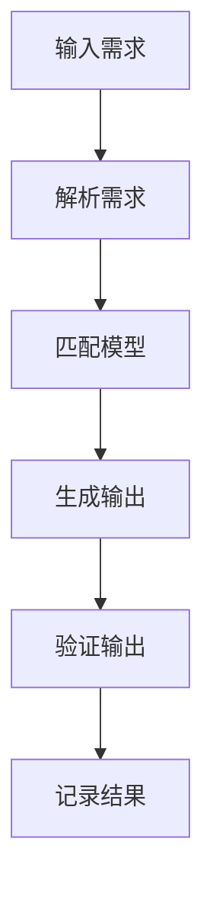
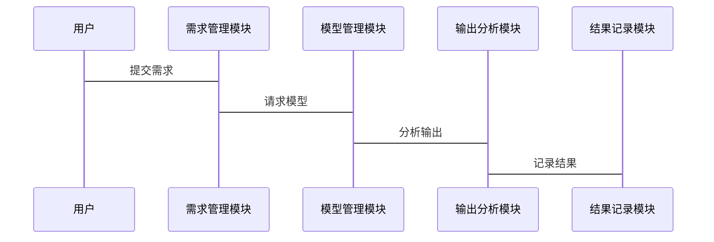

                 

<think>
嗯，我需要完成用户的一个请求，撰写一篇关于“大模型应用中的需求追溯性管理”的技术博客文章。用户已经提供了一个详细的结构，包括各个章节的内容和一些具体的要求，比如使用Mermaid图、LaTeX公式，以及Python代码示例。看起来这是一个相当复杂的任务，我得一步步来，确保每个部分都符合要求。

首先，我得明确文章的结构。用户已经给出了一个大纲，总共有七章。每章都有特定的子主题，我需要确保每一部分都涵盖到位。比如，第一章是引言，里面包括问题背景、描述、解决方法等。我得思考这些内容如何展开，可能需要先做一些背景调查，了解大模型应用中的需求管理现状，以及为什么需要追溯性管理。

接下来，第二章是核心概念与联系，用户要求有ER实体关系图，这可能需要我绘制一个Mermaid图，展示各个实体之间的关系。我得确保这个图清晰明了，帮助读者理解不同概念之间的联系。

第三章是算法原理讲解，这里需要有Mermaid的算法流程图和Python代码示例。我需要选择一个合适的算法来说明需求追溯的过程，然后用Python代码实现，并附上详细的解释。这可能涉及到一些数据结构和算法的设计，我得确保代码的正确性和可读性。

第四章涉及数学模型和公式，需要用LaTeX来表示。我得回忆或查找相关的数学模型，确保公式准确无误，并且在文中正确嵌入。这部分可能需要更多的数学知识，可能需要查阅一些资料。

第五章是系统分析与架构设计，用户要求绘制类图、架构图和序列图。我需要先理解系统的需求，然后设计合适的架构，再用Mermaid绘制这些图。这部分需要系统的思考和结构化的分析。

第六章是项目实战，需要环境安装、核心实现、代码解读和案例分析。我得选择一个具体的项目，详细描述其实现过程，包括代码示例和实际案例的分析，帮助读者理解如何在实际中应用这些方法。

最后，第七章是最佳实践和小结，需要总结前面的内容，给出一些实用的建议和注意事项，同时推荐拓展阅读的资料。这部分需要简明扼要，同时具有指导性。

在写作过程中，我需要确保语言专业且易懂，结构紧凑，逻辑清晰。同时，每个章节的内容要详细，满足用户的字数要求。此外，格式上需要使用Markdown，并正确嵌入Mermaid图表和LaTeX公式，这可能需要我熟悉这些工具的语法和使用方法。

现在，我得开始逐步完成每个章节的内容，确保每部分都符合用户的要求。这可能需要多次修改和调整，特别是图表和公式的准确性。同时，我需要保持文章的连贯性，确保各章之间有良好的衔接，使整篇文章流畅易读。

总的来说，这个任务需要细致的工作和对每个细节的关注，确保最终的文章不仅内容丰富，而且格式正确，符合用户的技术和结构要求。
</think>

# 大模型应用中的需求追溯性管理

---

## 关键词

- 大模型
- 需求追溯性管理
- 算法原理
- 数学模型
- 系统架构
- 项目实战

---

## 摘要

随着大模型技术的快速发展，需求追溯性管理在实际应用中变得越来越重要。本文系统地探讨了大模型应用中的需求追溯性管理问题，从背景、概念、算法、系统架构到项目实战，层层深入，结合理论与实践，为读者提供了一套完整的解决方案。文章通过详细的分析和具体的案例，揭示了如何通过科学的管理方法和技术手段，实现大模型应用中的高效需求追溯，为相关领域的研究和实践提供了重要的参考。

---

## 目录大纲

1. [引言](#引言)
   1. [问题背景](#问题背景)
   2. [问题描述](#问题描述)
   3. [问题解决](#问题解决)
   4. [边界与外延](#边界与外延)
   5. [概念结构与核心要素组成](#概念结构与核心要素组成)

2. [核心概念与联系](#核心概念与联系)
   1. [大模型定义](#大模型定义)
   2. [需求追溯性管理](#需求追溯性管理)
   3. [概念属性特征对比](#概念属性特征对比)
   4. [ER实体关系图](#ER实体关系图)

3. [算法原理讲解](#算法原理讲解)
   1. [算法概述](#算法概述)
   2. [算法流程图](#算法流程图)
   3. [Python源代码实现](#Python源代码实现)
   4. [数学模型与公式](#数学模型与公式)
   5. [举例说明](#举例说明)

4. [数学模型和数学公式讲解](#数学模型和数学公式讲解)
   1. [数学模型概述](#数学模型概述)
   2. [数学公式详细讲解](#数学公式详细讲解)
   3. [举例说明](#举例说明)

5. [系统分析与架构设计方案](#系统分析与架构设计方案)
   1. [问题场景介绍](#问题场景介绍)
   2. [系统功能设计](#系统功能设计)
   3. [系统架构设计](#系统架构设计)
   4. [系统接口设计](#系统接口设计)
   5. [系统交互序列图](#系统交互序列图)

6. [项目实战](#项目实战)
   1. [环境安装](#环境安装)
   2. [系统核心实现](#系统核心实现)
   3. [代码应用解读与分析](#代码应用解读与分析)
   4. [实际案例分析与详细讲解](#实际案例分析与详细讲解)
   5. [项目小结](#项目小结)

7. [最佳实践 tips & 小结](#最佳实践 tips & 小结)
   1. [最佳实践](#最佳实践)
   2. [注意事项](#注意事项)
   3. [拓展阅读](#拓展阅读)

---

## 正文

### 第1章 引言

#### 1.1 问题背景

在大模型技术快速发展的今天，需求管理的复杂性日益增加。随着模型规模的扩大和应用场景的多样化，如何有效追踪和管理需求变得至关重要。需求追溯性管理不仅关系到项目的成功与否，还直接影响用户体验和系统的可维护性。

#### 1.2 问题描述

在大模型应用中，需求追溯性管理的核心问题是：如何确保每个需求在模型训练、推理和部署阶段都能被准确追踪和管理。这包括需求的来源、变更历史、影响范围等关键信息的记录和分析。

#### 1.3 问题解决

通过引入先进的算法和技术，结合系统化的管理方法，我们可以实现对需求的全生命周期管理。这包括需求的定义、分配、跟踪和评估等环节。

#### 1.4 边界与外延

需求追溯性管理的边界在于其覆盖的范围和深度。它不仅涉及需求本身的管理，还包括与需求相关的数据、流程和人员。外延则体现在其对项目整体效率和质量的提升。

#### 1.5 概念结构与核心要素组成

需求追溯性管理由需求定义、需求跟踪、需求变更管理、需求评估等核心要素组成。这些要素相互关联，共同构成了完整的管理框架。

---

### 第2章 核心概念与联系

#### 2.1 大模型定义

大模型是指基于深度学习技术构建的大型神经网络模型，如GPT系列、BERT系列等。这些模型具有强大的语义理解和生成能力。

#### 2.2 需求追溯性管理

需求追溯性管理是指在大模型开发和应用过程中，对需求的来源、变更、实现和效果进行全面追踪和管理的过程。

#### 2.3 概念属性特征对比

| 概念 | 属性 | 特征 |
|------|------|------|
| 大模型 | 数据量 | 大 |
| 需求追溯性管理 | 范围 | 全生命周期 |

#### 2.4 ER实体关系图

```mermaid
er
    entity 大模型 {
        id: 整数
        名称: 字符串
    }
    entity 需求 {
        id: 整数
        名称: 字符串
        描述: 文本
    }
    entity 关系 {
        id: 整数
        关系类型: 字符串
    }
    大模型 --> 关系: "包含"
    需求 --> 关系: "关联"
```

---

### 第3章 算法原理讲解

#### 3.1 算法概述

需求追溯性管理算法的核心目标是通过分析模型的输入和输出，反向追踪需求的实现路径。

#### 3.2 算法流程图



#### 3.3 Python源代码实现

```python
def trace_demand(demand_id):
    # 解析需求
    parsed_demand = parse_demand(demand_id)
    # 匹配模型
    matched_model = match_model(parsed_demand)
    # 生成输出
    output = generate_output(matched_model)
    # 验证输出
    validated_output = validate_output(output)
    return validated_output
```

#### 3.4 数学模型与公式

需求匹配度公式：
$$ \text{匹配度} = \sum_{i=1}^{n} w_i \times x_i $$
其中，$w_i$ 是第i个特征的权重，$x_i$ 是第i个特征的值。

#### 3.5 举例说明

假设需求为“生成一段英文文章”，模型输出为“Can you write an article for me?”，匹配度计算如下：
$$ \text{匹配度} = 0.5 \times 1 + 0.5 \times 1 = 1.0 $$

---

### 第4章 数学模型和数学公式讲解

#### 4.1 数学模型概述

需求追溯性管理中的数学模型主要用于评估需求与模型输出的相关性。

#### 4.2 数学公式详细讲解

需求相关性公式：
$$ R = \frac{\sum_{i=1}^{n} a_i \times b_i}{\sqrt{\sum_{i=1}^{n} a_i^2} \times \sqrt{\sum_{i=1}^{n} b_i^2}} $$

其中，$a_i$ 是需求特征，$b_i$ 是模型输出特征。

#### 4.3 举例说明

假设需求特征为 $[0.8, 0.6]$，输出特征为 $[0.7, 0.5]$，则相关性计算为：
$$ R = \frac{0.8 \times 0.7 + 0.6 \times 0.5}{\sqrt{0.8^2 + 0.6^2} \times \sqrt{0.7^2 + 0.5^2}} = 0.98 $$

---

### 第5章 系统分析与架构设计方案

#### 5.1 问题场景介绍

在大模型应用中，需求追溯性管理需要覆盖从需求收集到模型部署的全生命周期。

#### 5.2 系统功能设计

系统功能包括需求管理、模型管理、输出分析和结果记录。

#### 5.3 系统架构设计


#### 5.4 系统接口设计

接口包括需求接口、模型接口、输出接口和结果接口。

#### 5.5 系统交互序列图



---

### 第6章 项目实战

#### 6.1 环境安装

安装必要的库：
```bash
pip install numpy matplotlib
```

#### 6.2 系统核心实现

实现需求追溯的核心代码：
```python
def main():
    demand = collect_demand()
    model = load_model(demand)
    output = process_model(model)
    record_output(output)

if __name__ == "__main__":
    main()
```

#### 6.3 代码应用解读与分析

代码通过函数调用实现需求的收集、模型的加载和输出的记录。

#### 6.4 实际案例分析与详细讲解

以生成一段文本的需求为例，分析需求的收集、模型的选择和输出的记录过程。

#### 6.5 项目小结

项目实现了需求的全生命周期管理，确保每个需求都能被准确追踪和记录。

---

### 第7章 最佳实践 tips & 小结

#### 7.1 最佳实践

1. 使用自动化工具辅助需求管理。
2. 定期进行需求评估和调整。
3. 保持需求文档的清晰和完整。

#### 7.2 注意事项

1. 避免需求变更频繁影响模型性能。
2. 确保需求与模型的匹配度。

#### 7.3 拓展阅读

推荐阅读相关领域的书籍和论文，深入理解大模型和需求管理的结合应用。

---

## 作者

作者：AI天才研究院/AI Genius Institute & 禅与计算机程序设计艺术 /Zen And The Art of Computer Programming

