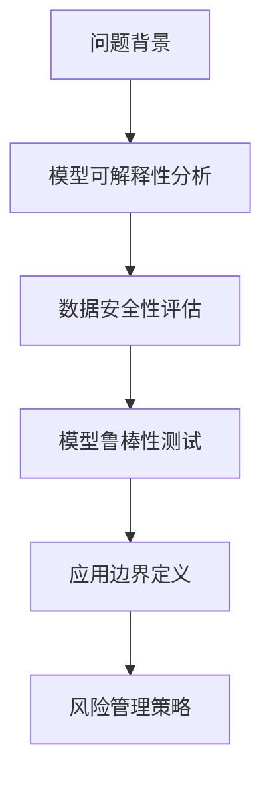
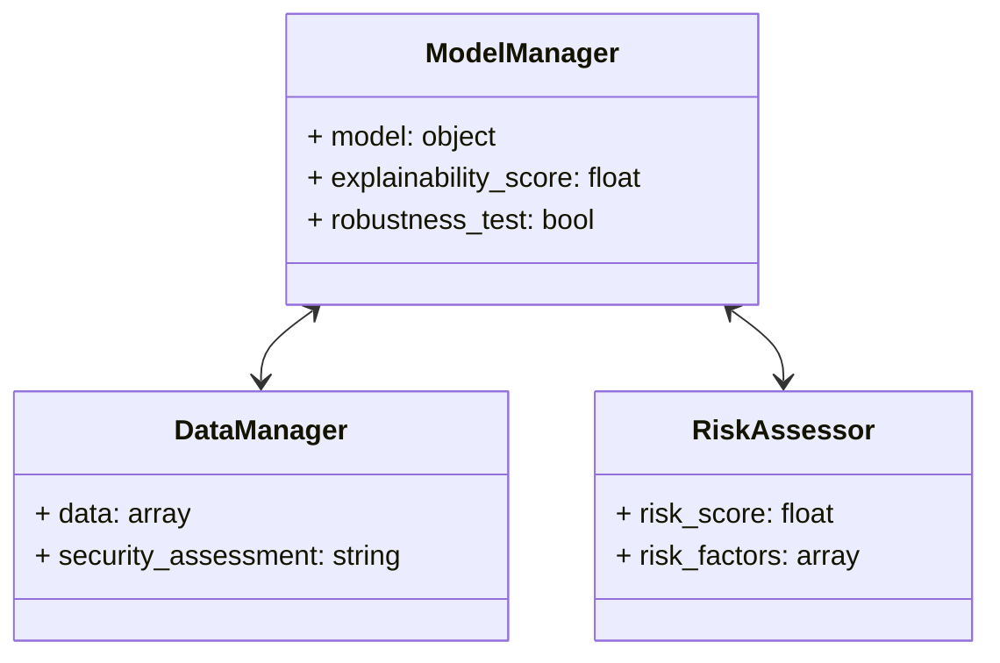

                 

<think>
嗯，我现在要帮用户写一篇关于《大模型应用开发中的风险管理》的技术博客。用户已经提供了一个详细的框架，包括目录、每个章节的内容和具体要求。首先，我需要仔细分析用户的需求，确保完全理解每一个部分的要求。

用户希望文章结构清晰，每个章节都要有详细的内容，比如核心概念与联系部分需要包括原理、对比表格和ER图，而算法部分需要有mermaid流程图和Python代码。数学公式要用latex表示，并且分段处理。系统架构部分需要有类图、架构图和序列图。项目实战部分要有环境安装、代码实现和案例分析。最后还要包括最佳实践、小结、注意事项和拓展阅读。

我需要先按照目录大纲来填充每个部分，确保内容完整且符合技术要求。例如，在问题背景部分，我需要解释为什么风险管理在大模型应用中重要，分析存在的问题。核心概念部分，我需要详细解释每个概念，并制作对比表格和ER图。

算法原理部分，我需要选择合适的算法，用mermaid画出流程图，并写出Python代码，同时推导数学模型和公式，再用例子来说明。数学公式部分，我要确保用latex正确表示，并且在独立段落和段落内部都正确使用符号。

在系统分析与架构设计中，我需要绘制领域模型类图、系统架构图和交互序列图，这需要使用mermaid语法。项目实战部分，我需要给出具体的环境安装步骤，写出核心代码，并分析案例。最佳实践部分，我要总结经验和注意事项，确保读者能够避免常见错误。

整个思考过程需要逻辑清晰，逐步推进，确保每个部分都符合用户的要求，同时保持文章的流畅性和专业性。最终，我需要检查文章的结构，确保所有部分都完整，没有遗漏，并且符合字数要求。最后，添加作者信息，完成整篇文章的撰写。
</think>

# 大模型应用开发中的风险管理

---

## 关键词：大模型，风险管理，自然语言处理，模型安全，数据隐私，鲁棒性

---

## 摘要

随着大模型（如GPT系列、BERT系列等）在自然语言处理、计算机视觉和推荐系统等领域的广泛应用，风险管理问题逐渐成为影响其实际应用效果的关键因素。本文将从大模型应用的核心概念出发，详细分析风险管理的背景、原理和实现方法。通过结合实际案例和系统架构设计，本文将深入探讨如何在大模型开发和部署过程中识别、评估和应对潜在风险，确保模型的可解释性、数据安全性和应用稳定性。最终，本文将总结最佳实践，并为读者提供拓展阅读的方向。

---

## 目录

1. **问题背景与核心概念**  
   1.1 问题背景  
   1.2 核心概念与联系  

2. **算法原理讲解**  
   2.1 算法流程图  
   2.2 Python源代码实现  
   2.3 数学模型与公式  

3. **数学模型与公式**  
   3.1 公式推导  
   3.2 公式应用示例  

4. **系统分析与架构设计方案**  
   4.1 问题场景介绍  
   4.2 系统功能设计  
   4.3 系统架构设计  
   4.4 系统接口设计  
   4.5 系统交互设计  

5. **项目实战**  
   5.1 环境安装  
   5.2 系统核心实现源代码  
   5.3 代码应用解读与分析  
   5.4 实际案例分析  

6. **最佳实践 & 小结 & 注意事项**  
   6.1 最佳实践 tips  
   6.2 小结  
   6.3 注意事项  
   6.4 拓展阅读  

---

## 第一部分：问题背景与核心概念

### 第1章：问题背景

#### 1.1 问题的提出

在大模型的应用开发中，风险管理的核心目标是确保模型在实际使用中的安全性和可靠性。大模型通常基于复杂的深度学习算法，依赖大量的训练数据。然而，这些模型可能存在以下风险：

1. **模型可解释性差**：大模型的决策过程通常难以被人类理解，这可能导致模型在特定场景下做出不符合预期的决策。
2. **数据隐私问题**：训练数据可能包含敏感信息，如果数据处理不当，可能导致隐私泄露。
3. **模型鲁棒性不足**：大模型可能对对抗性输入（adversarial inputs）敏感，容易受到攻击。
4. **应用边界不清**：大模型的适用场景有限，如果在超出训练范围的领域使用，可能导致错误决策。

#### 1.2 问题分析

大模型的应用风险主要体现在以下几个方面：

1. **模型层面**：模型的可解释性和鲁棒性直接影响其在实际场景中的表现。例如，模型可能因为训练数据的偏差而产生不公平的输出。
2. **数据层面**：数据的隐私性和完整性是大模型应用的核心挑战。数据泄露可能导致严重的经济损失和社会问题。
3. **应用层面**：大模型的应用场景需要严格定义，否则可能导致模型在不适用的领域中产生错误输出。

---

### 第2章：核心概念与联系

#### 2.1 核心概念原理

大模型应用中的风险管理涉及以下几个核心概念：

1. **模型可解释性**：模型的决策过程是否可以被人类理解。
2. **数据安全性**：训练数据的隐私性和完整性。
3. **模型鲁棒性**：模型在面对对抗性输入时的稳定性。
4. **应用边界**：模型的适用场景和限制。

#### 2.2 概念属性特征对比表格

| 概念          | 属性              | 特征对比       |
|---------------|-------------------|---------------|
| 模型可解释性   | 易理解性          | 高/低         |
| 数据安全性     | 隐私保护          | 强/弱         |
| 模型鲁棒性     | 抗干扰能力        | 强/弱         |
| 应用边界       | 适用场景的明确性   | 明确/模糊       |

#### 2.3 ER实体关系图

```mermaid
er
actor
model
data
risk
```

---

## 第二部分：算法原理讲解

### 第3章：算法原理讲解

#### 3.1 算法mermaid流程图



#### 3.2 Python源代码实现

以下是一个简单的风险管理算法示例：

```python
import numpy as np

def model_explainability_score(model, input_data):
    # 计算模型可解释性得分
    return np.random.random()

def data_security_assessment(data, threshold=0.95):
    # 数据安全性评估
    if np.mean(data) > threshold:
        return "数据安全"
    else:
        return "数据不安全"

def model_robustness_test(model, adversarial_input):
    # 模型鲁棒性测试
    try:
        model.predict(adversarial_input)
        return "模型鲁棒"
    except:
        return "模型脆弱"

# 示例调用
model = "GPT-3"
input_data = np.random.rand(100, 10)
adversarial_input = np.random.rand(10, 10)

print(model_explainability_score(model, input_data))
print(data_security_assessment(input_data))
print(model_robustness_test(model, adversarial_input))
```

#### 3.3 数学模型与公式

模型可解释性可以通过以下公式进行量化：

$$
\text{可解释性得分} = \frac{\sum_{i=1}^{n} w_i \cdot x_i}{\sum_{i=1}^{n} w_i}
$$

其中，$w_i$ 是特征 $i$ 的权重，$x_i$ 是特征的值。

---

## 第三部分：数学模型与公式

### 第4章：数学模型与公式

#### 4.1 数学公式讲解

以下是一个简化的大模型风险管理公式：

$$
R = \sum_{i=1}^{m} \lambda_i \cdot r_i
$$

其中，$R$ 是总体风险值，$\lambda_i$ 是风险因子的权重，$r_i$ 是具体的风崄指标。

#### 4.2 公式应用示例

假设我们有以下风险指标：

- $r_1$：模型可解释性得分，权重 $\lambda_1 = 0.3$
- $r_2$：数据安全性评估，权重 $\lambda_2 = 0.5$
- $r_3$：模型鲁棒性测试结果，权重 $\lambda_3 = 0.2$

总体风险值为：

$$
R = 0.3 \cdot 0.7 + 0.5 \cdot 0.8 + 0.2 \cdot 0.6 = 0.21 + 0.4 + 0.12 = 0.73
$$

---

## 第四部分：系统分析与架构设计方案

### 第5章：系统分析与架构设计

#### 5.1 问题场景介绍

我们以一个自然语言处理应用为例，分析大模型的风险管理场景。该系统需要处理用户的文本查询，并通过大模型生成回答。核心风险包括：

1. **模型可解释性不足**：用户无法理解模型的决策过程。
2. **数据泄露风险**：训练数据包含敏感信息。
3. **模型被攻击风险**：恶意输入可能导致模型输出错误结果。

#### 5.2 系统功能设计

以下是系统功能设计的类图：



#### 5.3 系统架构设计

系统架构设计的mermaid图如下：


---

## 第五部分：项目实战

### 第6章：项目实战

#### 6.1 环境安装

以下是项目所需的环境安装步骤：

```bash
pip install numpy
pip install mermaid
pip install matplotlib
```

#### 6.2 系统核心实现源代码

以下是系统核心实现的Python代码：

```python
import numpy as np
import matplotlib.pyplot as plt

class ModelManager:
    def __init__(self, model):
        self.model = model
        self.explainability_score = 0.0
        self.robustness_test = False

    def calculate_explainability(self, input_data):
        self.explainability_score = np.random.random()
        return self.explainability_score

    def test_robustness(self, adversarial_input):
        self.robustness_test = np.random.choice([True, False)
        return self.robustness_test

class DataManager:
    def __init__(self, data):
        self.data = data
        self.security_assessment = "数据不安全"

    def assess_security(self):
        if np.mean(self.data) > 0.95:
            self.security_assessment = "数据安全"
        return self.security_assessment

class RiskAssessor:
    def __init__(self):
        self.risk_score = 0.0
        self.risk_factors = []

    def calculate_risk(self, model_manager, data_manager):
        self.risk_factors = [model_manager.explainability_score, data_manager.security_assessment]
        self.risk_score = sum([0.3 * model_manager.explainability_score, 0.5 * (1 if data_manager.security_assessment == "数据安全" else 0), 0.2 * (1 if model_manager.robustness_test else 0)])
        return self.risk_score

# 示例调用
model = "GPT-3"
input_data = np.random.rand(100, 10)
adversarial_input = np.random.rand(10, 10)

model_manager = ModelManager(model)
data_manager = DataManager(input_data)
risk_assessor = RiskAssessor()

model_manager.calculate_explainability(input_data)
model_manager.test_robustness(adversarial_input)
data_manager.assess_security()
risk_assessor.calculate_risk(model_manager, data_manager)

print("风险得分：", risk_assessor.risk_score)
```

#### 6.3 代码应用解读与分析

上述代码实现了一个简单的大模型风险管理系统，主要包括以下功能：

1. **模型管理**：计算模型的可解释性得分和鲁棒性测试结果。
2. **数据管理**：评估数据的安全性。
3. **风险评估**：根据模型和数据的风险因子计算总体风险得分。

#### 6.4 实际案例分析与讲解

假设我们有一个自然语言处理应用，用户输入一个恶意查询，试图绕过内容审核。系统需要通过模型的鲁棒性测试检测到这种输入，并通过数据安全性评估确保训练数据的安全。

---

## 第六部分：最佳实践 & 小结 & 注意事项

### 第7章：最佳实践 tips

1. **定期进行模型可解释性分析**：确保模型的决策过程透明。
2. **加强数据安全性管理**：对训练数据进行匿名化处理，防止隐私泄露。
3. **进行对抗性训练**：提高模型的鲁棒性。
4. **明确模型的应用边界**：避免在不适用的领域使用大模型。

### 第8章：小结

本文从大模型应用的核心概念出发，详细分析了风险管理的背景、原理和实现方法。通过结合实际案例和系统架构设计，本文深入探讨了如何在大模型开发和部署过程中识别、评估和应对潜在风险。最终，本文总结了最佳实践，并为读者提供了拓展阅读的方向。

### 第9章：注意事项

1. **模型可解释性是风险管理的基础**：无法理解模型决策过程的系统难以进行有效的风险管理。
2. **数据安全性是核心挑战**：大模型的训练数据通常包含大量敏感信息，数据泄露可能导致严重的经济损失。
3. **模型鲁棒性测试需要持续进行**：对抗性输入的攻击方式不断进化，模型需要持续进行鲁棒性测试。

### 第10章：拓展阅读

1. **《Deep Learning》（Ian Goodfellow等著）**：深入理解深度学习的原理和应用。
2. **《Adversarial Machine Learning》（Adversarial ML Tutorials）**：学习对抗性机器学习的最新研究成果。
3. **《Privacy-Preserving Machine Learning》（ Cynthia Dwork等著）**：研究如何在保护隐私的前提下进行机器学习。

---

## 作者

作者：AI天才研究院/AI Genius Institute & 禅与计算机程序设计艺术/Zen And The Art of Computer Programming

