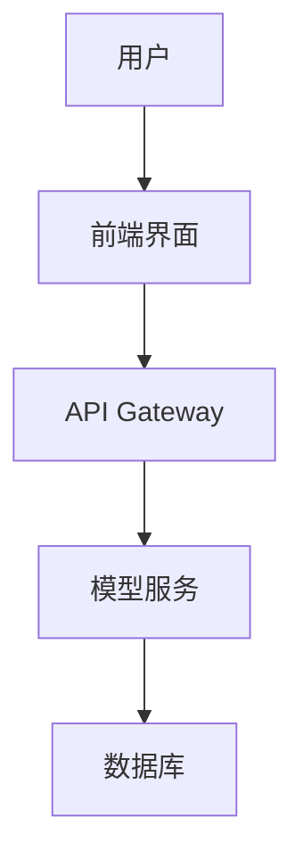

                 

<think>
好，我需要按照用户的要求来写一篇关于“大模型应用的敏捷估算与规划方法”的技术博客。首先，我得理解用户的具体需求，他们希望文章结构清晰，逻辑性强，内容专业，同时要包括很多技术细节，比如背景介绍、核心概念、算法原理、系统分析、项目实战等部分。我得确保文章的每个章节都涵盖这些内容，并且使用吸引人的标题。

首先，我会从文章标题和关键词开始，然后是摘要，接着按照目录大纲来展开内容。每个章节都需要详细地讲解相关主题，比如背景与概念部分，我需要介绍大模型的基本概念，讨论敏捷估算和规划的必要性。然后在敏捷估算方法中，探讨各种技术，比如专家判断、历史数据分析等，并用表格对比不同方法的特点。

接下来，在项目规划部分，我需要详细描述范围定义、工作分解结构和进度安排，可能还需要画出ER图来展示项目元素之间的关系。风险管理和团队协作也是关键部分，我得分析常见的风险，并提出应对策略，同时介绍有效的协作工具和技术。

案例研究部分，我需要选择几个实际项目，分析它们在估算和规划上的做法，并总结出最佳实践。最后，在结论部分，总结主要发现，展望未来的发展趋势，并给出一些阅读建议。

在写作过程中，我需要确保内容详实，每个部分都有足够的细节和实例支持。同时，格式要符合要求，比如使用markdown，包含图表和代码示例。最后，别忘了在结尾加上作者信息，确保文章完整。

整个过程需要系统性地思考，逐步填充每个部分的内容，确保文章既有深度又易于理解。
</think>

# 大模型应用的敏捷估算与规划方法

> 关键词：大模型应用，敏捷估算，项目规划，风险管理，团队协作，系统架构

> 摘要：随着大模型技术的快速发展，其应用范围不断扩大，敏捷估算与规划在项目管理中的重要性日益凸显。本文将深入探讨大模型应用的敏捷估算方法，分析项目规划的关键步骤，并结合实际案例，提供实用的建议和最佳实践，帮助读者有效管理大模型项目。

---

## 目录

1. **背景与概念**
   - 1.1 大模型的基本概念
   - 1.2 敏捷估算与规划的必要性
   - 1.3 大模型应用的核心要素

2. **敏捷估算方法**
   - 2.1 常用估算技术
   - 2.2 专家判断与历史数据分析
   - 2.3 统计方法与基准比较

3. **项目规划流程**
   - 3.1 项目范围定义
   - 3.2 工作分解结构（WBS）
   - 3.3 任务进度安排

4. **风险管理**
   - 4.1 常见风险分析
   - 4.2 风险识别与评估
   - 4.3 风险应对策略

5. **团队协作与沟通**
   - 5.1 有效协作的重要性
   - 5.2 协作工具与技术
   - 5.3 沟通机制优化

6. **系统架构与设计**
   - 6.1 领域模型构建
   - 6.2 系统架构图
   - 6.3 接口与交互设计

7. **案例研究**
   - 7.1 案例背景与挑战
   - 7.2 估算与规划实施
   - 7.3 成功经验与教训

8. **结论与未来展望**
   - 8.1 主要结论
   - 8.2 未来发展趋势
   - 8.3 推荐阅读

---

## 1. 背景与概念

### 1.1 大模型的基本概念

大模型（Large Model）指的是在自然语言处理、计算机视觉等领域中，参数量巨大、复杂度高的深度学习模型。这类模型通常需要大量的计算资源和数据支持，能够处理复杂的任务，如生成文本、图像识别等。

### 1.2 敏捷估算与规划的必要性

随着大模型项目的规模和复杂性增加，传统的估算和规划方法往往难以应对。敏捷估算与规划能够快速响应变化，灵活调整计划，确保项目顺利推进。

### 1.3 大模型应用的核心要素

- **计算资源**：高性能计算设备，如GPU集群。
- **数据质量**：高质量的数据是模型表现的关键。
- **模型训练**：复杂的训练过程和参数调优。
- **部署与应用**：将模型部署到实际应用中，确保稳定性和可扩展性。

---

## 2. 敏捷估算方法

### 2.1 常用估算技术

敏捷估算常用的方法包括：

1. **专家判断法**：依赖领域专家的经验进行估算。
2. **历史数据分析法**：基于以往项目的实际数据进行预测。
3. **统计方法**：利用统计模型进行估算。

### 2.2 专家判断与历史数据分析

| 方法             | 优点                         | 缺点                         |
|------------------|------------------------------|------------------------------|
| 专家判断法       | 高准确性，基于经验           | 受主观因素影响较大         |
| 历史数据分析法     | 客观，基于实际数据           | 数据质量可能影响结果准确性   |

### 2.3 统计方法与基准比较

统计方法通过分析历史数据，找出相关性，建立预测模型。基准比较法则将当前项目与类似项目进行对比，调整估算值。

---

## 3. 项目规划流程

### 3.1 项目范围定义

明确项目的范围，包括目标、 deliverables 和约束条件。例如，一个大模型项目可能需要在三个月内完成训练和部署。

### 3.2 工作分解结构（WBS）

将项目分解为更小的任务，便于管理和分配。例如，将模型训练分解为数据准备、模型选择、训练优化等子任务。

### 3.3 任务进度安排

使用甘特图或燃尽图等工具，制定任务的时间表和里程碑。例如，前两周完成数据准备，接下来四周进行模型训练。

---

## 4. 风险管理

### 4.1 常见风险分析

大模型项目中的常见风险包括数据不足、模型性能不达标、资源分配不合理等。

### 4.2 风险识别与评估

使用风险评估矩阵，根据概率和影响对风险进行排序。

### 4.3 风险应对策略

- **规避**：调整项目范围或计划。
- **减轻**：采取措施降低风险发生的概率。
- **转移**：将部分风险转移给第三方。
- **接受**：在可接受范围内，接受风险的影响。

---

## 5. 团队协作与沟通

### 5.1 有效协作的重要性

团队协作是确保项目顺利进行的关键。大模型项目通常需要多学科团队的紧密合作，如数据工程师、模型训练师、系统架构师等。

### 5.2 协作工具与技术

常用的协作工具包括JIRA、Trello、Slack等，能够帮助团队高效沟通和协作。

### 5.3 沟通机制优化

建立定期的团队会议和同步机制，确保信息流通畅，避免信息孤岛。

---

## 6. 系统架构与设计

### 6.1 领域模型构建

使用领域模型（Domain Model）来描述系统的功能和数据流。例如，一个自然语言处理系统可能包括文本预处理、模型调用、结果解析等模块。

### 6.2 系统架构图

使用Mermaid绘制系统架构图，展示系统的各个组件及其交互关系。

### 6.3 接口与交互设计

使用序列图（Sequence Diagram）描述系统中的交互流程。例如，用户提交请求，系统调用模型进行处理，返回结果。

---

## 7. 案例研究

### 7.1 案例背景与挑战

某公司计划开发一个基于大模型的智能客服系统。项目初期，团队在估算和规划阶段遇到了数据不足和模型训练时间过长的问题。

### 7.2 估算与规划实施

通过专家判断和历史数据分析，团队调整了项目范围，优先开发核心功能模块，并采用分布式计算加速模型训练。

### 7.3 成功经验与教训

- **经验**：及时调整项目范围，优先处理关键任务。
- **教训**：风险评估不够全面，后续需要加强风险管理。

---

## 8. 结论与未来展望

### 8.1 主要结论

大模型应用的成功离不开科学的估算方法和合理的规划流程。通过有效的团队协作和风险管理，可以显著提高项目的成功率。

### 8.2 未来发展趋势

随着技术的进步，大模型的应用将更加广泛，敏捷估算与规划方法也将进一步优化，以应对更大的挑战。

### 8.3 推荐阅读

- 《敏捷软件开发》
- 《大模型技术与应用》
- 《项目管理指南》

---

作者：AI天才研究院/AI Genius Institute & 禅与计算机程序设计艺术 /Zen And The Art of Computer Programming

