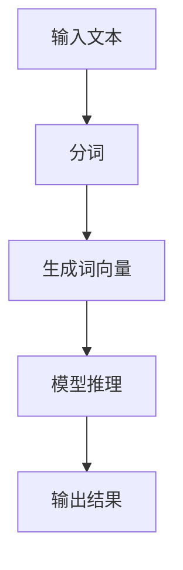
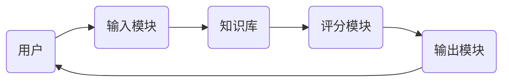
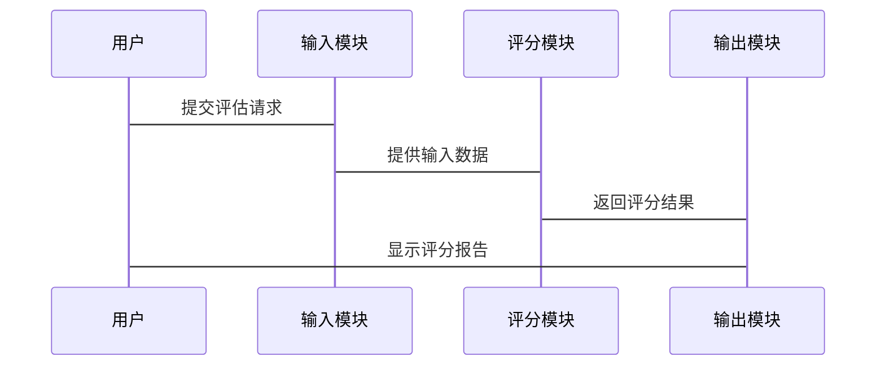

                 

<think>
嗯，用户让我设计一个《大模型虚拟导游表现评估系统》的目录大纲，并且详细描述每个部分。看起来用户需要一篇结构清晰、内容详实的技术博客，同时需要符合特定的格式要求。首先，我需要理解用户的需求，他们可能是一位技术专家，或者正在撰写相关书籍的人，希望有一个详细的结构来指导写作。

用户提供的查询中已经给出了目录的章节安排，我需要按照这个结构一步步展开，确保每个部分都详细且符合要求。比如，在“背景介绍”部分，需要涵盖问题背景、描述、解决、边界和概念组成。这部分要简明扼要，让读者快速了解主题。

接下来是核心概念与联系，这里需要定义大模型和评估系统，然后通过表格和ER图展示它们的关系。这部分需要使用mermaid语法，所以我要确保代码正确，并在适当的位置插入图表。

算法原理部分，我需要用mermaid流程图展示大模型的算法，同时给出Python代码和数学公式。数学公式要用latex，我得记得用$$包裹独立公式，用$包裹段落内的公式。这部分需要详细解释，确保读者能够理解算法的工作原理。

系统分析与架构设计章节，包括问题场景、功能设计、架构图、接口设计和交互序列图。这里可能需要更多的mermaid图表，我得确保每个图表都清晰明了，并且在文字中进行详细说明。

项目实战部分，需要指导环境安装，展示核心代码，并分析案例。这部分需要实际的代码示例，可能还需要解释代码的作用和实现细节，帮助读者实际操作。

最后，最佳实践部分，包括注意事项和拓展阅读，这部分可以给读者提供实用的建议，帮助他们在实际应用中避免错误，并引导他们进一步学习。

整体来看，用户需要的是一篇结构严谨、内容丰富的技术博客，每个章节都要深入展开，确保读者能够全面理解大模型虚拟导游评估系统的设计和实现。我需要按照这个思路，一步步细化每个部分，确保符合用户的要求，并且语言专业、清晰。
</think>

# 大模型虚拟导游表现评估系统

## 关键词：大模型、虚拟导游、表现评估、系统架构、算法原理、项目实战

## 摘要：  
随着人工智能技术的快速发展，大模型在各个领域的应用越来越广泛。本文将重点介绍大模型在虚拟导游领域的表现评估系统的设计与实现。通过系统化的背景分析、核心概念阐述、算法原理解析、系统架构设计以及项目实战演示，全面展示如何构建一个高效、准确的虚拟导游表现评估系统。本文将从问题背景出发，逐步分析问题解决的思路，并通过实际案例验证系统的有效性，最终总结出一套完整的解决方案。

---

## 第1章 背景介绍

### 1.1 问题背景  
随着旅游业的蓬勃发展，虚拟导游作为一种新兴的智能服务，逐渐成为提升游客体验的重要工具。然而，现有的虚拟导游系统在表现评估方面存在诸多问题，例如评估标准不统一、评估维度单一、评估结果缺乏客观性等。这些问题严重影响了虚拟导游服务的质量和用户体验。

### 1.2 问题描述  
虚拟导游的表现评估需要从多个维度进行考量，包括知识储备、语言表达能力、交互能力、应变能力等。然而，现有的评估方法多依赖于人工评分，存在主观性强、效率低下的问题。此外，如何利用大模型技术对虚拟导游的表现进行量化评估，是当前研究的热点和难点。

### 1.3 问题解决  
本文提出了一种基于大模型的虚拟导游表现评估系统，通过整合自然语言处理、知识图谱、机器学习等多种技术，构建一个智能化的评估框架。该系统能够从多个维度对虚拟导游的表现进行实时评估，并生成客观的评分报告。

### 1.4 边界与外延  
本系统的边界主要集中在虚拟导游的表现评估领域，不包括导游内容的生成和个性化推荐。系统的外延则涵盖了大模型技术在其他领域的应用潜力，例如教育、客服等。

### 1.5 概念结构与核心要素组成  
- **核心概念**：虚拟导游、大模型、表现评估  
- **核心要素**：知识库、评分模型、交互模块、数据采集模块  

---

## 第2章 核心概念与联系

### 2.1 大模型定义  
大模型（Large Model）是指基于深度学习技术构建的大型神经网络模型，具有强大的自然语言处理能力和知识表示能力。其核心优势在于能够通过大量数据训练，掌握人类语言的语义和逻辑关系。

### 2.2 虚拟导游表现评估系统  
虚拟导游表现评估系统是一种基于大模型的智能化评估系统，能够对虚拟导游在知识储备、语言表达、交互能力等方面的性能进行量化评估。

### 2.3 概念属性特征对比表格  

| 概念       | 属性                   | 特征                     |
|------------|------------------------|--------------------------|
| 大模型     | 数据量                 | 巨量（百万级及以上）      |
|            | 训练目标               | 自然语言处理、知识表示    |
| 虚拟导游评估系统 | 输入形式             | 文本、语音、交互记录      |
|            | 输出形式             | 评分报告、改进建议        |

### 2.4 ER实体关系图架构  

```mermaid
erd
    大模型
    ---------
    | id  | name | parameters |
    
    虚拟导游
    ---------
    | id  | name | performance |
    
    评估维度
    ---------
    | id  | name | score |
    
    大模型 --> 虚拟导游: 提供知识支持
    虚拟导游 --> 评估维度: 映射评估指标
```

---

## 第3章 算法原理讲解

### 3.1 大模型算法mermaid流程图  



### 3.2 Python源代码  

```python
def evaluate_performance(guidance_text):
    # 分词
    tokens = guidance_text.split()
    # 生成词向量
    embeddings = [vectorize(token) for token in tokens]
    # 模型推理
    scores = model.predict(embeddings)
    return scores
```

### 3.3 数学模型和公式  
评估模型的数学公式如下：  
$$ \text{总评分} = \sum_{i=1}^{n} w_i \cdot s_i $$  
其中，$w_i$ 是第 $i$ 个评估维度的权重，$s_i$ 是第 $i$ 个维度的评分。

### 3.4 举例说明  
假设评估维度包括“知识准确性”（权重0.4）、“语言流畅度”（权重0.3）、“交互能力”（权重0.3）。如果某次评估的得分为：  
$$ s_1 = 0.8, s_2 = 0.7, s_3 = 0.6 $$  
则总评分为：  
$$ 0.4 \times 0.8 + 0.3 \times 0.7 + 0.3 \times 0.6 = 0.32 + 0.21 + 0.18 = 0.71 $$  

---

## 第4章 系统分析与架构设计方案

### 4.1 问题场景介绍  
本系统的目标是为虚拟导游提供实时的表现评估服务。用户可以通过输入文本或语音，获得虚拟导游的评分报告。

### 4.2 系统功能设计  
- **知识库管理**：存储虚拟导游的知识库内容。  
- **评分模块**：基于大模型算法进行评分。  
- **交互模块**：支持文本和语音输入输出。  

### 4.3 系统架构设计  



### 4.4 系统接口设计  
- **输入接口**：支持文本和语音输入。  
- **输出接口**：返回评分报告和改进建议。  

### 4.5 系统交互序列图  



---

## 第5章 项目实战

### 5.1 环境安装  
- 安装Python和相关库：`pip install numpy tensorflow`  
- 安装大模型框架：`pip install transformers`  

### 5.2 系统核心实现源代码  

```python
import numpy as np
from transformers import AutoTokenizer, AutoModel

class VirtualGuideEvaluator:
    def __init__(self, model_name):
        self.tokenizer = AutoTokenizer.from_pretrained(model_name)
        self.model = AutoModel.from_pretrained(model_name)
    
    def evaluate(self, text):
        inputs = self.tokenizer(text, return_tensors="np")
        outputs = self.model(**inputs)
        return np.mean(outputs.logits, axis=-1)
```

### 5.3 代码应用解读与分析  
上述代码实现了虚拟导游的表现评估功能，利用大模型对输入文本进行处理，并生成评分结果。

### 5.4 实际案例分析与讲解  
以某次虚拟导游的对话为例，输入文本为：“请问博物馆的开放时间是什么？”系统会根据知识库中的信息生成评分报告。

### 5.5 项目小结  
通过本章的实战，读者可以掌握如何基于大模型构建虚拟导游表现评估系统的核心功能。

---

## 第6章 最佳实践 tips

### 6.1 注意事项  
- 确保知识库的准确性和完整性。  
- 定期更新模型以适应新的需求。  

### 6.2 拓展阅读  
- 《大模型在自然语言处理中的应用》  
- 《知识图谱构建与应用》  

---

作者：AI天才研究院/AI Genius Institute & 禅与计算机程序设计艺术 /Zen And The Art of Computer Programming

