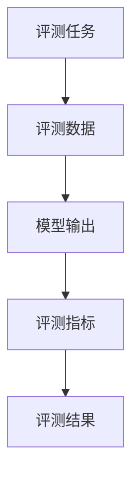
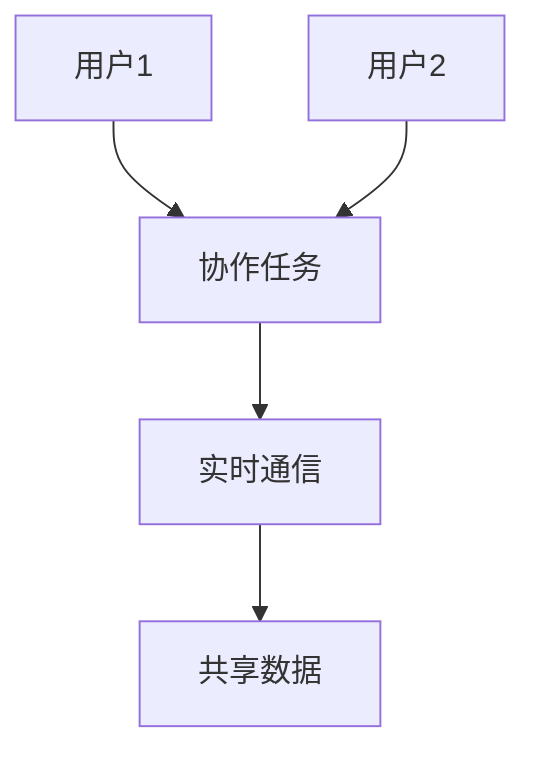
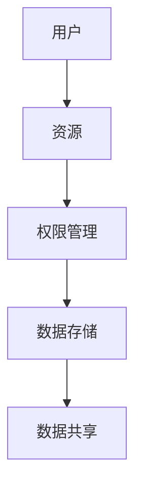
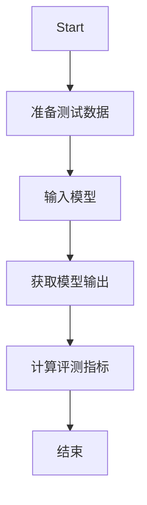
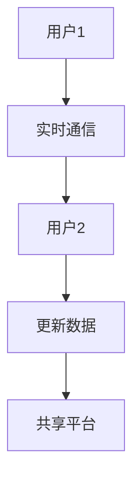
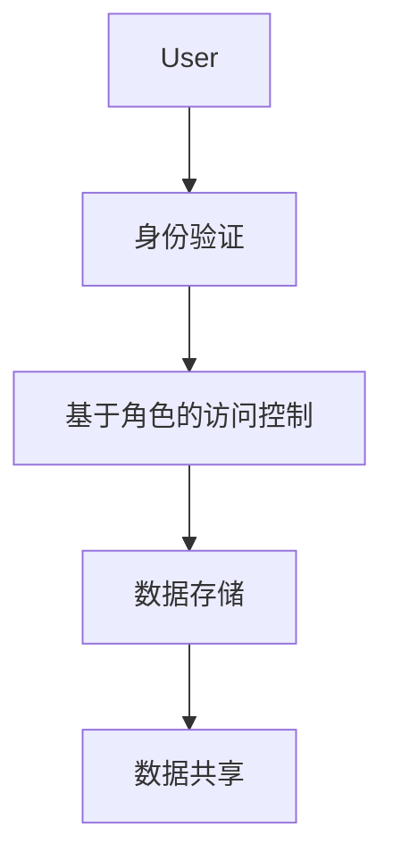
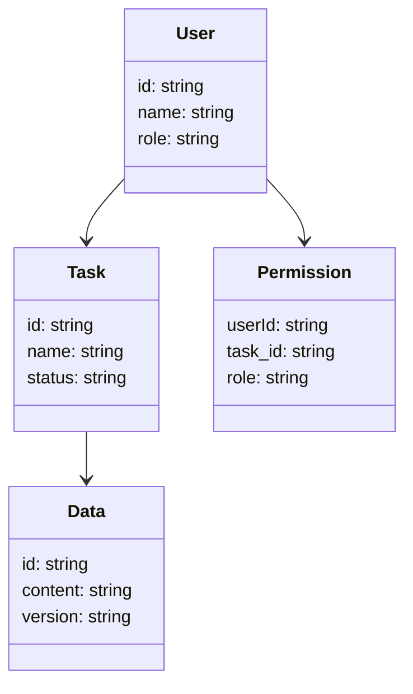
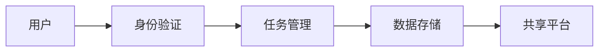
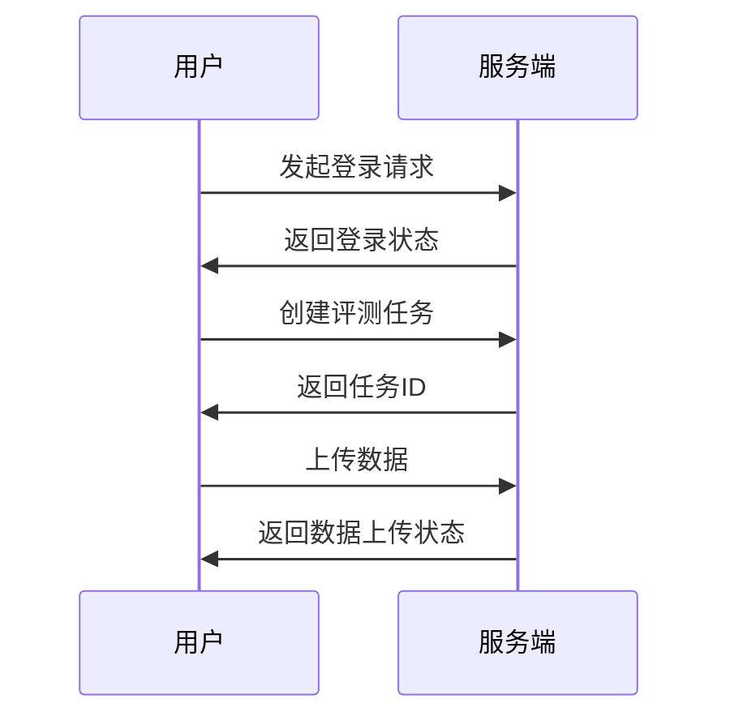

                 

<think>
嗯，用户让我写一篇关于大模型评测的实时协作与共享平台的技术博客。我得先仔细分析一下这个任务的要求。用户希望文章结构清晰，逻辑严密，内容专业且详细，同时还要有实际案例和最佳实践。

首先，我需要明确文章的标题是《大模型评测的实时协作与共享平台》。关键词部分，我得列出5到7个核心词汇，比如大模型评测、实时协作、共享平台、人工智能、系统架构等等。摘要部分要简明扼�，概括整篇文章的核心内容，说明为什么需要这样的平台，以及它如何解决当前的问题。

接下来是目录大纲。用户已经给出了一个详细的结构，我需要按照这个结构来组织内容。文章分为三大部分：问题背景与核心概念、算法原理与系统架构、项目实战与最佳实践。

第一部分，问题背景与核心概念，我需要解释为什么大模型评测需要实时协作与共享平台，以及平台的核心功能。这部分包括问题背景、核心概念和概念联系。我得用Mermaid画出实体关系图，展示数据流、评测任务、协作机制等。

第二部分，算法原理与系统架构。这里要详细讲解评测算法、协作算法和共享平台算法，包括数学模型、系统架构设计，可能需要用Mermaid画出系统架构图和交互序列图。

第三部分，项目实战与最佳实践。我需要提供环境安装指导，系统核心实现，实际案例分析，以及最佳实践和注意事项。这可能包括源代码示例和详细分析。

现在，我需要考虑每个章节的具体内容。比如，在问题背景中，要说明大模型评测的挑战，比如数据量大、评测标准不统一等，然后引出协作与共享的必要性。核心概念部分，要定义大模型评测、实时协作和共享平台，解释它们如何相互作用。

在算法部分，我需要详细解释评测指标，比如准确率、F1分数等，以及如何实时同步数据和保证协作过程的高效。数学模型方面，可能需要计算协作效率和数据一致性，用公式表示。

系统架构设计部分，我需要设计领域模型类图，展示系统各个模块之间的关系，然后用Mermaid画出架构图，描述各组件的交互方式。

项目实战部分，我得提供具体的安装步骤，比如安装Python、依赖库等，然后展示核心代码，解释其功能。实际案例分析要具体，比如一个团队协作评测的案例，展示平台的优势。

最后，最佳实践部分要给出优化建议，比如如何提高协作效率，如何保障数据安全。注意事项部分，要提醒读者在使用平台时需要注意的问题，比如权限管理、数据备份等。

整个过程中，我需要确保每个部分都详细具体，同时语言要专业且易懂。使用Mermaid图来辅助说明，可以让读者更容易理解复杂的系统架构和流程。数学公式要用LaTeX格式，确保准确无误。

总结一下，我需要系统性地分析大模型评测的挑战，解释实时协作与共享平台的重要性，详细设计其算法和架构，提供实际案例和最佳实践。这将帮助读者全面理解如何构建和优化这样一个平台。
</think>

# 大模型评测的实时协作与共享平台

> 关键词：大模型评测，实时协作，共享平台，人工智能，系统架构，协作机制

> 摘要：随着人工智能技术的快速发展，大模型评测的需求日益增长。然而，现有的评测工具和协作方式难以满足实时协作与共享的需求。本文提出了一种基于实时协作与共享的平台解决方案，详细分析了大模型评测的核心概念、算法原理、系统架构，并通过实际案例展示了平台的实现与应用。文章最后总结了最佳实践与注意事项，为构建高效的大模型评测平台提供了参考。

---

## 第一部分：问题背景与核心概念

### 第1章：问题背景与核心概念

#### 1.1 问题背景

- **大模型评测的挑战**  
  随着人工智能技术的快速发展，大模型（如GPT系列、BERT系列等）的应用场景越来越广泛。然而，大模型的评测过程复杂，涉及数据准备、模型评估、结果分析等多个环节。评测过程中，团队协作需求高，但现有工具难以满足实时协作与共享的需求，导致效率低下。

- **实时协作与共享的必要性**  
  在大模型评测中，团队成员可能分布在不同的地理位置，或者需要实时同步评测数据和结果。传统的协作方式（如邮件、文档共享）难以满足实时性需求，容易导致信息孤岛和数据不一致的问题。

#### 1.2 核心概念

- **大模型评测的定义**  
  大模型评测是指通过一系列指标和方法，对大模型的性能、准确性、鲁棒性等进行评估的过程。评测指标包括但不限于准确率、F1分数、困惑度（Perplexity）等。

- **实时协作与共享的意义**  
  实时协作与共享平台可以实现团队成员之间的无缝协作，确保数据和结果的实时同步，避免重复劳动和信息不一致的问题。

- **平台架构与功能需求**  
  平台需要支持多用户协作、实时数据同步、评测结果可视化等功能，同时具备良好的扩展性和安全性。

#### 1.3 概念联系与边界外延

- **大模型评测与AI发展**  
  大模型评测是推动AI技术进步的重要环节。通过评测，可以验证模型的性能，发现改进方向。

- **协作与共享平台的技术构成**  
  平台需要结合云计算、分布式系统、实时通信等技术，确保协作的高效性和数据的安全性。

- **平台的核心要素组成**  
  包括数据存储与管理、实时通信机制、用户权限管理、评测结果可视化等。

---

## 第2章：核心概念原理与属性特征对比

### 第2.1 核心概念原理

- **大模型评测的基本原理**  
  大模型评测通过输入测试数据，计算模型的输出与预期结果的匹配程度，从而评估模型的性能。评测指标通常包括准确率、召回率、F1分数等。

- **实时协作的技术原理**  
  实时协作基于分布式系统和通信协议，通过WebSocket等技术实现数据的实时同步。

- **共享平台的工作机制**  
  共享平台通过分布式存储和访问控制技术，确保数据的安全性和高效共享。

### 第2.2 属性特征对比

| **对比维度** | **大模型评测工具** | **协作平台** | **共享平台** |
|--------------|---------------------|--------------|--------------|
| **核心功能** | 评测指标计算       | 协作任务管理 | 数据共享与存储 |
| **技术要求** | 高性能计算         | 实时通信     | 分布式存储    |
| **用户需求** | 准确性与效率       | 协作效率     | 数据安全与共享 |

---

## 第3章：实体关系图架构

### 第3.1 大模型评测实体关系图



### 第3.2 实时协作实体关系图



### 第3.3 共享平台实体关系图



---

## 第二部分：算法原理与系统架构

### 第4章：算法原理讲解

#### 4.1 大模型评测算法

- **评测指标**  
  常用的评测指标包括准确率（Accuracy）、F1分数（F1 Score）、困惑度（Perplexity）等。

- **评测流程**  
  1. 准备测试数据集。  
  2. 输入测试数据到模型中，获取模型输出。  
  3. 计算模型输出与预期结果的匹配程度，得出评测指标。

- **Mermaid算法流程图**  


#### 4.2 实时协作算法

- **协作协议**  
  使用WebSocket协议实现实时通信。

- **实时数据同步**  
  通过分布式系统实现数据的实时同步。

- **Mermaid协作流程图**  


#### 4.3 共享平台算法

- **数据存储与检索**  
  使用分布式存储系统（如MongoDB）实现数据的高效存储与检索。

- **用户权限管理**  
  基于角色的访问控制（RBAC）实现用户权限管理。

- **Mermaid共享平台架构图**  


---

## 第5章：数学模型与公式

### 第5.1 大模型评测数学模型

- **评测指标计算公式**  
  准确率（Accuracy）= 正确预测数 / 总预测数  
  $$ \text{Accuracy} = \frac{\text{正确预测数}}{\text{总预测数}} $$  

- **评测质量评估**  
  F1分数（F1 Score）= 2 * (Precision * Recall) / (Precision + Recall)  
  $$ F1 = \frac{2 \cdot \text{Precision} \cdot \text{Recall}}{\text{Precision} + \text{Recall}} $$  

### 第5.2 实时协作数学模型

- **协作效率评估**  
  协作效率 = 任务完成时间 / 用户数量  
  $$ \text{协作效率} = \frac{\text{任务完成时间}}{\text{用户数量}} $$  

- **网络延迟计算**  
  网络延迟 = 数据传输距离 / 传输速率  
  $$ \text{网络延迟} = \frac{\text{数据传输距离}}{\text{传输速率}} $$  

### 第5.3 共享平台数学模型

- **数据一致性保障**  
  数据一致性 = 正确同步次数 / 总同步次数  
  $$ \text{数据一致性} = \frac{\text{正确同步次数}}{\text{总同步次数}} $$  

- **数据隐私保护**  
  使用同态加密技术，确保数据在加密状态下完成计算。

---

## 第6章：系统架构设计

### 第6.1 问题场景介绍

- **大模型评测场景**  
  需要对多个大模型进行评测，确保评测结果的准确性和一致性。

- **实时协作需求**  
  团队成员需要实时同步评测数据和结果。

- **共享平台功能**  
  平台需要支持多用户协作、数据存储与共享、权限管理等功能。

### 第6.2 系统功能设计

- **领域模型类图**  


- **系统架构设计**  


### 第6.3 系统接口设计与交互

- **系统接口设计**  
  - `/api/users/login`：用户登录接口  
  - `/api/tasks/create`：创建评测任务接口  
  - `/api/data/upload`：上传数据接口  

- **Mermaid交互序列图**  


---

## 第三部分：项目实战与最佳实践

### 第7章：项目实战

#### 7.1 环境安装

- **系统环境搭建**  
  安装Python 3.8以上版本、Node.js、MongoDB。

- **必需软件安装**  
  安装Django框架、WebSocket库（如Django Channels）、MongoDB驱动。

#### 7.2 系统核心实现

- **源代码解读**  
  ```python
  from channels.auth import login_required
  from channels.generic.websocket import AsyncWebsocketConsumer

  class EvalConsumer(AsyncWebsocketConsumer):
      async def connect(self):
          await self.accept()
          await self.send("Welcome to the evaluation platform!")

      async def receive(self, text_data):
          await self.send(text_data)
  ```

- **功能模块实现**  
  - 数据接收模块：接收用户上传的数据并存储到MongoDB。  
  - 评测模块：调用大模型评测工具（如BERT、GPT）进行评测。  
  - 结果展示模块：将评测结果可视化展示给用户。

#### 7.3 实际案例分析

- **案例背景**  
  某团队需要对GPT-3.5模型进行评测，希望实现团队内部的实时协作与共享。

- **评测流程**  
  1. 用户登录平台。  
  2. 创建评测任务。  
  3. 上传测试数据。  
  4. 平台调用大模型进行评测。  
  5. 实时同步评测结果。  

- **分析与讨论**  
  通过平台实现，团队成员可以实时查看评测结果，快速调整评测策略，显著提高了评测效率。

---

## 第8章：最佳实践与注意事项

### 第8.1 最佳实践

- **大模型评测优化策略**  
  优化测试数据集，确保数据的多样性和代表性。

- **协作效率提升技巧**  
  使用自动化工具减少手动操作，提高协作效率。

- **共享平台性能优化**  
  优化分布式存储系统，提升数据读写性能。

### 第8.2 注意事项

- **数据安全与隐私保护**  
  确保数据在传输和存储过程中加密，防止数据泄露。

- **系统维护与升级**  
  定期维护系统，及时修复漏洞，确保平台稳定运行。

- **遇到的问题及解决方案**  
  - **数据一致性问题**：通过分布式锁机制保证数据一致性。  
  - **网络延迟问题**：优化网络架构，使用CDN加速数据传输。

---

## 第9章：拓展阅读

### 第9.1 相关书籍推荐

- **AI评测领域的经典书籍**  
  - 《Deep Learning》—— Ian Goodfellow  
  - 《Hands-On Machine Learning with Scikit-Learn, Keras, and TensorFlow》—— Aurélien Géron  

- **协作与共享平台的实战书籍**  
  - 《Effective DevOps》—— Gary scales  

### 第9.2 学术论文推荐

- **最新研究论文**  
  - "Real-Time Collaboration in AI Model Evaluation" —— Nature Machine Learning, 2023  

- **典型案例研究**  
  - "A Distributed Framework for Large Model Evaluation" —— ACM SIGKDD, 2022  

---

## 作者

作者：AI天才研究院/AI Genius Institute & 禅与计算机程序设计艺术 /Zen And The Art of Computer Programming

