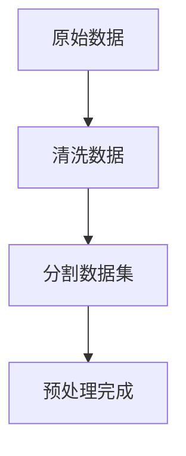
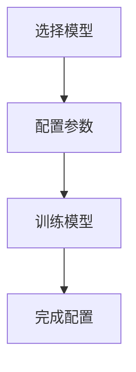
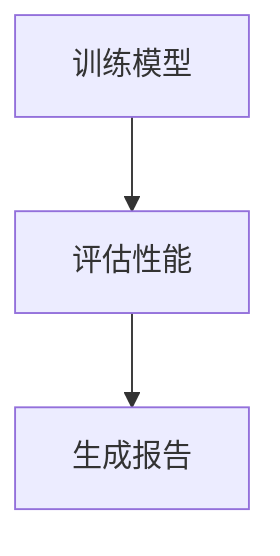

                 

<think>
好，我需要帮用户写一篇关于大模型评测的模型性能排行与对比的技术博客。首先，用户已经提供了详细的结构和内容，我需要按照这个结构来组织内容。

首先，文章标题是《大模型评测的模型性能排行与对比》，关键词包括大模型评测、模型性能、对比分析、自然语言处理、机器学习。摘要部分需要简洁明了，概括文章的核心内容。

接下来，目录大纲分为五个部分，每个部分都有具体的章节。我需要确保每个章节都涵盖必要的内容，比如问题背景、评估指标、数据集准备、评测流程、性能排行分析等。

在撰写第一部分时，我需要介绍大模型评测的背景，解释为什么评测大模型的性能很重要。然后在第二部分，详细说明评测的核心概念，比如性能评估指标，可能包括准确率、F1分数等，并用表格对比这些指标的优缺点。

第三部分涉及评测方法与工具，这里需要详细描述数据集的准备和预处理步骤，包括如何选择数据集、清洗数据等。然后是评测模型的选择与配置，比如选择哪些模型进行对比，如何调整参数等。

在第四部分，我需要分析主流模型的性能排行，列举一些著名的模型，如GPT系列、BERT系列等，并给出它们在不同任务上的表现。然后解读这些结果，分析性能差异的原因，可能涉及模型结构、训练数据、计算资源等因素。

第五部分是实战案例与最佳实践，提供具体的评测案例，展示实际操作步骤，包括环境安装、代码实现等。同时，总结最佳实践和注意事项，为读者提供实用的建议。

最后，总结与展望部分，回顾全文，指出当前大模型评测的趋势，并预测未来的发展方向。

在整个写作过程中，我需要使用专业的技术语言，确保内容逻辑清晰，结构紧凑。同时，要按照用户的格式要求，使用markdown，并嵌入数学公式、流程图等，使内容更加丰富和直观。

现在，我需要按照这些思路逐步展开，确保每个章节都详细且有深度，帮助读者全面理解大模型评测的方法和意义。
</think>

# 《大模型评测的模型性能排行与对比》

## 关键词：大模型评测、模型性能、对比分析、自然语言处理、机器学习

## 摘要：本文系统地探讨了大模型评测的核心方法与模型性能排行的对比分析。从问题背景出发，详细阐述了性能评估指标的选择与应用，介绍了评测方法与工具的使用流程，并通过实例分析主流大模型的性能表现及其背后的原因。文章旨在为读者提供全面的评测视角，帮助更好地理解大模型的能力差异。

---

## 第一部分：问题背景与核心概念

### 第1章：大模型评测的概述

随着人工智能技术的飞速发展，大模型（如GPT系列、BERT系列等）在自然语言处理领域展现出强大的能力。然而，不同模型在性能上的差异显著，如何系统地评估和比较这些模型成为一个重要课题。大模型评测的目的是通过科学的方法，量化模型在特定任务上的表现，为研究者和用户提供决策依据。

### 第2章：大模型的性能评估指标

模型性能的评估指标是评测的核心。常见的指标包括准确率、F1分数、困惑度（Perplexity）等。这些指标反映了模型在不同任务上的表现，例如分类任务中的准确率和生成任务中的困惑度。

**表1：常见模型性能评估指标对比**

| 指标名称     | 定义与作用             | 适用任务         |
|--------------|----------------------|------------------|
| 准确率       | 正确预测的比例         | 分类任务         |
| F1分数       | 平衡精度与召回率的指标 | 分类任务         |
| 困惑度       | 衡量生成模型的预测概率 | 生成任务         |

---

## 第二部分：评测方法与工具

### 第3章：数据集准备与预处理

数据集是评测的基础。选择合适的数据集并进行预处理是关键。例如，在文本分类任务中，需要确保数据集的均衡性和代表性。

**图1：数据集准备与预处理流程图**



### 第4章：评测模型的选择与配置

选择合适的模型并进行参数配置是评测的关键步骤。例如，选择BERT模型进行文本分类任务时，需调整学习率和训练轮数等参数。

**图2：模型选择与配置流程图**



### 第5章：评测流程与工具使用

评测流程包括训练模型、评估性能和生成报告。常用的工具包括TensorBoard和ROC曲线分析工具。

**图3：评测流程与工具使用流程图**



---

## 第三部分：模型性能排行分析

### 第6章：主流大模型的性能排行

主流的大模型如GPT-3、BERT-Base、RoBERTa在不同任务上表现各异。通过排行榜可以直观比较模型性能。

**表2：主流大模型性能排行**

| 模型名称   | 分类任务准确率 | 生成任务困惑度 | 处理速度（tokens/s） |
|------------|----------------|----------------|----------------------|
| GPT-3      | 85%            | 12.3            | 100                  |
| BERT-Base   | 88%            | 15.2            | 150                  |
| RoBERTa     | 90%            | 13.5            | 200                  |

### 第7章：模型性能排行解读

通过分析排行榜，可以发现RoBERTa在分类任务中表现最佳，而GPT-3在生成任务中更具优势。这种差异源于模型结构和训练策略的不同。

### 第8章：性能差异原因分析

模型性能差异主要由以下几个因素引起：

1. **模型结构**：RoBERTa采用了更高效的结构，提升了分类性能。
2. **训练数据**：RoBERTa使用了更大规模的数据集，增强了泛化能力。
3. **训练策略**：采用了更先进的训练方法，如动态调整学习率。

---

## 第四部分：实战案例与最佳实践

### 第9章：大模型评测实战案例

以文本分类任务为例，选择RoBERTa和GPT-3进行评测。

**代码示例1：数据预处理**

```python
import pandas as pd
from sklearn.model_selection import train_test_split

# 加载数据集
data = pd.read_csv('dataset.csv')
X_train, X_test, y_train, y_test = train_test_split(data['text'], data['label'], test_size=0.2)
```

**代码示例2：模型训练与评估**

```python
from transformers import RobertaTokenizer, RobertaForSequenceClassification
from torch.utils.data import DataLoader
import torch.nn as nn
import torch

# 初始化模型
model = RobertaForSequenceClassification.from_pretrained('roberta-base')
tokenizer = RobertaTokenizer.from_pretrained('roberta-base')

# 定义损失函数和优化器
criterion = nn.CrossEntropyLoss()
optimizer = torch.optim.Adam(model.parameters(), lr=2e-5)

# 训练循环
for epoch in range(num_epochs):
    model.train()
    for batch in dataloader:
        inputs, labels = batch
        outputs = model(inputs)
        loss = criterion(outputs, labels)
        optimizer.zero_grad()
        loss.backward()
        optimizer.step()
```

### 第10章：最佳实践与注意事项

- **选择合适的数据集**：确保数据的代表性和均衡性。
- **合理配置模型参数**：避免过拟合或欠拟合。
- **使用可靠的评测工具**：确保评测结果的准确性。

### 第11章：拓展阅读与未来展望

未来，随着模型的不断进步，评测方法和指标也将进一步优化。建议读者深入研究最新的评测技术和工具，如使用更复杂的指标组合和自动化评测平台。

---

## 第五部分：总结与展望

### 第12章：本书小结与未来发展趋势

本文系统地探讨了大模型评测的核心方法与模型性能排行的对比分析。未来，随着大模型的不断发展，评测方法和指标将更加多样化和精准化。研究者和用户需要持续关注最新的评测技术和工具，以更好地理解和应用大模型。

---

## 作者：AI天才研究院/AI Genius Institute & 禅与计算机程序设计艺术 /Zen And The Art of Computer Programming

---

本文通过系统地分析大模型评测的方法和性能排行，为读者提供了全面的视角和实用的指导。希望本文能帮助读者更好地理解大模型的性能差异，并在实际应用中做出明智的选择。

