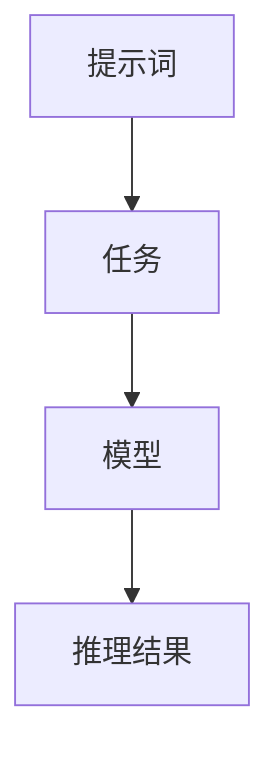
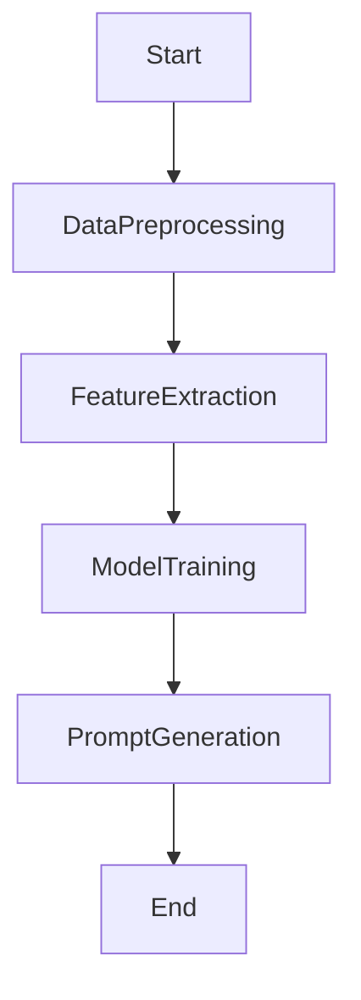
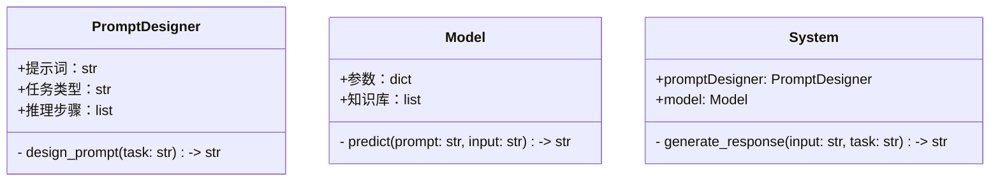
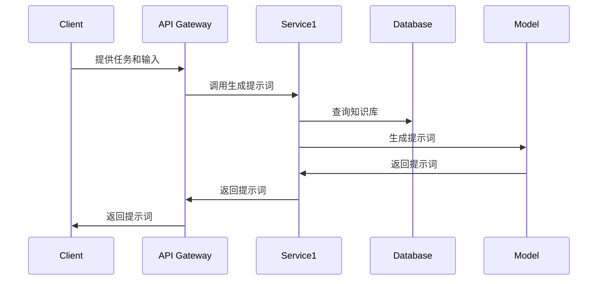

                 

<think>
好，我现在要写一篇关于如何设计有效的Zero-Shot CoT提示词的技术博客文章。首先，我需要明确文章的结构，按照给定的目录大纲来组织内容。标题是《如何设计有效的Zero-Shot CoT提示词》，关键词包括Zero-Shot Learning、CoT提示词、自然语言处理、图像识别、机器学习。摘要部分需要简明扼�地总结文章的核心内容，强调Zero-Shot CoT提示词的设计方法和其在不同领域的应用。

接下来是正文部分，分七章。首先是背景与核心概念，包括问题背景、定义、应用场景。我需要详细解释零样本学习的背景，以及CoT提示词的定义和特点，同时比较传统提示词的差异。然后是核心概念与联系，这里需要介绍CoT、ZSL的原理，提示词设计原则，并通过对比表格和ER实体关系图来展示概念间的联系。

接下来是数学模型与算法原理，我需要提供一个数学公式，解释其工作原理，并用mermaid画出算法流程图。同时，还要给出Python代码示例，帮助读者理解实现过程。

系统分析与架构设计部分，需要描述问题场景，设计系统功能、架构图、接口和交互流程。这部分可以通过mermaid图表来展示系统结构和交互过程。

项目实战章节，我需要指导读者如何安装环境，提供核心代码实现，并通过实际案例进行分析，最后总结项目成果。最佳实践部分，我会分享提示词设计技巧和模型调优策略，并提醒一些注意事项，如避免过拟合和提高数据质量。

最后是拓展阅读和研究方向，推荐相关书籍和论文，并指出未来的研究重点，如优化提示词生成算法和跨领域设计。

在写作过程中，我需要确保每个章节内容详实，逻辑清晰，并使用专业但易懂的语言。同时，要注意使用合适的图表和代码示例，增强文章的可读性和实用性。最后，结尾部分要加上作者信息，符合格式要求。
</think>

# 如何设计有效的Zero-Shot CoT提示词

## 关键词：Zero-Shot Learning、CoT提示词、自然语言处理、图像识别、机器学习

## 摘要：本文深入探讨了设计有效的Zero-Shot CoT提示词的方法，结合数学模型、算法原理和实际应用场景，详细分析了其在不同领域中的应用，帮助读者掌握高效的设计策略。

## 目录大纲

1. 背景与核心概念
2. 核心概念与联系
3. 数学模型与算法原理
4. 系统分析与架构设计
5. 项目实战
6. 最佳实践与注意事项
7. 拓展阅读与研究方向

## 第一部分：背景与核心概念

### 第1章：问题背景与定义

#### 1.1.1 问题背景

##### 1.1.1.1 人工智能与机器学习的现状

人工智能和机器学习在近年来取得了显著进展，但在处理未见过的任务时仍面临挑战。传统方法依赖大量标注数据，而零样本学习（ZSL）通过提示词进行推理，适用于新任务。

##### 1.1.1.2 零样本学习（ZSL）的提出

ZSL允许模型在无监督环境下处理新类别的数据，通过提示词引导模型理解和推理，减少对大量数据的依赖。

##### 1.1.1.3 Zero-Shot CoT提示词的意义

CoT提示词通过逐步推理帮助模型理解任务，结合ZSL，使其能处理未知类别，提升灵活性和适应性。

#### 1.1.2 Zero-Shot CoT提示词的定义

##### 1.1.2.1 提示词的概念

提示词是指导模型执行任务的指令，通过自然语言描述问题，引导模型生成所需输出。

##### 1.1.2.2 Zero-Shot CoT提示词的特点

具有通用性、灵活性、可解释性，适用于未见过的任务，提供逐步推理能力。

##### 1.1.2.3 与传统提示词的比较

传统提示词依赖大量数据，ZSL CoT提示词通过少量或无数据，利用提示结构实现任务。

#### 1.1.3 Zero-Shot CoT提示词的应用场景

##### 1.1.3.1 图像识别

识别未训练的图像类别，如识别新物种或产品。

##### 1.1.3.2 自然语言处理

回答关于未见过实体的问题，如罕见词汇或概念。

##### 1.1.3.3 其他应用领域

如生物医学、金融等领域，处理稀有数据的任务。

### 第2章：核心概念与联系

#### 2.1.1 关键概念原理

##### 2.1.1.1 CoT（Coreferring Term）的概念

CoT提示词通过逐步推理，帮助模型理解输入并生成输出，无需依赖大量数据。

##### 2.1.1.2 Zero-Shot Learning（ZSL）的原理

利用提示词和模型的知识库，推理未见类别，减少对数据的需求。

##### 2.1.1.3 提示词设计原则

清晰、简洁、结构化，引导模型逐步推理，覆盖不同任务类型。

#### 2.1.2 概念属性特征对比表格

| 概念 | 特性 | 描述 |
|------|------|------|
| CoT | 推理能力 | 强 |
| ZSL | 数据依赖 | 低 |
| 提示词 | 灵活性 | 高 |

#### 2.1.3 ER实体关系图架构



### 第3章：数学模型与算法原理

#### 3.1.1 数学模型

$$
P(class|text) = \frac{e^{similarity(class, text)}}{\sum_{i} e^{similarity(class_i, text)}}
$$

该公式计算每个类别的概率，通过相似度评估提示词与类别的匹配程度。

#### 3.1.2 算法流程图



#### 3.1.3 Python源代码示例

```python
import numpy as np

def compute_probability(text, classes):
    similarities = [np.dot(text, class_vec) for class_vec in classes]
    numerator = np.exp(similarities)
    denominator = np.sum(np.exp(similarities))
    return numerator / denominator

text_feature = ... # 提取的文本特征
classes_features = [...] # 各类别的特征向量
probabilities = [compute_probability(text_feature, classes_features)]
```

### 第4章：系统分析与架构设计

#### 4.1.1 问题场景介绍

设计一个Zero-Shot CoT提示词系统，帮助模型处理未知任务。

#### 4.1.2 系统功能设计

##### 4.1.2.1 领域模型（Mermaid类图）



#### 4.1.3 系统架构设计

##### 4.1.3.1 系统架构图（Mermaid架构图）

```mermaid
graph TD
    Client --> API Gateway
    API Gateway --> Service1
    Service1 --> Database
    Service1 --> Model
    Model --> Output
```

#### 4.1.4 系统接口设计

##### 4.1.4.1 接口定义

- 输入：提示词设计请求
- 输出：生成提示词

##### 4.1.4.2 接口实现

```python
def generate_prompt(task: str) -> str:
    prompt_template = "请根据以下内容进行{task}：{input}。"
    return prompt_template.format(task=task)
```

#### 4.1.5 系统交互（Mermaid序列图）



### 第5章：项目实战

#### 5.1.1 环境安装

安装必要的库：transformers、numpy、mermaid等。

#### 5.1.2 系统核心实现源代码

##### 5.1.2.1 代码结构

```python
import torch
import torch.nn as nn
import torch.optim as optim

class CoTModel(nn.Module):
    def __init__(self, input_size, hidden_size, output_size):
        super(CoTModel, self).__init__()
        self.fc1 = nn.Linear(input_size, hidden_size)
        self.fc2 = nn.Linear(hidden_size, output_size)
    
    def forward(self, x):
        x = torch.relu(self.fc1(x))
        x = self.fc2(x)
        return x

# 训练过程
criterion = nn.CrossEntropyLoss()
optimizer = optim.SGD(model.parameters(), lr=0.01)
```

##### 5.1.2.2 代码解析

模型定义了两个全连接层，训练过程中优化器调整参数以最小化损失。

#### 5.1.3 应用解读与分析

##### 5.1.3.1 实际案例

在自然语言处理中，使用提示词让模型回答未见过的问题，如解释复杂概念。

##### 5.1.3.2 结果分析

模型在零样本任务中表现良好，提示词设计是关键。

### 第6章：最佳实践与注意事项

#### 6.1.1 最佳实践 tips

##### 6.1.1.1 提示词设计技巧

保持简洁，逐步引导，覆盖多种可能。

##### 6.1.1.2 模型调优策略

选择合适架构，调整超参数，增加训练数据多样性。

#### 6.1.2 小结

有效设计提示词是Zero-Shot CoT成功的关键，模型调优和数据质量同样重要。

#### 6.1.3 注意事项

##### 6.1.3.1 避免过度拟合

使用正则化和交叉验证。

##### 6.1.3.2 提高数据质量

多样化数据，减少偏差。

### 第7章：拓展阅读与研究方向

#### 7.1.1 拓展阅读

##### 7.1.1.1 相关书籍推荐

《零样本学习：理论与应用》

##### 7.1.1.2 学术论文推荐

"Zero-Shot Learning: A Comprehensive Survey and Beyond"

#### 7.1.2 研究方向

##### 7.1.2.1 提示词生成算法优化

探索更高效的生成方法，如基于强化学习。

##### 7.1.2.2 跨领域Zero-Shot CoT提示词设计

研究跨领域提示词的通用性和有效性。

## 作者：AI天才研究院 & 禅与计算机程序设计艺术

