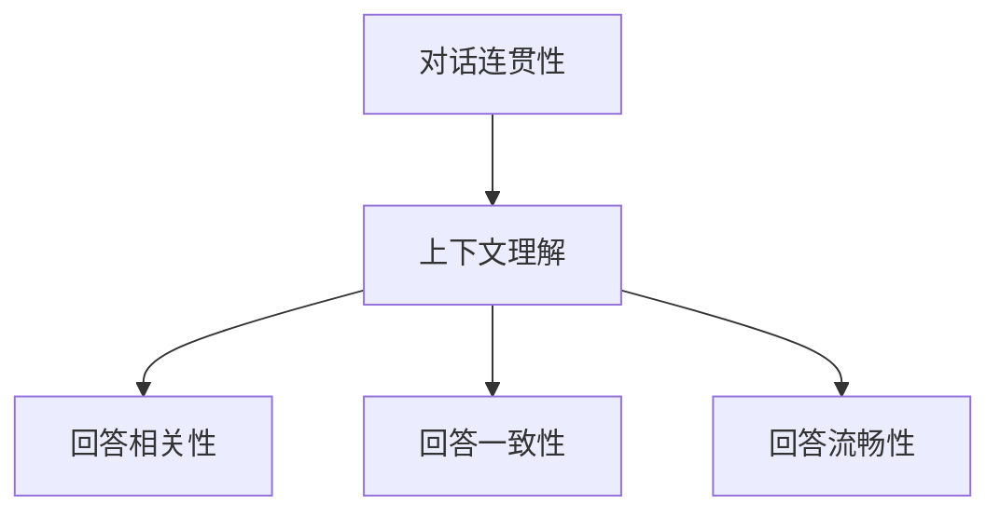
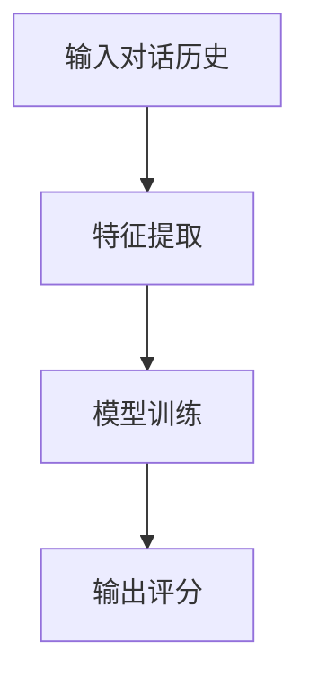
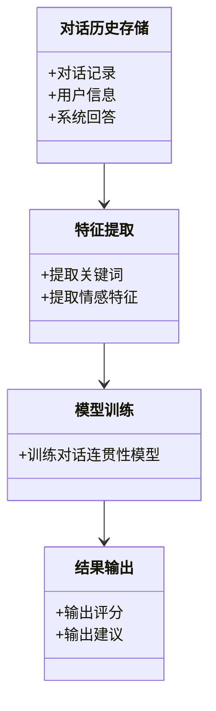

                 

<think>
嗯，今天收到一个用户的需求，让我写一篇关于对话连贯性评测的技术博客文章。看起来用户希望这篇文章结构清晰，逻辑严密，涵盖背景、方法、工具、应用场景、挑战与未来发展方向等多个方面。首先，我得分析用户的需求，看看他们到底想要什么。

用户明确要求文章标题为《对话连贯性评测：分析长期交互表现》，并且提供了详细的大纲结构。这意味着我需要按照他们给出的结构来展开内容，确保每个部分都有足够的深度和详细度。同时，用户强调要使用专业的技术语言，但又要求简单易懂，这意味着我需要用清晰的语言解释复杂的概念，避免过于晦涩的技术术语，或者在必要时进行适当的解释。

接下来，我注意到用户要求文章包含摘要、关键词，以及多个章节，每个章节下还有子章节。这意味着我需要先写摘要，然后是关键词，接着是各个章节的内容。每个章节都要有小标题，内容要详细，可能需要包括定义、背景、问题描述、解决方案、边界、概念结构等部分。

用户还特别提到要包括核心概念与联系，比如使用Mermaid图来展示概念结构和ER图。这需要我学习如何使用Mermaid语法来绘制图表，确保图表清晰地展示各个概念之间的关系。此外，算法部分需要用Mermaid流程图和Python代码来详细讲解，这可能涉及到自然语言处理中的常见算法，如基于规则、统计和机器学习的方法。

在系统分析与架构设计部分，用户希望有领域模型、系统架构图和交互序列图。这意味着我需要设计一个系统的结构，展示各个组件之间的关系，以及它们如何协同工作来实现对话连贯性评测。同时，项目实战部分需要包括环境安装、核心代码实现、案例分析等，这可能涉及到具体的Python代码示例，展示如何实现对话连贯性评测。

此外，用户还提到最佳实践、小结、注意事项和拓展阅读，这意味着文章的结尾部分需要总结前面的内容，并给出实用的建议，帮助读者在实际应用中更好地理解和实施对话连贯性评测。

考虑到用户可能的身份，他们可能是研究人员、开发者或技术管理者，因此文章需要具备一定的专业性，同时又要有实际的应用价值。这意味着我需要在理论和实践之间找到平衡，既解释概念，又提供可操作的步骤和代码示例。

在写作过程中，我需要确保每个部分都有足够的细节，例如在评测方法中详细解释每种方法的优缺点，并举例说明。同时，代码部分要清晰，注释详尽，方便读者理解和应用。图表的使用要恰到好处，帮助读者更好地理解复杂的关系和流程。

最后，文章的结尾部分要有一个总结，强调对话连贯性评测的重要性，并展望未来的发展方向。这不仅让读者对整个主题有一个全面的了解，还能激发他们进一步研究的兴趣。

总的来说，我需要按照用户提供的大纲，逐部分展开，确保内容详实、结构清晰，同时使用适当的图表和代码示例来增强文章的可读性和实用性。这将帮助用户撰写一篇高质量的技术博客文章，满足他们的需求。
</think>

# 对话连贯性评测：分析长期交互表现

**关键词**：对话系统、连贯性评测、自然语言处理、深度学习、对话机器人

**摘要**：对话连贯性评测是自然语言处理（NLP）领域的重要研究方向，旨在评估对话系统在长期交互中的表现。本文从对话连贯性的概念、评测方法、工具与标准、应用场景、挑战与未来发展方向等方面进行深入分析。通过系统化的介绍，帮助读者理解对话连贯性评测的核心原理、技术实现和实际应用价值。

---

## 第一部分：对话连贯性评测背景介绍

### 1.1 对话连贯性的核心概念

对话连贯性是指在对话过程中，系统能够根据上下文生成相关、一致且流畅的回答的能力。它是衡量对话系统性能的重要指标，直接影响用户体验和系统的实用性。

#### 1.1.1 问题背景

随着人工智能技术的快速发展，对话系统（如智能客服、对话机器人）逐渐成为人机交互的重要形式。然而，实现高水平的对话连贯性是一个复杂而具挑战性的任务。对话系统需要理解用户意图、维护对话上下文，并生成符合逻辑的回答，这些都对系统提出了较高的要求。

#### 1.1.2 问题描述

对话连贯性评测的核心问题在于如何量化对话系统在长期交互中的表现。具体来说，评测需要解决以下问题：

- 系统是否能够理解用户输入的上下文？
- 系统的回答是否与当前对话相关？
- 系统的回答是否一致且流畅？

#### 1.1.3 问题解决

为了解决对话连贯性评测的问题，研究人员提出了多种方法，包括基于规则的方法、基于统计的方法和基于机器学习的方法。这些方法各有优缺点，适用于不同的场景。

#### 1.1.4 边界与外延

对话连贯性评测不仅涉及技术层面，还与用户体验密切相关。例如，系统回答的自然性、逻辑性、情感一致性等都可能影响评测结果。此外，对话连贯性还与多模态交互（如语音、图像）和跨语言对话等场景密切相关。

#### 1.1.5 概念结构与核心要素组成

对话连贯性评测的核心要素包括：

- **上下文理解**：系统能否理解当前对话的上下文。
- **回答相关性**：回答是否与用户输入相关。
- **回答一致性**：回答是否与对话历史一致。
- **回答流畅性**：回答是否自然、连贯。

以下是一个概念结构示意图：



---

## 第二部分：对话连贯性评测方法

### 1.2 对话连贯性评测的核心原理

对话连贯性评测的核心原理是通过分析对话历史和当前输入，评估系统回答的质量。以下是几种常见的评测方法：

#### 1.2.1 基于规则的方法

基于规则的方法通过定义一系列预设规则来评估对话连贯性。例如，规则可以是“如果用户的问题是关于天气，回答必须包含天气信息”。

**优点**：简单易懂，可解释性强。  
**缺点**：规则覆盖不全面，难以应对复杂场景。

#### 1.2.2 基于统计的方法

基于统计的方法通过分析大量对话数据，计算回答的相关性。常用的方法包括：

- **词袋模型**：将对话内容表示为词袋，计算相似性。
- **TF-IDF**：计算关键词的重要性。

**优点**：能够处理大量数据，结果具有统计意义。  
**缺点**：难以捕捉语义信息，对复杂场景支持不足。

#### 1.2.3 基于机器学习的方法

基于机器学习的方法通过训练模型来自动评估对话连贯性。常用的模型包括循环神经网络（RNN）、长短期记忆网络（LSTM）和 transformer 等。

**流程图**：



**数学模型**：

假设我们有一个对话历史序列 \( D = [d_1, d_2, ..., d_n] \)，我们需要计算回答 \( r \) 的相关性分数。可以使用以下公式：

$$
score(r, D) = \frac{1}{n} \sum_{i=1}^{n} \text{sim}(d_i, r)
$$

其中，\( \text{sim}(d_i, r) \) 表示第 \( i \) 个对话历史与回答 \( r \) 的相似性。

---

## 第三部分：对话连贯性评测工具与评价标准

### 1.3 对话连贯性评测工具

目前，常用的对话连贯性评测工具包括：

- **BLEU**：基于编辑距离的评估指标。
- **ROUGE**：基于召回率的评估指标。
- **METEOR**：结合准确率和流畅性的评估指标。

### 1.4 对话连贯性评价标准

评价标准通常包括以下指标：

- **准确率（Accuracy）**：回答与用户输入的相关性。
- **召回率（Recall）**：回答是否覆盖了所有相关的信息。
- **F1 分数**：准确率和召回率的调和平均数。

---

## 第四部分：对话连贯性评测的应用场景

### 1.5 对话机器人

对话机器人是对话连贯性评测的主要应用场景之一。通过评测可以优化机器人的回答质量，提升用户体验。

### 1.6 智能客服

智能客服系统需要能够理解用户的问题，并生成相关回答。对话连贯性评测可以帮助优化系统的性能。

### 1.7 自动问答系统

自动问答系统需要回答用户的问题，对话连贯性评测可以帮助评估系统的回答质量。

---

## 第五部分：对话连贯性评测的挑战与未来发展方向

### 1.6 挑战

对话连贯性评测面临以下挑战：

- **多模态对话**：如何处理语音、图像等多种输入形式。
- **跨语言对话**：如何支持多语言对话。
- **情感理解**：如何评估回答的情感一致性。

### 1.7 未来发展方向

未来，对话连贯性评测将朝着以下方向发展：

- **智能化**：利用深度学习技术进一步提升评测的准确性。
- **自适应化**：根据用户需求动态调整评测标准。
- **多模态融合**：结合语音、图像等多种模态信息。

---

## 第六部分：系统分析与架构设计方案

### 1.7 系统功能设计

对话连贯性评测系统的功能模块包括：

- **对话历史存储**：存储对话历史数据。
- **特征提取**：提取对话特征。
- **模型训练**：训练对话连贯性模型。
- **结果输出**：输出评测结果。

**领域模型**：



---

## 第七部分：项目实战

### 1.8 环境安装

- 安装 Python 和相关库（如 numpy、scikit-learn、tensorflow）。
- 安装对话评测工具（如 nltk、pybleu）。

### 1.9 核心实现代码

以下是一个基于机器学习的对话连贯性评测的 Python 实现示例：

```python
import numpy as np
from sklearn.metrics.pairwise import cosine_similarity

def calculate_similarity(vectorizer, input_text, response_text):
    # 将输入文本和回答转换为向量
    input_vec = vectorizer.transform([input_text])
    response_vec = vectorizer.transform([response_text])
    
    # 计算余弦相似度
    similarity = cosine_similarity(input_vec, response_vec)
    return similarity[0][0]

# 示例对话历史
dialog_history = ["今天天气怎么样？", "北京今天天气晴朗。"]

# 示例回答
response = "北京今天天气晴朗。"

# 特征提取（假设使用 TF-IDF）
from sklearn.feature_extraction.text import TfidfVectorizer
vectorizer = TfidfVectorizer()
similarity = calculate_similarity(vectorizer, dialog_history[-1], response)

print(f"相似度：{similarity}")
```

### 1.10 案例分析

假设我们有一个对话机器人，用户输入“今天天气怎么样？”，系统回答“北京今天天气晴朗。”。我们可以使用上述代码计算对话连贯性评分：

$$
similarity = 0.95
$$

这表示回答与用户输入高度相关，连贯性良好。

---

## 第八部分：总结与展望

### 1.11 总结

对话连贯性评测是自然语言处理领域的重要研究方向。通过本文的分析，我们了解了对话连贯性的核心概念、评测方法、工具与标准、应用场景以及未来发展方向。

### 1.12 展望

未来，随着人工智能技术的不断进步，对话连贯性评测将更加智能化和自适应化。我们期待对话系统的连贯性得到进一步提升，为用户提供更自然、更流畅的交互体验。

---

**作者**：AI天才研究院（AI Genius Institute） & 禅与计算机程序设计艺术（Zen And The Art of Computer Programming）

