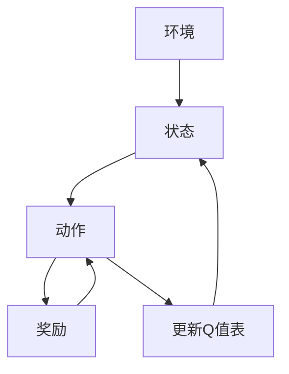
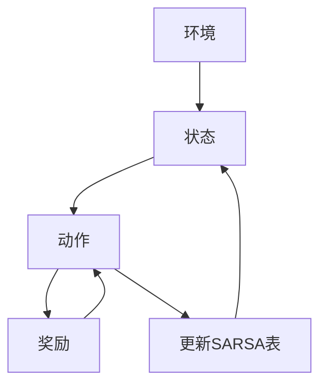
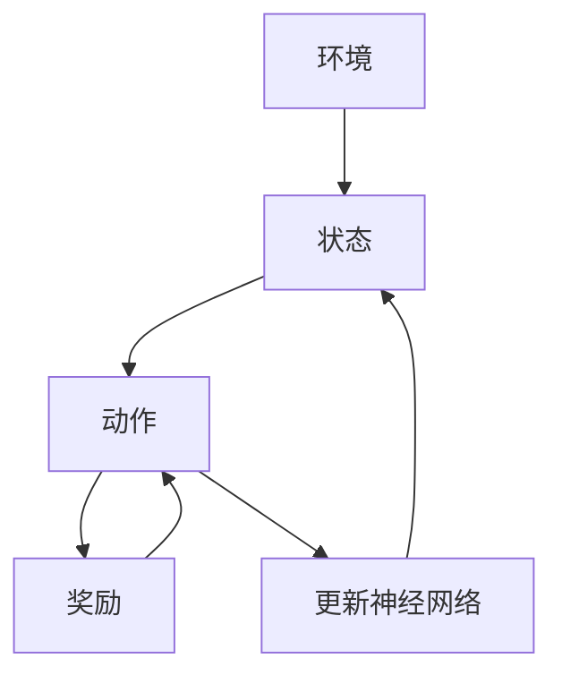
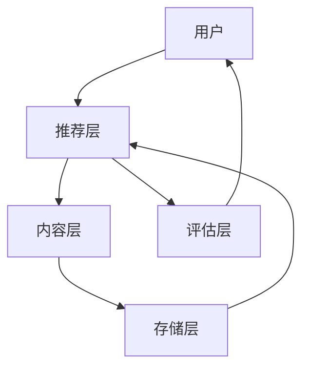

                 

<think>
好，我现在要帮用户写一篇关于《强化学习在AIGC内容个性化推荐中的作用》的技术博客。用户给了详细的指导，包括结构、内容和格式。我得先理解用户的需求，然后一步步展开思考。

首先，用户希望文章结构清晰，逻辑性强，内容专业。我需要按照目录大纲设计，每个章节都要详细展开。文章的核心关键词包括强化学习、AIGC、个性化推荐、推荐系统、机器学习，这些是关键点。

接下来，摘要部分要简明扼要，概括文章的核心内容。我得强调强化学习在个性化推荐中的重要性，以及它如何提升推荐系统的效率和用户体验。

开始第一章，背景介绍。我需要先说明AIGC内容个性化推荐的重要性，然后引出强化学习的应用。接着描述问题，比如数据稀疏性、实时性等，再讨论强化学习的优势，比如模型更新和动态调整能力。

然后是强化学习的基本原理，这部分需要清晰解释核心概念，如状态、动作、奖励、策略等。同时，要比较强化学习和其他推荐算法的区别，突出其动态调整的优势。

第二章重点放在强化学习的算法上，包括Q-Learning、SARSA和DQN。我需要详细讲解每个算法的工作原理，用mermaid流程图来展示，还要提供Python代码示例，方便读者理解。

第三章讨论AIGC推荐系统的架构，这部分需要系统设计，包括功能模块、数据流和交互设计。我可能需要用类图和架构图来展示系统的结构，确保读者能够清晰理解各个模块的协作。

第四章是应用部分，说明强化学习在内容生成和推荐中的具体应用，以及如何与其他推荐算法结合，提升推荐效果。这部分需要实际案例分析，让读者看到强化学习的实际价值。

第五章深入数学模型，用公式详细讲解强化学习的算法原理，比如Q-Learning的公式，DQN的网络结构。这部分要严谨，同时用例子帮助读者理解。

第六章是项目实战，指导读者如何搭建环境，实现算法，并提供代码示例。我需要详细说明每一步，确保读者能够跟着操作，同时分析案例结果，给出改进建议。

在写作过程中，我需要确保每个章节都有足够的细节，包括原理、算法、系统设计和实战案例。同时，要使用专业的技术术语，但保持语言简洁易懂。数学公式要用LaTeX格式，算法流程图和类图使用mermaid语法，这样在markdown中展示会更清晰。

最后，总结部分要回顾强化学习的优势和应用，同时指出其局限性，并给出未来发展的建议。这部分有助于读者全面理解强化学习在AIGC推荐中的作用，同时认识到其可能的挑战和改进空间。

我还需要注意文章的结构和格式，确保符合用户的要求，包括字数、格式和结尾的作者信息。整体来看，这篇文章需要兼具理论深度和实践应用，帮助读者全面掌握强化学习在个性化推荐中的应用。

总的来说，我会按照用户的指导，一步步展开思考，确保每个部分都详细且符合要求，最终写出一篇高质量的技术博客。
</think>

# 强化学习在AIGC内容个性化推荐中的作用

---

## 关键词：  
强化学习，AIGC，个性化推荐，推荐系统，机器学习

---

## 摘要：  
本文深入探讨强化学习在AIGC（人工智能生成内容）个性化推荐中的重要作用。通过分析强化学习的基本原理、算法实现、系统架构以及在内容生成和推荐中的具体应用，本文揭示了强化学习如何提升推荐系统的效率和用户体验。文章还结合实际案例，展示了强化学习在AIGC推荐中的优势，并探讨了其局限性和未来发展方向。

---

### 目录大纲设计步骤：

1. **确定书的核心内容和章节结构**：  
   - 核心主题：强化学习在AIGC内容个性化推荐中的作用。  
   - 章节结构：背景介绍、强化学习原理与算法、AIGC推荐系统架构、强化学习的应用、数学模型与算法讲解、项目实战。

2. **梳理核心概念和原理**：  
   - 强化学习的核心概念（状态、动作、奖励、策略）。  
   - 强化学习在个性化推荐中的实现方法。

3. **设计算法讲解**：  
   - Q-Learning、SARSA、DQN算法的原理和实现。  
   - 使用mermaid流程图和Python代码示例。

4. **创建数学模型和公式讲解**：  
   - 强化学习的数学模型和公式，使用LaTeX格式。

5. **设计系统分析与架构方案**：  
   - AIGC推荐系统的功能设计、架构设计、接口设计和交互设计。

6. **编写项目实战和案例分析**：  
   - 环境搭建、系统实现、案例分析。

7. **总结和拓展**：  
   - 总结关键点，提供最佳实践建议，指引用户进行拓展阅读。

---

## 第1章：背景介绍

### 1.1 问题背景

#### 1.1.1 AIGC内容个性化推荐的重要性  
个性化推荐是AIGC（人工智能生成内容）系统的核心功能之一。通过推荐系统，用户可以快速找到与其兴趣相符的内容，提升用户体验。然而，传统推荐算法（如基于协同过滤的算法）在面对大规模数据和复杂用户行为时，存在推荐效果差、实时性低等问题。

#### 1.1.2 强化学习在个性化推荐中的应用  
强化学习（Reinforcement Learning, RL）是一种通过试错机制优化决策的机器学习方法。其核心是通过与环境交互，学习最优策略以最大化累计奖励。强化学习在个性化推荐中的应用，能够动态调整推荐策略，实时优化推荐结果。

### 1.2 问题描述

#### 1.2.1 个性化推荐中的挑战  
- 数据稀疏性：用户行为数据不足导致推荐结果不准确。  
- 实时性要求：推荐系统需要快速响应用户请求。  
- 用户偏好变化：用户的兴趣可能会随时间变化。  

#### 1.2.2 强化学习解决个性化推荐问题的优势  
- 动态调整能力：强化学习能够根据用户反馈实时调整推荐策略。  
- 长期目标优化：强化学习通过最大化累计奖励，实现长期推荐效果的提升。  

### 1.3 问题解决

#### 1.3.1 强化学习的基本原理  
- **状态（State）**：用户的行为或环境的当前情况。  
- **动作（Action）**：推荐系统做出的推荐行为。  
- **奖励（Reward）**：用户对推荐结果的反馈（如点击、点赞）。  
- **策略（Policy）**：推荐系统选择动作的规则。  

#### 1.3.2 强化学习在个性化推荐中的实现方法  
强化学习通过与用户交互，不断调整推荐策略，以最大化用户的正向反馈。例如，基于Q-Learning算法的推荐系统会根据用户的点击行为更新推荐策略。

### 1.4 边界与外延

#### 1.4.1 强化学习在个性化推荐中的适用场景  
- 用户行为实时性强的场景。  
- 推荐结果需要动态优化的场景。  

#### 1.4.2 强化学习在个性化推荐中的局限性  
- 需要大量交互数据进行训练。  
- 对复杂环境的适应能力有限。  

### 1.5 概念结构与核心要素组成

#### 1.5.1 强化学习的基本概念  
强化学习通过试错机制，学习最优策略以最大化累计奖励。

#### 1.5.2 AIGC内容个性化推荐的核心要素  
- 用户行为分析：通过用户点击、浏览等行为，分析用户的兴趣偏好。  
- 内容生成：基于强化学习生成个性化内容。  
- 推荐策略优化：根据用户反馈动态调整推荐策略。  

---

## 第2章：强化学习原理与算法

### 2.1 强化学习的基本原理

#### 2.1.1 强化学习的基础知识  
强化学习是一种基于试错机制的学习方法，通过与环境交互，学习最优策略。

#### 2.1.2 强化学习的基本概念  
- 状态（State）：用户当前的行为或环境的描述。  
- 动作（Action）：推荐系统做出的推荐行为。  
- 奖励（Reward）：用户对推荐结果的反馈。  
- 策略（Policy）：推荐系统选择动作的规则。  

### 2.2 强化学习算法介绍

#### 2.2.1 Q-Learning算法  
Q-Learning是一种经典的强化学习算法，通过更新Q值表来学习最优策略。  

**算法流程图（mermaid）：**  


**Python代码示例：**  
```python
import numpy as np

class QLearning:
    def __init__(self, state_space, action_space):
        self.q_table = np.zeros((state_space, action_space))
    
    def choose_action(self, state, epsilon=0.1):
        if np.random.random() < epsilon:
            return np.random.randint(0, action_space)
        else:
            return np.argmax(self.q_table[state])
    
    def update_q_table(self, state, action, reward, learning_rate=0.1):
        self.q_table[state, action] = (1 - learning_rate) * self.q_table[state, action] + learning_rate * reward
```

#### 2.2.2 SARSA算法  
SARSA算法与Q-Learning类似，但其更新规则不同，通常在动作之后立即更新Q值。  

**算法流程图（mermaid）：**  


**Python代码示例：**  
```python
class SARSA:
    def __init__(self, state_space, action_space):
        self.q_table = np.zeros((state_space, action_space))
    
    def choose_action(self, state, epsilon=0.1):
        if np.random.random() < epsilon:
            return np.random.randint(0, action_space)
        else:
            return np.argmax(self.q_table[state])
    
    def update_q_table(self, state, action, reward, next_state, next_action, learning_rate=0.1):
        self.q_table[state, action] = (1 - learning_rate) * self.q_table[state, action] + learning_rate * (reward + self.q_table[next_state, next_action])
```

#### 2.2.3 Deep Q-Networks (DQN)算法  
DQN算法通过深度神经网络近似Q值函数，适用于高维状态空间。  

**算法流程图（mermaid）：**  


**Python代码示例：**  
```python
import torch
import torch.nn as nn

class DQN:
    def __init__(self, state_dim, action_dim):
        self.model = nn.Sequential(
            nn.Linear(state_dim, 64),
            nn.ReLU(),
            nn.Linear(64, action_dim)
        )
        self.optimizer = torch.optim.Adam(self.model.parameters())
    
    def choose_action(self, state, epsilon=0.1):
        if np.random.random() < epsilon:
            return np.random.randint(0, action_dim)
        else:
            with torch.no_grad():
                return torch.argmax(self.model(torch.FloatTensor(state))).item()
    
    def update_q_network(self, state, action, reward, next_state, learning_rate=0.001):
        current_q = self.model(torch.FloatTensor(state))
        current_q = current_q.gather(1, torch.tensor(action))
        next_q = self.model(torch.FloatTensor(next_state)).max(1)[0].detach()
        target = reward + gamma * next_q
        loss = (current_q - target).pow(2).mean()
        self.optimizer.zero_grad()
        loss.backward()
        self.optimizer.step()
```

### 2.3 强化学习算法比较与选择

#### 2.3.1 不同强化学习算法的比较  
| 算法 | 优缺点 | 适用场景 |  
|------|--------|----------|  
| Q-Learning | 简单，适合离散状态空间 | 离散状态空间，小规模问题 |  
| SARSA | 动作之后立即更新Q值 | 离散状态空间，实时性要求高 |  
| DQN | 适合高维状态空间 | 复杂环境，大规模问题 |  

#### 2.3.2 选择合适算法的标准  
- 状态空间的维度和类型。  
- 动作空间的维度和类型。  
- 环境的动态特性。  

---

## 第3章：AIGC内容个性化推荐系统架构

### 3.1 系统功能设计

#### 3.1.1 用户行为分析  
- 数据收集：收集用户的点击、浏览、点赞等行为数据。  
- 行为建模：通过用户行为数据，分析用户的兴趣偏好。  

#### 3.1.2 内容生成与推荐  
- 内容生成：基于强化学习生成个性化内容。  
- 推荐策略：根据用户行为和内容特征，生成推荐列表。  

#### 3.1.3 个性化推荐结果评估  
- 评估指标：如准确率、召回率、F1值等。  
- 用户反馈：收集用户的反馈，优化推荐策略。  

### 3.2 系统架构设计

#### 3.2.1 系统总体架构  
- 用户层：用户与推荐系统交互。  
- 推荐层：基于强化学习生成推荐结果。  
- 内容层：生成个性化内容。  

**系统架构图（mermaid）：**  


#### 3.2.2 数据流设计  
- 用户行为数据流：用户行为 → 推荐层 → 内容层。  
- 推荐结果数据流：推荐层 → 用户 → 评估层。  

#### 3.2.3 系统模块划分  
- 用户行为分析模块：处理用户行为数据。  
- 内容生成模块：生成个性化内容。  
- 推荐策略模块：优化推荐策略。  

### 3.3 系统接口设计

#### 3.3.1 用户接口  
- 输入：用户行为数据。  
- 输出：推荐结果。  

#### 3.3.2 内容接口  
- 输入：用户偏好。  
- 输出：个性化内容。  

#### 3.3.3 推荐接口  
- 输入：用户行为数据。  
- 输出：推荐列表。  

### 3.4 系统交互设计

#### 3.4.1 用户行为收集与处理  
- 用户行为数据通过日志记录，传输到推荐系统。  

#### 3.4.2 内容生成与推荐流程  
- 推荐系统根据用户行为生成推荐列表，内容生成模块生成个性化内容。  

#### 3.4.3 推荐结果反馈与优化  
- 用户反馈被传输到评估层，优化推荐策略。  

---

## 第4章：强化学习在AIGC内容个性化推荐中的应用

### 4.1 强化学习在内容生成中的应用

#### 4.1.1 强化学习生成文本  
- 使用强化学习生成与用户兴趣相符的文本内容。  
- 示例：基于GPT的强化学习模型生成个性化新闻标题。  

#### 4.1.2 强化学习生成图像  
- 使用强化学习生成个性化图像内容。  
- 示例：基于GAN的强化学习模型生成个性化图片。  

### 4.2 强化学习在内容推荐中的应用

#### 4.2.1 基于强化学习的推荐策略  
- 根据用户行为动态调整推荐策略。  
- 示例：基于DQN算法优化推荐列表。  

#### 4.2.2 强化学习优化推荐效果  
- 使用强化学习优化推荐系统的召回率和准确率。  
- 示例：基于Q-Learning算法优化推荐结果。  

### 4.3 强化学习在个性化推荐系统中的集成

#### 4.3.1 强化学习与传统推荐算法的结合  
- 将强化学习与协同过滤算法结合，提升推荐效果。  
- 示例：基于协同过滤的强化学习推荐系统。  

#### 4.3.2 强化学习在推荐系统中的调参与优化  
- 根据实验结果调整强化学习算法的参数。  
- 示例：优化Q-Learning算法的epsilon值。  

---

## 第5章：数学模型与算法讲解

### 5.1 数学模型介绍

#### 5.1.1 强化学习的数学模型  
- 状态空间：\( S \)  
- 动作空间：\( A \)  
- 奖励函数：\( R: S \times A \rightarrow \mathbb{R} \)  

#### 5.1.2 强化学习算法的数学公式  
- Q-Learning：  
  $$ Q(s, a) = Q(s, a) + \alpha [r + \max Q(s', a') - Q(s, a)] $$  

### 5.2 算法原理讲解

#### 5.2.1 Q-Learning算法原理  
- 状态转移：\( s' = T(s, a) \)  
- Q值更新：\( Q(s, a) = Q(s, a) + \alpha (r + \max Q(s', a') - Q(s, a)) \)  

#### 5.2.2 SARSA算法原理  
- 状态转移：\( s' = T(s, a) \)  
- Q值更新：\( Q(s, a) = Q(s, a) + \alpha (r + Q(s', a')) - Q(s, a)) \)  

#### 5.2.3 DQN算法原理  
- 神经网络近似Q值函数：  
  $$ Q(s) = \theta \cdot \phi(s) $$  
- 目标函数：  
  $$ \min_{\theta} \mathbb{E}[(r + \gamma Q(s') - Q(s))^2] $$  

### 5.3 举例说明

#### 5.3.1 Q-Learning算法举例  
- 状态：用户的兴趣偏好。  
- 动作：推荐内容。  
- 奖励：用户的点击行为。  

#### 5.3.2 SARSA算法举例  
- 状态：用户的实时行为。  
- 动作：推荐内容。  
- 奖励：用户的点赞行为。  

#### 5.3.3 DQN算法举例  
- 状态：用户的行为序列。  
- 动作：推荐内容。  
- 奖励：用户的反馈。  

---

## 第6章：项目实战

### 6.1 环境安装

#### 6.1.1 强化学习环境搭建  
- 安装Python和相关库（如numpy、torch）。  
- 示例代码：  
  ```bash
  pip install numpy torch
  ```

#### 6.1.2 AIGC内容生成环境搭建  
- 安装自然语言处理库（如transformers）。  
- 示例代码：  
  ```bash
  pip install transformers
  ```

### 6.2 系统核心实现

#### 6.2.1 强化学习算法实现  
- Q-Learning实现：  
  ```python
  class QLearning:
      def __init__(self, state_space, action_space):
          self.q_table = np.zeros((state_space, action_space))
      
      def choose_action(self, state, epsilon=0.1):
          if np.random.random() < epsilon:
              return np.random.randint(0, action_space)
          else:
              return np.argmax(self.q_table[state])
      
      def update_q_table(self, state, action, reward, learning_rate=0.1):
          self.q_table[state, action] = (1 - learning_rate) * self.q_table[state, action] + learning_rate * reward
  ```

#### 6.2.2 AIGC内容生成实现  
- 使用GPT模型生成文本内容：  
  ```python
  from transformers import AutoModelForCausalLM, AutoTokenizer

  model_name = "gpt2"
  tokenizer = AutoTokenizer.from_pretrained(model_name)
  model = AutoModelForCausalLM.from_pretrained(model_name)

  def generate_text(prompt):
      inputs = tokenizer.encode(prompt, return_tensors="pt")
      outputs = model.generate(inputs, max_length=50, num_beams=5, temperature=0.7)
      return tokenizer.decode(outputs[0], skip_special_tokens=True)
  ```

---

## 总结与展望

### 总结  
强化学习在AIGC内容个性化推荐中具有重要作用。通过动态调整推荐策略，强化学习能够提升推荐系统的效率和用户体验。本文结合理论和实践，深入探讨了强化学习在内容生成和推荐中的应用，并提供了具体的实现方法和案例分析。

### 展望  
未来，随着强化学习算法的不断优化和计算能力的提升，强化学习在AIGC推荐中的应用将更加广泛。例如，结合图神经网络和强化学习，进一步提升推荐系统的个性化能力。

---

## 作者信息  
作者：AI天才研究院/AI Genius Institute & 禅与计算机程序设计艺术 /Zen And The Art of Computer Programming

