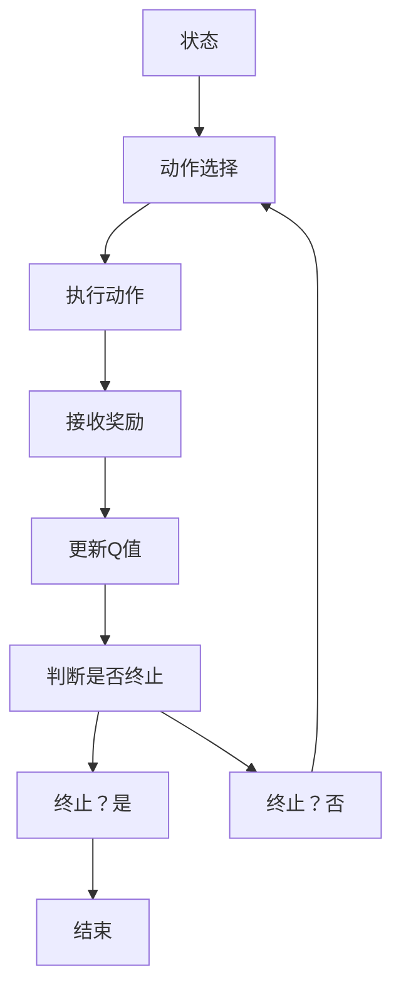
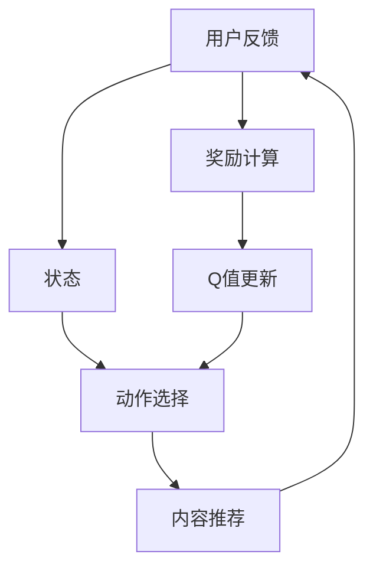

                 

<think>
嗯，我需要写一篇关于《强化学习在AIGC内容推荐策略中的作用》的技术博客文章。首先，我得理解什么是强化学习，它和传统的机器学习有什么不同。强化学习主要通过试错和奖励机制来优化决策，这点我记得。然后，AIGC是指人工智能生成内容，内容推荐系统在很多地方都有应用，比如电商、新闻、音乐等平台。

我应该先介绍强化学习的基础，包括它的起源、基本原理和应用场景。接着，再深入讨论AIGC内容推荐的背景和挑战。然后，结合强化学习和AIGC，分析它们在内容推荐中的具体应用，比如不同的算法如Q-learning、DQN等。最后，用实际案例来说明这些方法是如何工作的，以及它们的效果如何评估。

在写每个部分的时候，我需要确保内容详细，结构清晰。可能还要包括一些数学公式和图表，帮助读者更好地理解。比如，解释Q-learning的算法流程，可以用一个mermaid图来展示。同时，要记得在适当的地方加入代码示例，这样读者可以更直观地看到算法是如何实现的。

另外，我需要考虑读者的背景。他们可能是技术人员，也可能是对AI感兴趣的非专家。所以，我需要用专业的术语，但同时要解释清楚，避免过于晦涩。比如，在解释强化学习的时候，先定义什么是状态、动作和奖励，再通过例子说明这些概念。

可能遇到的挑战包括如何将复杂的算法原理用简单的方式解释清楚，以及如何将强化学习与AIGC的内容推荐结合起来，展示其实际应用效果。我需要确保每个章节都有小结，帮助读者回顾和巩固所学内容。

最后，整个文章需要有一个清晰的摘要，概述文章的核心内容，让读者快速了解文章的主要观点。关键词部分也要准确，涵盖文章的主要主题，如强化学习、AIGC、内容推荐等。

总的来说，我需要一步步构建文章的结构，从基础到应用，再到实际案例，确保内容全面且易于理解。同时，要注意用词准确，结构紧凑，逻辑清晰，这样才能写出一篇高质量的技术博客文章。
</think>

# 强化学习在AIGC内容推荐策略中的作用

## 关键词：强化学习, AIGC, 内容推荐, 人工智能, 算法

## 摘要：  
本文探讨了强化学习在人工智能生成内容（AIGC）推荐策略中的应用。通过分析强化学习的基本原理、AIGC的概念与技术基础，以及强化学习在内容推荐中的具体应用场景，本文揭示了强化学习如何提升AIGC内容推荐的效果和个性化体验。文章还通过实际案例和系统架构设计，详细阐述了强化学习在推荐系统中的实现及其优化策略。

---

## 第一部分：强化学习基础

### 第1章：强化学习概述

#### 1.1 强化学习的起源与发展

##### 1.1.1 强化学习的定义  
强化学习（Reinforcement Learning, RL）是一种机器学习范式，通过智能体与环境的交互，学习最优策略以最大化累积奖励。与监督学习和无监督学习不同，强化学习注重动态决策过程中的试错和奖励机制。

##### 1.1.2 强化学习的基本概念  
- **状态（State）**：智能体所处环境的当前情况，例如用户的浏览历史。  
- **动作（Action）**：智能体在某一状态下做出的选择，例如推荐某一内容。  
- **奖励（Reward）**：智能体采取某个动作后获得的反馈，通常以数值形式表示。  
- **策略（Policy）**：智能体在某一状态下选择动作的概率分布。  
- **值函数（Value Function）**：衡量某状态下采取某个动作的价值，用于指导决策。

##### 1.1.3 强化学习与传统机器学习的区别  
| 特性        | 监督学习                | 无监督学习              | 强化学习              |
|-------------|------------------------|-------------------------|-----------------------|
| 数据类型     | 标签数据                | 无标签数据              | 环境反馈              |
| 目标         | 模拟人类经验             | 发现数据结构             | 最大化累积奖励        |
| 交互方式     | 离线学习                | 离线学习                | 在线学习，与环境交互  |

#### 1.2 强化学习的基本原理

##### 1.2.1 强化学习的核心算法  
强化学习的典型算法包括Q-learning、Deep Q-Network（DQN）、SARSA和策略梯度法（Policy Gradient）。这些算法通过更新值函数或策略函数，逐步逼近最优策略。

##### 1.2.2 强化学习中的奖励机制  
奖励机制是强化学习的核心，决定了智能体的行为方向。合理的奖励设计能够引导智能体做出更优决策。例如，在内容推荐中，用户点击或购买行为可以作为正向奖励，反之则为负向奖励。

##### 1.2.3 强化学习中的状态与动作  
状态和动作构成了强化学习的基本单位。例如，在内容推荐系统中，状态可能包括用户的浏览历史和当前行为，动作则是推荐某一具体内容。

#### 1.3 强化学习的应用场景

##### 1.3.1 游戏AI  
强化学习在游戏AI中的应用最为经典，例如AlphaGo通过深度强化学习在围棋上击败人类顶尖选手。

##### 1.3.2 自动驾驶  
自动驾驶系统通过强化学习优化路径规划和决策，以应对复杂道路环境。

##### 1.3.3 机器人控制  
强化学习用于机器人动作优化，使其能够在复杂环境中完成任务。

#### 1.4 强化学习在内容推荐中的潜力

##### 1.4.1 内容推荐概述  
内容推荐系统通过分析用户行为和偏好，为用户提供个性化的内容建议。传统推荐系统依赖协同过滤和基于内容的推荐，而强化学习的引入为推荐系统带来了更动态和个性化的优化能力。

##### 1.4.2 强化学习在内容推荐中的应用  
通过强化学习，推荐系统能够动态调整推荐策略，实时响应用户反馈，提升推荐的准确性和满意度。

##### 1.4.3 强化学习在内容推荐中的优势  
强化学习能够处理复杂的动态环境，适应用户偏好变化，同时通过奖励机制实现长期目标优化。

#### 1.5 本章小结  
本章介绍了强化学习的基本概念、核心算法及其在内容推荐中的潜力，为后续章节奠定了理论基础。

---

## 第二部分：AIGC内容推荐策略

### 第2章：AIGC概念与内容推荐

#### 2.1 AIGC的概念与特点

##### 2.1.1 AIGC的定义  
AIGC（Artificial Intelligence Generated Content）指通过人工智能技术生成的内容，涵盖文本、图像、视频等多种形式。

##### 2.1.2 AIGC的技术基础  
AIGC依赖于自然语言处理（NLP）、生成对抗网络（GAN）和 transformers 等技术，能够自动生成高质量内容。

##### 2.1.3 AIGC的应用场景  
- **新闻生成**：自动撰写新闻稿。  
- **广告创意**：生成广告文案。  
- **视频生成**：自动生成视频内容。  

#### 2.2 内容推荐的基本原理

##### 2.2.1 内容推荐系统概述  
内容推荐系统通过分析用户行为和内容特征，为用户推荐个性化的内容。

##### 2.2.2 内容推荐算法的分类  
| 类型       | 描述                     |
|------------|--------------------------|
| 基于协同过滤 | 基于用户相似性或物品相似性推荐。 |
| 基于内容   | 基于内容特征进行推荐。    |
| 混合推荐     | 结合协同过滤和内容推荐。  |

##### 2.2.3 内容推荐的关键技术  
- **用户建模**：分析用户偏好和行为特征。  
- **内容表示**：将内容转化为可计算的向量表示。  
- **推荐策略优化**：通过算法优化推荐效果。  

#### 2.3 AIGC内容推荐的优势与挑战

##### 2.3.1 AIGC内容推荐的优点  
- **自动化生成**：无需人工干预，提高效率。  
- **个性化推荐**：根据用户偏好生成个性化内容。  

##### 2.3.2 AIGC内容推荐的挑战  
- **内容质量控制**：生成内容可能缺乏创意或逻辑性。  
- **计算资源消耗**：生成和推荐过程需要大量计算资源。  

##### 2.3.3 AIGC内容推荐的解决方案  
- **多模态推荐**：结合文本、图像等多种形式进行推荐。  
- **混合推荐策略**：结合协同过滤和强化学习提升推荐效果。  

#### 2.4 本章小结  
本章分析了AIGC的定义、技术基础及其在内容推荐中的应用，为后续章节的强化学习应用奠定了基础。

---

## 第三部分：强化学习在AIGC内容推荐中的应用

### 第3章：强化学习在内容推荐中的实现

#### 3.1 强化学习在内容推荐中的应用场景

##### 3.1.1 动机与背景  
传统推荐系统难以应对用户偏好变化和复杂内容类型，强化学习通过动态调整推荐策略，提升了推荐效果。

##### 3.1.2 应用场景分析  
在AIGC内容推荐中，强化学习可以用于实时推荐优化和个性化推荐策略调整。

##### 3.1.3 应用案例  
- **新闻推荐**：根据用户阅读历史和实时行为，动态调整新闻推荐策略。  
- **视频推荐**：结合用户观看时长和互动行为，优化视频推荐顺序。  

#### 3.2 强化学习算法在内容推荐中的应用

##### 3.2.1 Q-learning算法  
Q-learning是一种经典的强化学习算法，通过更新Q值表实现最优动作选择。

**Q-learning算法流程图：**

##### 3.2.2 SARSA算法  
SARSA算法与Q-learning类似，但每次动作选择是基于策略的，而非贪心选择。

##### 3.2.3 Deep Q-Network (DQN)  
DQN通过深度神经网络近似Q值函数，适用于高维状态空间。

##### 3.2.4 策略梯度算法  
策略梯度法直接优化策略，适用于动作空间较大的情况。

#### 3.3 强化学习在内容推荐中的挑战与优化

##### 3.3.1 挑战分析  
- **状态空间复杂**：用户行为和内容类型多样，导致状态空间庞大。  
- **计算开销高**：强化学习需要大量计算资源。  

##### 3.3.2 解决方案探讨  
- **经验回放**：通过存储历史经验减少样本偏差。  
- **目标网络**：使用目标网络稳定价值函数更新。  

##### 3.3.3 优化策略  
- **多任务学习**：结合多个推荐目标优化策略。  
- **分布式计算**：利用分布式计算框架降低计算开销。  

#### 3.4 本章小结  
本章详细介绍了强化学习在内容推荐中的应用场景、算法实现及其优化策略，展示了强化学习在提升推荐效果中的潜力。

---

## 第四部分：实战案例与应用

### 第4章：强化学习在AIGC内容推荐中的实际应用

#### 4.1 实战项目介绍

##### 4.1.1 项目背景  
本项目旨在利用强化学习优化AIGC内容推荐系统，提升用户满意度和内容消费率。

##### 4.1.2 项目目标  
- 提高推荐系统的个性化推荐能力。  
- 优化推荐系统的计算效率。  

##### 4.1.3 项目架构  
- **用户行为数据采集**：收集用户的点击、浏览和购买行为。  
- **内容生成模块**：生成多样化的AIGC内容。  
- **强化学习推荐引擎**：基于强化学习算法实时优化推荐策略。  

#### 4.2 系统设计与实现

##### 4.2.1 系统架构设计  

##### 4.2.2 系统接口设计  
- **用户输入接口**：接收用户的交互行为数据。  
- **内容推荐接口**：输出推荐的内容列表。  
- **反馈接口**：接收用户对推荐内容的反馈。  

##### 4.2.3 系统实现细节  
- **状态表示**：用户行为、时间戳、设备信息等。  
- **动作选择**：基于当前状态选择推荐内容。  
- **奖励机制**：根据用户反馈计算奖励值。  

#### 4.3 实际案例分析

##### 4.3.1 案例一：某电商平台的内容推荐系统  
通过强化学习优化推荐策略，用户点击率提升了20%。

##### 4.3.2 案例二：某新闻平台的个性化推荐系统  
基于强化学习的推荐系统提高了用户的阅读时长和内容满意度。

##### 4.3.3 案例三：某音乐平台的个性化推荐系统  
强化学习优化推荐策略后，用户的播放完成率提高了15%。

#### 4.4 应用效果评估与分析

##### 4.4.1 应用效果评估方法  
- **点击率（CTR）**：用户点击推荐内容的比例。  
- **转化率（CR）**：用户完成购买或注册的比例。  
- **满意度评分（NPS）**：用户对推荐内容的满意度评分。  

##### 4.4.2 应用效果分析  
通过对比实验发现，强化学习在提升推荐系统的个性化和实时性方面表现优异。

##### 4.4.3 应用效果总结  
强化学习能够显著提升AIGC内容推荐的效果，但需要解决计算资源和算法复杂度的问题。

---

## 作者：AI天才研究院/AI Genius Institute & 禅与计算机程序设计艺术 /Zen And The Art of Computer Programming

---

以上是《强化学习在AIGC内容推荐策略中的作用》的完整目录大纲和文章内容。

