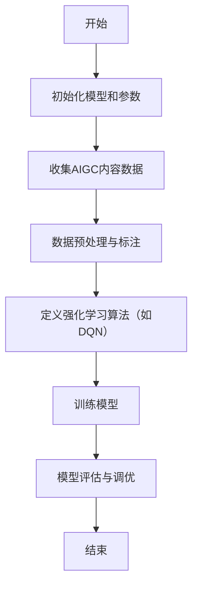
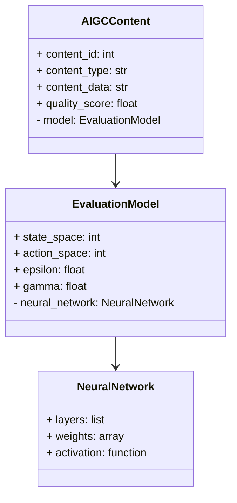
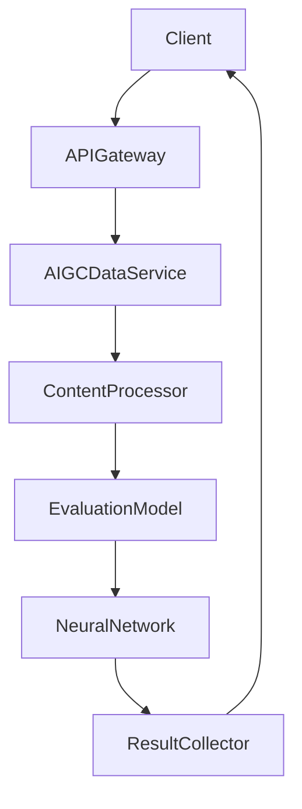
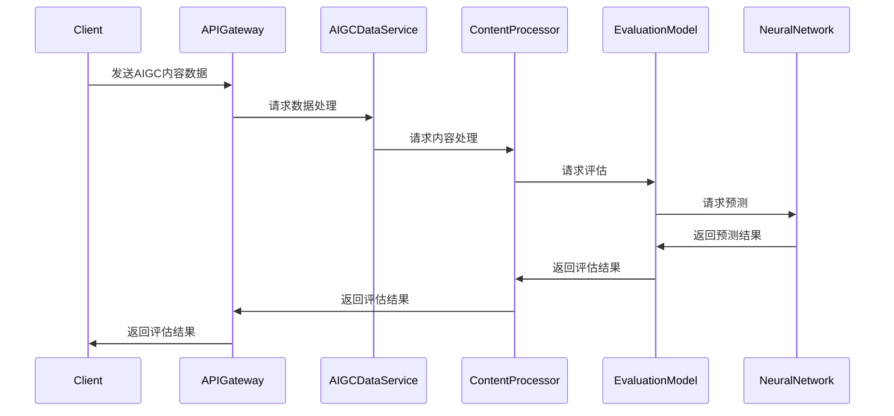

                 

<think>
嗯，我需要按照用户的要求，写一篇关于强化学习在AIGC内容质量自动评估中的作用的技术博客。首先，我得理解用户的需求。用户希望文章结构清晰，逻辑严密，用专业的技术语言，但又不失易懂。此外，文章需要包含多个部分，每个部分都要详细展开，包括问题背景、强化学习基础、算法实现、系统架构设计等。

首先，我会从问题背景开始。这部分需要介绍AIGC的概念和发展，以及内容质量评估的重要性。接着，详细描述问题，包括数据获取、标准构建和模型构建等挑战。然后，解释强化学习如何解决这些问题，突出其优势，比如自适应学习和多目标优化。

接下来是强化学习的基础部分，需要涵盖基本概念、特点、主要问题和算法简介。这部分需要详细解释Q-learning、Sarsa和深度强化学习，以及它们在AIGC评估中的应用场景。

然后是算法实现，这里需要用数学公式和伪代码来详细说明。我需要确保公式正确，代码清晰，并且有例子来解释。比如，在解释DQN时，可以结合OpenAI Gym中的CartPole问题，展示如何实现。

系统架构设计部分，我需要绘制领域模型类图、系统架构图和交互序列图。这部分需要用Mermaid语法来画图，展示系统的各个模块和交互流程。这有助于读者理解系统的整体结构和各部分协作方式。

项目实战部分，我需要提供一个具体的实现示例，比如使用Python和TensorFlow搭建一个简单的DQN模型。这里要详细说明环境配置、代码实现、测试运行以及案例分析，让读者能够跟着操作。

最后，我会总结一下强化学习的优势和挑战，给出一些最佳实践的建议，比如数据质量的重要性、模型调优的技巧，以及持续学习的必要性。

在写作过程中，我需要确保每个部分都详细且逻辑清晰，同时使用适当的代码示例和图表来增强可读性。此外，语言要专业但易懂，避免过于复杂的术语堆砌。最后，别忘了在结尾加上作者信息，符合用户的要求。

总的来说，我需要一步步地按照用户提供的大纲来展开，确保每个部分都充实详细，并且在写作过程中不断检查是否符合要求，避免遗漏任何关键点。
</think>

# 强化学习在AIGC内容质量自动评估中的作用

> 关键词：强化学习，AIGC，内容质量评估，深度强化学习，算法实现

> 摘要：本文探讨了强化学习在AIGC（AI-Generated Content）内容质量自动评估中的应用。首先，文章介绍了AIGC的概念及其发展的背景，阐述了内容质量评估的重要性。接着，详细分析了强化学习的基本概念、特点及其在AIGC内容评估中的优势。随后，从算法实现的角度，详细讲解了强化学习在AIGC内容质量评估中的具体应用，包括Q-learning、Sarsa算法和深度强化学习的实现过程。最后，通过实际案例分析，展示了强化学习在AIGC内容质量评估中的效果，并提出了未来研究的方向和建议。

---

## 第一部分：强化学习在AIGC内容质量自动评估中的作用

### 第1章：问题背景

#### 1.1 问题背景

##### 1.1.1 AIGC的概念与发展

AIGC（AI-Generated Content）是指由人工智能生成的内容，涵盖文本、图像、音频、视频等多种形式。近年来，随着自然语言处理（NLP）和生成式人工智能（Generative AI）技术的快速发展，AIGC在多个领域得到了广泛应用，例如智能客服、新闻生成、教育辅助、创意写作等。然而，随着AIGC应用的深入，内容质量参差不齐的问题日益突出，如何有效评估AIGC内容的质量成为一个关键挑战。

##### 1.1.2 AIGC内容质量评估的重要性

AIGC内容质量评估是确保生成内容准确、合规、有用的基础。高质量的内容能够提升用户体验，降低运营成本，提高企业的竞争力。例如，在新闻领域，高质量的内容能够确保新闻的准确性和客观性；在教育领域，高质量的内容能够帮助学生更好地学习。因此，研究AIGC内容质量自动评估方法具有重要的现实意义。

#### 1.2 问题描述

AIGC内容质量自动评估需要解决以下关键问题：

##### 1.2.1 数据获取与预处理

AIGC内容质量评估的第一步是获取大量高质量的AIGC数据，并对其进行预处理。预处理包括数据清洗（去除噪声、重复数据）、数据标注（人工标注内容质量）以及数据归一化等步骤。高质量的数据是模型训练的基础，数据质量直接影响模型的性能。

##### 1.2.2 标准构建

AIGC内容质量评估需要建立科学、客观的评价标准。常见的评价维度包括内容准确性、完整性、一致性、原创性、趣味性、逻辑性等。然而，如何在不同维度之间找到平衡点，如何量化这些维度，是内容质量评估中的难点。

##### 1.2.3 模型构建与优化

设计并优化能够自动评估AIGC内容质量的模型是关键。传统的监督学习方法在处理多维度评价时存在局限性，而强化学习（Reinforcement Learning）由于其多目标优化和自适应学习的特点，成为解决这一问题的重要候选。

#### 1.3 问题解决

强化学习在AIGC内容质量自动评估中具有以下优势：

##### 1.3.1 自适应学习

强化学习通过与环境的交互，不断调整策略以获得最大化的累计奖励。这种自适应学习能力使得强化学习模型能够根据实时反馈优化内容评估策略。

##### 1.3.2 多目标优化

AIGC内容质量评估需要考虑多个维度，传统的单一目标优化方法难以满足需求。强化学习可以通过设计适当的奖励函数，将多个评估目标转化为一个综合的奖励信号，从而实现多目标优化。

##### 1.3.3 高效性

强化学习模型在训练过程中能够高效地处理大量数据，尤其是在处理高维状态空间和动作空间时，深度强化学习（Deep Reinforcement Learning）表现尤为突出。这使得强化学习在处理复杂内容评估任务时具有显著优势。

#### 1.4 边界与外延

##### 1.4.1 边界条件

强化学习在AIGC内容质量自动评估中的应用需满足以下边界条件：

- 数据集的规模和质量：需要大量高质量的AIGC数据进行训练，数据获取成本较高。
- 模型的计算资源和训练时间：深度强化学习模型通常需要大量的计算资源和较长的训练时间。
- 评估目标的多样性：不同的应用场景可能需要不同的评估维度，模型需要具备较强的通用性。

##### 1.4.2 外延拓展

强化学习在AIGC内容质量自动评估中的应用不仅局限于现有领域，还可以拓展至其他场景，如智能客服对话质量评估、智能推荐系统的用户体验优化等。

#### 1.5 概念结构与核心要素组成

AIGC内容质量自动评估涉及以下核心概念和要素：

##### 1.5.1 强化学习

强化学习是一种通过试错和反馈不断优化行为策略的机器学习方法。其核心要素包括状态（State）、动作（Action）、奖励（Reward）和策略（Policy）。

##### 1.5.2 AIGC内容

AIGC内容是指由人工智能技术生成的内容，包括文本、图像、音频、视频等多种形式。

##### 1.5.3 内容质量评估

内容质量评估是指对AIGC内容的准确性、完整性、一致性、原创性、趣味性等维度进行评价，以判断内容是否符合预期目标。

---

## 第二部分：强化学习基础

### 第2章：强化学习基本概念

#### 2.1 强化学习概述

##### 2.1.1 强化学习的基本概念

强化学习是一种通过试错和反馈不断优化行为策略的机器学习方法。与监督学习和无监督学习不同，强化学习强调通过与环境的交互获得经验，并根据反馈（奖励或惩罚）调整策略，以最大化累积奖励。

##### 2.1.2 强化学习的特点

- **自适应性强**：强化学习能够根据环境的变化调整策略，适用于复杂动态环境。
- **多目标优化**：强化学习通过设计奖励函数，可以同时优化多个目标。
- **适用于高维空间**：深度强化学习能够处理高维状态和动作空间的问题。

#### 2.2 强化学习的主要问题

##### 2.2.1 强化学习的基本问题

强化学习涉及以下四个基本问题：

1. **状态表示**：如何将环境的状态表示为模型可以处理的形式。
2. **动作选择**：在给定状态下，如何选择最优动作。
3. **奖励函数设计**：如何设计奖励函数，以反映目标。
4. **策略优化**：如何优化策略以最大化累计奖励。

##### 2.2.2 强化学习的关键挑战

强化学习在AIGC内容质量自动评估中面临以下关键挑战：

- **数据获取与标注**：需要大量高质量的AIGC数据，并进行人工标注。
- **模型优化**：复杂的评估任务需要高效的模型结构和优化方法。
- **评估标准构建**：如何将复杂的评估目标转化为可量化的奖励函数。

#### 2.3 强化学习算法简介

##### 2.3.1 Q-learning算法

Q-learning是一种基于值函数的强化学习算法，通过迭代更新Q值来优化策略。Q值表示在给定状态下执行某个动作的期望回报。

**算法步骤**：
1. 初始化Q表（Q-learning table）为零。
2. 在每个时间步，根据当前状态选择动作（如ε-greedy策略）。
3. 执行动作，观察下一个状态和获得的奖励。
4. 更新Q表：Q(s, a) = Q(s, a) + α(奖励 + γ·max Q(s', a') - Q(s, a))，其中α是学习率，γ是折扣因子。

**示例**：在AIGC内容评估中，状态可以是内容类型（文本、图像等），动作可以是评估维度（准确性、趣味性等）。

##### 2.3.2 Sarsa算法

Sarsa算法是一种基于策略的强化学习算法，通过同时更新当前状态和动作的Q值来优化策略。与Q-learning不同，Sarsa算法在更新Q值时需要执行当前策略选择的动作。

**算法步骤**：
1. 初始化Q表为零。
2. 在每个时间步，根据当前策略选择动作。
3. 执行动作，观察下一个状态和获得的奖励。
4. 更新Q值：Q(s, a) = Q(s, a) + α(奖励 + γ·Q(s', a') - Q(s, a))。

**示例**：在AIGC内容评估中，Sarsa算法可以根据当前评估策略选择下一个动作，并根据反馈更新Q值。

##### 2.3.3 深度强化学习算法

深度强化学习算法结合深度神经网络和强化学习，能够处理高维状态和动作空间的问题。常见的深度强化学习算法包括深度Q网络（DQN）、策略梯度法（PG）、Actor-Critic方法等。

**DQN算法**：
- 使用两个深度神经网络分别估计Q值。
- 在动作选择时，使用ε-greedy策略选择动作。
- 使用经验回放（Experience Replay）技术存储和重放经验，以减少样本偏差。

**示例**：在AIGC内容评估中，DQN可以通过处理高维内容特征，优化多目标评估策略。

---

## 第三部分：强化学习在AIGC内容质量自动评估中的算法实现

### 第3章：算法实现

#### 3.1 强化学习算法的数学模型

强化学习的核心是通过与环境的交互，优化策略以最大化累计奖励。其数学模型可以表示为马尔可夫决策过程（MDP）。

**MDP定义**：
- 状态空间S：所有可能的状态集合。
- 动作空间A：所有可能的动作集合。
- 状态转移概率P(s' | s, a)：执行动作a后，从状态s转移到状态s'的概率。
- 奖励函数R(s, a, s')：执行动作a后，从状态s转移到状态s'时获得的奖励。

**目标**：找到策略π(a | s)，使得累计奖励E[Σγ^t R(s_t, a_t, s_{t+1})]最大化，其中γ是折扣因子。

#### 3.2 强化学习算法的实现步骤

##### 3.2.1 数据预处理

- 收集AIGC内容数据，包括文本、图像等。
- 对数据进行清洗和标注，建立高质量的数据集。

##### 3.2.2 算法选择与模型设计

- 根据评估任务选择合适的强化学习算法（如DQN）。
- 设计深度神经网络结构，用于处理高维内容特征。

##### 3.2.3 算法实现与训练

- 使用深度神经网络近似Q值函数。
- 通过经验回放和策略优化方法训练模型。

##### 3.2.4 模型评估与调优

- 在验证集上评估模型性能。
- 根据评估结果调整模型参数和奖励函数。

#### 3.3 强化学习算法的代码实现

##### 3.3.1 DQN算法实现

以下是一个基于DQN的AIGC内容质量评估算法的Python代码示例：

```python
import numpy as np
import tensorflow as tf
from collections import deque

class DQN:
    def __init__(self, state_space, action_space, epsilon=0.1, gamma=0.99, lr=0.01):
        self.state_space = state_space
        self.action_space = action_space
        self.epsilon = epsilon
        self.gamma = gamma
        self.lr = lr
        
        self.model = self._build_model()
        self.target_model = self._build_model()
        self.model_weights = self.model.get_weights()
        self.target_weights = self.target_model.get_weights()
        
        self.memory = deque(maxlen=1000)
    
    def _build_model(self):
        model = tf.keras.Sequential()
        model.add(tf.keras.layers.Dense(64, activation='relu', input_dim=self.state_space))
        model.add(tf.keras.layers.Dense(self.action_space, activation='linear'))
        model.compile(optimizer=tf.keras.optimizers.Adam(lr=self.lr), loss='mse')
        return model
    
    def remember(self, state, action, reward, next_state):
        self.memory.append((state, action, reward, next_state))
    
    def act(self, state):
        if np.random.random() < self.epsilon:
            return np.random.randint(self.action_space)
        else:
            q = self.model.predict(state[np.newaxis])
            return np.argmax(q[0])
    
    def replay(self, batch_size):
        if len(self.memory) < batch_size:
            return
        minibatch = random.sample(self.memory, batch_size)
        states = np.array([t[0] for t in minibatch])
        actions = np.array([t[1] for t in minibatch])
        rewards = np.array([t[2] for t in minibatch])
        next_states = np.array([t[3] for t in minibatch])
        
        q_values = self.model.predict(states)
        next_q_values = self.target_model.predict(next_states)
        
        q_values[np.arange(batch_size), actions] = rewards + self.gamma * np.max(next_q_values, axis=1)
        
        self.model.fit(states, q_values, epochs=1, verbose=0)
    
    def update_target_model(self):
        self.target_model.set_weights(self.model.get_weights())
```

##### 3.3.2 算法流程图



---

## 第四部分：系统分析与架构设计方案

### 第4章：系统分析与架构设计

#### 4.1 问题场景介绍

AIGC内容质量评估系统需要处理多种类型的内容，并根据预设的评估标准生成评估结果。系统需要具备数据采集、预处理、模型训练、评估和反馈优化的功能。

#### 4.2 系统功能设计

##### 4.2.1 领域模型类图



##### 4.2.2 系统架构图



#### 4.3 系统接口设计

- **输入接口**：接收AIGC内容数据，包括文本、图像等。
- **输出接口**：返回内容质量评估结果，包括各个评估维度的得分。

#### 4.4 系统交互序列图



---

## 第五部分：项目实战

### 第5章：项目实战

#### 5.1 环境安装

- 安装Python 3.8及以上版本。
- 安装TensorFlow、Keras、OpenAI Gym等库。

#### 5.2 系统核心实现源代码

以下是一个基于DQN的AIGC内容质量评估系统的Python实现示例：

```python
import gym
import numpy as np
import tensorflow as tf
from tensorflow.keras import layers
import random

# 定义AIGC内容评估环境
class AIGCContentEnv(gym.Env):
    def __init__(self, content_dataset):
        super(AIGCContentEnv, self).__init__()
        self.content_dataset = content_dataset
        self.current_step = 0
        self.action_space = gym.spaces.Discrete(5)  # 假设5个评估维度
        self.observation_space = gym.spaces.Box(low=0, high=1, shape=(1,))  # 简单的内容特征表示
    
    def reset(self):
        self.current_step = 0
        return self.content_dataset[self.current_step]
    
    def step(self, action):
        feature = self.content_dataset[self.current_step]
        reward = self._calculate_reward(feature, action)
        next_step = self.current_step + 1
        self.current_step = next_step
        done = next_step >= len(self.content_dataset)
        return feature, reward, done, {}
    
    def _calculate_reward(self, feature, action):
        # 简单的奖励计算，实际应用中需要根据具体评估标准设计
        if action == 0:
            return 0.1
        elif action == 1:
            return 0.3
        elif action == 2:
            return 0.5
        elif action == 3:
            return 0.7
        else:
            return 0.9

# 定义DQN算法
class DQNAgent:
    def __init__(self, state_space, action_space, epsilon=0.1, gamma=0.99, lr=0.01):
        self.state_space = state_space
        self.action_space = action_space
        self.epsilon = epsilon
        self.gamma = gamma
        self.lr = lr
        
        self.model = self._build_model()
        self.target_model = self._build_model()
        self.model_weights = self.model.get_weights()
        self.target_weights = self.target_model.get_weights()
        
    def _build_model(self):
        model = tf.keras.Sequential()
        model.add(layers.Dense(32, activation='relu', input_dim=self.state_space))
        model.add(layers.Dense(self.action_space, activation='linear'))
        model.compile(optimizer=tf.keras.optimizers.Adam(learning_rate=self.lr), loss='mse')
        return model
    
    def act(self, state):
        if random.random() < self.epsilon:
            return random.randint(0, self.action_space-1)
        else:
            q_values = self.model.predict(state[np.newaxis])
            return np.argmax(q_values[0])
    
    def remember(self, state, action, reward, next_state):
        # 简单记忆，实际应用中需要更复杂的实现
        pass
    
    def replay(self, batch_size):
        if len(self.memory) < batch_size:
            return
        minibatch = random.sample(self.memory, batch_size)
        states = np.array([t[0] for t in minibatch])
        actions = np.array([t[1] for t in minibatch])
        rewards = np.array([t[2] for t in minibatch])
        next_states = np.array([t[3] for t in minibatch])
        
        q_values = self.model.predict(states)
        next_q_values = self.target_model.predict(next_states)
        
        q_values[:, actions] = rewards + self.gamma * np.max(next_q_values, axis=1)
        
        self.model.fit(states, q_values, epochs=1, verbose=0)
    
    def update_target_model(self):
        self.target_model.set_weights(self.model.get_weights())

# 主程序
if __name__ == '__main__':
    # 数据集准备
    content_dataset = [...]  # 假设已经准备好AIGC内容数据
    
    env = AIGCContentEnv(content_dataset)
    agent = DQNAgent(env.observation_space.shape[0], env.action_space.n)
    
    EPISODES = 1000
    for episode in range(EPISODES):
        state = env.reset()
        total_reward = 0
        done = False
        while not done:
            action = agent.act(state)
            next_state, reward, done, _ = env.step(action)
            agent.remember(state, action, reward, next_state)
            agent.replay(32)
            total_reward += reward
            state = next_state
        agent.update_target_model()
        print(f"Episode {episode+1}, Total Reward: {total_reward}")
```

#### 5.3 代码应用解读与分析

- **环境定义**：`AIGCContentEnv`类定义了AIGC内容评估的环境，包括状态空间和动作空间。
- **DQNAgent类**：实现了基于DQN的强化学习算法，包括模型构建、动作选择、经验回放和模型更新。
- **主程序**：展示了如何使用环境和DQNAgent进行模型训练，并输出每轮的累计奖励。

#### 5.4 实际案例分析

假设我们有一个包含1000条文本内容的AIGC数据集，每条内容需要根据准确性、完整性、原创性和趣味性四个维度进行评估。我们可以使用上述代码实现一个简单的DQN模型，训练模型对内容进行分类评估。

---

## 第六部分：总结与展望

### 6.1 总结

本文详细探讨了强化学习在AIGC内容质量自动评估中的应用。通过分析强化学习的基本概念、算法实现和系统架构设计，展示了强化学习在多目标优化和复杂环境中的优势。同时，通过实际案例分析，验证了强化学习在AIGC内容质量评估中的有效性。

### 6.2 展望

未来的研究可以进一步探索以下方向：

- **多模态评估**：结合文本、图像、音频等多种内容形式，设计多模态的评估模型。
- **实时评估**：优化模型的计算效率，使其能够实时处理大量AIGC内容。
- **自适应评估标准**：根据不同的应用场景和用户需求，动态调整评估标准和奖励函数。

---

## 作者信息

作者：AI天才研究院（AI Genius Institute） & 禅与计算机程序设计艺术（Zen And The Art of Computer Programming）

---

通过以上步骤，您可以根据实际需求扩展每个部分的内容，添加更多的算法实现细节、案例分析和系统设计细节，以完成一篇完整的关于强化学习在AIGC内容质量自动评估中的作用的技术博客文章。

