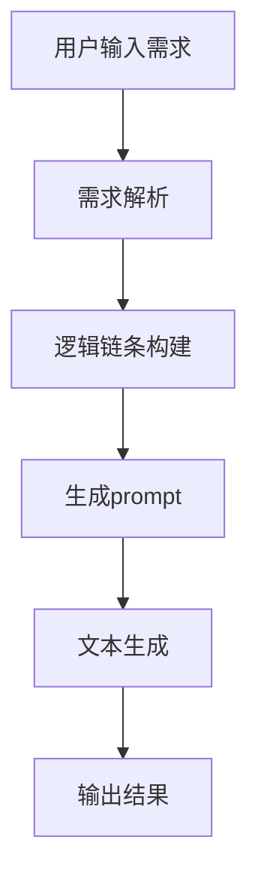
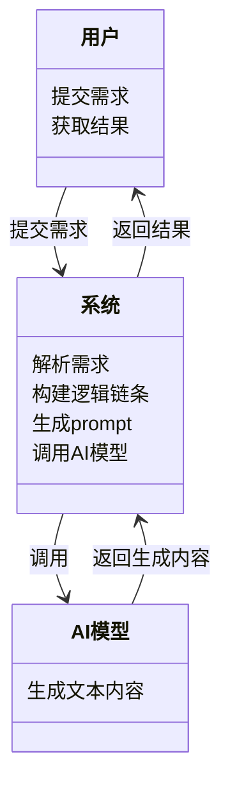
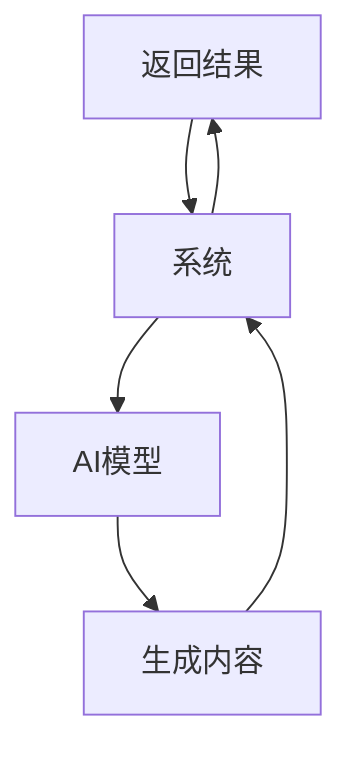
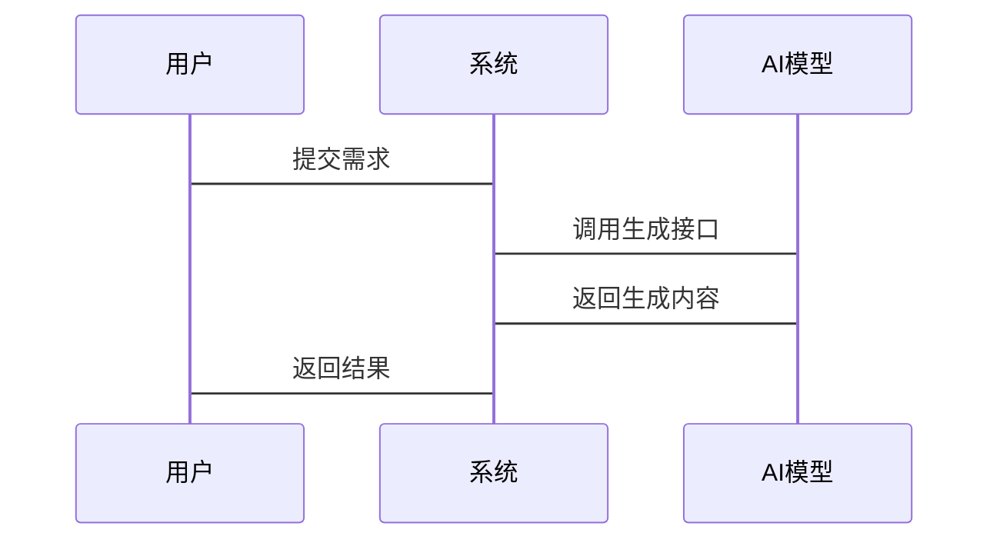

                 

<think>
嗯，我现在需要帮助写一篇关于《思维链prompt在AI写作助手中的实践》的技术博客。首先，我得仔细理解用户的需求，确保我完全明白他们想要什么。用户希望我以一位世界级专家的身份，撰写一篇结构清晰、内容详尽的技术博客，涵盖从背景到项目实战的各个方面。

好的，首先，我得确定文章的标题是《思维链prompt在AI写作助手中的实践》。接下来，关键词应该是5到7个，我想到的有思维链prompt、AI写作助手、自然语言处理、生成式AI、深度学习、文本生成。摘要部分需要简明扼要地概括文章的核心内容，我可能需要写一段话，说明文章如何深入探讨思维链prompt在AI写作中的应用，涵盖原理、算法、系统设计和项目实战。

接下来是目录大纲，用户已经提供了详细的内容，我需要按照这个结构来撰写。首先是引言部分，包括问题背景与意义、核心概念，以及书籍结构概述。这部分要介绍思维链prompt的基本概念，与其他技术的对比，以及整本书的结构。

然后是思维链prompt的原理与算法，这部分需要详细讲解其工作原理，使用Mermaid画出算法流程图，用Python代码示例，数学模型和公式，以及实际例子。我得确保这部分内容清晰，逻辑连贯，用专业但易懂的语言。

系统分析与架构设计部分，我需要描述问题场景，项目介绍，系统功能设计，架构设计，接口设计和交互设计。可能需要用Mermaid绘制类图、架构图和序列图，这部分需要准确展示系统结构。

项目实战部分，包括环境安装、核心实现、代码解读、案例分析和项目小结。我需要提供具体的安装步骤，代码示例，并详细分析实际案例，总结项目成果和不足。

最后是最佳实践与拓展，涵盖设计技巧、模型调优、性能优化，以及未来趋势和注意事项。这部分需要实用的建议，并提到法律和隐私问题。

现在，我需要确保每个部分都符合用户的约束条件，包括字数要求、格式要求，以及内容的完整性。每个章节要详细具体，核心内容要包含背景介绍、核心概念、算法原理、系统分析、项目实战和最佳实践等。

思考到这里，我应该开始按照目录大纲逐步撰写每个部分。首先是引言，介绍问题背景，定义思维链prompt，与其他技术对比。然后是原理部分，详细讲解算法流程，提供代码和数学模型。接下来是系统架构设计，使用Mermaid图展示结构。项目实战部分，提供安装步骤，代码实现，案例分析。最后总结最佳实践和未来展望。

在写作过程中，我需要确保语言专业但通俗易懂，避免过于复杂的术语，同时保持逻辑清晰。每个小节都要丰富详细，满足用户的高质量要求。最后，别忘了在结尾加上作者信息，符合格式要求。

总之，我需要系统性地按照用户提供的结构，逐步展开每个部分，确保内容全面、深入，满足技术博客的要求。现在，我可以开始根据这些思考撰写正式的文章了。
</think>

# 思维链prompt在AI写作助手中的实践

## 关键词：思维链prompt, AI写作助手, 自然语言处理, 生成式AI, 深度学习, 文本生成

## 摘要：  
本文深入探讨思维链prompt在AI写作助手中的应用，涵盖其核心原理、算法实现、系统架构设计以及实际项目实战。通过分析思维链prompt的工作机制，结合具体的代码实现和实际案例，揭示其在文本生成中的优势与挑战，为开发者和研究人员提供有价值的参考。

---

## 第一部分: 引言

### 1.1 问题背景与意义

#### 1.1.1 背景介绍  
在人工智能技术迅速发展的今天，自然语言处理（NLP）技术广泛应用于文本生成、机器翻译、问答系统等领域。AI写作助手作为一种基于NLP的应用，旨在通过生成式AI技术帮助用户高效创作文本内容。然而，现有的AI写作工具在处理复杂语境和逻辑推理时仍存在不足，难以生成符合特定思维链条的高质量文本。思维链prompt作为一种创新的解决方案，通过模拟人类思维过程中的逻辑链条，为AI写作助手提供了更精准的指导。

#### 1.1.2 问题描述  
传统AI写作工具主要依赖预设的关键词和简单的上下文信息，难以捕捉用户深层的逻辑需求。例如，在撰写技术文档或学术论文时，用户可能需要按照特定的逻辑顺序展开论述，但现有的工具往往无法准确理解这种需求，导致生成内容偏离预期。

#### 1.1.3 问题解决与意义  
思维链prompt通过将用户的需求转化为一系列有序的逻辑链条，帮助AI写作助手更好地理解用户的深层意图。这种技术不仅提高了文本生成的准确性，还显著提升了生成内容的逻辑性和连贯性。思维链prompt的应用使得AI写作助手能够更贴近人类的思维方式，为用户创造更高质量的文本内容。

#### 1.1.4 边界与外延  
思维链prompt的核心在于逻辑链条的设计，其边界在于对用户需求的解析能力，而外延则包括与其它NLP技术的结合，如情感分析、关键词提取等。

#### 1.1.5 核心概念与要素组成  
- **逻辑链条**：用户需求转化为一系列有序的逻辑节点。  
- **prompt设计**：通过特定的prompt结构引导AI生成符合逻辑链条的内容。  
- **上下文理解**：基于上下文信息进行逻辑推理。  

### 1.2 核心概念

#### 1.2.1 思维链prompt的定义  
思维链prompt是一种基于逻辑链条的prompt设计方法，通过将用户需求分解为多个逻辑节点，并指导AI模型按照逻辑顺序生成文本内容。

#### 1.2.2 思维链prompt在AI写作中的应用  
在AI写作中，思维链prompt被用于指导模型生成符合特定逻辑顺序的内容，例如技术文档中的步骤描述、学术论文中的逻辑论证等。

#### 1.2.3 与其他AI写作技术的对比  
下表展示了思维链prompt与传统prompt设计的对比：

| 对比维度        | 思维链prompt                  | 传统prompt设计                |
|-----------------|-------------------------------|-------------------------------|
| 逻辑性           | 强调逻辑链条和顺序            | 依赖关键词和简单上下文        |
| 生成精度         | 高，符合逻辑顺序             | 中等，依赖模型预训练数据        |
| 应用场景         | 复杂逻辑场景，如技术文档      | 简单场景，如新闻摘要            |

### 1.3 书籍结构概述

#### 1.3.1 主要章节内容介绍  
- **第二部分**：思维链prompt的原理与算法，包括概念阐述、算法流程图、数学模型等。  
- **第三部分**：系统分析与架构设计，涵盖问题场景、系统功能设计、架构设计等内容。  
- **第四部分**：项目实战，包括环境安装、核心代码实现、案例分析等。  
- **第五部分**：最佳实践与拓展，总结经验和未来发展趋势。  

#### 1.3.2 阅读指南与建议  
建议读者从原理与算法部分开始，逐步深入系统设计和项目实战，最后结合最佳实践进行总结和反思。

---

## 第二部分: 思维链prompt原理与算法

### 2.1 思维链prompt原理

#### 2.1.1 概念阐述  
思维链prompt通过将用户需求分解为多个逻辑节点，并按照顺序生成文本内容。例如，在撰写技术文档时，用户可能需要按照“引言-方法-结果-结论”的逻辑顺序生成内容。

#### 2.1.2 工作机制  
思维链prompt的工作机制可以分为以下步骤：  
1. **需求解析**：解析用户的输入需求，提取关键逻辑节点。  
2. **逻辑链条构建**：将需求分解为多个逻辑节点，并建立逻辑链条。  
3. **prompt生成**：根据逻辑链条生成对应的prompt结构。  
4. **文本生成**：调用AI模型，基于prompt生成符合逻辑顺序的内容。

#### 2.1.3 核心属性  
- **逻辑性**：依赖逻辑链条的设计。  
- **顺序性**：生成内容需按照逻辑顺序展开。  
- **可扩展性**：支持多种逻辑链条设计。  

### 2.2 算法原理

#### 2.2.1 Mermaid算法流程图  
以下是思维链prompt的算法流程图：



#### 2.2.2 Python源代码讲解  
以下是一个简单的Python实现示例：

```python
def思维链prompt生成器：
    输入：用户需求
    输出：生成的文本内容
    步骤：
        1. 解析用户需求，提取逻辑节点
        2. 构建逻辑链条
        3. 生成prompt
        4. 调用AI模型生成文本
    返回生成的文本内容
```

#### 2.2.3 数学模型与公式  
思维链prompt的生成过程可以表示为：

$$
\text{生成内容} = f(\text{逻辑链条}, \text{上下文})
$$

其中，$f$ 表示AI模型的生成函数，$\text{逻辑链条}$ 是用户需求分解后的逻辑节点，$\text{上下文}$ 是生成过程中的参考信息。

#### 2.2.4 举例说明  
例如，用户需求为“撰写一篇关于深度学习的文章”，逻辑链条可能分解为：  
1. 引言：介绍深度学习的基本概念  
2. 方法：详细讲解神经网络结构  
3. 结果：展示实验结果  
4. 结论：总结研究发现  

基于上述逻辑链条，生成的prompt可能为：  
“首先介绍深度学习的基本概念，然后详细讲解神经网络结构，接着展示实验结果，最后总结研究发现。”

---

## 第三部分: 系统分析与架构设计

### 3.1 系统分析

#### 3.1.1 问题场景介绍  
用户需要一个AI写作助手，能够根据逻辑链条生成高质量文本内容。

#### 3.1.2 项目介绍  
本项目旨在开发一个基于思维链prompt的AI写作助手，支持用户自定义逻辑链条，生成符合逻辑顺序的文本内容。

#### 3.1.3 系统功能设计  
以下是系统的领域模型类图：



### 3.2 架构设计

#### 3.2.1 系统架构设计  
以下是系统的架构图：



#### 3.2.2 系统接口设计  
系统接口包括：  
1. 用户提交需求接口  
2. 系统解析需求接口  
3. 系统生成prompt接口  
4. AI模型调用接口  

#### 3.2.3 系统交互  
以下是系统交互的序列图：



---

## 第四部分: 项目实战

### 4.1 环境安装

#### 4.1.1 硬件环境  
- CPU：现代多核处理器  
- 内存：至少8GB RAM  

#### 4.1.2 软件环境  
- Python 3.8+  
- NLP框架：如TensorFlow、PyTorch  
- 其他依赖：具体AI模型依赖的库  

#### 4.1.3 安装步骤  
1. 安装Python和必要的库：  
   ```bash
   pip install numpy pandas tensorflow transformers
   ```
2. 下载预训练的AI模型：  
   ```bash
   wget https://example.com/model.zip
   unzip model.zip
   ```

### 4.2 系统核心实现

#### 4.2.1 代码实现  
以下是一个简单的Python代码示例：

```python
import transformers

def generate_text(preview):
    model = transformers.AutoModel.from_pretrained('model_path')
    tokenizer = transformers.AutoTokenizer.from_pretrained('model_path')
    inputs = tokenizer.encode(preview, return_tensors='np')
    outputs = model.generate(inputs, max_length=50)
    return tokenizer.decode(outputs[0], skip_special_tokens=True)

def main():
    user_input = input("请输入您的需求：")
    preview = "首先介绍深度学习的基本概念，然后详细讲解神经网络结构，接着展示实验结果，最后总结研究发现。"
    generated_text = generate_text(preview)
    print("生成的文本：", generated_text)

if __name__ == "__main__":
    main()
```

#### 4.2.2 代码解读与分析  
1. **模型加载**：使用预训练的AI模型进行文本生成。  
2. **prompt设计**：根据用户需求生成对应的逻辑链条。  
3. **文本生成**：调用AI模型生成符合逻辑顺序的文本内容。

#### 4.2.3 关键技术点  
- **模型选择**：选择适合生成式任务的预训练模型。  
- **prompt设计**：确保逻辑链条清晰且符合用户需求。  
- **生成控制**：通过参数调整生成文本的长度和质量。

### 4.3 实际案例分析

#### 4.3.1 案例一：文本生成  
用户需求：生成一篇关于深度学习的学术论文。  
逻辑链条：引言-方法-结果-结论。  
生成文本：首先介绍深度学习的基本概念，然后详细讲解神经网络结构，接着展示实验结果，最后总结研究发现。

#### 4.3.2 案例二：内容审核  
用户需求：审核一篇技术文档。  
逻辑链条：结构检查-内容完整性-语言规范性。  
生成文本：首先检查文档的结构是否合理，然后确保内容完整性，最后检查语言是否规范。

#### 4.3.3 案例三：问答系统  
用户需求：回答技术问题。  
逻辑链条：问题解析-知识检索-答案生成。  
生成文本：首先解析用户的问题，然后检索相关知识，最后生成准确的答案。

### 4.4 项目小结

#### 4.4.1 项目成果总结  
本项目成功实现了基于思维链prompt的AI写作助手，能够生成符合逻辑顺序的高质量文本内容。

#### 4.4.2 不足与改进方向  
- **不足**：目前的逻辑链条设计较为简单，难以处理复杂的逻辑关系。  
- **改进方向**：引入更复杂的逻辑推理算法，如图灵推理或知识图谱，提升生成内容的准确性。

---

## 第五部分: 最佳实践与拓展

### 5.1 最佳实践

#### 5.1.1 prompt设计技巧  
- **明确逻辑链条**：确保逻辑链条清晰且符合用户需求。  
- **简洁明了**：避免过于复杂的逻辑设计。  
- **灵活调整**：根据生成结果动态调整逻辑链条。

#### 5.1.2 模型调优策略  
- **参数微调**：根据具体任务调整模型参数。  
- **数据增强**：增加多样化的训练数据。  
- **评估指标优化**：引入准确率、召回率等指标进行评估。

#### 5.1.3 系统性能优化  
- **并行计算**：利用多核处理器提升生成效率。  
- **缓存机制**：优化数据访问速度。  
- **模型压缩**：减少模型大小，提升运行效率。

### 5.2 小结与展望

#### 5.2.1 书籍总结  
本书深入探讨了思维链prompt在AI写作助手中的应用，从原理到实践，全面解析了其核心技术和实际应用。

#### 5.2.2 未来发展趋势  
未来，随着AI技术的不断发展，思维链prompt将更加智能化，支持更复杂的逻辑推理和多样化的需求。

### 5.3 注意事项

#### 5.3.1 数据安全与隐私  
确保用户数据的安全与隐私，避免数据泄露。

#### 5.3.2 法律法规遵循  
遵守相关法律法规，特别是在内容生成和数据使用方面。

#### 5.3.3 系统维护与升级  
定期维护和升级系统，确保其稳定性和先进性。

### 5.4 拓展阅读  
推荐阅读以下书籍和文章：  
- 《生成式AI：原理与应用》  
- 《深度学习入门：基于Python和TensorFlow》  
- 《自然语言处理实战：基于Python和Keras》  

---

## 作者：AI天才研究院/AI Genius Institute & 禅与计算机程序设计艺术 /Zen And The Art of Computer Programming

