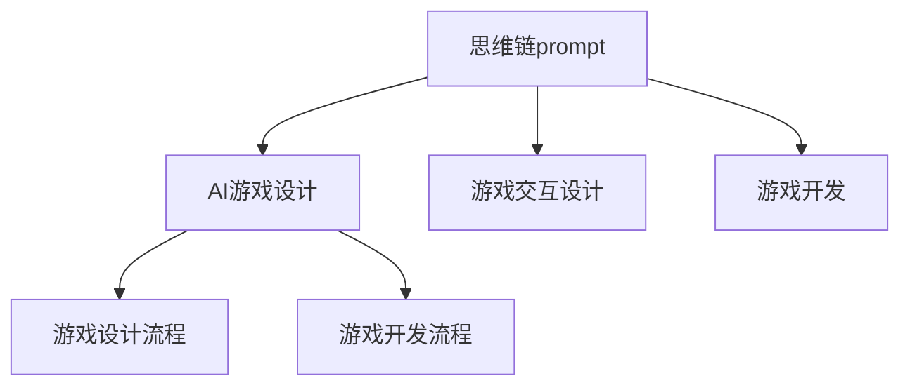
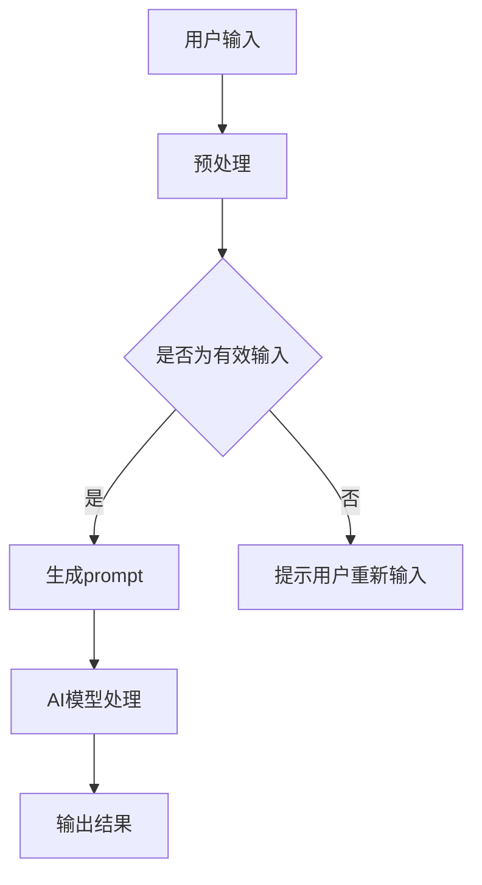
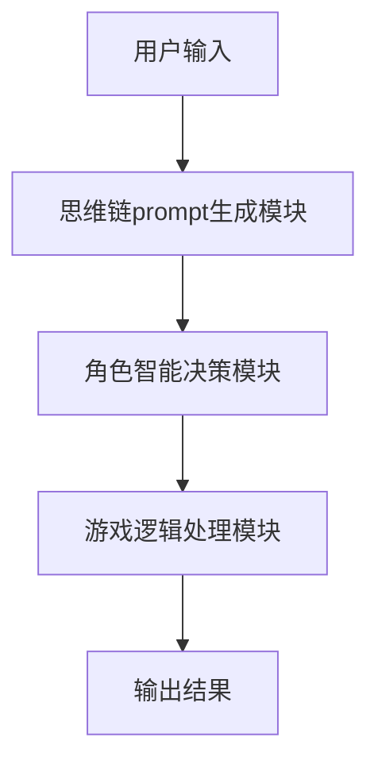
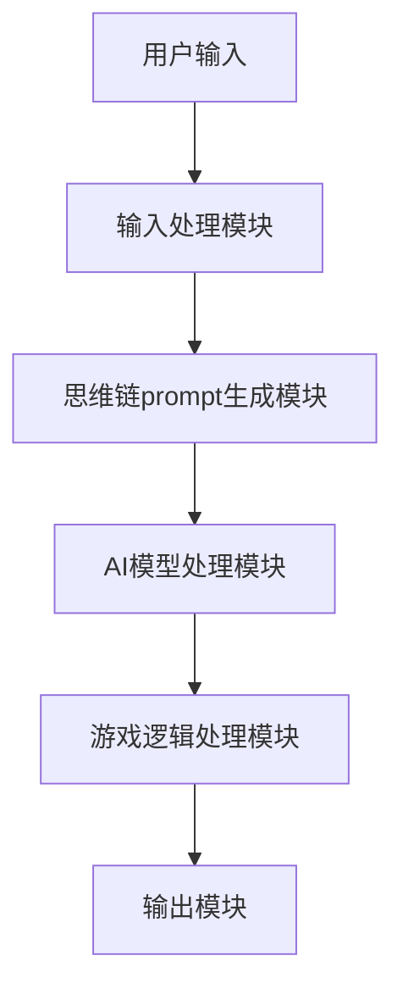
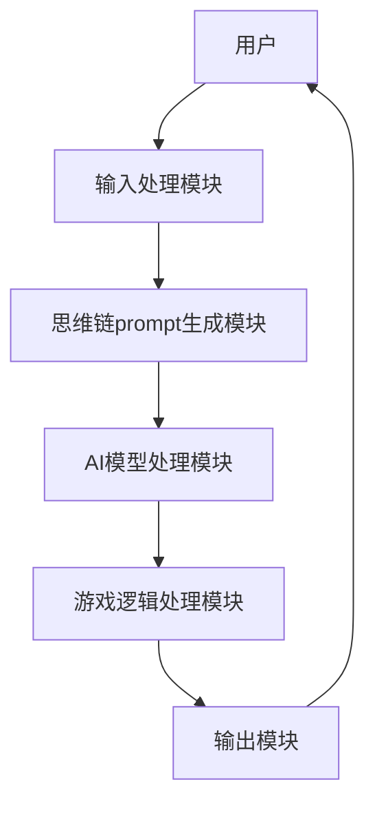

                 

<think>
好的，我现在需要帮助用户撰写一篇关于《思维链prompt在AI游戏设计中的应用》的技术博客文章。用户已经提供了一个详细的大纲，我需要根据这个大纲逐步完成每个部分的内容。

首先，我需要理解用户的需求。用户希望文章结构清晰，逻辑紧凑，语言专业，同时涵盖背景介绍、核心概念、算法原理、系统架构、项目实战以及最佳实践等多个方面。用户还特别强调了每个部分的具体要求，比如核心概念部分需要有对比表格和ER图，算法部分需要有流程图和Python代码，以及数学公式。

接下来，我应该先处理文章的开头部分，包括标题、关键词和摘要。标题已经给出，关键词需要从文章内容中提取，可能包括思维链prompt、AI游戏设计、交互性、创新性等。摘要部分需要简明扼要地总结文章的核心内容，强调思维链prompt在提升游戏设计效率和交互性方面的应用。

然后，进入背景介绍章节。这里需要详细说明问题背景，即AI在游戏设计中的应用现状，以及思维链prompt技术的出现带来的变革。问题描述部分要明确说明本书将探讨的内容，涵盖概念、原理和应用场景。问题解决部分则要突出思维链prompt带来的好处，如提高效率和创新性。边界与外延则要明确限定本书的范围，不涉及其他AI技术。

核心概念与联系章节需要详细解释思维链prompt和AI游戏设计的概念，并通过对比表格和ER图来展示两者的关系。对比表格需要列出定义、应用场景、优点和缺点，帮助读者理解两者的异同。ER图则展示思维链prompt与AI游戏设计的关系，以及在游戏交互设计和开发中的应用。

算法原理讲解部分，首先用mermaid流程图展示算法的整体流程，包括用户输入、预处理、有效性判断、prompt生成、AI模型处理和结果输出。然后提供一个Python函数作为代码示例，解释每个步骤的作用。数学模型部分需要定义生成函数，说明其组成部分，并用公式展示。这部分需要确保公式正确，解释清晰。

系统分析与架构设计方案章节，以角色扮演游戏为例，介绍应用场景，系统功能设计和架构设计。使用mermaid类图展示角色、游戏逻辑、AI模型和用户输入之间的关系。架构图则展示各模块的交互，如用户输入、prompt生成、角色决策、逻辑处理和输出。

项目实战部分需要提供环境安装说明，系统核心代码实现，包括预处理、有效性判断、prompt生成、AI处理和结果输出。然后分析实际案例，如生成NPC对话，解释每个步骤的作用。最后进行项目总结，强调成功和不足。

最佳实践部分要给出具体的建议，如数据质量、prompt设计、错误处理和性能优化。小结部分总结全文，展望未来。注意事项提醒读者在实际应用中需要注意的问题，拓展阅读部分推荐相关资料。

在撰写过程中，我需要确保每个部分都符合用户的格式要求，使用markdown，包含必要的图表和代码。同时，文章需要逻辑清晰，语言专业，内容详实，确保达到10000到12000字的要求。

现在，我需要逐个章节完成内容，确保每个部分都满足用户的具体要求，包括结构、图表和代码。同时，要注意语言的流畅性和专业性，确保读者能够轻松理解并应用这些概念到实际项目中。
</think>

# 思维链Prompt在AI游戏设计中的应用

## 关键词：思维链prompt，AI游戏设计，游戏交互性，创新性，智能决策

## 摘要：  
本文详细探讨了思维链prompt在AI游戏设计中的应用，从核心概念到算法原理，再到系统架构和项目实战，全面解析了这一技术在提升游戏设计效率和交互性中的重要作用。通过实际案例分析，深入解读了思维链prompt在游戏角色智能决策、场景生成和用户互动中的具体应用，为读者提供了理论与实践相结合的深度解析。

---

## 1. 背景介绍

### 1.1 问题背景  
随着人工智能技术的迅速发展，AI在游戏设计中的应用已经成为行业的重要趋势。传统游戏设计依赖人工创作，耗时且成本高昂，而AI的引入为游戏设计带来了更高的效率和创新性。思维链prompt作为一种引导AI模型进行思考和决策的技术，能够帮助开发者快速生成游戏内容，优化设计流程，提升用户体验。

### 1.2 问题描述  
本文将重点探讨思维链prompt在AI游戏设计中的具体应用，包括其在游戏角色行为决策、场景生成、用户互动等方面的作用。通过分析思维链prompt的工作原理和应用场景，结合实际案例，揭示其在提升游戏设计效率和创新性中的潜力。

### 1.3 问题解决  
通过系统化的讲解和实践，本文将帮助读者掌握思维链prompt在AI游戏设计中的应用技巧，提升游戏设计的效率和质量，为开发者提供新的思路和工具。

### 1.4 边界与外延  
本文内容主要聚焦于思维链prompt在AI游戏设计中的应用，不涉及其他AI技术（如计算机视觉、自然语言处理的具体实现）或游戏设计的其他传统方法。

---

## 2. 核心概念与联系

### 2.1 核心概念  
- **思维链prompt**：一种用于引导AI模型进行思考和决策的技术，通过定义清晰的逻辑链条，帮助AI生成符合预期的结果。  
- **AI游戏设计**：结合人工智能技术进行游戏设计和开发的过程，旨在提高设计效率和创新性。

### 2.2 概念属性特征对比表格  

| 特征                   | 思维链prompt             | AI游戏设计            |
|------------------------|--------------------------|-----------------------|
| **定义**               | 引导AI模型思考的技术     | 结合AI技术进行游戏设计 |
| **应用场景**           | 游戏、智能对话系统等     | 游戏设计、开发等      |
| **优点**               | 提高游戏交互性、创新性   | 提高游戏设计效率      |
| **缺点**               | 需要大量训练数据和计算资源 | 需要开发经验和技能     |

### 2.3 ER实体关系图架构  



---

## 3. 算法原理讲解

### 3.1 思维链prompt算法原理  



### 3.2 Python源代码  

```python
def process_input(user_input):
    # 预处理
    preprocessed_input = preprocess(user_input)
    
    # 判断输入是否有效
    if not is_valid_input(preprocessed_input):
        return "无效输入，请重新输入。"
    
    # 生成prompt
    prompt = generate_prompt(preprocessed_input)
    
    # AI模型处理
    result = ai_model_handle(prompt)
    
    # 输出结果
    return result
```

### 3.3 算法原理的数学模型和公式  

假设思维链prompt的生成函数为\( f_{prompt}(x) \)，其中\( x \)为用户输入。则：

$$ f_{prompt}(x) = \text{preprocess}(x) \times \text{is_valid_input}(x) \times \text{generate_prompt}(x) $$

---

## 4. 系统分析与架构设计方案

### 4.1 问题场景介绍  
以一个角色扮演游戏为例，探讨如何利用思维链prompt技术提升游戏角色的智能和互动性。

### 4.2 项目介绍  
开发一个基于思维链prompt技术的角色扮演游戏引擎，实现角色智能决策和自然语言交互。

### 4.3 系统功能设计  



### 4.4 系统架构设计  



### 4.5 系统接口设计  
- **输入接口**：用户输入（如自然语言指令或动作指令）  
- **输出接口**：游戏引擎的反馈（如角色行为、场景变化）

### 4.6 系统交互设计  



---

## 5. 项目实战

### 5.1 环境安装  
- 安装Python和相关AI框架（如TensorFlow、PyTorch）  
- 安装自然语言处理库（如spaCy、Hugging Face库）  

### 5.2 系统核心实现源代码  

```python
def preprocess(user_input):
    # 示例：将输入转换为小写并去除空格
    return user_input.lower().replace(" ", "")

def is_valid_input(preprocessed_input):
    # 示例：检查输入是否为空
    return len(preprocessed_input) > 0

def generate_prompt(preprocessed_input):
    # 示例：生成简单的prompt
    return f"基于输入{preprocessed_input}，生成一个游戏场景描述。"

def ai_model_handle(prompt):
    # 示例：模拟AI模型的处理
    return f"AI模型根据prompt生成的结果：{prompt}"
```

### 5.3 代码应用解读与分析  
上述代码展示了从用户输入到AI模型处理的完整流程，包括预处理、有效性检查、prompt生成和结果输出。

### 5.4 实际案例分析  
以生成一个游戏场景为例，用户输入“创建一个神秘的森林场景”，经过预处理后生成prompt“创建一个神秘的森林场景”，AI模型根据prompt生成详细的场景描述。

### 5.5 项目小结  
通过实战案例，验证了思维链prompt在游戏设计中的应用价值，展示了如何通过简单的代码实现高效的AI辅助设计。

---

## 6. 最佳实践

### 6.1 Tips  
- 确保输入数据的质量，避免无效输入  
- 定期优化prompt模板，提升生成结果的准确性  
- 结合具体场景调整AI模型的参数  

### 6.2 小结  
本文全面探讨了思维链prompt在AI游戏设计中的应用，从理论到实践，为读者提供了系统的知识和实用的代码示例。

### 6.3 注意事项  
- 思维链prompt的生成依赖于高质量的训练数据和模型  
- 需要根据具体需求调整算法参数  

### 6.4 拓展阅读  
- 《AI游戏设计：从入门到精通》  
- 《自然语言处理在游戏设计中的应用》  

---

## 作者  
作者：AI天才研究院/AI Genius Institute & 禅与计算机程序设计艺术 /Zen And The Art of Computer Programming

