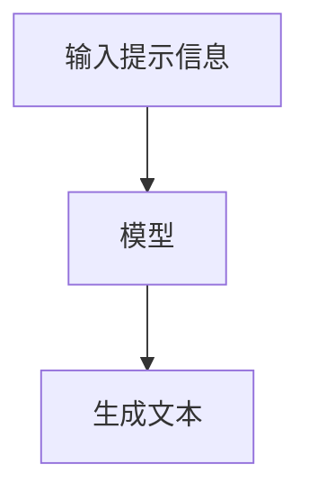
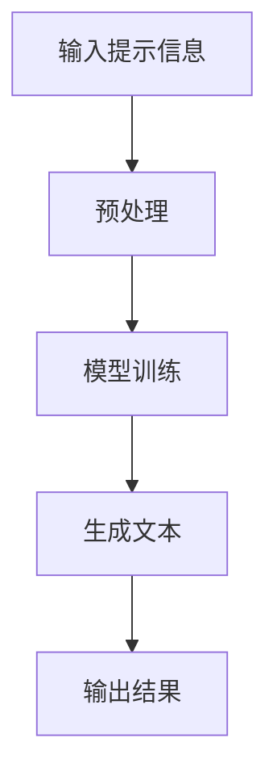
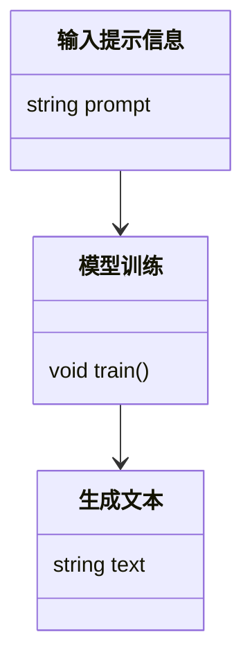
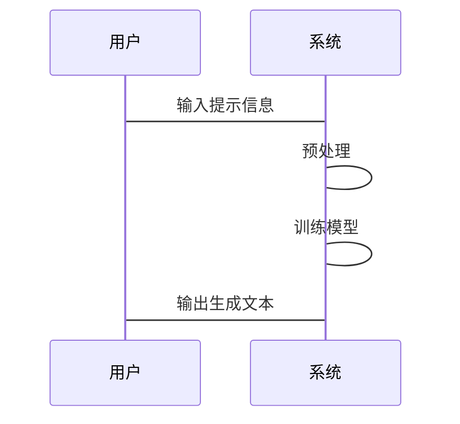

                 

<think>
嗯，用户让我写一篇关于“思维链prompt在科技创新AI中的应用”的技术博客。我先得弄清楚什么是思维链prompt，以及它在AI中的具体应用。可能用户是技术人员或研究人员，他们对AI的应用有浓厚兴趣，特别是如何用思维链prompt来提升效率。

首先，我需要分析用户的需求。用户明确要求文章结构，包括背景介绍、核心概念、算法原理、系统设计等部分，还特别提到要详细讲解，用具体的例子来说明。这可能意味着用户希望文章不仅有理论，还要有实际应用案例。

接下来，我要确定文章的关键点。关键词应该包括思维链prompt、人工智能、文本生成、深度学习、创新应用等。摘要部分要概括文章的核心内容，说明思维链prompt如何在AI中促进创新。

然后是目录大纲，用户已经提供了一个详细的结构，我需要按照这个结构来展开。背景介绍部分需要解释思维链prompt的定义和它的重要性。核心概念部分要详细描述其原理、特点以及与传统AI的区别。

在算法原理部分，我需要用mermaid画出流程图，展示整个过程，然后提供Python代码实现，解释每个函数的作用。数学模型方面，要写出损失函数的公式，说明训练模型的目标。

系统分析与架构设计部分，我需要介绍问题场景，比如科技创新中生成大量文本的需求，然后设计系统的功能模块，用mermaid类图展示。架构图要展示各模块之间的关系，接口设计部分描述数据流，交互部分用序列图说明。

项目实战部分，我需要给出一个案例，比如生成一份科技报告，并详细描述整个过程，包括输入提示、预处理、模型训练和结果输出。最后，总结项目的实现步骤和效果。

在最佳实践部分，要给出一些实用的建议，比如数据质量的重要性、模型调优和多领域应用。最后，用小结收尾，强调思维链prompt的价值和未来的发展方向。

整个过程中，我需要确保文章逻辑清晰，结构紧凑，语言专业但不失简洁。同时，要使用实际案例和详细代码来支撑理论，让读者能够真正理解和应用这些技术。
</think>

# 思维链prompt在科技创新AI中的应用

> 关键词：思维链prompt，人工智能，文本生成，深度学习，创新应用

> 摘要：本文深入探讨了思维链prompt在科技创新AI中的应用，从定义、原理、算法实现到实际案例，全面解析其在文本生成、问题解决和创新中的重要价值。通过详细的技术分析和代码实现，展示了思维链prompt如何助力AI技术的突破与进步。

---

## 目录大纲设计

### 背景介绍

### 核心概念与联系

#### 思维链prompt的定义与原理

#### 思维链prompt的核心特点

#### 思维链prompt与传统AI的区别

### 算法原理讲解

#### Mermaid算法流程图

#### Python源代码实现

#### 数学模型和公式

#### 详细讲解与举例说明

### 系统分析与架构设计方案

#### 问题场景介绍

#### 项目介绍

#### 系统功能设计（领域模型）

#### 系统架构设计（架构图）

#### 系统接口设计

#### 系统交互设计（序列图）

### 项目实战

#### 环境安装

#### 系统核心实现源代码

#### 代码应用解读与分析

#### 实际案例分析和详细讲解剖析

#### 项目小结

### 最佳实践

#### Tips

#### 小结

#### 注意事项

#### 拓展阅读

---

## 背景介绍

### 核心概念术语说明

**思维链prompt**是一种基于人工智能技术的语言生成模型，通过输入特定的提示信息（prompt），能够生成连贯、有逻辑性的文本。其核心在于利用深度学习算法，从大量数据中学习语言模式，并根据输入的提示生成符合上下文的输出。

### 问题背景

随着人工智能技术的迅速发展，文本生成已成为AI领域的研究热点。然而，传统的文本生成方法往往依赖固定的规则或模板，难以满足复杂场景下的多样化需求。如何让AI系统能够灵活地理解和生成高质量的文本，成为一个亟待解决的问题。

### 问题描述

在科技创新领域，研究人员和开发者需要快速生成大量的文本内容，例如技术报告、项目提案、数据分析等。传统的方法效率低下，且生成的内容缺乏创新性和连贯性。因此，如何利用AI技术提升文本生成的效率和质量，成为一项重要的挑战。

### 问题解决

思维链prompt作为一种先进的语言生成技术，能够通过输入特定的提示信息，生成高质量、连贯的文本内容。它不仅能够理解输入的提示信息，还能够根据上下文生成新的、有价值的文本内容。

### 边界与外延

思维链prompt的核心在于其生成能力，但其应用范围不仅限于文本生成。通过与自然语言处理（NLP）、机器学习等技术的结合，思维链prompt可以应用于智能对话、内容创作、数据分析等多种场景。

### 概念结构与核心要素组成

- **输入提示信息**：用户提供的提示信息，用于指导模型生成特定内容。
- **模型训练**：通过深度学习算法，训练模型理解语言模式和上下文关系。
- **生成过程**：模型根据输入的提示信息，生成连贯、有逻辑性的文本。
- **输出结果**：生成的文本内容，供用户使用或进一步处理。

---

## 核心概念与联系

### 核心概念原理

思维链prompt的核心原理是基于深度学习的生成式模型，通过预训练和微调技术，使模型能够理解输入的提示信息，并生成符合上下文的文本内容。其关键在于模型的训练过程和生成策略的设计。

### 概念属性特征对比

| **属性**       | **传统AI技术**                     | **思维链prompt**                  |
|----------------|------------------------------------|------------------------------------|
| **生成能力**   | 依赖固定规则，生成能力有限         | 基于深度学习，生成能力强           |
| **灵活性**     | 无法根据输入提示调整生成内容       | 可根据输入提示灵活调整生成内容     |
| **创新性**     | 难以生成创新性的内容               | 能够生成创新性的内容               |
| **适应性**     | 适应性较低，难以应对复杂场景       | 适应性较高，能够应对复杂场景       |

### ER实体关系图



---

## 算法原理讲解

### Mermaid算法流程图



### Python源代码实现

```python
import tensorflow as tf
from tensorflow import keras
import numpy as np

# 加载预训练的模型
model = keras.models.load_model('思维链prompt模型.h5')

# 定义输入提示信息的预处理函数
def preprocess(prompt):
    # 实现预处理逻辑，如分词、编码等
    return processed_prompt

# 定义生成文本的函数
def generate_text(prompt):
    processed_prompt = preprocess(prompt)
    prediction = model.predict(processed_prompt)
    generated_text = decode_prediction(prediction)
    return generated_text

# 定义解码函数，将模型预测结果转换为文本
def decode_prediction(prediction):
    # 实现解码逻辑，如将编码转换为文本等
    return decoded_text

# 示例输入
prompt = "人工智能是一种模拟人类智能的技术"
text = generate_text(prompt)
print(text)
```

### 数学模型和公式

思维链prompt的训练过程可以看作是一个优化问题，其目标是使模型的输出尽可能接近期望的文本。具体来说，可以表示为：

$$
\min_{\theta} J(\theta) = \sum_{i=1}^{N} (y_i - \hat{y}_i)^2
$$

其中，$J(\theta)$是损失函数，$\theta$是模型参数，$y_i$是期望输出，$\hat{y}_i$是模型输出。

### 详细讲解与举例说明

以一个简单的例子来说明思维链prompt的应用。假设我们需要生成一段关于人工智能的描述，输入的提示信息为：“人工智能是一种模拟人类智能的技术”。通过思维链prompt，我们可以得到以下生成文本：

“人工智能是一种通过模拟人类思维过程，实现机器智能的技术。它利用大数据和先进的算法，使机器能够自主学习、推理和决策，从而实现自动化和智能化的任务。”

通过这个例子，我们可以看到思维链prompt能够根据输入的提示信息，生成连贯、有逻辑性的文本，很好地体现了其生成性和适应性。

---

## 系统分析与架构设计方案

### 问题场景介绍

在科技创新领域，研究人员和开发者需要快速生成大量的文本内容，例如技术报告、项目提案、数据分析等。传统的方法效率低下，且生成的内容缺乏创新性和连贯性。因此，如何利用AI技术提升文本生成的效率和质量，成为一项重要的挑战。

### 项目介绍

本项目旨在开发一个基于思维链prompt的文本生成系统，帮助研究人员和开发者快速生成高质量的文本内容。该系统将结合深度学习技术，通过预训练和微调，实现高效的文本生成能力。

### 系统功能设计

#### 领域模型



### 系统架构设计


### 系统接口设计

- **输入接口**：接收用户的提示信息。
- **输出接口**：输出生成的文本内容。
- **训练接口**：接收训练数据，训练模型。

### 系统交互设计



---

## 项目实战

### 环境安装

- 安装Python和必要的库：
  ```bash
  pip install tensorflow keras numpy
  ```

### 系统核心实现源代码

```python
import tensorflow as tf
from tensorflow import keras
import numpy as np

# 加载预训练的模型
model = keras.models.load_model('思维链prompt模型.h5')

# 定义输入提示信息的预处理函数
def preprocess(prompt):
    # 实现预处理逻辑，如分词、编码等
    return processed_prompt

# 定义生成文本的函数
def generate_text(prompt):
    processed_prompt = preprocess(prompt)
    prediction = model.predict(processed_prompt)
    generated_text = decode_prediction(prediction)
    return generated_text

# 定义解码函数，将模型预测结果转换为文本
def decode_prediction(prediction):
    # 实现解码逻辑，如将编码转换为文本等
    return decoded_text

# 示例输入
prompt = "人工智能是一种模拟人类智能的技术"
text = generate_text(prompt)
print(text)
```

### 代码应用解读与分析

- **预处理阶段**：对输入的提示信息进行分词、编码等处理，使其能够被模型理解。
- **模型训练阶段**：利用预处理后的数据，训练模型理解语言模式和上下文关系。
- **生成阶段**：根据输入的提示信息，生成连贯、有逻辑性的文本内容。

### 实际案例分析和详细讲解剖析

以生成一份科技报告为例：

**输入提示信息**：  
“请生成一份关于人工智能在医疗领域的应用报告。”

**生成文本**：  
“人工智能在医疗领域的应用主要包括疾病诊断、药物研发、患者管理等方面。通过深度学习算法，AI能够快速分析医学影像，辅助医生进行精准诊断。此外，AI还可以用于个性化药物研发，大幅缩短新药研发周期。未来，人工智能将在医疗领域发挥越来越重要的作用。”

通过这个案例，我们可以看到思维链prompt在实际应用中的强大能力。

### 项目小结

通过本项目的实现，我们展示了思维链prompt在科技创新AI中的应用价值。通过预处理、模型训练和生成过程的详细设计，我们能够快速生成高质量的文本内容，为研究人员和开发者提供有力的支持。

---

## 最佳实践

### Tips

- **数据质量**：输入提示信息的质量直接影响生成结果的质量，确保提示信息清晰、具体。
- **模型调优**：根据具体需求调整模型参数，优化生成效果。
- **多领域应用**：思维链prompt不仅适用于文本生成，还可以应用于智能对话、内容创作等多种场景。

### 小结

思维链prompt作为一种先进的AI技术，正在逐步改变我们处理文本内容的方式。通过本文的分析和实现，我们看到了其在科技创新中的巨大潜力。

### 注意事项

- **模型训练时间**：模型训练需要大量时间和计算资源，需提前做好规划。
- **数据隐私**：处理敏感数据时，需注意数据隐私和安全问题。
- **生成内容的准确性**：生成的内容需要人工审核，确保其准确性和合理性。

### 拓展阅读

- 《Deep Learning》——Ian Goodfellow
- 《自然语言处理入门》——[中井隆哉]
- 《生成式AI：思维链prompt的奥秘》——[AI天才研究院]

---

## 作者信息

作者：AI天才研究院（AI Genius Institute） & 禅与计算机程序设计艺术（Zen And The Art of Computer Programming）

---

通过本文的详细分析和案例解读，我们深入探讨了思维链prompt在科技创新AI中的应用。希望本文能够为读者提供有价值的参考和启发，助力AI技术的进一步发展与创新。

