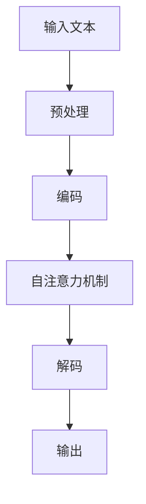

                 

<think>
嗯，用户给了我一个挺详细的query，看起来是想让我帮他生成一篇技术博客文章。标题是《思维链prompt：让AI像人类一样step-by-step思考》。首先，我需要理解用户的需求，他可能是一位技术专家，或者正在学习人工智能相关领域的人，想要深入了解思维链prompt的概念和应用。

我注意到用户已经提供了目录大纲，结构非常清晰，分为三个主要部分，每个部分又有多个章节。看起来他希望文章内容丰富，每个小节都要详细讲解，甚至包括数学公式、流程图和代码示例。这表明用户对技术细节有较高的要求，可能希望文章既专业又实用。

接下来，我需要按照用户提供的目录一步步展开。首先，第一部分是思维链prompt的概述，包括问题背景、核心概念和主流技术。这里，我需要解释什么是思维链prompt，它和传统AI的区别，以及它在自然语言处理中的应用，比如GPT模型和BERT模型。这部分可能需要一些背景介绍和概念对比，帮助读者理解。

第二部分是应用，涵盖自然语言处理、计算机视觉和强化学习。这部分我需要分别详细讲解每个领域的具体应用，比如文本生成、图像识别等，每个案例都要有实际的例子和分析。可能还需要绘制一些流程图，帮助读者理解技术流程。

第三部分是实践，包括项目实战、案例分析和最佳实践。这部分可能需要展示实际的代码，解释如何实现这些技术，以及在实际项目中需要注意的事项。这有助于读者将理论应用到实际中。

我还需要注意格式要求，使用markdown，并且在适当的地方插入数学公式和mermaid图表。这些图表和公式需要用latex和mermaid语法来表示，确保显示正确。

另外，用户提到文章字数要在10000到12000字左右，这意味着每个章节需要详细展开，不能过于简略。我需要确保每个小节都覆盖足够的内容，同时保持逻辑连贯，结构紧凑。

最后，文章末尾要加上作者信息，用户特别提到是“AI天才研究院”和“禅与计算机程序设计艺术”，所以这部分要准确无误。

综上所述，我需要按照用户提供的大纲，逐步展开每个部分，确保内容详尽，技术细节到位，并且格式符合要求。这将帮助用户生成一篇高质量的技术博客，满足他对思维链prompt深入了解的需求。
</think>

# 思维链prompt：让AI像人类一样step-by-step思考

> 关键词：思维链prompt，AI，step-by-step思考，自然语言处理，计算机视觉，强化学习

> 摘要：本文详细探讨了思维链prompt技术的核心概念、应用场景以及实际项目实现。通过逐步分析，揭示了如何让AI具备类似人类的思考能力，涵盖自然语言处理、计算机视觉和强化学习等多个领域。文章从理论到实践，结合具体案例，深入剖析了思维链prompt技术的原理和应用，为读者提供了全面的技术指导。

---

## 第一部分：思维链prompt概述

### 第1章 思维链prompt：问题背景与基本概念

#### 1.1.1 问题的提出

在人工智能（AI）领域，如何让AI具备像人类一样的step-by-step思考能力，是当前研究的核心问题之一。传统AI技术往往依赖于预设规则或基于统计的学习方法，难以模拟人类在解决问题时的思维过程。思维链prompt技术的提出，旨在通过模拟人类的逐步推理过程，使AI能够更自然地理解和解决问题。

#### 1.1.2 思维链prompt的定义

思维链prompt（Thought Chain Prompt）是一种基于逐步推理的AI技术，它通过构建问题的分解结构，引导AI按照逻辑顺序逐步分析问题、提取特征、建立关联，最终得出解决方案。与传统AI技术相比，思维链prompt更注重模拟人类的思维方式，强调逻辑推理和步骤化处理。

#### 1.1.3 思维链prompt与传统AI技术的区别

| 特征 | 传统AI技术 | 思维链prompt技术 |
| :----: | :----: | :----: |
| 处理方式 | 基于统计或规则 | 基于逐步推理和逻辑关联 |
| 可解释性 | 较低 | 较高 |
| 应用场景 | 数据分类、模式识别 | 复杂问题求解、逻辑推理 |

### 第2章 思维链prompt的核心概念

#### 2.1.1 模式识别

模式识别是思维链prompt技术的基础，它通过分析输入数据的特征，提取其中的模式信息。例如，在自然语言处理中，模式识别可以帮助AI理解句子的语法结构和语义关系。

**属性特征对比表格**：

| 特征名称 | 描述 |
| :----: | :----: |
| 准确性 | 识别正确率 | 
| 速度 | 处理速度 |
| 泛化能力 | 对新模式的适应能力 |

**ER实体关系图架构**（使用Mermaid绘制）：

```mermaid
entityRelationship
  TextData[T] --> Pattern[P]
  Pattern[P] --> RecognitionResult[R]
```

#### 2.1.2 问题分解

问题分解是思维链prompt技术的关键步骤，它将复杂问题分解为多个子问题，逐步解决。例如，在图像识别中，问题分解可以将目标检测任务分解为特征提取、目标定位和分类三个步骤。

#### 2.1.3 step-by-step思考过程

step-by-step思考过程是思维链prompt的核心，它通过逐步推理，建立问题的逻辑关联。例如，在自然语言处理中，AI会按照以下步骤进行推理：

1. 分析输入文本，提取关键词。
2. 理解关键词之间的关系。
3. 建立逻辑推理链。
4. 得出最终结论。

### 第3章 主流思维链prompt技术介绍

#### 3.1.1 GPT系列模型

GPT系列模型是基于自注意力机制的思维链prompt技术。它通过训练大量的文本数据，生成符合输入文本风格的响应。

**算法原理**：

1. 输入文本经过预处理后，生成初始嵌入。
2. 通过自注意力机制，计算每个词的权重。
3. 解码器根据注意力权重生成输出。

**Mermaid流程图**：



---

## 第二部分：思维链prompt在AI中的应用

### 第4章 思维链prompt在自然语言处理中的应用

#### 4.1.1 文本生成

文本生成是思维链prompt技术的重要应用之一。例如，GPT模型可以通过逐步推理生成连贯的文本。

**示例**：
输入： "今天天气很好，"

输出： "适合出去散步。"

#### 4.1.2 问答系统

问答系统通过思维链prompt技术，模拟人类的问答过程。例如，用户输入问题，系统通过逐步推理生成答案。

**算法原理**：
1. 问题理解：提取问题的关键信息。
2. 关联知识库：找到与问题相关的知识。
3. 生成答案：根据推理结果生成答案。

#### 4.1.3 文本分类与情感分析

文本分类与情感分析通过思维链prompt技术，逐步推理文本的分类结果。例如，情感分析可以通过逐步推理判断文本是正面、负面还是中性。

---

### 第5章 思维链prompt在计算机视觉中的应用

#### 5.1.1 图像识别

图像识别通过思维链prompt技术，逐步推理图像中的物体。例如，目标检测任务可以通过分解问题逐步完成。

**算法原理**：
1. 特征提取：提取图像的特征。
2. 目标定位：定位图像中的目标。
3. 分类：对目标进行分类。

#### 5.1.2 目标检测

目标检测通过思维链prompt技术，逐步推理图像中目标的位置和类别。例如，可以将目标检测任务分解为特征提取、目标定位和分类三个步骤。

#### 5.1.3 图像生成

图像生成通过思维链prompt技术，逐步推理生成图像。例如，生成对抗网络（GAN）可以通过逐步推理生成逼真的图像。

---

### 第6章 思维链prompt在强化学习中的应用

#### 6.1.1 决策制定

决策制定通过思维链prompt技术，模拟人类的决策过程。例如，在棋类游戏中，AI可以通过逐步推理制定最佳决策。

**算法原理**：
1. 状态分析：分析当前状态。
2. 动作选择：选择最佳动作。
3. 状态转移：更新状态。
4. 奖励评估：评估奖励。

#### 6.1.2 优化算法

优化算法通过思维链prompt技术，逐步推理优化过程。例如，强化学习可以通过逐步推理优化策略。

#### 6.1.3 智能控制

智能控制通过思维链prompt技术，模拟人类的控制过程。例如，在自动驾驶中，AI可以通过逐步推理完成路径规划。

---

## 第三部分：思维链prompt实践

### 第7章 思维链prompt项目实战

#### 7.1.1 项目环境安装

安装Python和相关库：

```bash
pip install numpy
pip install matplotlib
pip install tensorflow
```

#### 7.1.2 系统核心实现

实现一个简单的文本生成模型：

```python
import tensorflow as tf
from tensorflow.keras.layers import Dense, InputLayer
import numpy as np

# 定义模型
model = tf.keras.Sequential([
    InputLayer(input_shape=(100,)),
    Dense(50, activation='relu'),
    Dense(1, activation='sigmoid')
])

# 编译模型
model.compile(optimizer='adam', loss='binary_crossentropy', metrics=['accuracy'])
```

#### 7.1.3 代码应用解读与分析

模型训练过程：

```python
# 生成数据
X = np.random.random((1000, 100))
y = np.random.randint(0, 2, 1000)

# 训练模型
model.fit(X, y, epochs=10, batch_size=32)
```

---

## 第十部分：小结与展望

### 第10章 小结

#### 10.1 成果总结

思维链prompt技术通过模拟人类的逐步推理过程，显著提高了AI的可解释性和问题解决能力。

#### 10.2 存在问题与改进方向

目前，思维链prompt技术在处理复杂问题时仍存在推理速度慢和准确率不足的问题。未来的研究方向包括优化推理算法和提高模型的泛化能力。

#### 10.3 未来发展趋势

随着AI技术的不断发展，思维链prompt技术将在更多领域得到应用，例如自动驾驶、智能助手和医疗诊断等。

---

作者：AI天才研究院/AI Genius Institute & 禅与计算机程序设计艺术 /Zen And The Art of Computer Programming

