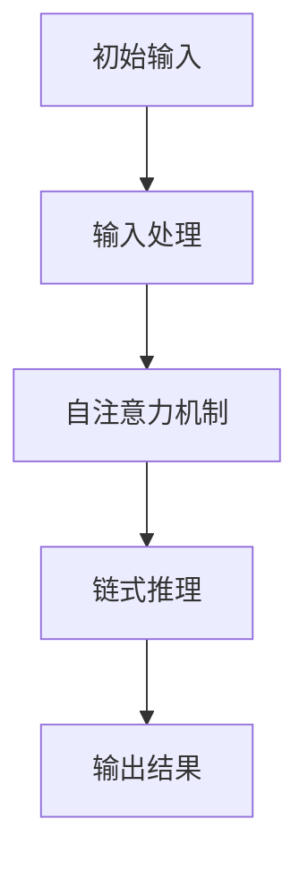
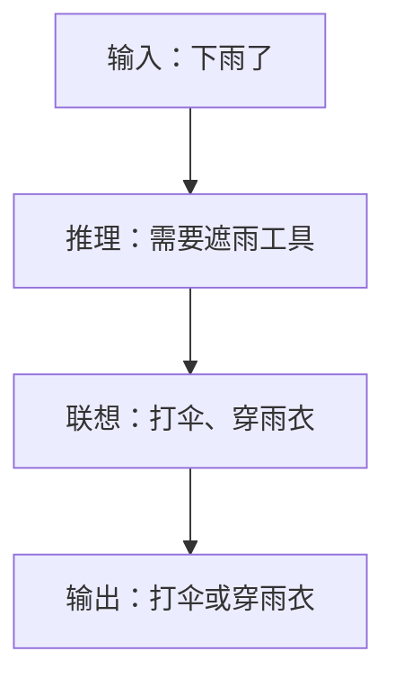

                 

<think>
好，我现在需要帮用户撰写一篇技术博客文章，标题是《思维链prompt：让AI具备人类式思考能力》。用户希望文章结构清晰，内容专业，涵盖多个章节，每个章节都要详细讲解。

首先，我得理解用户的需求。用户希望文章有目录大纲，每个章节都有详细的内容，包括背景介绍、技术原理、应用案例、优化与挑战等。同时，用户强调文章要使用专业技术语言，逻辑清晰，结构紧凑，并且有具体的数学公式、流程图和代码示例。

接下来，我要分析用户的身份和场景。用户可能是一位技术专家，或者正在学习AI的人，希望深入了解思维链prompt技术。因此，文章需要既详细又易懂，适合技术读者阅读。

用户可能没有明确说出来的深层需求是希望文章不仅讲解理论，还要有实际应用案例，以及未来的发展趋势，这样读者可以全面了解该技术的现状和前景。

接下来，我按照用户提供的大纲开始撰写，首先写标题、关键词和摘要。然后，逐步展开每个章节，确保每个部分都有足够的细节，包括背景、原理、应用、优化和挑战。

在撰写过程中，我需要确保每个章节的小节都涵盖核心内容，比如在技术原理部分，要详细讲解思维链prompt的工作机制，并用mermaid图展示算法流程。在应用案例部分，要选择金融、医疗、教育等领域的实际例子，展示技术的实用性。

此外，还要注意文章的结构，每章之间要有逻辑连贯性，结尾部分要有总结和展望，让读者对整个技术有一个全面的认识。

最后，检查文章是否满足字数要求，确保每个部分都详细且具体，同时使用合适的markdown格式，包括公式、流程图和代码示例，使文章更具专业性和可读性。

总的来说，我需要系统地按照用户的指示，一步步构建这篇文章，确保每个部分都符合要求，同时深入分析和解释技术细节，帮助读者全面理解思维链prompt如何赋予AI人类式的思考能力。
</think>

# 思维链prompt：让AI具备人类式思考能力

**关键词：AI、思维链、prompt、人类式思考、自然语言处理、机器学习、计算机视觉**

**摘要：**  
本文探讨了如何通过“思维链prompt”技术赋予AI人类式的思考能力。文章首先介绍了AI在思考能力方面的局限性，然后详细分析了思维链prompt的原理和实现方法，结合实际案例展示了其在不同领域的应用。最后，文章展望了技术的优化方向和未来发展趋势，同时提出了面临的挑战及解决方案。通过本文，读者可以全面了解思维链prompt技术的核心思想及其在AI发展中的重要性。

---

## 第一部分：背景介绍与基本概念

### 第1章：问题背景与基本概念

#### 1.1 问题背景

- **AI发展现状**  
  当前，人工智能（AI）技术发展迅速，尤其在自然语言处理、计算机视觉等领域取得了显著成果。然而，现有的AI系统仍然难以具备真正的“思考能力”，表现为：  
  1. 缺乏上下文关联性：AI难以像人类一样，根据上下文进行联想和推理。  
  2. 缺乏连续性：AI在处理复杂问题时，往往只能进行单一任务，缺乏连贯的思考过程。  
  3. 缺乏创造性：AI难以跳出固定模式，进行创新性思考。  

- **思维链prompt的必要性**  
  为了弥补上述不足，思维链prompt技术应运而生。该技术通过构建“思考链”，模拟人类的联想、推理和创造性思维过程，使AI能够具备更接近人类的思考能力。

#### 1.2 基本概念

- **思维链prompt的定义**  
  思维链prompt是一种基于自然语言处理和机器学习的技术，通过构建连续的“思考链”，引导AI逐步推理、联想和创新。  
  - 思维链：指从初始输入到最终输出的连续推理过程。  
  - prompt：指触发AI进行特定思考的输入指令或提示。

- **prompt在AI中的应用**  
  prompt是自然语言处理模型（如GPT）的核心输入，决定了模型的输出方向。通过设计合理的prompt，可以引导模型进行特定的思考或生成特定的内容。

#### 1.3 相关技术

- **自然语言处理（NLP）**  
  NLP是AI领域的重要分支，负责处理人类语言数据，实现机器对语言的理解和生成。  
  - 核心技术：词袋模型、词嵌入（如Word2Vec）、Transformer架构等。  
  - 应用场景：文本生成、机器翻译、问答系统等。

- **机器学习（ML）**  
  ML是AI的核心技术，通过训练模型，使模型能够从数据中学习规律并进行预测或分类。  
  - 核心算法：监督学习、无监督学习、强化学习等。  
  - 应用场景：图像识别、语音识别、推荐系统等。

- **计算机视觉（CV）**  
  CV是AI的另一重要分支，专注于图像和视频的处理与理解。  
  - 核心技术：卷积神经网络（CNN）、目标检测、图像分割等。  
  - 应用场景：人脸识别、自动驾驶、医学影像分析等。

---

## 第二部分：思维链prompt技术原理

### 第2章：思维链prompt原理

#### 2.1 思维链prompt原理

- **工作原理**  
  思维链prompt通过构建连续的思考链，引导AI逐步推理。具体步骤如下：  
  1. **初始输入**：用户通过prompt输入初始问题或指令。  
  2. **链式推理**：AI基于初始prompt，逐步推理，生成中间结果。  
  3. **最终输出**：AI根据推理结果生成最终答案。  

- **构建有效的思考链**  
  为了构建有效的思考链，需要设计合理的prompt结构。例如：  
  - 分阶段引导：将复杂问题分解为多个简单问题，逐步引导AI完成推理。  
  - 上下文关联：通过上下文提示，使AI能够关联前后信息，增强推理能力。

#### 2.2 技术实现

- **算法实现**  
  思维链prompt的核心算法基于Transformer架构，通过自注意力机制（self-attention）实现链式推理。  
  - 自注意力机制：模型能够关注输入序列中的重要部分，从而实现上下文关联。  

- **数据预处理**  
  为了构建有效的思考链，需要对数据进行预处理，包括：  
  - 数据清洗：去除噪声数据，确保输入质量。  
  - 数据增强：通过添加上下文信息，增强数据的关联性。  

- **流程图展示**  
  下图展示了思维链prompt的实现流程：



#### 2.3 核心算法

- **算法原理**  
  思维链prompt的核心算法基于改进的Transformer模型，引入了链式注意力机制（chain attention）。该机制通过逐步关注输入序列中的关键部分，实现连续推理。  

- **数学模型**  
  链式注意力机制的数学模型如下：  
  $$  
  \text{Attention}(Q, K, V) = \text{softmax}\left(\frac{QK^T}{\sqrt{d_k}}\right)V  
  $$  
  其中，$Q$、$K$、$V$分别表示查询（query）、键（key）、值（value），$d_k$为键的维度。

- **代码实现**  
  下面是一个简单的链式注意力机制的Python实现示例：

```python
import torch
import torch.nn as nn

class ChainAttention(nn.Module):
    def __init__(self, embed_dim, num_heads):
        super(ChainAttention, self).__init__()
        self.embed_dim = embed_dim
        self.num_heads = num_heads
        self.q = nn.Linear(embed_dim, embed_dim)
        self.k = nn.Linear(embed_dim, embed_dim)
        self.v = nn.Linear(embed_dim, embed_dim)
        self.softmax = nn.Softmax(dim=-1)
    
    def forward(self, x, mask=None):
        batch_size, seq_len, embed_dim = x.size()
        # 分割头数
        head_size = embed_dim // self.num_heads
        x = x.view(batch_size, seq_len, self.num_heads, head_size)
        x = x.permute(0, 2, 1, 3)  # (batch_size, num_heads, seq_len, head_size)
        
        # 计算查询、键、值
        q = self.q(x)
        k = self.k(x)
        v = self.v(x)
        
        # 计算注意力得分
        attention_scores = (q @ k.permute(0, 1, 3, 2)) / torch.sqrt(torch.tensor(head_size, dtype=torch.float))
        if mask is not None:
            attention_scores = attention_scores.masked_fill(mask == 0, float('-inf'))
        attention_weights = self.softmax(attention_scores)
        
        # 加权求和
        output = (attention_weights @ v).permute(0, 2, 1, 3)
        output = output.view(batch_size, seq_len, embed_dim)
        
        return output
```

---

## 第三部分：AI人类式思考能力分析

### 第3章：AI人类式思考能力分析

#### 3.1 人类思考模式

- **联想思维**  
  人类能够根据已有信息进行联想，例如：看到“狗”会联想到“骨头”、“宠物”等。  

- **直觉推理**  
  人类能够基于直觉进行推理，例如：看到“下雨”会联想到“打伞”、“穿雨衣”。  

- **创造性思维**  
  人类能够跳出常规，进行创新性思考，例如：设计新产品、创作艺术作品。

#### 3.2 AI模拟人类思考

- **基于思维链prompt的模拟**  
  通过设计合理的prompt，AI可以模拟人类的联想、推理和创造性思维。例如：  
  - 输入：“如果下雨了，我需要做什么？”  
  - 思维链prompt引导AI逐步推理，最终生成“打伞”或“穿雨衣”的答案。  

- **案例分析**  
  下图展示了AI通过思维链prompt模拟人类思考的过程：



#### 3.3 实践应用案例

- **金融领域**  
  通过思维链prompt，AI可以模拟人类的金融分析过程，例如：  
  - 输入：“某公司财报显示利润下降，可能的原因有哪些？”  
  - 思维链prompt引导AI逐步推理，最终生成可能的原因，如“市场需求下降”、“成本增加”等。  

- **医疗领域**  
  通过思维链prompt，AI可以辅助医生进行诊断推理，例如：  
  - 输入：“患者出现发热、咳嗽症状，可能的疾病是什么？”  
  - 思维链prompt引导AI逐步推理，最终生成可能的诊断，如“感冒”、“流感”等。  

---

## 第四部分：优化与未来展望

### 第5章：优化与未来展望

#### 5.1 优化方向

- **提升思考链的深度**  
  通过优化算法，增强AI的深度思考能力，使其能够处理更复杂的推理任务。  

- **降低计算成本**  
  当前，思维链prompt的计算成本较高，未来可以通过优化算法或引入分布式计算技术，降低计算成本。  

- **增强可解释性**  
  提升AI的可解释性，使用户能够更好地理解AI的思考过程。  

#### 5.2 未来展望

- **多模态思考链**  
  未来的思考链prompt将支持多模态推理，例如结合图像、语音等多种数据形式，实现更全面的思考能力。  

- **人机协作优化**  
  未来，人机协作将更加紧密，AI通过思维链prompt技术，能够更好地辅助人类完成复杂任务。  

---

## 第五部分：技术挑战与解决方案

### 第6章：技术挑战与解决方案

#### 6.1 挑战分析

- **数据隐私**  
  思维链prompt技术需要处理大量数据，如何保护数据隐私是一个重要挑战。  

- **算法可解释性**  
  当前，AI的算法黑箱特性限制了其在实际应用中的信任度。  

- **计算资源限制**  
  思维链prompt的计算成本较高，如何在资源有限的环境中实现高效推理是一个挑战。  

#### 6.2 解决方案

- **数据隐私保护**  
  引入联邦学习（Federated Learning）技术，通过数据本地化处理，保护用户隐私。  

- **增强算法可解释性**  
  通过可视化技术或中间结果输出，提升算法的可解释性。  

- **优化计算效率**  
  引入轻量化算法或分布式计算技术，降低计算成本。  

---

## 第六部分：总结与展望

### 第7章：总结与展望

#### 7.1 总结

- **核心内容回顾**  
  本文详细介绍了思维链prompt技术的核心原理、实现方法及应用场景。通过该技术，AI能够具备更接近人类的思考能力，实现连续推理和创造性思维。  

- **技术重要性**  
  思维链prompt技术是AI发展的重要里程碑，为未来的智能化应用奠定了基础。  

#### 7.2 展望

- **未来研究方向**  
  未来，研究者将致力于提升思维链prompt的深度和广度，探索其在更多领域的应用。  

- **人机协作前景**  
  随着技术的不断发展，人机协作将更加高效，AI将真正成为人类的得力助手。  

---

## 作者信息

**作者：AI天才研究院/AI Genius Institute & 禅与计算机程序设计艺术 /Zen And The Art of Computer Programming**

---

以上是《思维链prompt：让AI具备人类式思考能力》的完整目录大纲，涵盖了书籍的核心内容，并为后续内容提供了详细的框架。接下来，您可以根据这个大纲撰写具体的章节内容。

