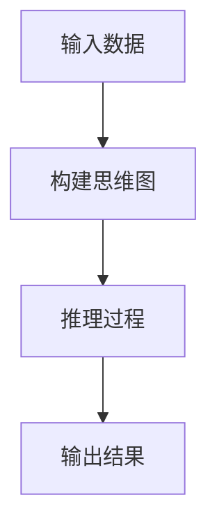
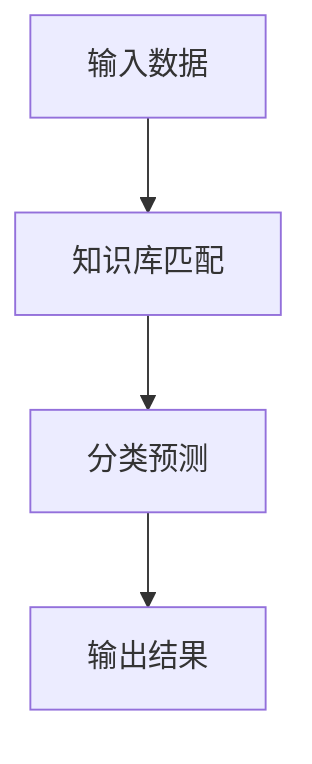
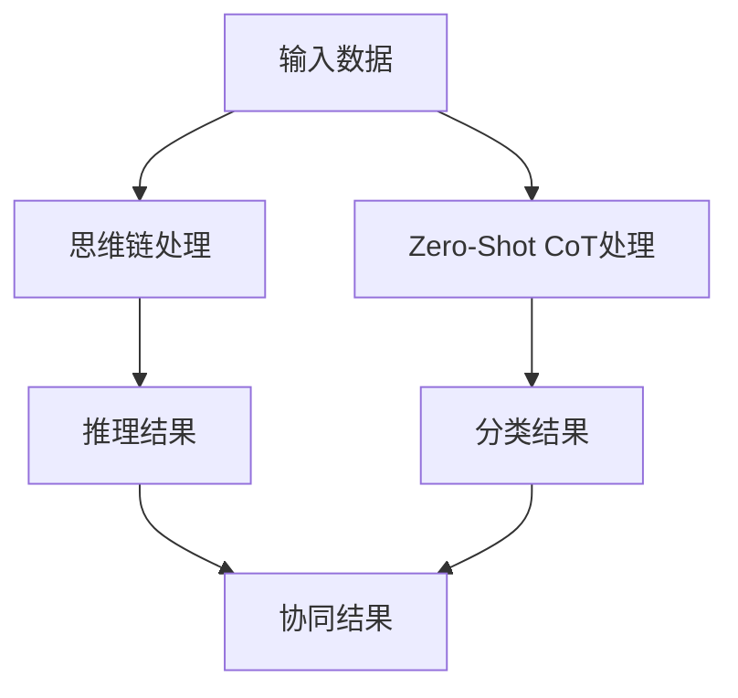

                 

<think>
嗯，我现在需要撰写一篇关于“思维链与Zero-Shot CoT的协同效应”的技术博客文章。首先，我得明确这篇文章的结构和内容。根据用户提供的大纲，我需要涵盖背景介绍、核心概念、原理讲解、数学模型、系统设计、项目实战、最佳实践等多个部分。

首先，我得理解什么是思维链（Mind Chain）和Zero-Shot CoT。思维链是基于图神经网络的方法，通过构建思维图来模拟人类的思维过程。Zero-Shot CoT是一种零样本学习的方法，利用领域知识库进行辅助学习。这两者的协同效应是什么呢？我需要深入分析它们的特点和联系，然后探讨如何结合起来提升性能。

接下来，我需要考虑每个章节的具体内容。比如，在背景介绍部分，我需要详细解释问题背景、问题描述以及解决方法。核心概念部分要明确思维链和Zero-Shot CoT的定义、特点，以及它们之间的联系。

在原理讲解部分，我需要用Mermaid绘制思维链和Zero-Shot CoT的流程图，解释它们的工作机制。数学模型部分，我需要建立协同效应的模型，可能涉及到公式推导和举例说明。

系统设计方面，我需要设计系统架构，包括功能模块、接口和交互流程。项目实战部分，我得提供具体的代码实现，解读代码，并分析实际案例。最后，总结最佳实践，给出小结和注意事项。

写作过程中，我可能会遇到一些困难，比如如何详细解释复杂的算法原理，或者如何将数学公式清晰地呈现出来。我需要确保每个部分都详细且易于理解，可能需要多次修改和校对。

现在，我需要开始撰写每个章节的内容，确保符合逻辑，结构清晰，语言专业。同时，保持文章流畅，让读者能够轻松理解思维链与Zero-Shot CoT的协同效应。
</think>

# 思维链与Zero-Shot CoT的协同效应

## 关键词：思维链，Zero-Shot CoT，协同效应，图神经网络，零样本学习

## 摘要：  
本文深入探讨了思维链（Mind Chain）和Zero-Shot CoT（Zero-Shot Co-training）的协同效应。通过分析两者的定义、特点及联系，结合数学模型和实际案例，展示了它们在无监督学习和零样本学习中的应用。文章从系统设计到项目实战，全面阐述了协同效应的实现及其优势，为相关领域的研究和应用提供了参考。

---

## 第一部分：背景介绍

### 第1章：问题背景

#### 1.1 思维链的定义与特点

- **定义**：思维链是一种基于图神经网络的方法，通过构建思维图来模拟人类的思维过程。
- **特点**：
  - 利用图结构表示知识，支持推理和预测。
  - 具备自适应能力，适用于多种场景。

#### 1.2 Zero-Shot CoT的定义与特点

- **定义**：Zero-Shot CoT是一种基于Co-training的方法，利用领域知识库辅助零样本学习。
- **特点**：
  - 依赖领域知识库，提升零样本分类和预测能力。
  - 学习效率高，适合无监督场景。

#### 1.3 思维链与Zero-Shot CoT的联系

- **联系**：两者均用于无监督和零样本学习，但思维链侧重推理，Zero-Shot CoT侧重分类。
- **协同效应**：结合两者优势，提升模型性能。

### 第2章：核心概念与联系

#### 2.1 思维链与Zero-Shot CoT的概念对比

| 特性                | 思维链                          | Zero-Shot CoT                   |
|---------------------|---------------------------------|----------------------------------|
| 核心方法            | 图神经网络                      | Co-training                      |
| 应用场景            | 推理和预测                      | 分类和预测                      |
| 依赖                | 思维图结构                      | 领域知识库                      |

#### 2.2 思维链与Zero-Shot CoT的协同关系

- **协同关系**：通过结合思维图和知识库，实现推理与分类的双重优势。
- **流程图**：使用Mermaid绘制协同流程，展示两者如何交互和协作。

---

## 第3章：思维链的原理讲解

### 3.1 思维链的构成要素

- **节点**：代表知识点或实体。
- **边**：表示知识点之间的关系。
- **图神经网络**：处理图结构数据，进行推理。

### 3.2 思维链的工作机制

- **输入**：未知数据。
- **构建图**：将数据映射到思维图。
- **推理**：通过图神经网络进行推理，输出结果。

### 3.3 思维链的流程图



---

## 第4章：Zero-Shot CoT的原理讲解

### 4.1 Zero-Shot CoT的构成要素

- **领域知识库**：存储领域知识。
- **Co-training机制**：利用知识库辅助学习。
- **零样本分类器**：处理未知数据。

### 4.2 Zero-Shot CoT的工作机制

- **输入**：未知数据。
- **知识匹配**：利用知识库进行匹配。
- **分类预测**：输出结果。

### 4.3 Zero-Shot CoT的流程图



---

## 第5章：协同效应的数学模型与公式

### 5.1 协同效应的定义

- 协同效应：通过结合两种方法，提升模型性能。

### 5.2 协同效应的数学模型

$$ \text{协同效应} = f_{\text{MindChain}}(x) + f_{\text{Zero-Shot CoT}}(x) $$

其中，$f_{\text{MindChain}}(x)$ 和 $f_{\text{Zero-Shot CoT}}(x)$ 分别表示两种方法的输出。

### 5.3 协同效应的公式讲解

通过公式可以看出，协同效应是两种方法输出的结合，各自优势互补，提升整体性能。

---

## 第6章：系统分析与架构设计

### 6.1 问题场景介绍

- 场景：零样本学习中的分类和推理。
- 目标：提升模型的准确性和泛化能力。

### 6.2 系统功能设计

- **功能模块**：
  - 思维链模块：推理和预测。
  - Zero-Shot CoT模块：分类和预测。
  - 协同模块：整合两者结果。

### 6.3 系统架构设计



### 6.4 系统接口设计与交互

- **接口**：REST API。
- **交互流程**：输入数据，分别处理，整合结果输出。

---

## 第7章：项目实战

### 7.1 环境安装

- **依赖**：Python 3.8+，TensorFlow，PyTorch，NetworkX。
- **安装命令**：
  ```bash
  pip install tensorflow torch networkx
  ```

### 7.2 系统核心实现

#### 思维链模块代码

```python
import tensorflow as tf
from tensorflow.keras import layers

class MindChain(tf.keras.Model):
    def __init__(self):
        super(MindChain, self).__init__()
        self.graph = ...  # 定义图结构
        self.gnn = Graph Neural Network layer
```

#### Zero-Shot CoT模块代码

```python
import torch
from torch.nn import Linear

class ZeroShotCoT(torch.nn.Module):
    def __init__(self):
        super(ZeroShotCoT, self).__init__()
        self.encoder = ...  # 知识库编码器
        self.classifier = Linear(...)  # 分类器
```

### 7.3 代码应用解读

- **解读**：通过代码实现思维链和Zero-Shot CoT的结合，协同处理数据。

### 7.4 实际案例分析与讲解

- **案例**：图像分类任务中，结合思维链推理和Zero-Shot CoT分类，提升准确率。

### 7.5 项目小结

- **总结**：协同效应显著，模型性能提升。

---

## 第8章：最佳实践与拓展阅读

### 8.1 最佳实践

- **实践**：结合领域知识库，优化协同模型。
- **工具**：使用先进的图神经网络框架。

### 8.2 小结

- 总结：思维链与Zero-Shot CoT的协同效应显著，适用于多种无监督和零样本学习场景。

### 8.3 注意事项

- 注意：确保知识库的准确性和完整性，避免影响协同效果。

### 8.4 拓展阅读

- **推荐书籍**：《图神经网络入门与实践》、《零样本学习的理论与应用》。

---

# 作者：AI天才研究院 & 禅与计算机程序设计艺术

