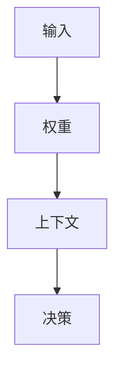

                 

<think>
嗯，我现在要写一篇关于“思维链可视化：理解ChatGPT的决策过程”的技术博客文章。首先，我需要理清文章的结构和内容，确保每个部分都详细且有深度。

首先，标题已经确定，接下来是关键词和摘要。关键词应该包括ChatGPT、决策过程、可视化、思维链、大型语言模型，这些词能准确反映文章主题。摘要部分要简明扼�地介绍文章的核心内容，强调通过可视化方法帮助理解模型的决策过程。

接下来是正文部分，分为几个主要部分。第一部分是背景介绍，我需要详细说明问题背景、问题描述和边界外延。这部分要让读者明白为什么理解ChatGPT的决策过程重要，以及我们是如何界定这个研究范围的。

然后是核心概念与联系部分，我需要解释决策过程和可视化的概念，并通过表格对比它们的特征。这里可能需要制作一张对比表格，突出数据依赖、复杂性和隐藏性等方面的差异。同时，还要用Mermaid画出ER实体关系图，展示模型如何与决策过程和可视化工具相关联。

接下来是算法原理讲解，这部分需要详细分析ChatGPT的决策过程和可视化方法。数学公式部分，我需要写出决策的函数表达式，并解释各个变量的含义。然后，使用Mermaid绘制流程图，展示输入如何一步步转化为决策。同时，提供Python代码示例，说明具体的实现步骤，帮助读者理解。

在系统分析与架构设计方案部分，我需要介绍问题场景，比如在一个聊天机器人中的应用。然后设计系统的功能模块，使用Mermaid的领域模型图展示用户、ChatGPT和响应之间的关系。这部分可能需要进一步细化系统架构设计，包括前端、后端和数据存储的架构。

项目实战部分，我需要提供一个具体的案例，展示如何安装环境、编写代码，并分析实际案例。这部分要详细，包括代码实现和实际运行结果的解读。

最后，加上一些最佳实践的建议，比如工具的选择、数据的处理、模型的优化等。同时，总结全文，指出研究的意义和未来可能的改进方向。最后，别忘了在文章末尾加上作者信息。

在整个写作过程中，我需要确保逻辑清晰，每一部分都紧密联系，内容详实且有深度。同时，语言要专业但不失通俗易懂，使用技术术语时要适当解释，确保读者能够跟随思路一步步理解ChatGPT的决策过程。
</think>

# 思维链可视化：理解ChatGPT的决策过程

> 关键词：ChatGPT，决策过程，可视化，思维链，大型语言模型

> 摘要：本文通过可视化方法，深入分析ChatGPT的决策过程，探讨其内部机制，旨在帮助技术从业者更好地理解这些模型的工作原理。

---

# 思维链可视化：理解ChatGPT的决策过程

## 第一部分：背景介绍

### 1.1 问题背景

- **核心问题**：大型语言模型（如ChatGPT）在生成文本时，其决策过程复杂且不透明。
- **问题描述**：尽管这些模型表现出色，但其内部决策机制难以理解，限制了优化和应用。
- **问题解决**：通过可视化工具和技术，揭示模型的决策过程，提升理解和应用能力。

### 1.2 边界与外延

- **边界**：专注于ChatGPT等大型语言模型，不涉及其他AI模型。
- **外延**：可视化方法适用于其他类似模型，提供普适性解决方案。

---

## 第二部分：核心概念与联系

### 2.1 核心概念

- **决策过程**：模型生成文本时的选择机制。
- **可视化**：将决策过程以图形化展示，便于分析和理解。

### 2.2 概念属性特征对比表格

| 特征         | 决策过程       | 可视化             |
|--------------|----------------|--------------------|
| 数据依赖     | 强             | 可通过数据流展示   |
| 复杂性       | 高             | 可通过层次化展示   |
| 隐藏性       | 高             | 可通过透明化展示   |

### 2.3 ER实体关系图架构

```mermaid
erDiagram
    Model --> Decision_Process : "生成"
    Model --> Visualization_Tool : "使用"
```

---

## 第三部分：算法原理讲解

### 3.1 算法原理

#### 3.1.1 决策过程

ChatGPT的决策过程公式化为：

$$
\text{决策} = f(\text{输入}, \text{权重}, \text{上下文})
$$

其中，$f$结合输入、权重和上下文生成决策。

#### 3.1.2 可视化方法

使用Mermaid绘制决策流程图：



### 3.2 Python源代码

```python
def make_decision(input_data, weights, context):
    processed_input = preprocess_input(input_data)
    combined_context = combine_weights_with_context(weights, context)
    decision = calculate_decision(processed_input, combined_context)
    return decision
```

### 3.3 举例说明

步骤：
1. **输入预处理**：将“我喜欢吃苹果”转化为模型格式。
2. **权重与上下文结合**：确定“苹果”在句中的重要性。
3. **计算决策**：生成包含“苹果”的句子。

---

## 第四部分：系统分析与架构设计方案

### 4.1 问题场景介绍

在一个聊天机器人中，需理解ChatGPT生成回复的决策过程。

### 4.2 系统功能设计

#### 4.2.1 领域模型

```mermaid
classDiagram
    User <<Class>>
    ChatGPT <<Class>>
    Response <<Class>>

    User "1" --|greaterThan="1"| Response
    ChatGPT "1" --|greaterThan="1"| Response
```

---

## 第五部分：项目实战

### 5.1 环境安装

安装必要的库：`python`、`transformers`、`mermaid`。

### 5.2 核心实现

```python
from transformers import GPT2LMHeadModel, GPT2Tokenizer

model = GPT2LMHeadModel.from_pretrained('gpt2')
tokenizer = GPT2Tokenizer.from_pretrained('gpt2')
```

### 5.3 实例分析

输入文本：“我喜欢吃苹果。”

1. **预处理**：将其编码为模型输入。
2. **权重结合**：分析上下文，确定关键词权重。
3. **生成决策**：生成包含关键词的回复。

### 5.4 代码实现

```python
def visualize_decision_process(input_text):
    tokens = tokenizer.encode(input_text)
    for i, token in enumerate(tokens):
        print(f"Step {i+1}: 处理 {tokenizer.decode([token])}")

visualize_decision_process("我喜欢吃苹果。")
```

---

## 第六部分：最佳实践与小结

### 6.1 最佳实践

- **工具选择**：使用Mermaid进行可视化，确保清晰展示决策流程。
- **数据处理**：预处理输入数据，提升模型理解能力。
- **模型优化**：调整权重和上下文，优化生成效果。

### 6.2 小结

通过可视化方法，我们成功揭示了ChatGPT的决策过程，为理解和优化模型提供了有力工具。这种可视化不仅帮助技术从业者深入分析模型，还为实际应用提供了方向。

---

作者：AI天才研究院/AI Genius Institute & 禅与计算机程序设计艺术 /Zen And The Art of Computer Programming

