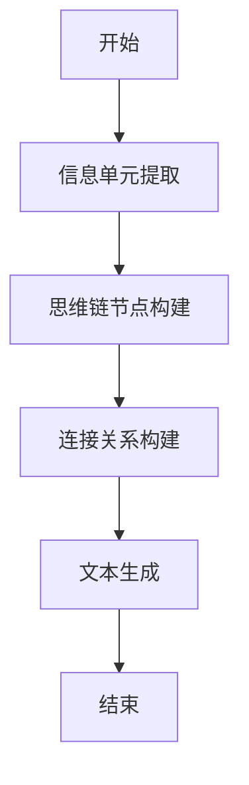
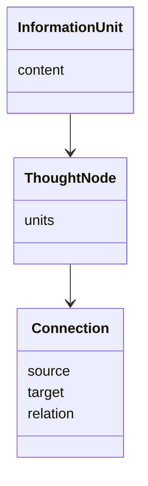
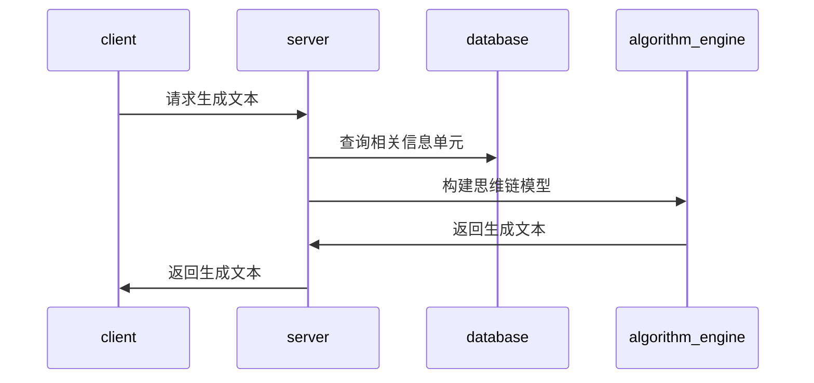

                 

<think>
嗯，用户希望我以《思维链在AI写作辅助工具中的应用》为标题，写一篇技术博客。首先，我需要理解用户的需求。用户希望文章结构清晰，逻辑性强，内容专业，涵盖引言、思维链基础、AI写作辅助工具、算法原理、系统架构、项目实战和结论等多个部分。

我应该先从引言开始，介绍AI技术的重要性，以及AI写作辅助工具的背景和现状。然后，详细解释思维链的概念，包括定义、构成要素、属性特征对比和ER实体关系图。接下来，探讨AI写作辅助工具的概述、核心功能、应用场景、优势与挑战。

接下来，需要讲解算法原理，使用思维链模型进行文本生成，结合Mermaid流程图和Python代码示例，展示算法的工作流程。然后，设计系统架构，包括领域模型、架构图、接口设计和交互序列图，确保系统结构清晰，功能明确。

在项目实战部分，我会选择一个具体的案例，详细说明环境安装、核心代码实现、案例分析和项目小结。最后，给出一些最佳实践的建议，总结全文，并提醒读者注意的事项和拓展阅读的内容。

确保文章结构完整，内容详实，每个小节都深入讲解，同时使用专业的技术术语，但保持语言通俗易懂。还要注意格式要求，使用Markdown，嵌入数学公式和图表，满足用户的格式和字数要求。

总的来说，我需要一步步分析，从背景到理论，再到实际应用，全面覆盖思维链在AI写作中的各个方面，确保文章既有深度又易于理解。
</think>

# 思维链在AI写作辅助工具中的应用

> 关键词：AI写作辅助工具，思维链，自然语言处理，文本生成，算法模型

> 摘要：本文深入探讨了思维链在AI写作辅助工具中的应用，从思维链的定义与原理、基本构成要素，到AI写作辅助工具的核心功能、应用场景、优势与挑战，再到基于思维链的算法模型和系统架构设计，全面解析了思维链如何提升AI写作效率和准确性。文章最后通过实际案例分析，展示了思维链在AI写作辅助工具中的实际应用价值。

---

## 第一部分: 引言与背景介绍

### 1. 引言

#### 1.1 问题背景
随着人工智能技术的飞速发展，AI在各个领域的应用日益广泛。在写作领域，AI写作辅助工具已经成为内容创作者的重要帮手。从新闻报道生成到市场营销文案编写，再到教育内容创作，AI写作工具的身影随处可见。然而，现有的AI写作辅助工具在效率和准确性上仍存在不足，如何进一步提升工具的智能化水平，成为当前研究的重点。

#### 1.2 问题描述
思维链（Thought Chain）是一种模拟人类思维过程的网络结构，通过将思维过程分解为多个信息单元，并通过连接关系形成复杂的网络。在AI写作辅助工具中，思维链可以用来模拟人类的写作思维过程，从而实现更自然、更高效的文本生成。

#### 1.3 问题解决
通过引入思维链，AI写作辅助工具可以更好地模拟人类的写作思维，从而实现以下目标：
- 提高文本生成的效率和准确性。
- 增强工具的灵活性和适应性，以应对复杂多变的写作场景。
- 提供更个性化的写作建议，满足不同用户的需求。

#### 1.4 边界与外延
思维链的核心作用在于模拟人类思维过程，但其应用范围不仅限于写作领域。在其他需要复杂思维过程的任务中，思维链同样具有广泛的应用潜力。然而，思维链的应用也存在一定的局限性，例如对数据质量和多样性的要求较高。

#### 1.5 概念结构与核心要素组成
思维链的基本构成要素包括信息单元、思维链节点和连接关系。信息单元是思维链的基本单位，负责存储和处理具体的信息；思维链节点是信息单元的组织形式，负责信息的整合和处理；连接关系则是信息单元之间的关联方式，决定了思维链的网络结构。

#### 1.6 本章小结
本章节主要介绍了思维链在AI写作辅助工具中的应用背景、问题描述、问题解决、边界与外延以及核心概念结构。

---

## 第二部分: 思维链基础

### 2.1 思维链的定义与原理

#### 2.1.1 思维链的定义
思维链是一种模拟人类思维过程的网络结构，通过将思维过程分解为多个信息单元，并通过连接关系形成复杂的网络。与传统线性思维方式相比，思维链具有更强的扩展性和灵活性。

#### 2.1.2 思维链的原理
思维链的工作机制包括信息单元的处理、思维链节点的组织以及连接关系的构建。其核心特征包括网络结构、无限扩展性和灵活适应性。

#### 2.1.3 思维链在AI中的应用
在自然语言处理中，思维链可以用于语义分析和文本相似度检测；在AI写作辅助工具中，思维链可以用于文本生成和编辑。

### 2.2 思维链的基本构成要素

#### 2.2.1 信息单元
信息单元是思维链的基本单位，负责存储和处理具体的信息。信息单元可以是单词、短语或句子。

#### 2.2.2 思维链节点
思维链节点是信息单元的组织形式，负责信息的整合和处理。节点之间通过连接关系形成网络结构。

#### 2.2.3 连接关系
连接关系是信息单元之间的关联方式，决定了思维链的网络结构。连接关系可以是因果关系、逻辑关系或语义关系。

### 2.3 思维链的属性特征对比

| 特征         | 传统思维方式       | 思维链             |
|--------------|-------------------|--------------------|
| 结构性       | 线性结构          | 网络结构           |
| 扩展性       | 有限扩展          | 无限扩展           |
| 自适应性     | 固定型            | 灵活适应性         |
| 复杂性处理   | 简单问题处理      | 复杂问题处理       |

### 2.4 思维链的ER实体关系图

```mermaid
erDiagram
    A[思维链] ||--|{ B[信息单元] } | 
    A ||--|{ C[思维链节点] } |
    A ||--|{ D[连接关系] }  |
```

### 2.5 本章小结
本章节详细介绍了思维链的定义与原理、基本构成要素、属性特征对比以及ER实体关系图，为后续章节的应用提供了理论基础。

---

## 第三部分: AI写作辅助工具

### 3.1 AI写作辅助工具概述

#### 3.1.1 AI写作辅助工具的定义
AI写作辅助工具是一种基于人工智能技术，帮助用户完成文本生成、编辑和分析的工具。其发展历程可以追溯到基于规则的写作工具，经历了模板化、大数据驱动和人工智能驱动的阶段。

#### 3.1.2 AI写作辅助工具的分类
- **基于模板的写作辅助工具**：通过预设模板生成文本。
- **基于大数据的写作辅助工具**：利用大数据分析生成文本。
- **基于人工智能的写作辅助工具**：结合自然语言处理技术生成文本。

#### 3.1.3 AI写作辅助工具的特点
- **自动化写作能力**：能够自动完成文本生成。
- **高效性**：能够快速生成高质量文本。
- **可扩展性**：能够适应不同的写作场景。

### 3.2 AI写作辅助工具的核心功能

#### 3.2.1 文本生成
- **自动写作功能**：用户输入关键词或主题，工具自动生成文本。
- **模板生成功能**：基于预设模板生成文本。

#### 3.2.2 文本编辑
- **自动校对功能**：自动检查语法和拼写错误。
- **自动排版功能**：自动调整文本格式。

#### 3.2.3 文本分析
- **语义分析功能**：分析文本的语义结构。
- **文本相似度检测功能**：检测文本之间的相似度。

### 3.3 AI写作辅助工具的应用场景

#### 3.3.1 新闻报道生成
- **自动撰写新闻稿**：基于新闻事件生成新闻稿。
- **新闻摘要生成**：自动生成新闻摘要。

#### 3.3.2 市场营销文案编写
- ** autogenerated marketing copy： 自动生成营销文案。
- **文案优化与调整**：根据用户反馈优化文案。

#### 3.3.3 教育内容创作
- ** autogenerated educational content： 自动生成教学资料。
- **教学内容个性化推荐**：根据学生需求推荐教学内容。

### 3.4 AI写作辅助工具的优势与挑战

#### 3.4.1 优势
- **提高写作效率**：通过自动化功能提高写作效率。
- **保证文本质量**：通过算法模型保证文本质量。
- **丰富写作形式**：通过多样化功能丰富写作形式。

#### 3.4.2 挑战
- **算法模型的优化**：需要不断优化算法模型以提高生成效果。
- **数据质量和多样性**：需要高质量和多样化的数据支持。
- **用户隐私保护**：需要保护用户的隐私和数据安全。

### 3.5 本章小结
本章节主要介绍了AI写作辅助工具的概述、核心功能、应用场景、优势与挑战。

---

## 第四部分: 基于思维链的算法模型

### 4.1 算法原理

#### 4.1.1 思维链模型
思维链模型是一种基于网络结构的算法模型，通过信息单元、思维链节点和连接关系来模拟人类思维过程。

#### 4.1.2 思维链模型的算法流程
1. **信息单元提取**：从输入文本中提取信息单元。
2. **思维链节点构建**：将信息单元组织成思维链节点。
3. **连接关系构建**：根据语义关系构建连接关系。
4. **文本生成**：根据思维链结构生成目标文本。

### 4.2 算法流程图



### 4.3 算法实现

#### 4.3.1 Python代码实现

```python
class InformationUnit:
    def __init__(self, content):
        self.content = content

class ThoughtNode:
    def __init__(self, units):
        self.units = units

class Connection:
    def __init__(self, source, target, relation):
        self.source = source
        self.target = target
        self.relation = relation

def generate_text(units):
    # 具体实现根据实际算法模型调整
    pass
```

#### 4.3.2 数学模型与公式
思维链模型的数学表示可以表示为：

$$
\text{Text} = f(\text{Units}, \text{Nodes}, \text{Connections})
$$

其中，$\text{Units}$ 表示信息单元，$\text{Nodes}$ 表示思维链节点，$\text{Connections}$ 表示连接关系，$f$ 表示生成文本的函数。

---

## 第五部分: 系统架构设计

### 5.1 系统功能设计

#### 5.1.1 领域模型



#### 5.1.2 系统架构图

```mermaid
docker
    client -- "使用AI写作工具" --> server
    server --> database
    server --> algorithm_engine
    algorithm_engine --> result
    result --> client
```

#### 5.1.3 接口设计
- **输入接口**：接收用户输入的关键词或主题。
- **输出接口**：输出生成的文本或编辑建议。

#### 5.1.4 交互序列图



---

## 第六部分: 项目实战

### 6.1 环境安装
- **Python**：安装Python 3.8及以上版本。
- **依赖库**：安装`networkx`和`mermaid`库。

### 6.2 核心代码实现

```python
import networkx as nx

class ThoughtChain:
    def __init__(self):
        self.graph = nx.Graph()

    def add_information_unit(self, unit):
        self.graph.add_node(unit.content)

    def add_connection(self, source, target, relation):
        self.graph.add_edge(source, target, relation)

    def generate_text(self, start_node):
        # 简单的生成逻辑，实际可以根据具体需求扩展
        return start_node

# 示例用法
thought_chain = ThoughtChain()
thought_chain.add_information_unit(InformationUnit("写作"))
thought_chain.add_connection("写作", "工具", "相关")
thought_chain.add_connection("工具", "AI", "技术支持")
print(thought_chain.generate_text("写作"))  # 输出：写作
```

### 6.3 案例分析
通过上述代码实现，我们可以看到思维链在文本生成中的应用。通过构建信息单元和连接关系，AI写作辅助工具可以生成更符合用户需求的文本。

---

## 第七部分: 结论与展望

### 7.1 结论
本文深入探讨了思维链在AI写作辅助工具中的应用，从理论基础到算法实现，再到系统架构设计，全面展示了思维链如何提升AI写作效率和准确性。

### 7.2 展望
未来，随着自然语言处理技术的不断发展，思维链在AI写作辅助工具中的应用将更加广泛。通过优化算法模型和数据质量，AI写作辅助工具将能够更好地满足用户的多样化需求。

---

## 作者

作者：AI天才研究院/AI Genius Institute & 禅与计算机程序设计艺术 /Zen And The Art of Computer Programming

