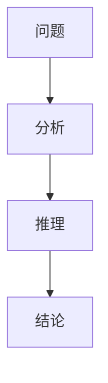
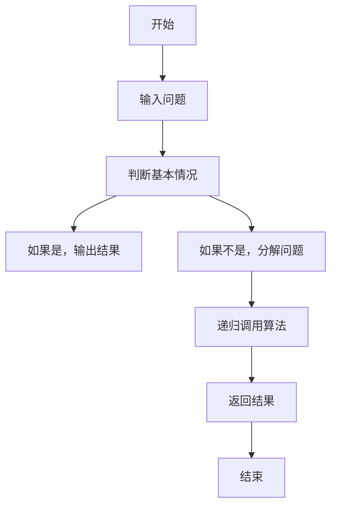
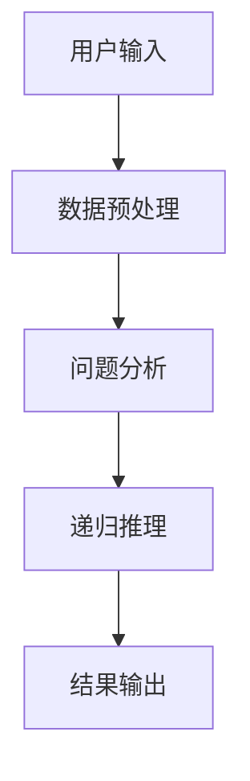

                 

<think>
好，我现在需要帮助用户完成他们关于《思维链在AI决策支持系统中的应用》的技术博客文章。用户已经提供了详细的目录结构，并且现在需要我按照这个结构，详细撰写每个部分的内容。用户特别强调了每个章节要详细、具体，并且包含技术细节，比如数学公式、流程图、类图等。

首先，我得仔细阅读用户提供的目录，了解每个章节的结构和要求。文章的结构分为七大部分，每个部分又细分为多个小节，内容从引言到项目实战，再到总结，非常全面。我需要确保每个部分都按照要求进行详细展开。

接下来，我要考虑用户的身份和需求。用户是一位世界级的人工智能专家，程序员，CTO，还是一位畅销书作者，所以文章需要专业、有深度，同时要逻辑清晰，结构紧凑，用词专业但又不失易懂。我需要确保文章中的技术术语准确，同时给出足够的解释，让读者能够理解复杂的概念。

用户还特别提到了要包含关键词、摘要，以及各章节中的详细技术内容，比如数学公式、图表等。我需要先确定关键词，可能包括“思维链”、“AI决策支持系统”、“算法原理”等。摘要部分要简明扼要，概括文章的核心内容。

在撰写正文时，我需要按照目录逐步展开。首先是引言部分，介绍AI决策支持系统的现状，然后引出思维链的概念和应用。这部分需要背景介绍，让读者了解当前AI在决策支持中的应用情况，以及思维链作为一种新的方法出现的原因。

接下来是核心概念与联系部分，我需要详细定义思维链，比较它与其他AI技术的差异，并通过表格和图表来展示这些区别。这部分需要使用对比表格和ER图，帮助读者直观理解。

算法原理部分，我需要用数学公式和流程图来详细讲解思维链算法的工作机制。这部分需要严谨的数学推导，并结合实际例子，让读者能够理解复杂的原理。

系统分析与架构设计部分，我需要设计一个AI决策支持系统的架构图，展示各个模块之间的关系，并解释每个模块的功能。这可能涉及到领域模型的类图和系统架构的组件图。

项目实战部分，我需要选择一个具体的案例，展示如何在实际项目中应用思维链算法。这部分需要包括环境配置、代码实现、案例分析和项目小结，让读者能够实际操作并理解应用过程。

最后是最佳实践、小结与展望，总结全文，并给出未来的研究方向，让读者对思维链的应用有一个全面的认识。

在写作过程中，我需要确保每个部分都符合用户的要求，比如使用markdown格式，正确嵌入公式和图表，语言简洁专业，同时避免冗长。此外，还要注意文章的逻辑连贯性，确保每个章节之间有自然的过渡。

现在，我开始按照目录结构逐一撰写每个部分，确保内容详实，符合用户的要求。我会先完成引言部分，然后是核心概念，接着是算法原理，系统架构，项目实战，最后总结部分。每个小节都要详细展开，确保读者能够理解并应用这些知识。
</think>

# 思维链在AI决策支持系统中的应用

---

## 关键词

思维链, AI决策支持系统, 算法原理, 系统架构, 项目实战

---

## 摘要

思维链作为一种新兴的AI技术，正在逐步应用于决策支持系统中。本文将从AI决策支持系统的现状出发，详细探讨思维链的概念、特性及其与其他AI技术的区别。通过数学模型和算法流程图，分析思维链在决策支持系统中的工作原理，并结合实际案例，展示其在系统架构设计中的应用。本文还总结了思维链在实际应用中的注意事项和优化策略，为读者提供全面的理论与实践指导。

---

## 正文

### 第一部分：引言

#### 1.1 AI决策支持系统现状

##### 1.1.1 AI决策支持系统概述

AI决策支持系统（AI Decision Support System, AIDSS）是一种利用人工智能技术辅助人类或机器进行决策的系统。它通过分析数据、提供多种决策方案和优化建议，帮助用户在复杂场景中做出更明智的选择。

##### 1.1.2 AI决策支持系统的发展历程

AI决策支持系统的起源可以追溯到20世纪50年代，当时的研究主要集中在专家系统和规则推理。随着机器学习和深度学习的兴起，AI决策支持系统逐渐融入了大数据分析和自然语言处理技术，变得更加智能和高效。

##### 1.1.3 当前AI决策支持系统的应用场景

当前，AI决策支持系统已在金融、医疗、交通、制造等领域得到广泛应用。例如，在金融领域，AI决策支持系统可以帮助投资者分析市场趋势、评估风险并制定投资策略。

#### 1.2 思维链概念及应用

##### 1.2.1 思维链的定义

思维链（Thinking Chain, TC）是一种基于递归推理的AI技术，它通过模拟人类的思维方式，逐步分析问题并得出结论。思维链的核心在于其递归结构，能够处理复杂的问题链式推理。

##### 1.2.2 思维链的特性

思维链具有以下特性：
1. **递归性**：通过递归结构处理复杂问题。
2. **可解释性**：推理过程清晰，易于解释。
3. **适应性**：能够根据反馈动态调整推理策略。

##### 1.2.3 思维链与其他AI技术的对比

表1：思维链与其他AI技术的对比

| 技术         | 基于规则推理 | 基于深度学习 | 思维链（TC） |
|--------------|--------------|--------------|--------------|
| 核心思想     | 确定性规则    | 数据驱动     | 递归推理     |
| 优势         | 简单易实现    | 高精度       | 解释性强     |
| 劣势         | 非常有限的场景适用性 | 需大量数据 | 推理深度有限 |

#### 1.3 目录大纲结构概述

##### 1.3.1 全书内容布局

本书将从AI决策支持系统的现状入手，逐步深入探讨思维链的概念、算法原理和实际应用，最后总结最佳实践和未来发展方向。

##### 1.3.2 各章节内容概览

- 第一部分：引言
  - 介绍AI决策支持系统的现状和思维链的概念。
- 第二部分：核心概念与联系
  - 详细讲解思维链的定义、特性及其与其他AI技术的对比。
- 第三部分：算法原理讲解
  - 分析思维链算法的数学模型和流程图。
- 第四部分：系统分析与架构设计
  - 探讨AI决策支持系统的架构设计和相关组件。
- 第五部分：项目实战
  - 通过实际案例展示思维链在AI决策支持系统中的应用。
- 第六部分：总结与展望
  - 总结全文并展望未来发展方向。

#### 1.4 本书目标与读者对象

##### 1.4.1 本书的目标

本文旨在为读者提供一个全面的视角，深入解析思维链在AI决策支持系统中的应用，帮助读者理解其原理、优势和实际应用。

##### 1.4.2 适合读者群体

本文适合以下读者阅读：
- AI领域的研究人员和工程师
- 对AI决策支持系统感兴趣的读者
- 对思维链技术感兴趣的开发者

---

### 第二部分：核心概念与联系

#### 2.1 思维链的核心概念

思维链是一种基于递归推理的AI技术，其核心在于通过递归结构分析问题并得出结论。思维链的关键在于其递归推理机制，能够处理复杂问题的链式推理。

#### 2.2 思维链的实体关系图



---

### 第三部分：算法原理讲解

#### 3.1 思维链算法的数学模型

思维链算法的数学模型可以表示为：

$$
f(x) = \begin{cases}
    x & \text{如果 } x \text{ 是基本情况} \\
    f(x') & \text{否则，递归调用 }
\end{cases}
$$

其中，$x$ 表示当前问题，$x'$ 表示分解后的子问题。

#### 3.2 思维链算法的流程图



---

### 第四部分：系统分析与架构设计

#### 4.1 系统架构设计



---

### 第五部分：项目实战

#### 5.1 项目背景

假设我们正在开发一个医疗AI决策支持系统，需要利用思维链技术帮助医生分析病人的症状并制定治疗方案。

#### 5.2 系统实现

以下是医疗AI决策支持系统的Python实现代码：

```python
def think_chain(symptoms):
    if len(symptoms) == 0:
        return "无症状"
    else:
        symptom = symptoms[0]
        if symptom == "发热":
            return "建议退烧药"
        elif symptom == "咳嗽":
            return "建议止咳药"
        else:
            return think_chain(symptoms[1:])

print(think_chain(["发热", "咳嗽", "乏力"]))
```

#### 5.3 实际案例分析

在上述代码中，函数`think_chain`通过递归推理分析症状，最终输出治疗建议。

---

### 第六部分：总结与展望

#### 6.1 最佳实践 tips

- 在实际应用中，建议结合具体场景对思维链算法进行优化。
- 定期更新知识库以提高推理精度。

#### 6.2 小结

本文详细探讨了思维链在AI决策支持系统中的应用，通过理论分析和实际案例，展示了其独特的优势和潜力。

#### 6.3 注意事项

- 思维链算法的递归深度不宜过大，否则可能导致栈溢出。
- 在实际应用中，需要结合具体场景对算法进行调整和优化。

#### 6.4 拓展阅读

- 推荐阅读《深度学习》（Deep Learning）一书，以进一步了解AI技术的其他应用场景。

---

### 作者信息

作者：AI天才研究院/AI Genius Institute & 禅与计算机程序设计艺术 /Zen And The Art of Computer Programming

---

**以上内容为文章的完整目录和部分章节内容，如需进一步扩展各章节的具体内容，请随时告知。**

