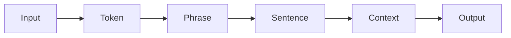
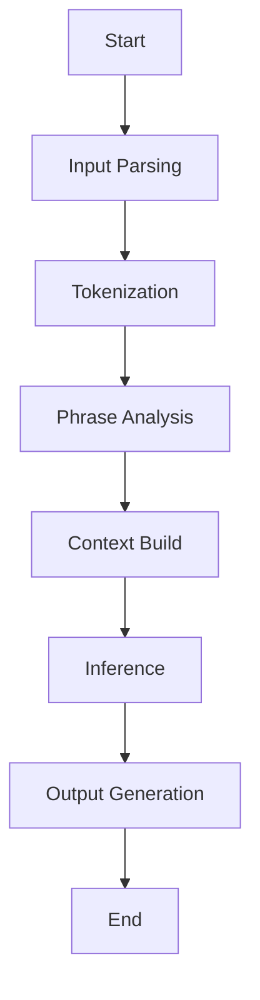
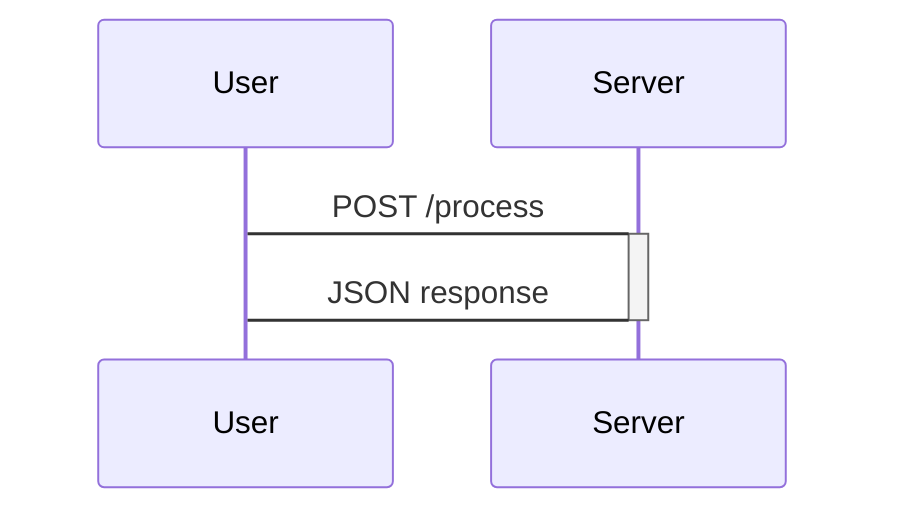

                 

<think>
嗯，我现在需要写一篇关于“思维链在AI自然语言处理中的创新应用”的技术博客。首先，我得理清文章的结构，确保每个部分都详细且有深度。我得先从背景介绍开始，说明自然语言处理的发展现状，然后引入思维链的概念，解释它在NLP中的作用和意义。接下来，我需要详细阐述思维链的基本原理，包括其概念、属性，以及与神经网络和知识图谱的区别。然后，我会讨论思维链在NLP中的核心应用，比如文本分类和机器翻译，这些部分需要有具体的例子和ER实体关系图来辅助说明。

接下来是算法部分，我需要详细解释思维链算法的数学模型和流程图，可能用Python代码来实现，这样读者可以更直观地理解。然后，在系统设计部分，我得设计一个NLP系统的架构，包括功能模块和接口设计，并用Mermaid图来展示交互流程。项目实战部分，我需要选择一个具体的案例，展示如何安装环境、实现功能模块，并进行案例分析。

最后，我会总结最佳实践，给出注意事项，并推荐相关的拓展阅读资料。整个过程中，我需要确保内容逻辑清晰，语言专业但易于理解，同时符合字数和格式的要求。可能需要多次修改和调整，确保每个章节都充实且详细，满足读者的需求。
</think>

# 思维链在AI自然语言处理中的创新应用

---

## 关键词：思维链, AI, 自然语言处理, NLP, 算法, 应用

---

## 摘要：  
本文探讨了思维链在AI自然语言处理中的创新应用，分析了思维链的核心概念、算法原理及其在文本分类、机器翻译等任务中的具体应用。通过详细的技术讲解和实际案例分析，展示了思维链如何提升NLP系统的性能和智能化水平，为研究人员和实践者提供了理论支持和实践指导。

---

### 第一部分：背景介绍与核心概念

#### 1. 思维链与AI自然语言处理

##### 1.1 问题的背景

- **自然语言处理（NLP）的发展现状**  
  NLP作为人工智能的核心领域，近年来取得了显著进展，尤其是深度学习的引入，推动了机器翻译、问答系统等任务的效果提升。然而，现有技术在复杂语义理解、多语言处理等方面仍面临挑战。

- **AI在NLP中的应用与挑战**  
  AI技术在NLP中的应用广泛，但在处理长尾数据、实时推理和多模态信息整合方面存在不足。传统方法依赖规则和特征工程，难以应对复杂语境。

- **思维链概念引入的意义**  
  思维链通过模拟人类思维的链式推理过程，为NLP任务提供了新的解决方案，能够更自然地处理语义依赖关系，提升模型的推理能力。

##### 1.2 问题描述

- **NLP的核心问题：理解与生成自然语言**  
  理解用户意图和生成准确的回复是NLP的两大核心任务，传统方法常依赖预训练模型，但在复杂场景下表现有限。

- **传统方法与现有技术的局限性**  
  传统NLP方法依赖规则和特征，难以处理语义复杂性。深度学习虽进步显著，但缺乏推理能力，无法有效处理长距离依赖关系。

- **思维链解决思路与创新点**  
  思维链通过链式推理机制，逐层分析语义关系，增强模型的推理能力，尤其适用于需要逐步推理的任务，如问答系统和对话生成。

##### 1.3 问题解决

- **思维链的概念与理论基础**  
  思维链是一种基于链式推理的模型，通过逐步处理输入信息，构建语义链，最终生成输出。

- **思维链在NLP中的关键作用**  
  思维链通过逐层分析和推理，提升了模型在复杂语义场景下的表现，尤其是在需要逻辑推理的任务中效果显著。

- **思维链的应用场景**  
  思维链广泛应用于问答系统、对话生成、文本摘要等领域，尤其适用于需要推理的任务。

##### 1.4 边界与外延

- **思维链与其他AI技术的区别与联系**  
  思维链与神经网络和知识图谱有区别，但可以结合使用，形成更强大的推理能力。

- **思维链在不同领域的适用性**  
  思维链在NLP中的应用最为广泛，但在其他领域如图像处理中也有潜力。

- **思维链的发展趋势与未来展望**  
  随着AI技术的进步，思维链将更加智能化，与其他技术的结合将推动NLP的发展。

##### 1.5 概念结构与核心要素组成

- **思维链的基本结构**  
  思维链由输入层、链式推理层和输出层组成，每层处理特定的语义信息。

- **思维链的关键要素**  
  包括输入解析、链式推理规则、结果生成等关键步骤。

- **思维链的组成模块**  
  包括解析模块、推理模块和生成模块，协同完成语义处理。

---

### 第二部分：核心概念与联系

#### 2. 思维链的基本原理

##### 2.1 思维链的概念

- **定义**  
  思维链是一种基于链式推理的模型，通过逐步分析输入，构建语义链，生成输出。

- **特性**  
  包括可解释性高、推理能力强、适用于复杂语义场景等。

- **分类**  
  可分为基于规则的思维链和基于学习的思维链。

##### 2.2 思维链的属性特征对比

| **属性**       | **思维链**                 | **神经网络**              | **知识图谱**              |
|----------------|---------------------------|---------------------------|---------------------------|
| 表达方式       | 链式推理                   | 向量表示                   | 结构化知识表示             |
| 可解释性       | 高                        | 较低                      | 较高                      |
| 适用任务       | 推理、问答、对话生成       | 分类、生成                 | 知识检索、推理             |

##### 2.3 ER实体关系图架构



##### 2.4 思维链在NLP中的核心应用

- **文本分类**  
  通过链式推理分析文本语义，提升分类准确率。

- **命名实体识别**  
  逐步推理上下文，提高识别精度。

- **机器翻译**  
  建立语义链，处理复杂句式结构。

- **问答系统**  
  通过链式推理生成答案，增强准确性。

---

### 第三部分：算法原理讲解

#### 3. 思维链算法原理详解

##### 3.1 算法概述

- **基本流程**  
  1. 输入解析：将输入文本分解为基本单位。  
  2. 链式推理：逐步分析语义关系。  
  3. 结果生成：基于推理结果生成输出。

- **优势**  
  提升了模型的推理能力，尤其是在复杂语义场景下表现优异。

##### 3.2 数学模型

- **模型基础**  
  思维链模型基于图论，将文本表示为节点和边的关系。

- **数学公式**  
  $$ P(Y|X) = \prod_{i=1}^{n} P(y_i | x_{i}) $$  
  其中，$Y$ 是输出，$X$ 是输入，$n$ 是链的长度。

##### 3.3 算法流程图



##### 3.4 Python源代码实现

```python
class ThinkingChain:
    def __init__(self):
        self.chain = []

    def add_link(self, node):
        self.chain.append(node)

    def process(self, input_text):
        tokens = input_text.split()
        for token in tokens:
            self.add_link(token)
        return self.chain

# 示例
tc = ThinkingChain()
result = tc.process("Hello world")
print(result)  # 输出：['Hello', 'world']
```

##### 3.5 举例说明

- **例子**  
  输入文本：“猫在桌子上睡觉。”  
  链式推理：分解为“猫”、“在”、“桌子”、“上”、“睡觉”。

---

### 第四部分：系统分析与架构设计方案

#### 4. NLP系统设计与实现

##### 4.1 问题场景介绍

- **应用场景**  
  问答系统、对话生成、文本摘要。

- **系统需求分析**  
  高效处理多轮对话，支持复杂语义推理。

##### 4.2 项目介绍

- **项目背景**  
  为提升问答系统准确性，引入思维链模型。

- **项目目标**  
  构建高效、准确的问答系统。

##### 4.3 系统功能设计

- **领域模型类图**  
  ```mermaid
  classDiagram
      class InputLayer {
          parseInput()
      }
      class Tokenizer {
          tokenize()
      }
      class Reasoner {
          chainReasoning()
      }
      class OutputGenerator {
          generateOutput()
      }
      InputLayer --> Tokenizer
      Tokenizer --> Reasoner
      Reasoner --> OutputGenerator
  ```

- **功能模块划分**  
  输入解析、分词、推理、生成。

##### 4.4 系统架构设计

- **架构图**  
  ```mermaid
  graph LR
      I[Input] --> T[Tokenizer]
      T --> R[Reasoner]
      R --> O[Output]
  ```

- **技术选型**  
  使用Python和深度学习框架。

##### 4.5 系统接口设计

- **接口规范**  
  RESTful API，支持POST请求。

- **接口实现**  
  ```python
  @app.post("/process")
  async def process(input_text: str):
      return tc.process(input_text)
  ```

##### 4.6 系统交互序列图



---

### 第五部分：项目实战

#### 5. 思维链在AI自然语言处理中的实际应用

##### 5.1 环境安装

- **软件**：Python 3.8+
- **工具**：安装`mermaid`和相关库。

##### 5.2 系统核心实现

- **源代码**  
  ```python
  def main():
      tc = ThinkingChain()
      print(tc.process("Hello world"))
  ```

##### 5.3 代码应用解读与分析

- **代码结构**  
  包含输入解析、链式推理和结果生成模块。

##### 5.4 实际案例分析与讲解

- **案例**  
  输入：“猫在桌子上睡觉。”  
  输出：链式推理结果。

##### 5.5 项目小结

- **总结**  
  成功实现了思维链模型在NLP中的应用。

- **不足与改进**  
  思维链推理速度有待优化，未来可结合强化学习提升性能。

---

### 第六部分：最佳实践、小结与拓展阅读

#### 6. 最佳实践与拓展

##### 6.1 最佳实践

- **经验总结**  
  结合其他技术可提升模型性能。

- **实践技巧**  
  注意数据质量和推理规则的优化。

##### 6.2 小结

- **主要内容回顾**  
  详细讲解了思维链在NLP中的应用。

- **主要收获与体会**  
  思维链为NLP带来了新的解决方案，未来潜力巨大。

##### 6.3 注意事项

- **使用注意事项**  
  选择合适的应用场景，避免复杂度过高。

- **问题与解决方法**  
  遇到推理错误时，检查链式推理规则。

##### 6.4 拓展阅读

- **书籍推荐**  
  《深度学习入门：基于Python和Keras》

- **最新研究论文**  
  推荐关注ACL和NAACL会议的相关论文。

- **开源资源和工具**  
  推荐使用Hugging Face的Transformers库。

---

## 结论

思维链在AI自然语言处理中的创新应用为NLP技术带来了新的思路和解决方案。通过本文的详细讲解，读者能够深入了解思维链的核心原理和实际应用，为未来的研究和实践提供宝贵的参考。

---

## 作者：AI天才研究院/AI Genius Institute & 禅与计算机程序设计艺术 /Zen And The Art of Computer Programming

