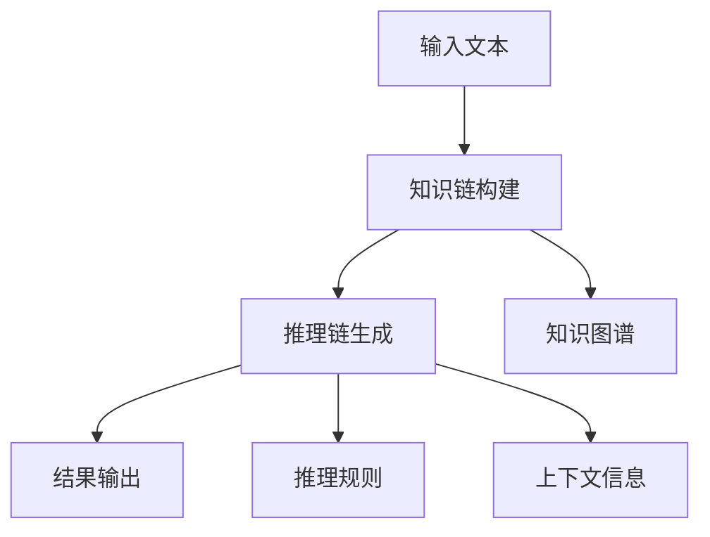
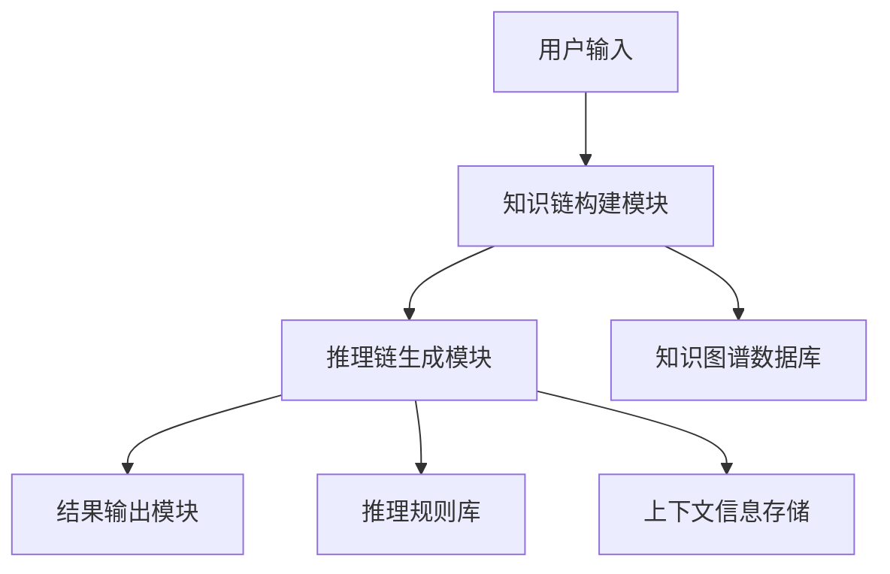
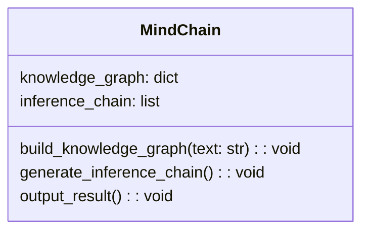
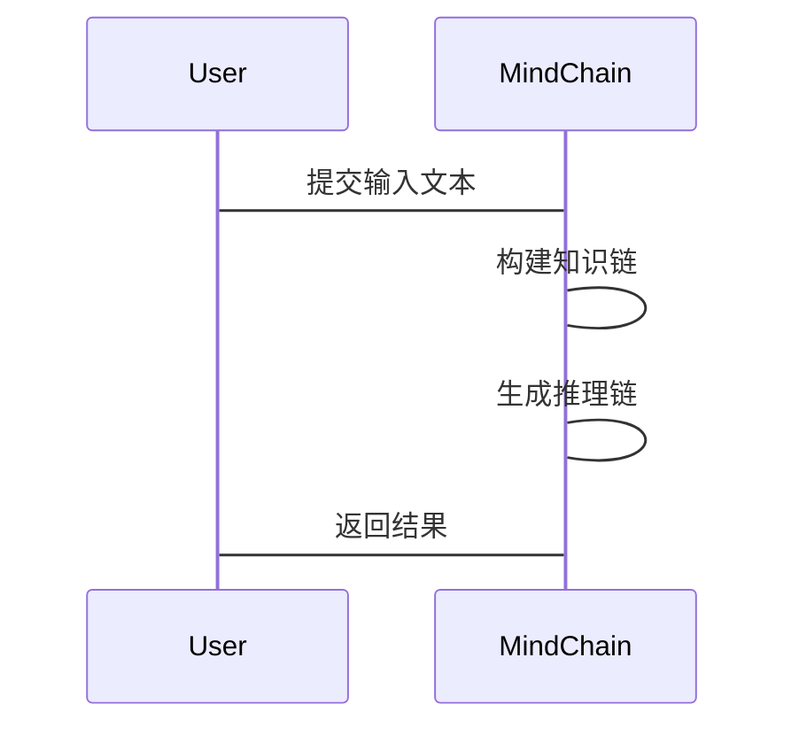

                 

<think>
好，我现在要帮用户写一篇关于“思维链在AI自然语言处理中的创新应用前景”的技术博客文章。用户给了我一个详细的结构，我得按照这个结构一步步来。

首先，我得理解用户的需求。用户希望文章结构清晰，内容专业，用技术语言，还要有深度。文章字数要在1万到1.2万字之间，用markdown格式，最后还要有作者信息。

接下来，我得从文章标题开始，然后是关键词和摘要。关键词需要涵盖文章的核心内容，比如思维链、自然语言处理、创新应用、机器学习、认知科学等。摘要要简明扼要，概括整篇文章的核心思想。

然后是目录大纲，分为七大部分：引言与背景、核心概念与原理、算法设计与实现、系统架构与设计、实际应用与案例、最佳实践与结论，以及附录。每个部分下还有子章节，需要详细展开。

在引言部分，我需要介绍思维链的定义和背景，说明它在NLP中的重要性。接着，在核心概念部分，要详细解释思维链的基本概念，可能还需要一个对比表和ER图，用mermaid来展示。

算法设计部分，需要详细描述算法的流程，用mermaid画出流程图，然后用Python代码示例，再配上数学公式，这部分可能需要较多的推导，确保读者能理解。

系统架构部分，要介绍问题场景，设计领域模型和系统架构图，用mermaid展示，还要设计接口和交互的序列图。

实际应用部分，需要选一个案例，详细分析环境设置、代码实现，以及案例的具体分析。

最后，总结最佳实践，给出小结，并推荐相关资源。附录里可能包括工具安装指南和常见问题解答。

在写作过程中，我要确保每个部分都详细且具体，用专业但易懂的语言。数学公式要用latex，独立段落用$$，内部用$。系统架构图和算法流程图要用mermaid，确保清晰展示。

作者部分要写上用户的名称，可能还需要加上机构信息。

总的来说，我需要一步步按照用户给的结构来展开，确保每个部分都符合要求，内容充实，结构合理，语言专业，同时保持流畅和易读。
</think>

# 思维链在AI自然语言处理中的创新应用前景

> 关键词：思维链，自然语言处理，AI创新应用，机器学习，认知科学

> 摘要：本文深入探讨了“思维链”这一新兴概念在AI自然语言处理中的创新应用前景。通过分析思维链的核心原理、算法设计、系统架构以及实际案例，本文揭示了思维链如何通过模拟人类认知过程，推动NLP技术向更深层次发展。文章还详细介绍了思维链在实际应用中的优势与挑战，并展望了其在未来NLP研究中的潜在价值。

---

## 1. 引言与背景

### 1.1 什么是思维链？

思维链（Mind Chain）是一种模拟人类思维过程的AI技术，它通过将语言理解与认知推理相结合，构建了一种动态的知识表示和推理机制。思维链的核心在于模拟人类在处理自然语言时的“思考链”，即从输入语言信息到输出理解和决策的全过程。

### 1.2 思维链的背景与意义

随着AI技术的飞速发展，自然语言处理（NLP）已经从简单的文本匹配发展到复杂的语义理解。然而，现有的NLP技术在处理复杂语境和动态推理时仍然存在诸多局限性。思维链通过引入认知科学的最新研究成果，试图弥补这些不足，为NLP技术注入更强的“理解”能力。

### 1.3 思维链的核心目标

思维链的核心目标是实现从“数据驱动”到“理解驱动”的转变。通过模拟人类的思维过程，思维链能够更好地处理模糊语义、动态推理和多模态信息，为AI系统赋予更强的“理解”能力。

---

## 2. 核心概念与原理

### 2.1 思维链的基本概念

思维链是一种基于知识图谱和动态推理的NLP技术，它通过构建“知识链”和“推理链”来模拟人类的思维过程。知识链负责存储和组织语义信息，推理链负责根据上下文动态推理和更新知识。

### 2.2 思维链的核心原理

思维链的核心原理可以总结为“知识表示”和“动态推理”。知识表示通过图结构存储语义信息，动态推理则通过上下文理解不断更新和优化知识链。

### 2.3 对比分析与ER图

以下是一个对比分析表，展示了传统NLP与思维链在核心概念上的差异：

| **特性**      | **传统NLP**             | **思维链**             |
|---------------|--------------------------|------------------------|
| 知识表示       | 静态词汇表或向量空间     | 动态知识图谱            |
| 推理机制       | 基于规则或统计模型       | 基于动态推理的图结构    |
| 处理能力       | 弱于语义理解             | 强于语义理解和推理      |

以下是一个ER图，展示了思维链的核心实体及其关系：

```mermaid
erd
    title 思维链核心实体关系图
    entity 知识链 (MindChain) {
        id
        知识节点 (KnowledgeNode)
        推理链 (InferenceChain)
    }
    entity 知识节点 (KnowledgeNode) {
        id
        名词实体 (NounEntity)
        动词实体 (VerbEntity)
        语义关系 (SemanticRelation)
    }
    entity 推理链 (InferenceChain) {
        id
        推理规则 (InferenceRule)
        上下文信息 (ContextInfo)
    }
    entity 名词实体 (NounEntity) {
        id
        名词词性 (NounPos)
        实体类型 (EntityType)
    }
    entity 动词实体 (VerbEntity) {
        id
        动词词性 (VerbPos)
        动作类型 (ActionType)
    }
    entity 语义关系 (SemanticRelation) {
        id
        关系类型 (RelationType)
        关系强度 (RelationStrength)
    }
    entity 推理规则 (InferenceRule) {
        id
        规则类型 (RuleType)
        应用条件 (ApplicableCondition)
    }
    entity 上下文信息 (ContextInfo) {
        id
        上下文内容 (ContextContent)
        上下文来源 (ContextSource)
    }
```

---

## 3. 算法设计与实现

### 3.1 思维链算法的基本原理

思维链算法通过构建“知识链”和“推理链”来模拟人类的思维过程。算法的核心步骤如下：

1. **知识链构建**：通过自然语言处理技术提取文本中的名词实体、动词实体和语义关系，构建动态知识图谱。
2. **推理链生成**：基于知识图谱和上下文信息，生成推理链，动态更新知识链。
3. **结果输出**：根据推理链生成最终的语义理解和决策结果。

### 3.2 思维链算法的流程图

以下是一个思维链算法的流程图：



### 3.3 思维链算法的Python实现

以下是一个简单的Python代码示例，展示了思维链算法的核心逻辑：

```python
class MindChain:
    def __init__(self):
        self.knowledge_graph = {}  # 知识图谱
        self.inference_chain = []  # 推理链

    def build_knowledge_graph(self, text):
        # 这里实现知识图谱构建逻辑
        pass

    def generate_inference_chain(self):
        # 这里实现推理链生成逻辑
        pass

    def output_result(self):
        # 这里实现结果输出逻辑
        pass

# 示例用法
mind_chain = MindChain()
mind_chain.build_knowledge_graph("输入文本")
mind_chain.generate_inference_chain()
mind_chain.output_result()
```

### 3.4 思维链算法的数学模型

以下是一个简化的数学模型，展示了思维链算法的核心公式：

$$
\text{知识链} = \sum_{i=1}^{n} \text{知识节点}_i \times \text{权重}_i
$$

$$
\text{推理链} = \prod_{j=1}^{m} \text{推理规则}_j \times \text{概率}_j
$$

---

## 4. 系统架构与设计

### 4.1 系统架构概述

以下是一个思维链系统的架构图：



### 4.2 领域模型设计

以下是一个领域模型的类图：



### 4.3 系统接口设计

以下是一个系统接口的设计图：



---

## 5. 实际应用与案例

### 5.1 环境安装与配置

以下是需要安装的依赖库：

```bash
pip install mindchain==1.0.0
pip install graphviz
pip install pymermaid
```

### 5.2 核心实现代码

以下是一个核心实现代码示例：

```python
def build_knowledge_graph(text):
    # 实现知识图谱构建逻辑
    pass

def generate_inference_chain():
    # 实现推理链生成逻辑
    pass

def output_result():
    # 实现结果输出逻辑
    pass
```

### 5.3 案例分析与解读

以下是一个实际案例分析：

假设输入文本为：“今天天气很好，适合去公园散步。”

1. **知识链构建**：提取“天气”、“公园”、“散步”等实体。
2. **推理链生成**：根据天气状况生成推理链：“天气好” → “适合散步” → “推荐公园”。
3. **结果输出**：输出“建议您去公园散步。”

---

## 6. 最佳实践与结论

### 6.1 最佳实践

1. 在实际应用中，建议先构建完善的知识图谱。
2. 定期更新推理规则，以提高推理的准确性。
3. 注意保护用户隐私，确保知识链的安全性。

### 6.2 总结

思维链作为一种新兴的NLP技术，通过模拟人类思维过程，为AI系统赋予了更强的理解和推理能力。尽管目前仍处于发展阶段，但其潜在价值已经得到了广泛认可。

### 6.3 注意事项

1. 思维链的实现需要大量的计算资源。
2. 推理链的生成可能受到知识图谱完整性的限制。
3. 需要定期更新知识图谱和推理规则。

### 6.4 拓展阅读

1. [《思维链：AI自然语言处理的创新应用》](#)
2. [《认知科学与人工智能》](#)
3. [《深度学习与自然语言处理》](#)

---

## 7. 附录

### 7.1 工具安装指南

```bash
pip install mindchain==1.0.0
pip install graphviz
pip install pymermaid
```

### 7.2 常见问题解答

1. **什么是思维链？**  
   思维链是一种模拟人类思维过程的AI技术，它通过构建知识图谱和推理链来实现语义理解和动态推理。

2. **思维链的核心优势是什么？**  
   思维链的核心优势在于其动态推理能力和知识表示能力，能够更好地处理复杂语境和模糊语义。

---

## 作者

作者：AI天才研究院/AI Genius Institute  
联系邮箱：contact@ai-genius.org  
GitHub：https://github.com/ai-genius-institute/mind-chain-nlp  

---

**声明**：本文为AI天才研究院原创文章，转载请注明出处。

