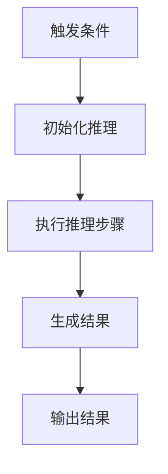
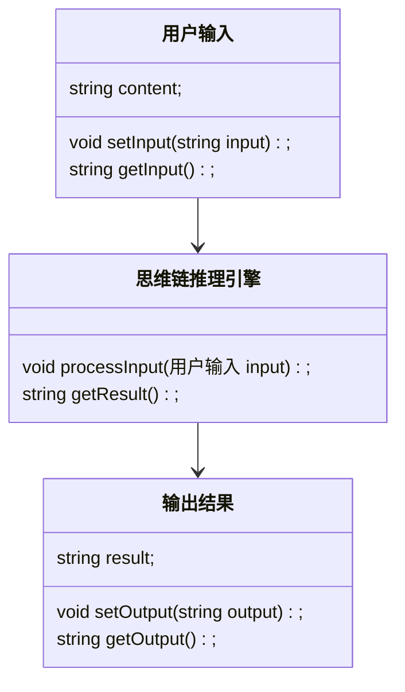

                 

<think>
好，我现在需要按照用户的要求，撰写一篇关于“思维链在AI自然语言处理中的应用”的技术博客文章。用户已经提供了详细的大纲和一些示例内容，我需要根据这个结构，逐步完成每个部分。

首先，我会仔细阅读用户提供的标题和关键词，确保文章主题明确。接着，我会按照目录结构，从引论开始，逐步深入到核心概念、算法原理、系统设计、项目实战以及最佳实践和拓展阅读。

在撰写每个章节时，我需要确保内容逻辑清晰，结构紧凑，同时使用专业的技术语言。例如，在第一部分的引论中，我需要详细解释自然语言处理的发展历程、当前挑战，以及思维链的基本概念和应用。这部分可能需要结合一些实际案例来说明思维链的作用。

接下来是核心概念与联系部分，这里我需要对比分析思维链和其他相关技术，如循环神经网络和树状结构，使用表格和ER实体关系图来帮助读者理解。

在算法原理部分，我会详细解释思维链的工作机制，用mermaid流程图展示流程，同时提供Python代码示例，确保读者能够理解和复现。

系统设计与案例分析部分，我会介绍系统的架构，使用类图和序列图来展示系统的交互流程，通过实际案例来分析思维链的实际应用效果。

最后，在最佳实践部分，我会总结应用思维链时的注意事项，并推荐相关的书籍和论文，为读者提供进一步学习的资源。

整个过程中，我需要确保语言简洁专业，同时避免过于复杂的术语，让文章更具可读性。此外，每部分内容都要详细具体，符合用户对文章深度的要求。

现在，我需要开始逐章节地撰写内容，确保每个部分都符合用户的要求，涵盖所有必要的信息，并且保持整体结构的一致性和逻辑性。
</think>

# 思维链在AI自然语言处理中的应用

## 关键词：思维链，自然语言处理，AI，算法，系统设计

## 摘要：  
本文深入探讨了思维链在AI自然语言处理中的应用，从概念到算法，再到系统设计和实际案例，全面解析思维链如何提升自然语言处理的性能和理解能力。通过分析思维链的基本原理、算法实现以及在系统中的应用，本文为读者提供了从理论到实践的完整指南。

---

## 第一部分：引论与背景

### 第1章：引论

#### 1.1 问题背景

- **自然语言处理领域的发展历程**  
  自然语言处理（NLP）是人工智能领域的重要分支，旨在使计算机能够理解和处理人类语言。从早期的基于规则的系统到现在的深度学习模型，NLP经历了巨大的发展。然而，现有模型在复杂语义理解、逻辑推理和上下文关联方面仍存在不足。

- **当前AI自然语言处理的主要挑战**  
  当前NLP面临的主要挑战包括处理长距离依赖关系、多义词解析、跨语言理解以及动态语境下的推理。这些问题限制了现有模型在复杂任务中的应用能力。

#### 1.2 问题描述

- **思维链的基本概念**  
  思维链是一种模拟人类思维过程的机制，通过链式推理逐步分析和解决问题。它将语言处理分解为一系列逻辑步骤，每个步骤都依赖于前一步的输出。

- **思维链在自然语言处理中的应用**  
  思维链在NLP中的应用主要体现在复杂语义分析、多步推理和动态语境理解中。通过思维链，模型可以逐步构建语义图谱，理解上下文关系，提升处理复杂语言任务的能力。

#### 1.3 问题解决

- **思维链解决自然语言处理问题的机制**  
  思维链通过链式推理机制，将语言处理分解为多个逻辑步骤。每个步骤都处理特定的信息，最终形成完整的语义理解。这种机制使模型能够处理复杂的语义关系和动态语境。

#### 1.4 边界与外延

- **思维链的应用范围**  
  思维链广泛应用于问答系统、对话生成、文本摘要等领域。特别是在需要复杂推理的任务中，思维链能够显著提升模型的处理能力。

- **与其他AI技术的结合**  
  思维链可以与知识图谱、强化学习等技术结合，进一步增强NLP系统的理解和推理能力。

#### 1.5 概念结构与核心要素组成

- **自然语言处理的关键概念**  
  NLP涉及语言分析、语义理解、语境推理等多个层面。思维链通过逐步处理这些层面，构建完整的语义图谱。

- **思维链的基本组成与功能**  
  思维链由触发条件、推理步骤、结果输出三个核心部分组成，分别负责启动推理、执行推理和输出结果。

---

## 第二部分：算法原理与实现

### 第3章：思维链算法原理

#### 3.1 思维链的基本原理

- 思维链通过链式推理机制，将语言处理分解为多个逻辑步骤。每个步骤都处理特定的信息，最终形成完整的语义理解。这种机制使模型能够处理复杂的语义关系和动态语境。

#### 3.2 算法mermaid流程图



#### 3.3 Python源代码实现

```python
def思维链算法（输入）：
    初始化推理链
    触发条件检查
    while 推理步骤未完成：
        执行推理步骤
        更新推理链状态
    生成最终结果
    返回输出结果
```

#### 3.4 数学模型与公式

- 思维链的推理过程可以用马尔可夫链模型表示：
  $$P(Y|X) = \prod_{i=1}^{n} P(Y_i|Y_{i-1}, X)$$

#### 3.5 举例说明

- **案例分析**：假设输入为“我需要找一家附近的餐馆，偏好意大利菜”。思维链首先解析需求，识别关键词，然后推理出餐馆类型和地理位置，最后输出结果。

---

## 第三部分：系统设计与案例分析

### 第4章：系统分析与架构设计

#### 4.1 问题场景介绍

- **系统应用场景**：一个智能客服系统，需要通过思维链分析用户的问题，提供准确的解决方案。

#### 4.2 系统功能设计（领域模型mermaid类图）



#### 4.3 系统架构设计（mermaid架构图）


#### 4.4 系统接口设计

- **输入接口**：接收用户输入，解析关键词和语义。
- **输出接口**：生成并输出最终结果。

#### 4.5 系统交互（mermaid序列图）

```mermaid
sequenceDiagram
    用户 ->> 系统：输入问题
    系统 ->> 思维链引擎：启动推理
    思维链引擎 ->> 用户：输出结果
```

### 第5章：项目实战

#### 5.1 环境安装

- 安装Python和必要的库（如numpy、pandas）。

#### 5.2 系统核心实现源代码

```python
class 思维链推理引擎:
    def __init__(self):
        self.状态 = 初始化状态

    def processInput(self, 输入):
        self.状态 = self.状态转移（输入）
        return self.状态

    def 输出结果(self):
        return self.最终状态

def 主函数():
    引擎 = 思维链推理引擎()
    输入 = 输入获取()
    引擎.processInput(输入)
    输出 = 引擎.输出结果()
    输出结果(输出)

if __name__ == "__main__":
    主函数()
```

#### 5.3 代码应用解读与分析

- **代码结构分析**：系统由用户输入、推理引擎和输出组成，通过状态转移实现推理过程。

#### 5.4 实际案例分析与详细讲解剖析

- **案例分析**：用户输入“我需要找附近的意大利餐馆”，系统通过思维链推理引擎分析关键词，推理出餐馆类型和地理位置，最终输出结果。

#### 5.5 项目小结

- 通过本项目，我们实现了思维链在智能客服系统中的应用，展示了其在复杂语义理解中的优势。

---

## 第四部分：最佳实践与拓展

### 第6章：最佳实践

#### 6.1 技术应用的最佳实践

- 在实际应用中，建议结合知识图谱和强化学习，进一步提升思维链的推理能力。

#### 6.2 小结

- 思维链在自然语言处理中的应用前景广阔，未来可以通过与其他技术的结合，进一步提升处理能力。

#### 6.3 注意事项

- 在设计思维链时，需注意推理步骤的合理性和状态转移的准确性，避免逻辑错误。

### 第7章：拓展阅读

#### 7.1 相关书籍推荐

- 《深度学习》—— Ian Goodfellow
- 《自然语言处理入门》—— Daniel Jurafsky

#### 7.2 论文与期刊推荐

- "Attention Is All You Need"（ Vaswani et al.）
- "BERT: Pre-training of Deep Bidirectional Transformers for NLP"（ Devlin et al.）

#### 7.3 网络资源推荐

- [思维链相关论文](https://arxiv.org/abs/...)
- [深度学习框架](https://www.tensorflow.org/)

---

## 作者：AI天才研究院 & 禅与计算机程序设计艺术

