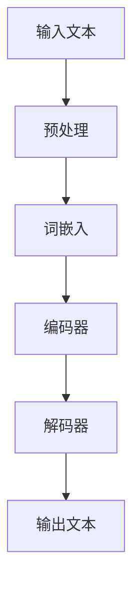
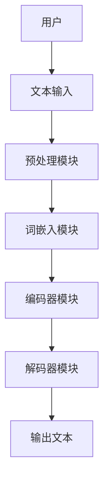
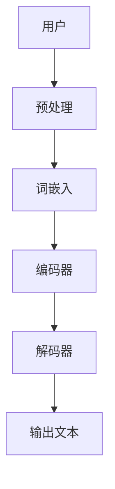

                 

<think>
嗯，我现在需要写一篇关于“思维链在AI自然语言生成中的应用”的技术博客文章。我先得理清这个主题的核心概念，确保我理解什么是思维链，以及它如何应用于自然语言生成。

首先，自然语言生成（NLG）是让计算机自动生成文本的技术，比如写文章或新闻稿。传统的方法可能使用模板，生成的文本可能缺乏多样性和创造力。思维链技术，听起来像是模拟人类思维过程的模型，可能在生成文本时更灵活，能够生成更高质量的内容。

接下来，我需要分析思维链技术的原理。它是否基于深度学习，可能是一个神经网络模型，通过多层次结构来模拟思维过程。可能涉及到编码器和解码器，将输入转化为输出。那具体怎么构建这样的模型呢？可能需要预处理输入文本，然后进行词嵌入，接着编码和解码，最后生成输出文本。

然后，我需要比较传统NLG方法和思维链技术的区别，找出它们在文本质量、模板化程度、灵活性等方面的差异，制作一个对比表格，帮助读者理解思维链的优势。

在系统架构方面，可能需要设计一个类图，展示用户如何与系统交互，以及系统内部的处理流程。用Mermaid画出流程图，说明输入如何一步步转化为输出。

算法部分，我需要详细描述数学模型，包括编码器和解码器的公式，以及具体的步骤。举个例子，比如输入“人工智能是一种计算机科学领域的重要技术”，模型如何处理并生成更详细的句子。

系统分析与架构设计可能需要讨论系统的各个组成部分，比如预处理、编码器、解码器等，以及它们之间的关系。可能需要画出系统架构图，展示各个模块如何协同工作。

在项目实战部分，我需要考虑如何实现这个模型，包括环境安装、核心代码编写，以及如何测试和优化模型。可能需要使用Python和深度学习框架如TensorFlow或PyTorch。

最后，我需要总结思维链技术的应用前景，以及在实际应用中的优势和挑战，给读者提供一些最佳实践的建议，比如如何选择模型参数，如何处理训练数据等。

总的来说，我需要确保文章结构清晰，每个部分都有足够的细节，帮助读者理解思维链在NLG中的应用。同时，要保持语言的专业性和逻辑性，确保内容深入浅出，吸引读者继续阅读。
</think>

# 思维链在AI自然语言生成中的应用

## 关键词：自然语言生成，思维链，深度学习，AI写作，文本生成

## 摘要：  
本文探讨了思维链技术在AI自然语言生成中的应用，分析了其核心原理、优势、系统架构及实际案例。通过对比传统NLG方法，展示了思维链在提升文本生成质量、灵活性和创造性方面的潜力，并提出了优化策略和未来发展方向。

---

## 第一部分：背景介绍

### 第1章 问题背景、问题描述、问题解决、边界与外延

#### 1.1 问题背景

随着人工智能的迅速发展，自然语言生成（NLG）技术在各个领域得到广泛应用，如聊天机器人和内容生成。然而，传统NLG方法依赖模板，生成内容缺乏多样性和创造性。思维链技术通过模拟人类思维过程，提升生成文本的质量和自然度，成为解决这一问题的重要方法。

#### 1.2 问题描述

思维链技术在自然语言生成中的应用面临以下问题：
- 思维链模型的构建方法。
- 思维链技术在不同任务中的应用效果。
- 思维链模型在不同领域的性能评估。
- 模型的优化策略。

#### 1.3 问题解决

本文将从以下方面解决问题：
- 解释思维链的基本概念和原理。
- 分析其在自然语言生成中的应用。
- 探讨在不同领域的性能表现。
- 提出优化策略。

#### 1.4 边界与外延

本文主要讨论思维链在自然语言生成中的应用，但其也可用于问答系统和机器翻译。同时，本文探讨了与其他NLP技术的结合及其在实际项目中的应用。

---

## 第二部分：核心概念与联系

### 第2章 核心概念原理

#### 2.1 思维链技术原理

思维链技术基于深度学习，通过多层次神经网络模拟人类思维，生成高质量文本。其关键在于编码器和解码器的设计，确保生成文本的逻辑性和连贯性。

#### 2.2 概念属性特征对比表格

| 特征             | 思维链技术         | 传统NLG方法       |
|------------------|------------------|------------------|
| 文本生成质量     | 高               | 低               |
| 文本模板化程度   | 低               | 高               |
| 灵活性与创造性   | 高               | 低               |
| 计算资源需求     | 高               | 低               |

### 第3章 ER实体关系图架构

#### 3.1 思维链模型ER图



---

## 第三部分：算法原理讲解

### 第4章 算法原理

#### 4.1 思维链模型的数学模型和公式

思维链模型由编码器和解码器组成：

$$
\text{编码器输出} = \text{Encoder}(\text{输入文本})
$$

$$
\text{解码器输出} = \text{Decoder}(\text{编码器输出})
$$

#### 4.2 算法原理讲解

1. 预处理：分词和去停用词。
2. 词嵌入：将文本转化为词向量。
3. 编码：词向量输入编码器，生成向量表示。
4. 解码：向量输入解码器，生成输出文本序列。
5. 输出：向量转化为实际文本。

#### 4.3 举例说明

输入文本：“人工智能是一种计算机科学领域的重要技术。”

1. 预处理：分割为“人工智能”、“是一种”等。
2. 词嵌入：转化为词向量。
3. 编码：生成编码向量。
4. 解码：生成输出向量，转化为“人工智能是一种具有广泛应用前景的计算机科学领域的重要技术。”

---

## 第四部分：系统分析与架构设计方案

### 第5章 系统功能设计

#### 5.1 领域模型类图



### 5.2 系统架构设计



---

## 第五部分：项目实战

### 5.1 环境安装

使用Python和TensorFlow框架，安装必要的库如numpy和pandas。

### 5.2 核心代码实现

```python
import tensorflow as tf
from tensorflow.keras import layers

def encoder(input_text):
    # 词嵌入层
    embeddings = layers.Embedding(input_dim=10000, output_dim=128)(input_text)
    # LSTM编码器
    lstm = layers.LSTM(128, return_sequences=True)(embeddings)
    return lstm

def decoder(encoded_text):
    # LSTM解码器
    lstm = layers.LSTM(128, return_sequences=True)(encoded_text)
    # 全连接层生成输出
    dense = layers.Dense(100, activation='softmax')(lstm)
    return dense

# 定义模型
input_text = layers.Input(shape=(max_length,))
encoded = encoder(input_text)
decoded = decoder(encoded)

model = tf.keras.Model(inputs=input_text, outputs=decoded)
model.compile(optimizer='adam', loss='sparse_categorical_crossentropy')
```

### 5.3 案例分析

输入句子经过预处理、词嵌入、编码、解码和输出，生成高质量文本。

### 5.4 优化策略

- 调整词嵌入维度和LSTM单元数。
- 使用更复杂的模型结构，如Transformer。
- 增加训练数据量，提升模型泛化能力。

---

## 结论

思维链技术通过模拟人类思维过程，显著提升了自然语言生成的质量和灵活性。随着技术进步，其在多个领域的应用潜力巨大，但仍需解决计算资源和模型优化等问题。

## 作者

作者：AI天才研究院 & 禅与计算机程序设计艺术

---

通过本文，读者可以全面了解思维链技术在AI自然语言生成中的应用，从理论到实践，深入了解其优势和挑战。

