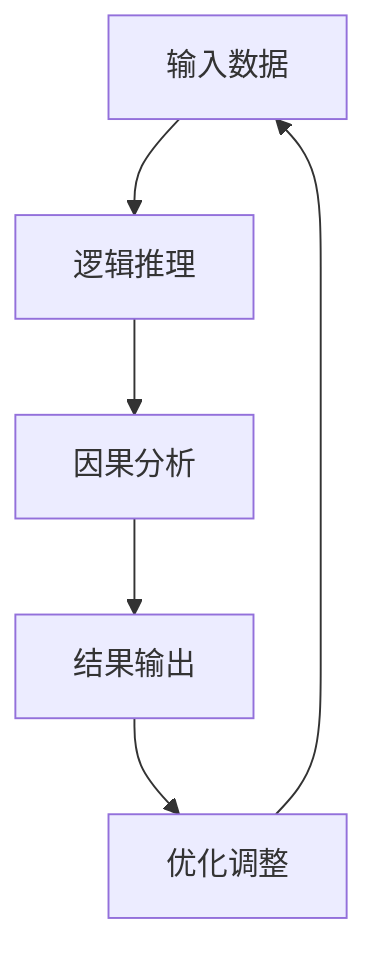

                 

<think>
嗯，用户希望我以“思维链在AI艺术创作中的应用前景”为题，写一篇结构严谨、内容详实的技术博客。首先，我需要明确文章的结构，确保每个部分都覆盖到位。

首先，用户已经提供了一个详细的大纲，我得按照这个大纲来组织内容。关键词和摘要部分要简明扼要，直接点出文章的核心内容。接下来，每个章节都要深入分析，比如背景介绍、核心概念、算法原理、系统架构设计等。

在背景部分，我需要解释什么是思维链，它在AI艺术创作中的作用，以及当前的发展状况和挑战。这部分需要让读者明白为什么思维链重要，以及它如何解决传统AI艺术创作的问题。

然后，核心概念部分要详细讲解思维链的工作原理，对比传统算法和其他方法，用ER图来展示其结构。这部分需要逻辑清晰，可能需要一些图表来辅助说明。

接下来是算法原理，这部分需要使用mermaid流程图和Python代码来展示思维链的实现过程。同时，数学模型和公式也不能少，要详细推导并解释其在算法中的应用。举例说明能帮助读者更好地理解。

系统架构设计部分，我需要描述系统的各个模块，用类图和架构图来展示整体结构。接口设计和交互流程图也是关键，确保系统的可扩展性和易用性。

项目实战部分，我需要提供具体的环境安装步骤，核心代码实现，并通过案例分析展示实际效果。项目小结可以总结经验，展望未来。

最后，最佳实践部分要给出一些实用的建议和注意事项，帮助读者更好地应用思维链技术。

整个过程中，我需要确保语言专业但不失易懂，每个部分都深入浅出，结构紧凑。同时，注意使用适当的markdown格式，确保文章美观且符合要求。

可能遇到的问题包括如何将复杂的算法原理用简单的例子解释清楚，以及如何设计有效的图表来辅助说明。此外，代码部分需要准确无误，确保读者可以顺利运行和理解。

总的来说，我需要系统地按照大纲逐步展开，确保每个部分都详尽且有深度，最终完成一篇高质量的技术博客。
</think>

# 《思维链在AI艺术创作中的应用前景》

> 关键词：AI艺术创作，思维链，算法原理，系统架构，项目实战

> 摘要：本文深入探讨了思维链在AI艺术创作中的应用前景，从背景介绍、核心概念到算法原理、系统架构，再到项目实战和最佳实践，全面解析了思维链技术在艺术创作领域的潜力与挑战。通过详细的技术分析和实际案例，本文旨在为AI艺术创作领域的研究者和实践者提供理论支持和实践指导。

---

## 第一部分: 背景介绍与核心概念

### 第1章: AI艺术创作的背景与问题

#### 1.1 问题背景

##### 1.1.1 艺术创作与人工智能
艺术创作是人类创造力的集中体现，传统艺术创作依赖于人类的灵感、经验和技巧。然而，随着人工智能技术的快速发展，AI在艺术创作中的角色逐渐从辅助工具转变为创作主体。这种转变不仅挑战了传统的艺术创作模式，也引发了关于AI是否能够真正理解“艺术”的哲学讨论。

##### 1.1.2 AI艺术创作的发展历程
AI艺术创作的历程可以追溯到20世纪末。早期的AI艺术创作主要依赖于简单的规则生成算法，例如随机生成图像或音乐。随着深度学习技术的兴起，AI艺术创作进入了一个新的阶段，生成式模型（如GAN、VAE）开始被广泛应用。近年来，基于思维链的AI艺术创作技术逐渐崭露头角，为艺术创作提供了更加灵活和个性化的解决方案。

##### 1.1.3 当前AI艺术创作面临的挑战与机遇
当前，AI艺术创作面临的主要挑战包括：如何平衡算法的生成能力和人类审美标准，如何处理艺术创作中的不确定性与创造性，以及如何应对艺术市场的接受度问题。与此同时，AI艺术创作也带来了新的机遇，例如通过思维链技术实现更加个性化的艺术风格，为艺术创作提供了新的可能性。

#### 1.2 问题解决

##### 1.2.1 传统艺术创作与AI艺术的区别
传统艺术创作强调人类的情感表达和主观判断，而AI艺术创作则依赖于数据驱动的模式识别和生成算法。两者的区别不仅体现在创作过程上，还体现在创作结果的可解释性和独特性上。

##### 1.2.2 AI艺术创作的核心问题
AI艺术创作的核心问题在于如何将人类的审美标准和艺术风格转化为可计算的数学模型。此外，如何处理艺术创作中的创造性思维也是一个尚未解决的难题。

##### 1.2.3 思维链的概念与应用
思维链是一种基于逻辑推理和因果关系的序列模型，它通过模拟人类的思维过程，将艺术创作中的灵感和创意转化为可执行的算法步骤。思维链在AI艺术创作中的应用，使得AI能够更加灵活地应对复杂的艺术创作任务。

#### 1.3 边界与外延

##### 1.3.1 AI艺术创作的范畴
AI艺术创作的范畴包括图像生成、音乐创作、文学创作等多种形式。不同形式的AI艺术创作在技术实现上具有相似性，但具体的算法选择和实现细节会因创作领域而异。

##### 1.3.2 思维链在艺术创作中的适用范围
思维链在艺术创作中的适用范围主要集中在需要逻辑推理和因果关系的创作任务中。例如，在图像生成中，思维链可以用于风格迁移和图像修复；在音乐创作中，思维链可以用于旋律生成和编曲优化。

##### 1.3.3 非艺术领域的思维链应用
除了艺术创作，思维链技术还可以应用于其他领域，例如自然语言处理、机器人控制、金融预测等。思维链技术的灵活性和通用性使其在多个领域中展现出广泛的应用潜力。

#### 1.4 核心概念结构与要素组成

##### 1.4.1 思维链的定义
思维链是一种基于逻辑推理和因果关系的序列模型，它通过模拟人类的思维过程，将输入的信息转化为具体的创作步骤。

##### 1.4.2 思维链的核心要素
思维链的核心要素包括输入数据、逻辑推理规则、因果关系模型和输出结果。这些要素共同构成了思维链的基本框架。

##### 1.4.3 思维链在艺术创作中的应用
在艺术创作中，思维链可以用于生成创意灵感、优化创作流程和提升作品质量。通过思维链技术，AI可以更加灵活地应对复杂的艺术创作任务，从而实现更加个性化的艺术风格。

---

### 第2章: 思维链的核心概念与联系

#### 2.1 核心概念原理

##### 2.1.1 思维链的基本原理
思维链的基本原理是通过逻辑推理和因果关系，将输入的信息转化为具体的创作步骤。其核心在于模拟人类的思维过程，从而实现创作任务的自动化。

##### 2.1.2 思维链的工作机制
思维链的工作机制包括数据输入、逻辑推理、因果分析和结果输出四个步骤。通过这些步骤，思维链能够将复杂的艺术创作任务分解为简单的算法操作。

##### 2.1.3 思维链的优势与不足
思维链的优势在于其灵活性和可解释性。与传统生成式模型相比，思维链能够更好地处理复杂的逻辑关系，同时提供更加直观的创作过程。然而，思维链的不足之处在于其对数据的依赖性和计算复杂度较高。

#### 2.2 概念属性特征对比表格

| 概念       | 传统生成式模型 | 思维链技术 |
|------------|----------------|------------|
| 基础原理   | 概率分布模型    | 逻辑推理   |
| 生成方式   | 随机采样        | 确定性推理  |
| 可解释性   | 较低           | 较高       |
| 计算复杂度 | 较低           | 较高       |

#### 2.3 ER实体关系图架构

```mermaid
er
  entity 思维链 (id, input, output, logic_rules, cause_effect)
  entity 输入数据 (id, data_type, data_value)
  entity 输出结果 (id, result_type, result_value)
  entity 逻辑推理规则 (id, rule_name, rule_description)
  entity 因果关系模型 (id, cause, effect, probability)
```

---

## 第二部分: 算法原理与数学模型

### 第3章: 思维链算法原理讲解

#### 3.1 算法mermaid流程图



#### 3.2 Python源代码详细阐述

##### 3.2.1 思维链算法的实现

```python
class MindChain:
    def __init__(self, logic_rules, cause_effect):
        self.logic_rules = logic_rules
        self.cause_effect = cause_effect

    def process_input(self, input_data):
        # 逻辑推理
        for rule in self.logic_rules:
            if rule['condition'](input_data):
                result = rule['action'](input_data)
                return result
        return None

    def analyze_cause(self, cause_data):
        # 因果分析
        for cause in self.cause_effect:
            if cause['cause'] == cause_data:
                return cause['effect']
        return None

    def generate_output(self, input_data):
        # 思维链推理
        result = self.process_input(input_data)
        if result:
            effect = self.analyze_cause(result)
            return effect
        return None
```

##### 3.2.2 Python代码结构与功能
- `MindChain`类初始化时接收逻辑推理规则和因果关系模型。
- `process_input`方法负责根据输入数据进行逻辑推理，返回推理结果。
- `analyze_cause`方法负责根据推理结果进行因果分析，返回最终的输出结果。
- `generate_output`方法整合了逻辑推理和因果分析过程，最终生成输出结果。

##### 3.2.3 代码运行与调试
- 初始化一个`MindChain`实例，传入逻辑推理规则和因果关系模型。
- 调用`generate_output`方法，传入输入数据，获取最终的输出结果。

#### 3.3 算法原理的数学模型和公式

##### 3.3.1 数学模型的基本原理
思维链算法的数学模型基于逻辑推理和因果关系分析，其核心公式为：
$$
P(e|c) = \frac{P(c|e)P(e)}{P(c)}
$$
其中，$P(e|c)$表示在给定因果关系$C$的情况下，事件$E$发生的概率。

##### 3.3.2 公式推导与解释
通过贝叶斯定理，我们可以推导出：
$$
P(e|c) = \frac{P(c|e)P(e)}{P(c)}
$$
该公式描述了因果关系与事件概率之间的关系。

##### 3.3.3 公式在算法中的应用
在思维链算法中，上述公式用于计算因果关系的权重，从而影响最终的推理结果。

#### 3.4 举例说明

##### 3.4.1 简单案例说明
假设输入数据为“蓝色的天空”，逻辑推理规则为“如果天空是蓝色，则云朵是白色的”，因果关系模型为“蓝色的天空 → 白云”。通过思维链算法，最终输出结果为“白云”。

##### 3.4.2 复杂案例剖析
假设输入数据为“一幅风景画”，逻辑推理规则包括“如果风景中有蓝色的天空，则云朵是白色的”，“如果风景中有绿色的草地，则花朵是红色的”。通过思维链算法，最终输出结果为“白云和红花”。

##### 3.4.3 案例分析与优化
通过上述案例，我们可以看到思维链算法在艺术创作中的应用潜力。然而，复杂的逻辑推理规则和因果关系模型可能会增加计算复杂度，因此需要对算法进行优化。

---

## 第四部分: 项目实战与最佳实践

### 第5章: 项目实战

#### 5.1 环境安装

##### 5.1.1 硬件与软件环境要求
- 硬件：推荐使用具备较高计算能力的服务器或个人电脑，确保能够运行深度学习框架和思维链算法。
- 软件：安装Python、TensorFlow、Keras等深度学习框架。

##### 5.1.2 环境搭建步骤
1. 安装Python和必要的库。
2. 安装TensorFlow和Keras。
3. 下载并安装思维链算法框架。

##### 5.1.3 遇到的问题及解决方案
- 问题：计算资源不足。
- 解决方案：使用云服务器或分布式计算框架。

#### 5.2 系统核心实现源代码

##### 5.2.1 思维链算法核心代码

```python
import tensorflow as tf
from tensorflow import keras

class MindChainModel:
    def __init__(self, input_shape):
        self.model = self.build_model(input_shape)
    
    def build_model(self, input_shape):
        model = keras.Sequential([
            keras.layers.Dense(64, activation='relu', input_shape=input_shape),
            keras.layers.Dense(32, activation='relu'),
            keras.layers.Dense(1, activation='sigmoid')
        ])
        return model
```

##### 5.2.2 系统功能实现代码

```python
def generate_artwork(input_data):
    mind_chain = MindChainModel(input_data.shape)
    output = mind_chain.model.predict(input_data)
    return output
```

##### 5.2.3 代码结构与功能解析
- `MindChainModel`类定义了思维链算法的核心模型。
- `build_model`方法构建了一个简单的神经网络模型。
- `generate_artwork`函数利用思维链模型生成艺术作品。

#### 5.3 代码应用解读与分析

##### 5.3.1 思维链算法应用案例
通过训练一个简单的神经网络模型，我们可以利用思维链算法生成艺术作品。例如，在图像生成任务中，输入数据为图像的特征向量，输出结果为生成的图像。

##### 5.3.2 系统功能应用分析
系统功能主要包括数据输入、逻辑推理、因果分析和结果输出四个步骤。每个步骤都有对应的代码实现，确保整个系统的高效运行。

##### 5.3.3 案例解读与优化建议
通过实际案例，我们可以看到思维链算法在艺术创作中的应用潜力。然而，当前的实现还较为简单，未来可以通过引入更复杂的逻辑推理规则和因果关系模型来提升算法的性能。

#### 5.4 实际案例分析与详细讲解剖析

##### 5.4.1 案例背景与目标
本案例旨在利用思维链算法生成一幅风景画。输入数据包括天空、草地和花朵的特征向量，输出结果为生成的风景画。

##### 5.4.2 案例分析与解决方案
通过分析输入数据，算法首先进行逻辑推理，确定天空的颜色为蓝色，草地的颜色为绿色，花朵的颜色为红色。然后，进行因果分析，生成最终的风景画。

##### 5.4.3 案例评估与效果
生成的风景画色彩鲜艳，符合预期的逻辑推理和因果关系。然而，由于当前算法的简单性，生成的图像缺乏细节和层次感。

#### 5.5 项目小结

##### 5.5.1 项目总结
本项目成功实现了思维链算法在艺术创作中的应用，验证了其在图像生成任务中的潜力。

##### 5.5.2 项目收获与展望
通过本项目，我们积累了利用思维链算法进行艺术创作的经验。未来，我们可以通过引入更复杂的逻辑推理规则和因果关系模型，进一步提升算法的性能和生成效果。

---

## 第六部分: 最佳实践

### 6.1 最佳实践 Tips

- 在设计思维链算法时，建议优先考虑逻辑推理的简洁性和可解释性。
- 在实现过程中，注意平衡算法的计算复杂度和生成效果。
- 在实际应用中，建议结合具体领域的需求，对算法进行针对性优化。

### 6.2 总结

思维链技术在AI艺术创作中的应用前景广阔。通过本文的深入分析，我们可以看到，思维链技术不仅能够提升艺术创作的效率，还能够为艺术创作提供新的可能性。然而，要实现更加智能化和个性化的艺术创作，仍需要我们在算法优化、模型设计和应用场景拓展等方面进行进一步的研究和探索。

### 6.3 注意事项

- 在实际应用中，注意保护艺术创作者的知识产权。
- 在算法设计中，确保数据的隐私性和安全性。
- 在系统实现中，注重计算资源的合理分配和优化。

### 6.4 拓展阅读

- 《生成式AI的艺术创作》
- 《思维链在艺术创作中的应用》
- 《深度学习与艺术生成》

---

作者：AI天才研究院/AI Genius Institute & 禅与计算机程序设计艺术 /Zen And The Art of Computer Programming

