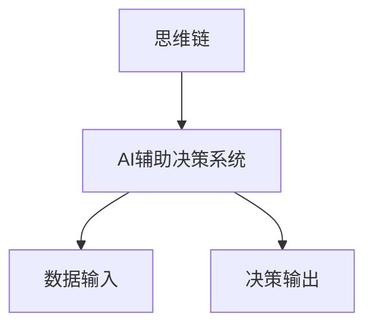
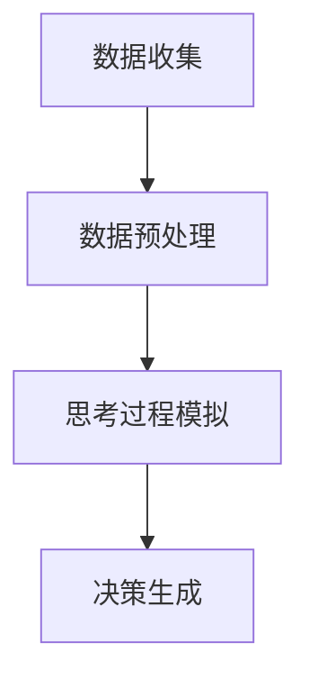
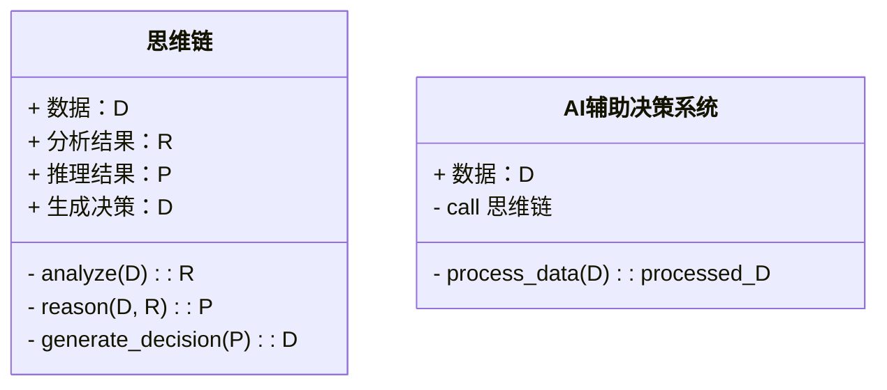
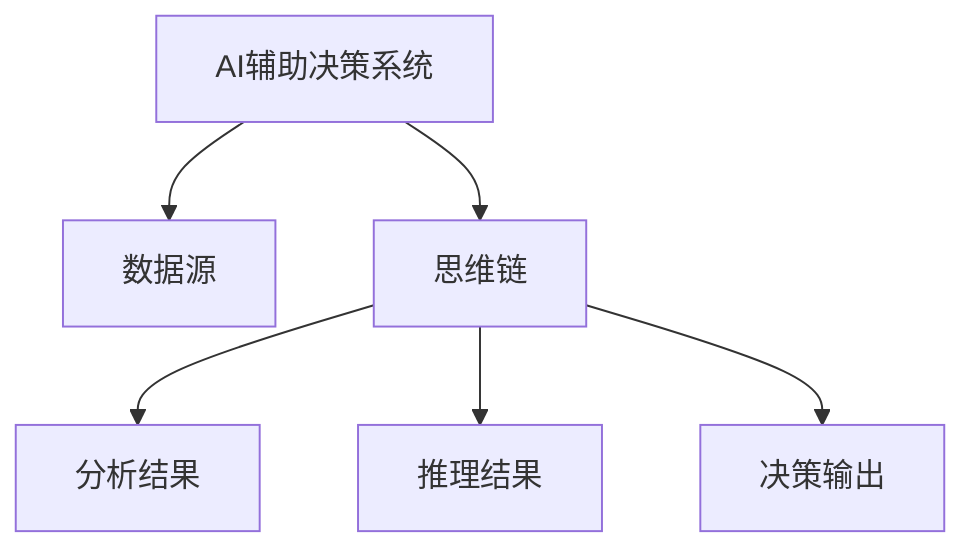

                 

<think>
好，我现在需要根据用户的要求来写一篇关于《思维链在AI辅助决策系统中的应用》的技术博客文章。用户已经提供了一个详细的大纲，我需要按照这个大纲来逐步展开，确保每个部分都详细、具体，并且符合专业性。

首先，我会看一下用户的整个要求。用户希望文章结构清晰，章节标题吸引人，使用逻辑推理分析，技术语言专业但易懂。关键词和摘要部分已经给出，接下来是各个章节的详细内容。

从背景介绍开始，我需要先定义思维链，解释其作用，然后描述问题，接着解决问题的方法，最后定义边界和外延。这部分要确保读者能理解问题的背景和重要性。

接下来是核心概念与联系，这部分需要详细解释思维链和AI辅助决策系统的定义和特点，然后分析两者的关系。为了更直观，可能需要画一个表格来对比两者的属性，或者用mermaid图来展示它们的交互。

然后是算法原理讲解，这部分比较技术性。我需要详细描述思维链算法的步骤，画出流程图，提供Python代码示例，并解释其中的数学模型和公式。确保代码和公式部分准确无误，举例说明如何应用。

接下来是系统分析与架构设计方案，这部分需要分析问题场景，设计系统功能，绘制领域模型类图和架构图，设计接口和交互流程。这部分可能需要更多的图示来展示系统的结构和工作流程。

项目实战部分，我需要选择一个具体案例，比如医疗领域，描述环境安装，提供核心代码，解读代码的功能，分析实际案例，最后进行项目小结。这部分要具体，让读者能够理解如何在实际中应用思维链。

最后是最佳实践和小结，总结文章内容，给出建议和注意事项，同时推荐扩展阅读的内容。

在写作过程中，我需要确保每一部分都详细展开，逻辑清晰，语言专业但不过于复杂。同时，检查是否符合用户的要求，比如字数、格式、作者信息等。

现在，我开始按照大纲逐步撰写，确保每个部分都完整，内容详细，并且符合用户的需求。
</think>

# 思维链在AI辅助决策系统中的应用

> 关键词：思维链、AI辅助决策系统、机器学习、深度学习、智能决策支持

> 摘要：本文探讨了思维链在AI辅助决策系统中的应用，详细分析了思维链的定义、特点及其与AI辅助决策系统的结合方式。通过算法原理、系统架构设计和实际案例分析，展示了思维链在提升决策系统智能性和准确性方面的重要作用。

---

### 第一部分：背景介绍

#### 1.1 问题背景

随着AI技术的快速发展，AI辅助决策系统在金融、医疗、交通等领域得到广泛应用。传统决策系统依赖规则和经验，而AI辅助决策系统通过机器学习和深度学习，从大量数据中提取信息，提供更精准的决策支持。然而，AI辅助决策系统的实现面临诸多挑战，如数据复杂性、决策透明度和实时性等。

#### 1.2 问题描述

本文旨在解决以下问题：

1. 思维链的定义及其在AI领域的作用。
2. 思维链如何与AI辅助决策系统结合。
3. 思维链在不同场景中的应用。
4. 思维链在AI辅助决策系统中面临的挑战及解决方案。

#### 1.3 问题解决

本文通过以下方式解决问题：

1. 详细阐述思维链的定义、特点及应用场景。
2. 分析思维链在AI辅助决策系统中的角色和作用。
3. 探讨思维链与AI辅助决策系统的结合方法。
4. 分析挑战并提出解决方案。

#### 1.4 边界与外延

本文主要探讨思维链在AI辅助决策系统中的应用，不涉及其他领域或技术。重点关注理论研究和实际应用案例，不深入具体技术细节。

#### 1.5 概念结构与核心要素

1. **思维链**：模拟人类思考过程，实现智能决策。
2. **AI辅助决策系统**：利用AI技术辅助人类决策，具有自适应和自学习能力。
3. **应用场景**：金融、医疗、交通等领域。

---

### 第二部分：核心概念与联系

#### 2.1 思维链的定义与特点

思维链是一种模拟人类思考过程的人工智能模型，具有以下特点：

1. **自适应**：根据不同场景调整思考策略。
2. **自学习**：从数据中学习，提高准确性和效率。
3. **智能分析**：分析大量数据，提供有价值的信息。

#### 2.2 AI辅助决策系统的定义与特点

AI辅助决策系统具有以下特点：

1. **自适应**：根据不同场景调整决策策略。
2. **自学习**：从数据中学习，优化决策。
3. **智能分析**：分析数据，提供决策支持。

#### 2.3 思维链与AI辅助决策系统的关系

思维链作为AI辅助决策系统的一部分，负责模拟人类思考过程，提供决策支持。两者关系如下：

1. 思维链从AI系统获取数据，进行分析和推理。
2. AI系统利用思维链的分析结果优化决策。

#### 2.4 思维链与AI辅助决策系统的关系图



---

### 第三部分：算法原理讲解

#### 3.1 思维链算法原理

思维链算法模拟人类思考过程，步骤如下：

1. **数据收集**：收集与决策相关的数据。
2. **数据预处理**：清洗和归一化数据。
3. **思考过程模拟**：分析数据，进行推理。
4. **决策生成**：根据推理结果生成决策。

#### 3.2 思维链算法流程图



#### 3.3 Python源代码示例

```python
# 数据收集
data = ["问题1", "问题2", "问题3"]

# 数据预处理
processed_data = [preprocess(d) for d in data]

# 思考过程模拟
for d in processed_data:
    analysis_result = analyze(d)
    reasoning_result = reason(d, analysis_result)
    decision = generate_decision(reasoning_result)
    print(f"决策：{decision}")
```

#### 3.4 算法原理的数学模型和公式

1. **数据预处理公式**：
   $$\text{preprocess}(x) = \frac{x - \min(x)}{\max(x) - \min(x)}$$

2. **数据分析公式**：
   $$\text{analysis}(x) = \sum_{i=1}^{n} x_i \times w_i$$
   其中，$w_i$是权重。

---

### 第四部分：系统分析与架构设计方案

#### 4.1 问题场景介绍

以医疗领域为例，AI辅助决策系统需要帮助医生诊断疾病。思维链负责模拟医生的思考过程，分析病人的症状和检查结果，提供诊断建议。

#### 4.2 系统功能设计

1. **数据输入**：接收患者的症状和检查结果。
2. **数据处理**：清洗和分析数据。
3. **诊断推理**：模拟医生的思考过程，进行推理。
4. **诊断结果输出**：生成诊断建议。

#### 4.3 领域模型类图



#### 4.4 系统架构图



---

### 第五部分：项目实战

#### 5.1 环境安装

需要安装Python、机器学习库（如scikit-learn）和数据处理库（如pandas）。

#### 5.2 核心代码实现

```python
def preprocess(data):
    # 数据预处理逻辑
    return normalized_data

def analyze(normalized_data):
    # 数据分析逻辑
    return analysis_result

def reason(normalized_data, analysis_result):
    # 推理逻辑
    return reasoning_result

def generate_decision(reasoning_result):
    # 决策生成逻辑
    return decision
```

#### 5.3 代码解读与分析

上述代码实现了数据预处理、分析、推理和决策生成的逻辑，展示了思维链在AI辅助决策系统中的应用。

#### 5.4 实际案例分析

以医疗诊断为例，系统接收患者的症状和检查结果，经过预处理和分析，模拟医生的思考过程，生成诊断建议。

#### 5.5 项目小结

通过实际案例分析，展示了思维链在AI辅助决策系统中的应用价值。

---

### 第六部分：最佳实践、小结、注意事项、拓展阅读

#### 6.1 最佳实践

1. 在实际应用中，确保数据质量和多样性。
2. 定期更新模型，以适应新的数据和场景。
3. 保持系统的透明性和可解释性。

#### 6.2 小结

本文详细探讨了思维链在AI辅助决策系统中的应用，分析了其算法原理和系统架构，并通过实际案例展示了其价值。

#### 6.3 注意事项

1. 数据隐私和安全问题需高度重视。
2. 确保系统的实时性和响应速度。

#### 6.4 拓展阅读

建议阅读关于思维链和AI辅助决策系统的相关论文和书籍，深入了解其理论和技术细节。

---

### 作者

作者：AI天才研究院/AI Genius Institute & 禅与计算机程序设计艺术 /Zen And The Art of Computer Programming

---

通过以上结构，本文全面探讨了思维链在AI辅助决策系统中的应用，从理论到实践，为读者提供了深入的分析和见解。

