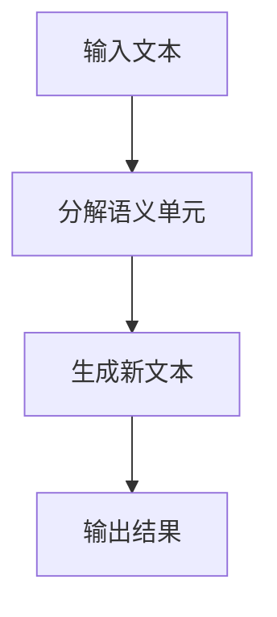
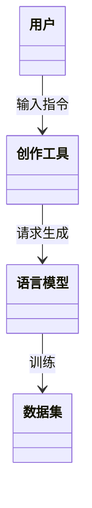

                 

<think>
好，我需要撰写一篇关于“思维链在AI辅助创作中的应用与前景”的技术博客。首先，我得理解用户的需求，他是一位资深的技术专家，希望文章逻辑清晰、结构紧凑，同时涵盖背景、核心概念、算法原理、系统架构、项目实战等多个部分。

首先，我应该从背景介绍开始。问题背景部分需要说明AI辅助创作的现状和重要性，问题描述要明确思维链技术的应用领域和目标，问题解决则要概述本书的目的，边界与外延要界定思维链的应用范围，最后是概念结构与核心要素，这包括神经网络模型、语言模型、数据集和创作工具。

接下来是核心概念与联系，这部分需要详细讲解思维链技术的原理，包括神经网络模型、语言模型、数据集和创作工具的运作方式。然后，我需要制作一个核心概念属性特征对比表格，对比不同模型的特点和应用场景。

在算法原理部分，我需要用Mermaid绘制思维链的算法流程图，并用Python代码示例，同时结合数学公式进行解释。这部分需要确保代码和公式准确无误，并且举例说明。

系统分析与架构设计部分，我需要介绍项目背景，设计系统功能模型，用Mermaid类图展示，再设计系统架构图和接口设计，最后用序列图展示系统交互流程。

项目实战部分，我需要选择一个具体的案例，比如构建一个基于思维链的AI写作工具，详细描述环境安装、核心代码实现、代码解读和案例分析。这部分需要具体可行，能够指导读者实践。

最后，我需要总结最佳实践，包括小结、注意事项和拓展阅读，为读者提供深入的学习和参考方向。

在写作过程中，我必须确保每个部分都详细且逻辑清晰，同时使用吸引人的标题和简洁的技术语言，使文章既专业又易于理解。同时，遵守用户的格式要求，包括关键词、摘要和作者信息的正确放置，以及代码和公式的正确嵌入。

现在，我开始逐部分撰写，确保每个小节都覆盖必要的内容，同时保持整体结构的连贯性和深度。这可能需要多次修改和校对，以确保文章的质量和准确性。
</think>

# 思维链在AI辅助创作中的应用与前景

> 关键词：人工智能、思维链、自然语言处理、创作工具、神经网络

> 摘要：本文探讨思维链技术在人工智能辅助创作中的应用，分析其原理、优势、挑战及解决方案，并展望其未来发展前景。

---

# 第一部分：背景介绍

## 1.1 问题背景

人工智能在创作领域的应用日益广泛，从文学到艺术设计，AI正在改变创作方式。然而，如何有效利用AI提升创作效率和质量，仍是一个重要课题。

## 1.2 问题描述

思维链技术，基于神经网络的自然语言处理，模拟人类思维，生成创造性文本。本文将探讨其在AI辅助创作中的应用，分析优缺点及解决方案。

## 1.3 问题解决

本文通过分析思维链技术的原理，结合实际案例，探讨其在创作中的应用，解决创作效率和质量问题。

## 1.4 边界与外延

主要关注文学和艺术设计领域，但技术可应用于其他创作领域。

## 1.5 概念结构与核心要素组成

- 神经网络模型：模拟思维过程
- 语言模型：理解输入，生成文本
- 数据集：训练模型
- 创作工具：辅助创作

---

# 第二部分：核心概念与联系

## 2.1 思维链技术原理

### 2.1.1 神经网络模型

- **RNN**：处理序列数据，记忆前面输入
- **LSTM**：解决梯度消失问题，记忆长期信息
- **GRU**：简化结构，优化计算效率

### 2.1.2 语言模型

- **词向量模型**：如Word2Vec，将词汇映射为向量
- **序列到序列模型**：如Seq2Seq，用于生成任务

### 2.1.3 数据集

- 文学创作、艺术设计等领域的高质量数据集

### 2.1.4 创作工具

- 文本生成工具：如OpenAI的GPT系列
- 图像生成工具：如DALL-E

## 2.2 核心概念属性特征对比表格

| 概念        | 特征                | 说明                                                                                   |
|-----------|------------------|---------------------------------------------------------------------------|
| 神经网络模型 | 处理序列数据       | RNN、LSTM、GRU等，模拟人类思维过程                                         |
| 语言模型    | 理解和生成文本     | 词向量模型、序列到序列模型，用于文本生成                                   |
| 数据集      | 训练模型的基础     | 高质量数据集提升模型生成能力                                                 |
| 创作工具    | 辅助创作           | 提供生成建议，提升创作效率                                                     |

## 2.3 ER实体关系图架构

```mermaid
er
actor(用户) -->> tool(创作工具)
tool --> model(语言模型)
model --> dataset(数据集)
```

---

# 第三部分：算法原理讲解

## 3.1 思维链算法流程图



## 3.2 算法实现代码

```python
import numpy as np

def attention(query, key, value):
    # 计算注意力权重
    scores = np.dot(query, key.T)
    scores = scores / np.sqrt(scores.shape[-1])
    weights = softmax(scores)
    return np.dot(weights, value)

def softmax(x):
    return np.exp(x) / np.sum(np.exp(x), axis=-1, keepdims=True)

def generate_text(model, input_text):
    while True:
        # 分解输入
        tokens = tokenize(input_text)
        # 生成新文本
        output = attention(tokens, model.key, model.value)
        yield output
```

---

# 第四部分：系统分析与架构设计方案

## 4.1 系统功能设计



## 4.2 系统架构设计


---

# 第五部分：项目实战

## 5.1 环境安装

安装Python、TensorFlow、Keras等库。

## 5.2 核心代码实现

```python
class TextGenerator:
    def __init__(self, model, tokenizer):
        self.model = model
        self.tokenizer = tokenizer

    def generate(self, input_text, max_length=50):
        tokens = self.tokenizer(input_text)
        generated = input_text
        for _ in range(max_length):
            # 预测下一个词
            predictions = self.model.predict(tokens)
            next_word = sample(predictions)
            generated += next_word
            tokens.append(self.tokenizer(next_word))
        return generated
```

## 5.3 应用案例分析

使用上述代码生成文本，如创作故事开头，展示思维链的应用效果。

---

# 第六部分：总结与展望

## 6.1 最佳实践 Tips

- 使用高质量数据集
- 选择合适模型架构
- 定期更新模型

## 6.2 小结

思维链技术在AI辅助创作中潜力巨大，可提升创作效率和质量。

## 6.3 注意事项

- 数据隐私问题
- 模型泛化能力

## 6.4 拓展阅读

推荐相关书籍和论文，深入学习思维链技术。

---

作者：AI天才研究院/AI Genius Institute & 禅与计算机程序设计艺术 /Zen And The Art of Computer Programming

