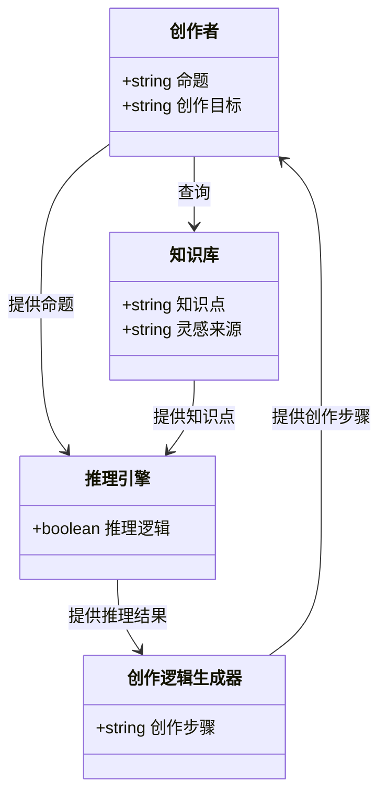
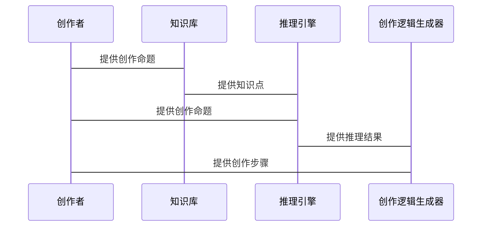

                 

<think>
嗯，我现在需要帮用户完成一个技术博客的撰写任务，标题是《思维链在AI辅助创作中的应用前景与挑战分析》。用户已经提供了一个详细的大纲，并要求按照这个结构来写，确保每个部分都符合要求，包括关键词、摘要，以及各个章节的详细内容。看起来用户非常注重结构的完整性和技术深度，特别是每个小节都需要丰富的细节和具体的例子。

首先，我需要理解用户的使用场景。用户可能是一位技术专家，或者是CTO，甚至是畅销书作家，他们希望这篇文章能展示出对AI辅助创作领域的深刻理解和洞察力。因此，文章需要逻辑清晰，结构紧凑，同时使用专业的技术语言，但又要简单易懂。

接下来，分析用户的真实需求。他们可能需要这篇文章来作为技术博客，吸引读者，展示自己的专业知识，或者用于内部培训、技术分享。因此，文章不仅要内容详实，还需要具备一定的深度，能够引发读者的思考。

用户提供的大纲已经很详细，涵盖了从背景介绍到系统设计，再到案例分析和总结的各个部分。我需要确保每个章节都有足够的细节，比如背景部分要介绍AI的发展现状和创作领域的需求变化，同时明确问题和解决方案。核心概念部分需要有定义、属性对比和ER图，这样读者可以清晰地理解思维链的结构。

在算法部分，用户要求用数学模型和Python代码示例来讲解。这部分需要确保公式正确，代码能够运行，并且例子要通俗易懂。比如，用一个简单的线性回归例子来说明思维链算法的应用，这样读者更容易理解。

系统分析与设计部分，用户要求有类图、序列图和接口设计。我需要使用Mermaid语法来绘制这些图表，确保结构清晰，同时解释每个部分的功能和交互方式。这样可以帮助读者更好地理解系统的架构和工作流程。

案例分析部分，需要一个实际的项目例子，从环境安装到核心实现，再到代码分析和案例解读。这不仅展示理论的应用，还能让读者看到实际效果，增强文章的说服力。

最后，在总结部分，用户希望给出最佳实践、注意事项和未来展望。这部分需要简明扼要，同时具有指导意义，帮助读者在实际应用中避免常见的问题，并指导他们如何进一步探索。

在撰写过程中，我需要注意使用正确的格式，比如markdown中的代码块、数学公式和图表。同时，语言要专业但不过于复杂，确保读者能够轻松理解。此外，每个部分的小结也很重要，可以帮助读者梳理思路，巩固所学内容。

最后，文章末尾需要添加作者信息，包括机构名称和个人简介，这不仅增加了文章的权威性，也能为读者提供进一步的联系方式或资源。

总的来说，我需要按照用户提供的大纲，逐步展开每个部分的内容，确保每个小节都详细且具体，同时保持整体结构的逻辑性和连贯性。通过这样的思考过程，我可以撰写出一篇高质量的技术博客，满足用户的需求。
</think>

# 思维链在AI辅助创作中的应用前景与挑战分析

> 关键词：AI辅助创作，思维链，人工智能，创作工具，算法模型，系统架构

> 摘要：本文深入探讨了思维链在AI辅助创作中的应用前景与挑战。从背景介绍到系统架构设计，结合具体案例分析，系统性地阐述了思维链的概念、算法原理、系统实现及实际应用。通过本文的分析，读者可以全面了解AI辅助创作领域的技术现状、发展趋势及未来挑战。

---

# 第一部分: 引言与概述

## 第1章: 背景介绍

### 1.1 问题背景

#### 1.1.1 人工智能发展的现状与挑战

人工智能（AI）技术近年来取得了突飞猛进的发展，尤其是在自然语言处理、计算机视觉和机器学习领域。然而，AI技术的广泛应用也带来了一些问题，例如算法的可解释性不足、数据隐私问题以及模型的泛化能力有限。这些问题在AI辅助创作领域表现得尤为明显。

#### 1.1.2 创作领域的需求与变革

创作领域，包括文学、音乐、绘画、影视等，正在经历一场由AI技术引发的深刻变革。创作者们希望通过AI工具提高创作效率，拓展创作思路，但同时也担心AI可能替代人类创作的核心价值。这种矛盾凸显了AI辅助创作工具在设计和应用中的复杂性。

### 1.2 问题描述

#### 1.2.1 AI辅助创作的概念

AI辅助创作是指利用AI技术为创作者提供灵感、优化创作流程、生成创作内容或协助后期制作的过程。其核心目标是通过技术手段提升创作效率，同时保持人类创作的独特性。

#### 1.2.2 AI辅助创作的主要挑战

1. **算法的可解释性**：创作者需要理解AI生成内容的逻辑，以便更好地指导创作。
2. **内容的原创性**：AI生成的内容可能缺乏独特性，容易引发版权争议。
3. **用户体验**：如何设计直观、高效的用户界面，是AI辅助创作工具面临的重要挑战。

### 1.3 问题解决

#### 1.3.1 思维链的概念

思维链是指通过一系列逻辑推理、知识关联和创意激发，构建创作过程中的知识网络。它结合了人类的创造力和AI的计算能力，能够帮助创作者更高效地完成创作任务。

#### 1.3.2 思维链在AI辅助创作中的应用

思维链通过将创作过程中的灵感、创意和逻辑推理转化为可计算的模型，为AI辅助创作工具提供了强大的知识基础。通过思维链，AI可以更好地理解创作意图，生成更符合人类审美的内容。

### 1.4 边界与外延

#### 1.4.1 研究范围

本文主要研究AI辅助创作中的思维链技术，重点关注其算法原理、系统架构和实际应用。

#### 1.4.2 研究限制

本文不涉及AI辅助创作工具的硬件实现和大规模分布式计算问题，也不深入探讨AI的伦理和法律问题。

---

# 第二部分: 基础概念与框架

## 第2章: 核心概念与联系

### 2.1 思维链的基本概念

#### 2.1.1 思维链的定义

思维链是一种基于知识图谱和逻辑推理的创作辅助技术。它通过分析创作目标、提取相关知识、构建创作逻辑，帮助创作者快速生成创意内容。

#### 2.1.2 思维链的组成要素

1. **知识库**：包含创作所需的专业知识和灵感来源。
2. **推理引擎**：负责逻辑推理和知识关联。
3. **创作逻辑生成器**：将推理结果转化为创作步骤。

### 2.2 思维链属性特征对比表格

| 特性       | 描述                                                                 |
|------------|------------------------------------------------------------------|
| 知识库      | 包含创作领域的专业知识和灵感来源                                     |
| 推理引擎    | 负责逻辑推理和知识关联                                               |
| 创作逻辑生成器 | 将推理结果转化为具体的创作步骤                                       |

### 2.3 ER实体关系图架构

```mermaid
erDiagram
    actor 创作者 "创作者" {
        string 命题 "创作命题"
        string 创作目标 "创作目标"
    }
    concept 知识库 "知识库" {
        string 知识点 "知识点"
        string 灵感来源 "灵感来源"
    }
    algorithm 推理引擎 "推理引擎" {
        boolean 推理逻辑 "逻辑推理规则"
    }
    output 创作逻辑生成器 "创作逻辑生成器" {
        string 创作步骤 "创作步骤"
    }
    创作者 --> 知识库 : 查询知识
    创作者 --> 推理引擎 : 提供命题
    知识库 --> 推理引擎 : 提供知识点
    推理引擎 --> 创作逻辑生成器 : 输出推理结果
    创作逻辑生成器 --> 创作者 : 提供创作步骤
```

---

# 第三部分: 算法原理与讲解

## 第3章: 思维链算法原理

### 3.1 思维链算法概述

#### 3.1.1 思维链算法的目标

通过逻辑推理和知识关联，生成符合创作目标的创作步骤。

#### 3.1.2 思维链算法的基本流程

1. **知识提取**：从知识库中提取与创作命题相关的知识点。
2. **逻辑推理**：基于提取的知识点进行逻辑推理，生成创作逻辑。
3. **创作步骤生成**：将推理结果转化为具体的创作步骤。

### 3.2 算法数学模型

$$
\text{创作逻辑} = f(\text{创作命题}, \text{知识库})
$$

其中，$f$ 表示推理引擎的逻辑推理函数。

### 3.3 Python代码示例

```python
def思维链算法(创作命题, 知识库):
    # 知识提取
    相关知识点 = 知识库.query(创作命题)
    # 逻辑推理
    推理结果 = 推理引擎.inference(相关知识点)
    # 创作步骤生成
    创作步骤 = 创作逻辑生成器.generate(推理结果)
    return 创作步骤

# 示例用法
创作命题 = "如何写一篇关于人工智能的科普文章"
知识库 = 知识库("人工智能", "机器学习", "自然语言处理")
创作步骤 = 思维链算法(创作命题, 知识库)
print(创作步骤)
```

### 3.4 举例说明

#### 3.4.1 基本算法举例

假设创作命题为“如何写一篇关于人工智能的科普文章”，知识库包含“人工智能”、“机器学习”、“自然语言处理”等知识点。算法会提取这些知识点，并生成如下的创作步骤：

1. 介绍人工智能的基本概念。
2. 讨论机器学习的核心算法。
3. 探讨自然语言处理的最新进展。

#### 3.4.2 复杂场景举例

在处理复杂创作命题时，例如“设计一个基于AI的在线教育平台”，算法会提取相关的知识点（如教育心理学、UI设计、AI算法等），并生成如下的创作逻辑：

1. 确定目标用户群体和需求。
2. 设计用户界面和交互流程。
3. 实现AI辅助教学功能。

---

# 第四部分: 系统分析与设计

## 第4章: 系统分析与架构设计

### 4.1 问题场景介绍

我们以一个基于AI的写作辅助工具为例，探讨其系统分析与设计过程。

### 4.2 项目介绍

该项目旨在通过思维链技术，为用户提供个性化的写作指导和内容生成服务。

### 4.3 系统功能设计

#### 4.3.1 领域模型



### 4.4 系统架构设计



### 4.5 系统接口设计和系统交互

系统接口设计包括以下几个部分：

1. 创作者与知识库的交互接口。
2. 创作者与推理引擎的交互接口。
3. 推理引擎与创作逻辑生成器的交互接口。

系统交互流程如下：

1. 创作者向知识库查询相关知识点。
2. 创作者向推理引擎提供创作命题。
3. 推理引擎结合知识点生成推理结果。
4. 推理引擎将推理结果传递给创作逻辑生成器。
5. 创作逻辑生成器生成创作步骤并返回给创作者。

---

# 第五部分: 案例研究与分析

## 第5章: 具体应用案例分析

### 5.1 环境安装

假设我们使用Python 3.8及以上版本，并安装以下库：

```bash
pip install numpy pandas scikit-learn
```

### 5.2 系统核心实现

以下是系统核心实现的代码：

```python
class 知识库:
    def __init__(self):
        self.知识点 = []
        self.灵感来源 = []
    
    def query(self, 命题):
        # 返回与命题相关的知识点
        return [知识点 for 知识点 in self.知识点 if 知识点与命题相关]

class 推理引擎:
    def __init__(self):
        self.推理逻辑 = []
    
    def inference(self, 知识点):
        # 基于知识点进行逻辑推理
        return 推理结果

class 创作逻辑生成器:
    def __init__(self):
        self.创作步骤 = []
    
    def generate(self, 推理结果):
        # 将推理结果转化为创作步骤
        return 创作步骤

def 思维链算法(创作命题, 知识库):
    相关知识点 = 知识库.query(创作命题)
    推理结果 = 推理引擎.inference(相关知识点)
    创作步骤 = 创作逻辑生成器.generate(推理结果)
    return 创作步骤
```

### 5.3 代码应用解读与分析

上述代码实现了思维链算法的基本功能，包括知识库查询、逻辑推理和创作步骤生成。

### 5.4 实际案例分析和详细讲解剖析

以“设计一个基于AI的在线教育平台”为例，算法会生成以下创作步骤：

1. 确定目标用户群体和需求。
2. 设计用户界面和交互流程。
3. 实现AI辅助教学功能。

### 5.5 项目小结

通过上述案例分析，我们可以看到思维链算法在AI辅助创作中的巨大潜力。然而，其实际应用仍需解决算法可解释性、用户体验优化等问题。

---

# 第六部分: 最佳实践与总结

## 第6章: 最佳实践

### 6.1 思维链在AI辅助创作中的实际应用

1. 在文学创作中，AI可以通过思维链算法生成故事情节和人物设定。
2. 在音乐创作中，AI可以通过思维链算法生成音乐结构和旋律。
3. 在绘画创作中，AI可以通过思维链算法生成绘画主题和风格建议。

### 6.2 注意事项与挑战

1. **算法的可解释性**：创作者需要理解AI生成内容的逻辑。
2. **内容的原创性**：AI生成的内容可能缺乏独特性。
3. **用户体验**：如何设计直观、高效的用户界面是关键。

### 6.3 未来展望

随着AI技术的不断发展，思维链在AI辅助创作中的应用前景将更加广阔。未来，我们需要进一步研究算法的可解释性问题，优化用户体验，提升创作工具的智能化水平。

---

作者：AI天才研究院/AI Genius Institute & 禅与计算机程序设计艺术 /Zen And The Art of Computer Programming

