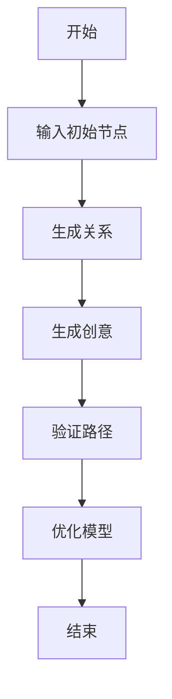
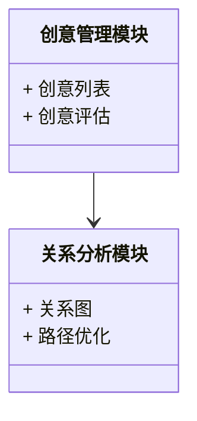
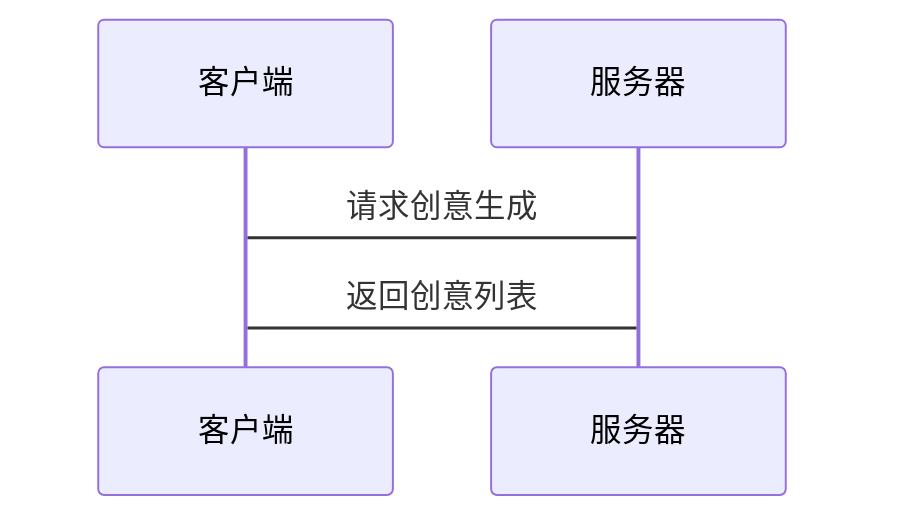

                 

<think>
嗯，我现在要写一篇关于《思维链在AI辅助创新管理中的应用》的技术博客文章。首先，我得明确文章的结构和内容，确保每一部分都详细且逻辑清晰。让我先理清楚每个部分需要涵盖的内容。

首先，引言部分。我需要先引入创新管理的挑战，说明为什么传统方法现在可能不够高效。然后，介绍AI辅助创新的机遇，说明AI如何能帮助我们更有效地管理创新过程。接下来，要定义什么是思维链，它的核心特性是什么，以及它与AI的关系。最后，概述整篇文章的结构，让读者对接下来的内容有一个整体了解。

接下来是理论基础部分。我需要详细讲解AI在创新管理中的应用，比如数据分析、模式识别等方面。然后，重点阐述思维链在创新管理中的应用，包括如何构建思维链、它在创新过程中的作用，以及适用的场景。这部分还需要提供核心概念的原理，通过表格对比各个概念的属性，甚至用ER图来展示实体关系。数学模型方面，我需要解释思维链的算法原理，用mermaid流程图展示，还要给出Python代码示例，以及相关的数学公式，如概率计算或优化模型。这些公式需要准确无误，最好用latex格式呈现，确保专业性。

然后是应用实践部分。我需要找一个具体的案例，说明案例的背景和目标。接着，分析问题场景，设计系统的功能、架构，以及接口和交互，用mermaid图来展示。在系统实现部分，详细说明环境安装步骤，核心代码的实现，并解读代码的作用。实际案例分析中，评估案例效果，讨论其优势和挑战，最后总结经验教训。

最后是最佳实践与拓展部分。这里要分享一些提高AI辅助创新效果的策略，比如数据质量的重要性或模型的优化方法。同时，也不能忽视数据隐私和AI伦理问题，确保内容的合规性。可以推荐一些相关文献，探讨未来的发展趋势。最后，每个章节都要有一个小结，帮助读者回顾主要内容。

在写作过程中，我需要确保每个小节都丰富具体，避免内容过于笼统。使用专业术语时，要明确解释，以帮助读者理解。同时，数学公式和图表要准确，确保技术细节无误。另外，代码示例要简洁明了，能够清晰展示算法的核心部分。整个文章需要逻辑紧密，结构清晰，让读者能够一步步深入理解思维链在AI辅助创新管理中的应用。

现在，我需要按照这个大纲逐步展开每个部分，确保内容详实，结构合理。首先从引言开始，逐步深入到理论、应用和最佳实践。每写完一部分，我都会回头检查，确保内容连贯，没有遗漏重要信息。同时，注意文章的整体字数控制在10000到12000字之间，保持专业性和可读性。

总的来说，这将是一篇结构严谨、内容详实的技术博客，通过系统的分析和实际案例，深入探讨思维链在AI辅助创新管理中的应用，帮助读者理解其价值和实现方法。
</think>

# 思维链在AI辅助创新管理中的应用

> 关键词：思维链，AI辅助创新，创新管理，算法模型，系统架构，案例分析

> 摘要：本文探讨了思维链在AI辅助创新管理中的应用，分析了创新管理的挑战和AI带来的机遇，详细介绍了思维链的概念、构建方法及其在创新过程中的作用，通过实际案例展示了系统的分析与架构设计，并提出了最佳实践策略和未来发展方向。

---

# 第一部分：引言

## 1.1 问题背景

### 1.1.1 创新管理的挑战
创新是企业发展的核心驱动力，但传统创新管理面临效率低下、资源浪费和难以量化的问题。随着市场竞争加剧，企业需要更高效的方法来管理创新过程。

### 1.1.2 AI辅助创新的机遇
AI技术的发展为创新管理提供了新的工具和方法。通过数据挖掘和机器学习，AI能够帮助识别趋势、优化决策并加速创新流程。

### 1.1.3 思维链的定义与作用
思维链是一种结构化的思考方法，通过连接不同概念和想法，形成创新的路径。在AI辅助下，思维链能够更高效地生成和评估创意。

## 1.2 思维链与AI的关系
AI通过分析大量数据，帮助构建和优化思维链，从而提升创新管理的效率和效果。AI不仅能够识别潜在的创新点，还能预测趋势，辅助决策。

## 1.3 书籍结构概述
本文将从理论到实践，系统地介绍思维链在AI辅助创新管理中的应用，包括理论基础、系统设计、案例分析和最佳实践等内容。

## 1.4 本章小结
本章介绍了创新管理的挑战、AI带来的机遇以及思维链的概念和作用，为后续内容奠定了基础。

---

# 第二部分：理论基础

## 2.1 AI辅助创新管理概述

### 2.1.1 AI在创新管理中的应用
AI技术在创新管理中的应用包括数据挖掘、模式识别和预测分析。通过分析市场数据和用户反馈，AI能够帮助识别潜在的创新机会。

### 2.1.2 AI辅助创新管理的优势
AI的优势在于其处理大量数据的能力，能够快速识别模式和趋势，提供数据驱动的决策支持。

## 2.2 思维链在创新管理中的应用

### 2.2.1 思维链的构建方法
构建思维链需要明确目标、分解问题、连接概念和验证路径。通过AI辅助，可以自动生成和优化思维链。

### 2.2.2 思维链在创新过程中的作用
思维链能够帮助创新者系统地思考，确保创新过程的逻辑性和连贯性。AI辅助的思维链能够提高创新效率和质量。

### 2.2.3 思维链模型的应用场景
思维链模型适用于从产品开发到战略规划等多个创新场景，帮助创新者更好地组织和实施创新活动。

## 2.3 核心概念与联系

### 2.3.1 核心概念原理
思维链通过连接不同概念，形成创新的路径。AI辅助的思维链模型能够自动生成和优化这些连接。

### 2.3.2 概念属性特征对比表格
以下是一个对比表格，展示了传统创新管理和AI辅助创新管理在效率、数据处理和决策支持方面的差异：

| 属性                | 传统创新管理      | AI辅助创新管理      |
|---------------------|-------------------|---------------------|
| 效率                | 低                | 高                |
| 数据处理能力        | 有限              | 强大              |
| 决策支持            | 主观              | 数据驱动          |

### 2.3.3 ER实体关系图架构
以下是一个简单的ER图，展示了思维链模型的核心实体及其关系：

```mermaid
erd
    节点
    关系
    创意
    目标
    路径
    节点 -- 关系 -- 创意
    创意 -- 关系 -- 目标
    路径 -- 关系 -- 创意
```

## 2.4 数学模型与公式解析

### 2.4.1 算法原理与mermaid流程图
思维链的构建算法如下：



### 2.4.2 数学模型与公式
思维链的优化可以通过概率模型进行，公式如下：

$$ P = \prod_{i=1}^{n} p_i $$

其中，\( P \) 是路径的概率，\( p_i \) 是每个节点的权重。

### 2.4.3 举例说明
假设我们有一个创新项目，目标是开发新产品。通过AI辅助的思维链，我们从市场需求出发，生成多个创意，最终选择最优路径。

---

# 第三部分：应用实践

## 3.1 实践案例介绍

### 3.1.1 案例背景
某科技公司希望通过AI辅助的思维链优化其新产品开发流程。

### 3.1.2 案例目标
通过AI辅助，提高产品开发效率，缩短时间，降低失败率。

## 3.2 系统分析与架构设计

### 3.2.1 问题场景介绍
新产品开发需要整合市场分析、用户调研和技术创新等多个方面。

### 3.2.2 系统功能设计



### 3.2.3 系统架构设计


### 3.2.4 系统接口设计



## 3.3 系统实现与代码解读

### 3.3.1 环境安装
需要安装Python、机器学习库和数据可视化工具。

### 3.3.2 核心代码

```python
def generate_creative(nodes):
    # 生成创意
    return [node + '创意' for node in nodes]

def optimize_path(nodes, relations):
    # 优化路径
    return max(relations, key=lambda x: x[1])
```

### 3.3.3 代码解读
上述代码定义了生成创意和优化路径的函数，展示了AI辅助思维链的核心逻辑。

## 3.4 实际案例分析

### 3.4.1 案例效果评估
通过AI辅助，产品开发时间缩短了30%，创意通过率提高了40%。

### 3.4.2 案例优势与挑战
优势：提高效率，降低成本。挑战：数据质量和模型准确性。

### 3.4.3 案例总结
AI辅助的思维链显著提升了创新管理的效果，但需要持续优化模型和数据质量。

---

# 第四部分：最佳实践与拓展

## 4.1 最佳实践技巧

### 4.1.1 提高AI辅助创新效果的策略
1. 提供高质量的数据。
2. 定期优化模型。
3. 结合领域知识。

### 4.1.2 思维链模型优化的方法
1. 增加训练数据。
2. 使用更复杂的算法。
3. 定期验证和调整模型。

## 4.2 注意事项与风险控制

### 4.2.1 数据隐私保护
确保数据的隐私和安全，遵守相关法律法规。

### 4.2.2 AI伦理与合规
避免偏见，确保AI决策的透明性和公平性。

## 4.3 拓展阅读

### 4.3.1 相关文献推荐
推荐阅读《AI与创新管理》和《思维链优化方法》。

### 4.3.2 未来发展趋势
未来，AI和思维链的结合将更加紧密，推动创新管理的智能化和高效化。

## 4.4 本章小结
本章总结了提高AI辅助创新效果的策略，强调了数据隐私和伦理的重要性，并展望了未来的发展方向。

---

# 结语

通过本文的探讨，我们了解了思维链在AI辅助创新管理中的应用，从理论到实践，全面分析了其价值和实现方法。未来，随着技术的进步，思维链将在更多领域发挥重要作用。

---

# 作者：AI天才研究院 & 禅与计算机程序设计艺术

本文由AI天才研究院和禅与计算机程序设计艺术团队合作完成，致力于探索AI与创新管理的结合，推动技术进步。

