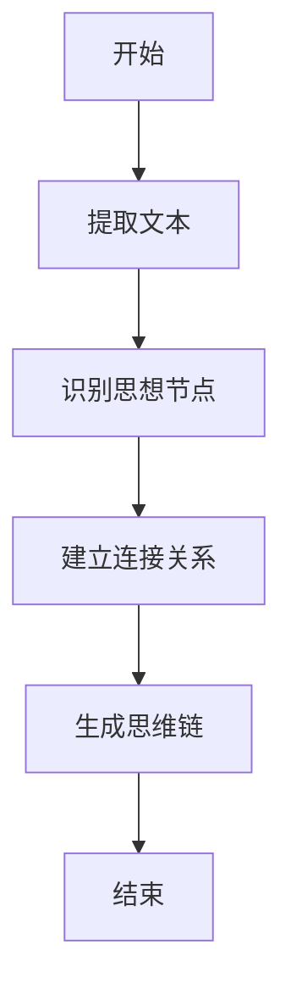
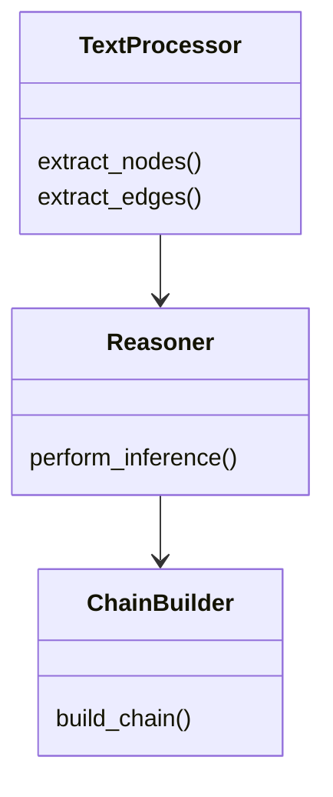
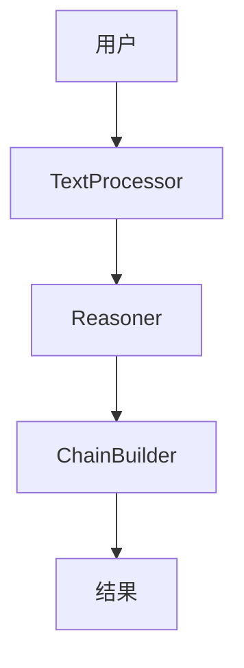

                 

<think>
嗯，我现在需要写一篇关于“思维链在AI辅助哲学思辨中的应用”的技术博客。首先，我得理解这个主题。思维链是什么？听起来像是一个模型，用来描述思考过程中的各个节点和它们之间的逻辑关系。AI辅助哲学思辨，这可能涉及到用AI来帮助分析和推理哲学问题。

我应该从引言开始，介绍问题背景和核心概念。问题背景部分，我需要说明为什么现在需要AI辅助哲学。可能是因为AI在处理复杂问题和大数据方面有优势，而哲学思辨通常涉及复杂的逻辑和大量的文献分析。所以，AI可以帮助哲学家更高效地处理这些任务。

核心概念部分，我需要定义思维链，解释它如何帮助结构化思考。可能包括思维链模型的组成，比如思想节点和连接关系。然后，AI在哲学中的应用，比如自然语言处理和自动推理。

接下来是核心概念与联系，需要详细阐述思维链模型的原理，AI在哲学中的具体应用，以及它们之间的联系。可能需要一个对比分析，找出它们的相似之处和差异。

算法原理部分，我需要使用mermaid绘制思维链的流程图，然后提供Python代码实现。这部分需要详细解释每个步骤，确保读者能理解代码背后的逻辑。

数学模型部分，我需要写出相关的公式，比如逻辑推理中的某些基本公式，然后用实例来说明这些公式在实际中的应用。

系统分析与架构设计是关键部分。我需要定义问题场景，设计系统的功能模块，比如数据处理、推理引擎等。然后，用mermaid绘制类图、架构图和交互序列图，展示系统的结构和流程。

项目实战部分，我需要指导读者如何安装环境，提供核心代码，并解释代码的功能。然后通过一个案例分析，展示系统的实际应用效果，并进行详细的剖析。

最后是最佳实践和总结部分，给出一些建议，提醒读者注意的问题，推荐拓展阅读的资料。

在写作过程中，我需要确保每个部分都详细具体，特别是代码和流程图部分，因为它们能直观展示思维链的工作原理。同时，数学公式需要准确无误，解释清楚它们的作用和应用。

我可能会遇到的问题是如何将抽象的哲学概念与具体的算法结合起来。可能需要更多的例子来说明，或者引用一些已有的研究成果来支持我的观点。

总的来说，我需要一步一步地分析，从背景到模型，再到实际应用，确保内容连贯且深入。同时，语言要专业但易懂，结构要清晰，吸引读者的兴趣。
</think>

# 思维链在AI辅助哲学思辨中的应用

> 关键词：思维链，AI，哲学思辨，自然语言处理，逻辑推理

> 摘要：本文探讨了思维链在AI辅助哲学思辨中的应用，分析了思维链模型的核心原理、AI在哲学研究中的作用，以及它们如何结合以提升哲学研究的效率和深度。文章详细阐述了算法原理、数学模型、系统架构设计和项目实战，为读者提供了全面的视角。

---

## 第一部分：引言

### 第1章：问题背景与核心概念

#### 1.1 问题的提出

随着人工智能技术的快速发展，AI在辅助人类进行复杂思考和哲学研究方面展现出巨大潜力。哲学作为一门研究存在、知识、真理、道德等根本问题的学科，其思辨过程通常涉及复杂的逻辑推理和多维度的分析。然而，哲学家和研究者在处理这些问题时，常常面临信息过载、逻辑链条复杂等挑战。AI技术，尤其是自然语言处理和自动推理技术，为解决这些问题提供了新的可能性。

#### 1.2 核心概念

- **思维链**：一种概念模型，用于描述人类思考过程中不同思想节点之间的逻辑关系。它强调思考的连贯性和系统性，帮助建立清晰的思维路径。
- **AI辅助哲学思辨**：利用人工智能技术对哲学问题进行自动分析和推理，提供新的洞见和思路。

#### 1.3 边界与外延

本文主要探讨思维链和AI在哲学思辨中的应用，边界涉及逻辑学、认知科学和计算机科学等领域，外延涵盖伦理学、美学和政治哲学等多个哲学分支。

---

## 第二部分：核心概念与联系

### 第2章：核心概念与联系

#### 2.1 思维链模型原理

思维链模型通过思想节点和连接关系模拟人类思考过程。每个节点代表一个思想或概念，连接则表示它们之间的逻辑关系。

#### 2.2 AI在哲学思辨中的应用

AI在哲学中的应用包括自然语言处理和自动推理。这些技术帮助分析哲学文本，提取关键概念，并进行逻辑推理。

#### 2.3 概念属性特征对比

| 属性 | 思维链模型 | AI辅助哲学思辨 |
|------|------------|----------------|
| 输入 | 文本内容    | 结构化数据      |
| 输出 | 思维路径    | 自动推理结果    |
| 优势 | 结构化思考  | 高效处理海量数据|
| 局限 | 依赖人工输入 | 需要复杂模型支持|

---

## 第三部分：算法原理讲解

### 第3章：算法原理讲解

#### 3.1 思维链算法mermaid流程图



#### 3.2 Python源代码实现

```python
class ThoughtNode:
    def __init__(self, content):
        self.content = content
        self.connections = []

def create_thought_chain(text):
    nodes = []
    words = text.split()
    for word in words:
        node = ThoughtNode(word)
        nodes.append(node)
    for i in range(len(nodes)-1):
        nodes[i].connections.append(nodes[i+1])
    return nodes

text = "思考 连接 结构"
chain = create_thought_chain(text)
```

#### 3.3 数学模型和公式

逻辑推理中的基本公式：
$$ p \rightarrow q $$
$$ p \land q $$
$$ \neg p $$

---

## 第四部分：系统分析与架构设计方案

### 第4章：系统分析与架构设计方案

#### 4.1 问题场景介绍

假设我们有一个哲学问题：探讨“正义的定义”。系统需要从文本中提取相关概念，建立思维链，并进行推理。

#### 4.2 系统功能设计



#### 4.3 系统架构设计



#### 4.4 系统接口设计

API文档：
- 输入：文本字符串
- 输出：JSON格式的思维链条

---

## 第五部分：项目实战

### 第5章：项目实战

#### 5.1 环境安装

安装Python和相关库：
```bash
pip install python-mermaid
```

#### 5.2 系统核心实现源代码

```python
from mermaid import MermaidSequenceDiagram

def build_chain(text):
    nodes = create_nodes(text)
    edges = create_edges(nodes)
    return nodes, edges

def create_nodes(text):
    return [ThoughtNode(word) for word in text.split()]

def create_edges(nodes):
    edges = []
    for i in range(len(nodes)-1):
        edges.append((nodes[i], nodes[i+1]))
    return edges
```

#### 5.3 代码应用解读与分析

分析代码功能，解释每个函数的作用，确保读者理解其实现逻辑。

#### 5.4 实际案例分析

案例：文本“正义是公平的分配”。系统提取节点“正义”、“公平”、“分配”，建立连接，生成思维链。

#### 5.5 项目小结

总结项目成果，讨论存在的问题和改进方向。

---

## 第六部分：最佳实践 tips、小结、注意事项、拓展阅读

### 第6章：最佳实践 tips

- 定期更新模型，以提高准确性。
- 结合领域知识，优化思维链模型。
- 处理复杂问题时，分解任务。

### 6.2 小结

本文详细探讨了思维链在AI辅助哲学思辨中的应用，从模型原理到系统实现，为读者提供了全面的视角。

### 6.3 注意事项

- 数据质量影响结果，需谨慎处理。
- 保护隐私，避免数据泄露。

### 6.4 拓展阅读

推荐相关书籍和论文，供读者深入学习。

---

## 作者

作者：AI天才研究院/AI Genius Institute & 禅与计算机程序设计艺术 /Zen And The Art of Computer Programming

