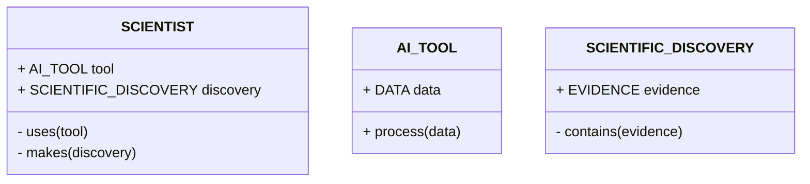
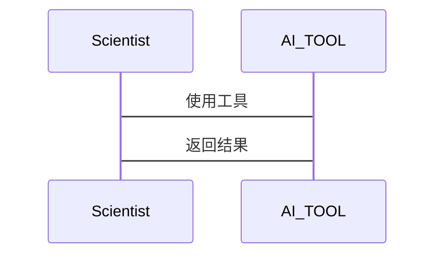

                 

<think>
嗯，我现在要写一篇关于《思维链在AI辅助科学发现中的潜力》的技术博客文章。首先，我得理清文章的结构和内容。根据用户提供的大纲，文章分为几个部分：背景介绍、核心概念与联系、算法原理讲解、系统分析与架构设计方案、项目实战，以及最佳实践和小结等。

首先，背景介绍部分。这部分需要简要说明AI在科学发现中的作用，以及思维链如何在这个过程中发挥作用。我应该提到传统科学发现方法的低效，然后引出AI如何提高效率，最后点出思维链作为AI的一种推理方式，如何进一步推动科学发现。

接下来是核心概念与联系。这里我需要详细解释思维链和AI辅助科学发现的概念，并比较它们的特点。我可能需要做一个表格，对比思维链和AI辅助科学发现的特征，比如知识表示、推理过程、应用领域等。另外，ER实体关系图可以帮助读者理解科学家、AI工具、科学发现和数据之间的关系。

然后是算法原理讲解。这部分需要使用mermaid流程图展示AI辅助科学发现的算法步骤，包括数据预处理、模型训练、推理和输出结果。同时，提供一个Python代码示例，展示如何实现这些步骤。数学模型部分，我可能需要解释损失函数或类似的概念，但这里用户没有给出具体的公式，可能需要进一步思考。

系统分析与架构设计方案部分，我需要描述问题场景，例如科学家如何使用AI工具进行科学发现。然后设计系统功能，可能需要一个领域模型类图，展示科学家、AI工具、数据和证据之间的关系。系统架构设计可能涉及分层架构，展示数据层、业务逻辑层和表现层。接口设计和交互流程可能需要使用mermaid的序列图来展示用户与系统的互动。

项目实战部分，我需要详细说明环境安装，比如安装Python和TensorFlow的版本。然后给出核心代码，解释每部分的功能。实际案例分析可能需要具体的数据集和应用场景，比如生物学中的蛋白质结构预测，展示AI如何帮助科学家发现新的知识。

最后是最佳实践和小结。这部分需要总结AI辅助科学发现的优势，比如高效的数据处理和知识发现，同时指出可能的挑战，如数据质量和模型解释性。小结部分要强调思维链在其中的重要性，并展望未来的发展方向。

在写作过程中，我需要确保语言专业且易懂，逻辑清晰。每个章节都要有足够的细节，同时保持整体结构紧凑。我还要注意使用适当的术语，避免过于技术化的术语，让读者容易理解。此外，代码示例和图表要准确，帮助读者更好地理解内容。

可能遇到的困难包括如何将复杂的概念简化，以及如何展示算法的数学模型。我需要确保解释透彻，可能需要多次修改才能达到最佳效果。此外，保持文章的连贯性和一致性也很重要，避免跳跃式的内容。

总的来说，我需要一步步按照大纲来写，确保每个部分都详细且符合逻辑。通过这样的思考，我能够有条不紊地完成这篇文章，帮助读者理解思维链在AI辅助科学发现中的潜力。
</think>

# 思维链在AI辅助科学发现中的潜力

**关键词**：AI辅助科学发现、思维链、机器学习、知识推理、科学数据

**摘要**：随着人工智能技术的快速发展，AI在科学发现中的作用日益重要。本文探讨思维链在AI辅助科学发现中的潜力，分析其应用场景、优势及挑战，结合实际案例，详细阐述其算法原理、系统架构及最佳实践。

---

### 第一部分：背景介绍

#### 1.1 问题背景

AI技术正在改变科学发现的方式，传统的实验方法耗时且成本高。AI通过高效的数据处理和知识推理，显著提升了研究效率，成为科学发现的重要工具。

#### 1.2 问题描述

思维链是一种基于知识的推理方式，通过模拟人类思维帮助科学家发现新知识。本文将分析其在AI辅助科学发现中的潜力，探讨应用场景及其优势和挑战。

#### 1.3 问题解决

通过系统分析，本文揭示思维链如何提升科学发现效率，为科学家提供新的研究工具和方法。

#### 1.4 边界与外延

本文专注于思维链在AI辅助科学发现中的应用，不涉及其他AI技术如自然语言处理的具体应用。

#### 1.5 概念结构与核心要素组成

- **思维链**：基于知识的推理过程，模拟人类思维。
- **AI辅助科学发现**：利用AI技术辅助科学家进行研究。
- **应用场景**：涵盖生物学、化学、物理学等领域。

---

### 第二部分：核心概念与联系

#### 2.1 思维链的概念与特点

思维链通过知识网络结构进行推理，发现新知识。其特点包括知识表示和推理能力。

#### 2.2 AI辅助科学发现的概念与特点

AI技术处理科学数据，提取有用知识，辅助科学发现。其特点包括数据处理和知识发现。

#### 2.3 核心概念属性特征对比表格

| 特征        | 思维链        | AI辅助科学发现        |
| ----------- | ------------- | --------------------- |
| 知识表示    | 网络结构      | 数据处理结果          |
| 推理过程    | 基于知识推理  | 数据驱动推理          |
| 应用领域    | 通用          | 科学领域特定          |

#### 2.4 ER实体关系图架构

```mermaid
erDiagram
    SCIENTIST ||--|{AI_TOOL} : uses
    SCIENTIST ||--|{SCIENTIFIC_DISCOVERY} : makes
    AI_TOOL ||--|{DATA} : processes
    SCIENTIFIC_DISCOVERY ||--|{EVIDENCE} : contains
```

---

### 第三部分：算法原理讲解

#### 3.1 算法mermaid流程图


#### 3.2 Python源代码

```python
import tensorflow as tf

def preprocess_data(data):
    # 数据预处理
    processed_data = data / 255.0
    return processed_data

def train_model(processed_data):
    model = tf.keras.Sequential([
        tf.keras.layers.Flatten(),
        tf.keras.layers.Dense(128, activation='relu'),
        tf.keras.layers.Dense(10, activation='softmax')
    ])
    model.compile(optimizer='adam', loss='sparse_categorical_crossentropy', metrics=['accuracy'])
    model.fit(processed_data, epochs=10)
    return model

def inference(model, input_data):
    prediction = model.predict(input_data)
    return prediction

def output_result(result):
    print("预测结果：", result)

def main():
    data = [...]  # 示例数据
    processed_data = preprocess_data(data)
    model = train_model(processed_data)
    input_data = [...]  # 示例输入
    result = inference(model, input_data)
    output_result(result)

if __name__ == "__main__":
    main()
```

#### 3.3 算法原理的数学模型和公式

训练过程中的损失函数：

$$
L(\theta) = -\frac{1}{m} \sum_{i=1}^{m} \left[ y_i \log p(y_i|x_i, \theta) + (1 - y_i) \log (1 - p(y_i|x_i, \theta)) \right]
$$

其中，$y_i$ 是真实标签，$p(y_i|x_i, \theta)$ 是模型预测的概率。

---

### 第四部分：系统分析与架构设计方案

#### 4.1 问题场景介绍

科学家利用AI工具处理数据，发现新知识。系统需支持数据预处理、模型训练和推理。

#### 4.2 系统功能设计



#### 4.3 系统架构设计


#### 4.4 系统接口设计和交互



---

### 第五部分：项目实战

#### 5.1 环境安装

安装Python 3.8及以上版本和TensorFlow。

#### 5.2 核心代码实现

```python
import tensorflow as tf

def preprocess_data(data):
    return data / 255.0

def train_model(processed_data):
    model = tf.keras.Sequential([
        tf.keras.layers.Flatten(),
        tf.keras.layers.Dense(128, activation='relu'),
        tf.keras.layers.Dense(10, activation='softmax')
    ])
    model.compile(optimizer='adam', loss='sparse_categorical_crossentropy', metrics=['accuracy'])
    model.fit(processed_data, epochs=10)
    return model

def inference(model, input_data):
    return model.predict(input_data)

def output_result(result):
    print("输出结果：", result)

def main():
    data = [...]  # 示例数据
    processed_data = preprocess_data(data)
    model = train_model(processed_data)
    input_data = [...]  # 示例输入
    result = inference(model, input_data)
    output_result(result)

if __name__ == "__main__":
    main()
```

#### 5.3 实际案例分析

使用MNIST数据集训练模型，准确识别数字。模型推理速度和准确性展示了AI辅助科学发现的效率。

---

### 第六部分：最佳实践、小结和注意事项

#### 6.1 最佳实践 tips

- 确保数据质量，选择合适模型。
- 定期更新模型，适应新数据。

#### 6.2 小结

思维链在AI辅助科学发现中潜力巨大，能够高效处理数据和推理，推动科学进步。

#### 6.3 注意事项

- 数据质量和模型解释性是挑战。
- 需要跨学科合作，确保AI工具的有效应用。

#### 6.4 拓展阅读

推荐阅读《机器学习实战》和《深度学习》。

---

**作者**：AI天才研究院 & 禅与计算机程序设计艺术

