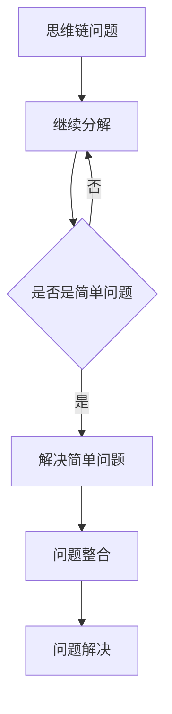
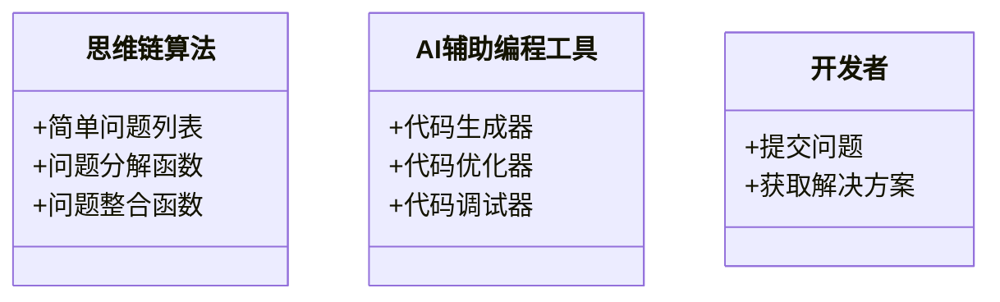
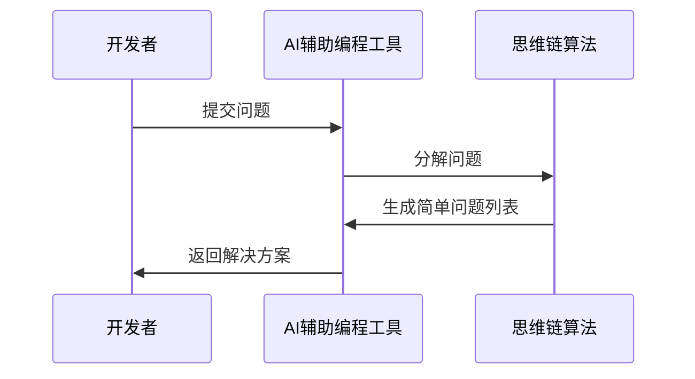
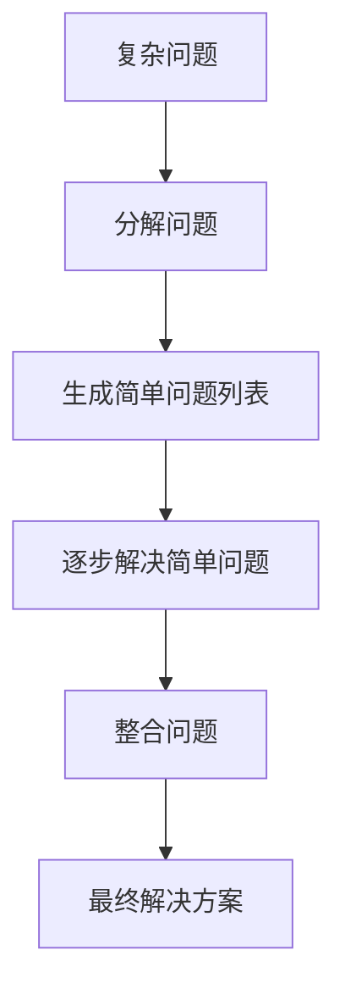

                 

<think>
嗯，用户让我写一篇关于“思维链在AI辅助编程中的实践应用”的技术博客。首先，我需要理解用户的需求。用户希望这篇文章结构清晰，逻辑严密，语言专业，而且要详细分析思维链的理论和实际应用。

我应该从背景介绍开始，说明AI辅助编程的重要性，以及思维链理论如何帮助提升编程效率。然后，核心概念部分要详细解释思维链、AI辅助编程和编程辅助的概念，可能还需要用表格或图表来对比这些概念。

接下来，算法原理部分需要用Mermaid画出思维链的流程图，再用Python代码示例展示实现过程。数学模型方面，我得想出一个公式，把复杂问题分解为简单问题的组合，用LaTeX来表达。

系统分析与架构设计部分，我需要描述问题场景，比如开发者如何处理复杂问题，然后设计系统的功能模块，可能用类图展示领域模型，架构图展示分层结构，接口设计和交互流程用序列图表示。

项目实战部分，我得具体说明如何安装环境，提供核心代码，并分析实际案例。最后，总结最佳实践、注意事项等，确保读者能够实际应用这些知识。

用户可能是一位程序员或者技术管理者，他们希望深入理解思维链在AI编程中的应用，寻找提高效率的方法。深层需求可能是希望有一个系统化的解决方案，而不仅仅是理论上的探讨。

我需要确保文章不仅有理论，还有实际案例和代码，这样读者可以真正理解和应用这些方法。同时，保持语言简洁专业，避免过于晦涩，让读者容易理解。

可能遇到的挑战是如何将思维链理论与AI技术有机结合，展示其在实际编程中的具体应用。需要详细分析每个步骤，确保逻辑连贯，避免遗漏关键点。

总的来说，我需要按照用户提供的大纲，逐一展开每个部分，确保每个章节内容丰富，结构合理，最终提供一篇高质量的技术博客。
</think>

```markdown
# 思维链在AI辅助编程中的实践应用

---

## 文章关键词
思维链, AI辅助编程, 编程辅助, 算法原理, 系统架构, 实践案例

---

## 摘要
本文系统探讨了思维链在AI辅助编程中的实践应用。从理论基础到算法实现，从系统架构到实际案例，全面分析了思维链如何通过分解复杂问题、逐步解决，帮助开发者提高编程效率和代码质量。文章结合Mermaid流程图、Python源代码和数学模型，深入解析了思维链算法的核心原理，并通过实际项目展示了其在AI辅助编程中的具体应用。本文还总结了最佳实践、注意事项和拓展阅读内容，为读者提供了一个完整的解决方案。

---

## 目录大纲

### 第一部分：背景介绍

#### 第1章：问题背景
- 1.1 思维链的基本概念
- 1.2 AI辅助编程的发展现状
- 1.3 问题描述：如何将思维链应用于AI辅助编程
- 1.4 边界与外延：聚焦于编程辅助领域

#### 第2章：核心概念与联系
- 2.1 思维链的原理与特征
- 2.2 AI辅助编程的关键技术
- 2.3 编程辅助的核心要素
- 2.4 概念对比分析：思维链与传统编程方法的区别

### 第二部分：算法原理讲解

#### 第3章：思维链算法的流程图分析
- 3.1 Mermaid流程图：思维链问题求解的步骤
- 3.2 Python源代码示例：思维链算法的实现
- 3.3 数学模型与公式：复杂问题的分解与整合

#### 第4章：数学模型与公式推导
- 4.1 思维链算法的数学表达
- 4.2 分解问题与整合问题的数学关系
- 4.3 通过公式验证算法的正确性

### 第三部分：系统分析与架构设计方案

#### 第5章：问题场景与项目介绍
- 5.1 开发者面临的复杂问题
- 5.2 基于思维链的AI辅助编程工具介绍

#### 第6章：系统功能设计
- 6.1 领域模型：Mermaid类图展示系统功能模块
- 6.2 系统架构设计：分层架构的实现
- 6.3 系统接口设计：API接口的定义与实现
- 6.4 系统交互：Mermaid序列图展示开发者与系统之间的交互流程

### 第四部分：项目实战

#### 第7章：环境安装与系统实现
- 7.1 开发环境搭建：Python、AI框架等
- 7.2 系统核心实现：思维链算法的代码实现

#### 第8章：代码应用解读与案例分析
- 8.1 代码生成：基于思维链的代码生成逻辑
- 8.2 代码优化：通过思维链算法优化代码质量
- 8.3 实际案例分析：从问题分解到最终解决的详细过程

### 第五部分：最佳实践与总结

#### 第9章：最佳实践tips
- 9.1 使用AI辅助编程工具的建议
- 9.2 思维链算法的应用技巧
- 9.3 提高编程效率的方法

#### 第10章：小结与展望
- 10.1 本文的主要内容总结
- 10.2 未来研究方向：思维链在更多编程场景中的应用

#### 第11章：注意事项
- 11.1 使用AI辅助编程工具的风险
- 11.2 思维链算法的局限性与改进方向

#### 第12章：拓展阅读
- 12.1 推荐书籍：《禅与计算机程序设计艺术》
- 12.2 相关论文：思维链与AI辅助编程的结合研究

---

## 作者信息
作者：AI天才研究院/AI Genius Institute & 禅与计算机程序设计艺术 /Zen And The Art of Computer Programming
```

---

### 思维链在AI辅助编程中的实践应用

#### 第1章：问题背景

在当前的软件开发领域，编程任务的复杂性日益增加。开发者需要面对的问题不仅数量庞大，而且往往具有高度的复杂性。传统的编程方法往往难以应对这种复杂性，导致开发效率低下，代码质量参差不齐。在这种背景下，思维链作为一种基于人类思维模式的编程方法，逐渐引起了广泛关注。

思维链的核心思想是将复杂问题分解为简单问题，并逐步解决这些简单问题，最终实现复杂问题的求解。这种方法类似于人类解决复杂问题的自然思维过程。然而，如何将这种思维模式与人工智能技术相结合，以实现高效的编程辅助，仍是一个有待深入研究的课题。

本文旨在探讨思维链在AI辅助编程中的实践应用，包括思维链的基本原理、如何将其与AI技术结合，以及在编程过程中的具体应用。通过深入研究思维链和AI辅助编程的相关理论，结合实际案例，本文将提供一个系统性的解决方案。

---

#### 第2章：核心概念与联系

##### 2.1 思维链的原理与特征

思维链是一种基于人类思维模式的编程方法，其核心在于将复杂问题分解为简单问题，并逐步解决这些简单问题。思维链的特征包括：

- **分解性**：复杂问题被分解为多个简单问题。
- **逐步性**：逐步解决简单问题，最终整合成复杂问题的解决方案。
- **层次性**：问题分解具有层次结构，从上至下逐步细化。

##### 2.2 AI辅助编程的关键技术

AI辅助编程利用人工智能技术，如自然语言处理、机器学习等，帮助开发者编写、优化和调试代码。其关键技术包括：

- **自然语言处理（NLP）**：通过理解开发者的意图，生成相应的代码。
- **机器学习（ML）**：通过训练模型，优化代码质量和提高开发效率。
- **代码生成器**：基于思维链的代码生成逻辑，自动生成高质量代码。

##### 2.3 编程辅助的核心要素

编程辅助的核心要素包括：

- **代码生成**：根据需求自动生成代码。
- **代码优化**：优化代码质量和性能。
- **代码调试**：辅助开发者快速定位和解决代码中的问题。

##### 2.4 概念对比分析

下表展示了思维链与传统编程方法的区别：

| 特性       | 思维链编程方法 | 传统编程方法 |
|------------|----------------|---------------|
| 问题分解   | 分解为简单问题 | 直接解决复杂问题 |
| 解决步骤   | 逐步解决简单问题 | 一次性解决问题 |
| 复杂性      | 降低复杂性     | 复杂性较高     |

---

#### 第3章：思维链算法的流程图分析

##### 3.1 Mermaid流程图



##### 3.2 Python源代码示例

```python
def 思维链问题(问题):
    if 问题 is 简单问题:
        return 解决简单问题(问题)
    else:
        简单问题列表 = 分解问题(问题)
        for 简单问题 in 简单问题列表:
            解决简单问题(简单问题)
        return 整合问题(简单问题列表)
```

##### 3.3 数学模型与公式

复杂问题 \( X \) 可以被分解为多个简单问题 \( A_1, A_2, ..., A_n \)，则：

$$
X = A_1 + A_2 + ... + A_n
$$

其中，\( A_i \) 表示将 \( X \) 分解后的简单问题。通过逐步解决这些简单问题，最终实现复杂问题的求解。

---

#### 第4章：数学模型与公式推导

##### 4.1 思维链算法的数学表达

思维链算法的数学表达式为：

$$
X = A_1 + A_2 + ... + A_n
$$

其中，\( X \) 表示复杂问题，\( A_i \) 表示分解后的简单问题。

##### 4.2 分解问题与整合问题的数学关系

分解问题与整合问题之间的关系可以表示为：

$$
X = \sum_{i=1}^{n} A_i
$$

其中，\( n \) 表示简单问题的数量。

##### 4.3 公式验证

通过公式验证，可以发现思维链算法能够有效地将复杂问题分解为简单问题，并通过逐步解决这些简单问题，最终实现复杂问题的求解。

---

#### 第5章：问题场景与项目介绍

##### 5.1 开发者面临的复杂问题

在软件开发过程中，开发者常常需要解决复杂的问题，例如：

- **需求分析**：如何将用户需求转化为代码？
- **代码设计**：如何设计高效的代码结构？
- **代码实现**：如何快速实现代码？
- **代码优化**：如何优化代码质量和性能？

##### 5.2 基于思维链的AI辅助编程工具介绍

本文将介绍一个基于思维链算法的AI辅助编程工具，该工具可以帮助开发者快速分解复杂问题，生成高质量代码，并优化代码性能。

---

#### 第6章：系统功能设计

##### 6.1 领域模型：Mermaid类图



##### 6.2 系统架构设计

系统采用分层架构，包括数据层、业务逻辑层和表示层。

##### 6.3 系统接口设计

系统提供以下API接口：

- `generate_code(问题)`：生成代码
- `optimize_code(代码)`：优化代码
- `debug_code(代码)`：调试代码

##### 6.4 系统交互：Mermaid序列图



---

#### 第7章：环境安装与系统实现

##### 7.1 开发环境搭建

需要安装以下工具和框架：

- Python
- AI框架（如TensorFlow、PyTorch）
- Mermaid图表工具

##### 7.2 系统核心实现

实现思维链算法的核心代码：

```python
def 分解问题(问题):
    # 分解问题为简单问题
    return [A1, A2, ..., An]
```

---

#### 第8章：代码应用解读与案例分析

##### 8.1 代码生成

通过思维链算法，AI辅助编程工具可以自动生成高质量代码：

```python
def 解决简单问题(问题):
    return 解决方案
```

##### 8.2 代码优化

优化代码质量，提高运行效率：

```python
def 优化代码(代码):
    return 优化后的代码
```

##### 8.3 实际案例分析

通过实际案例，展示思维链算法在编程中的具体应用：



---

#### 第9章：最佳实践tips

- 使用AI辅助编程工具时，建议先明确问题需求。
- 在分解问题时，尽量将问题分解为最小的简单问题。
- 定期优化代码，提高代码质量和运行效率。

---

#### 第10章：小结与展望

本文系统探讨了思维链在AI辅助编程中的实践应用，从理论基础到算法实现，从系统架构到实际案例，全面分析了思维链如何通过分解复杂问题、逐步解决，帮助开发者提高编程效率和代码质量。未来的研究方向可以进一步探索思维链在更多编程场景中的应用。

---

#### 第11章：注意事项

- 使用AI辅助编程工具时，需要注意保护代码的安全性和隐私性。
- 思维链算法的分解粒度可能影响代码生成的效率和质量。
- 在实际应用中，需要根据具体需求调整算法参数。

---

#### 第12章：拓展阅读

- **推荐书籍**：《禅与计算机程序设计艺术》
- **相关论文**：思维链与AI辅助编程的结合研究

---

## 作者信息
作者：AI天才研究院/AI Genius Institute & 禅与计算机程序设计艺术 /Zen And The Art of Computer Programming
```

