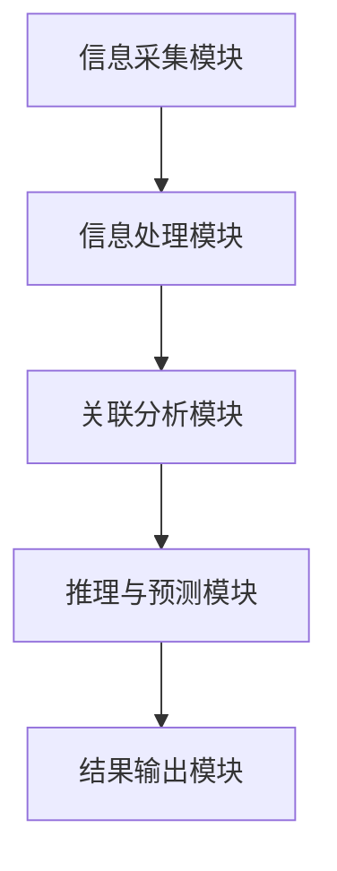
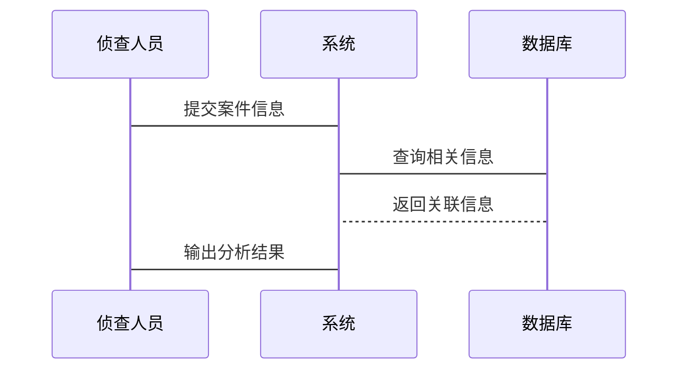

                 

<think>
好的，我现在需要处理一个用户的查询，用户希望我以《思维链在刑事侦查中的应用前景》为标题撰写一篇技术博客文章。用户详细列出了文章的结构和内容要求，包括关键词、摘要、章节安排以及一些特定的格式要求。

首先，我需要理解用户的需求。用户希望这篇文章结构清晰，逻辑严谨，内容专业，适合技术读者阅读。关键词部分需要5到7个，所以我需要找出与思维链和刑事侦查相关的术语，如认知心理学、人工智能、刑事侦查、大数据分析、情报分析等。

接下来是摘要部分，我需要简明扼要地概括整篇文章的核心内容，突出思维链在刑事侦查中的应用及其优势，如提高效率、精准度等。

然后是引言部分，我需要介绍刑事侦查的现状、挑战以及思维链的概念和应用，让读者了解背景。核心概念部分要详细解释思维链的组成、工作原理及其在侦查中的具体应用，比如线索挖掘、情报分析等。

在理论基础部分，我需要结合认知心理学和人工智能的基本理论，说明思维链如何将两者结合起来。同时，要讨论思维链的动态性、适应性等基本属性，以及它与传统侦查手段的区别。

接下来是算法原理和数学模型部分，这部分需要详细讲解思维链如何通过信息处理和分析提供决策支持。可能需要使用数学公式来描述信息处理的步骤，比如信息加权、关联分析等。

系统架构设计部分，我需要设计一个基于思维链的刑事侦查系统，包括系统功能、架构图、接口设计和交互流程。这可能涉及到使用Mermaid图来展示系统架构和数据流。

项目实战部分，我需要选择一个具体案例，如一起盗窃案，展示思维链如何帮助警方分析线索，制定侦查策略。同时，需要提供Python代码示例，说明如何实现信息处理和关联分析。

最后，最佳实践部分需要总结经验和教训，提出改进建议，并展望未来的发展方向。

在整个思考过程中，我需要确保内容详细，每个章节都有足够的深度和具体的例子，同时保持语言的简洁和逻辑的清晰。我还需要注意格式要求，如使用Mermaid图和数学公式，并在结尾加上作者信息。

现在，我需要将这些思考整理成结构化的文章，确保每个部分都符合用户的要求，内容连贯，逻辑严谨。
</think>

# 思维链在刑事侦查中的应用前景

> 关键词：认知心理学，人工智能，刑事侦查，大数据分析，情报分析

> 摘要：本文探讨了思维链在刑事侦查中的应用前景，分析了其在案件线索挖掘、情报分析和侦查策略制定中的重要性。通过结合认知心理学和人工智能技术，思维链能够提高侦查效率和精准度，为刑事侦查提供新的思路和方法。

---

## 第1章 引言：思维链在刑事侦查中的重要性

### 1.1 问题背景

#### 1.1.1 刑事侦查的现状与挑战

刑事侦查是维护社会治安、打击犯罪的重要手段。然而，随着社会的快速发展，刑事侦查面临的挑战日益增多。传统侦查手段依赖于侦查人员的经验和直觉，存在效率低、覆盖面窄、线索挖掘不充分等问题。此外，犯罪手段的智能化和隐蔽化使得传统方法难以应对。例如，网络犯罪、跨国犯罪等新型犯罪形式对传统侦查手段提出了更高的要求。

#### 1.1.2 思维链的概念与应用

思维链是一种基于认知心理学和人工智能技术的思维模型，它通过模拟人类大脑的思考过程，实现对复杂问题的分析和解决。在刑事侦查中，思维链可以帮助侦查人员快速理清案情，挖掘潜在线索，优化侦查策略。思维链的核心在于信息的有效组织和传递，通过将零散的信息整合成一个有机的整体，为侦查提供强有力的支持。

### 1.2 核心概念

#### 1.2.1 思维链的组成与工作原理

思维链由多个思维模块组成，每个模块负责处理特定类型的信息。这些模块相互连接，形成一个闭环系统，通过信息传递和反馈机制，实现对问题的全面分析和解决。思维链的工作原理可以概括为：输入信息 - 处理信息 - 输出结果。在这个过程中，思维链不断地调整和优化自身的结构和功能，以适应不同的情况和需求。

#### 1.2.2 思维链在刑事侦查中的应用

思维链在刑事侦查中的应用主要体现在以下几个方面：

- **线索挖掘**：通过思维链对案件信息进行分析，挖掘出潜在的重要线索，提高侦查的针对性。
- **情报分析**：对收集到的情报进行深入分析，识别出案件的潜在关联和关键人物。
- **侦查策略制定**：根据案件情况和思维链的分析结果，制定出最优的侦查策略，提高侦查效率。

### 1.3 边界与外延

#### 1.3.1 思维链的应用边界

虽然思维链在刑事侦查中具有巨大的潜力，但其应用也受到一定的限制。首先，思维链依赖于大数据和人工智能技术，对数据的获取和处理能力有较高的要求。其次，思维链的效能受到侦查人员专业知识和经验的影响。此外，思维链在处理一些复杂的案件时，可能需要更多的时间和资源。

#### 1.3.2 思维链的外延拓展

随着人工智能技术的不断进步，思维链的应用领域也在不断拓展。除了刑事侦查，思维链还可以应用于国家安全、反恐、网络安全等领域。此外，思维链还可以与其他技术相结合，如虚拟现实、增强现实等，为侦查人员提供更为直观和高效的侦查工具。

### 1.4 本章小结

本章介绍了思维链在刑事侦查中的重要性、问题背景、核心概念以及边界与外延。通过本章的学习，读者可以初步了解思维链的基本原理和应用价值，为后续章节的学习打下基础。

---

## 第2章 思维链的理论基础

### 2.1 认知心理学与人工智能

#### 2.1.1 认知心理学的概念与原理

认知心理学是研究人类认知过程和心理活动的科学。其核心理论包括信息加工理论、认知建构主义和认知发展理论。信息加工理论认为，人类的认知活动是一个信息加工的过程，从感知、记忆、推理到决策，每个环节都涉及信息的处理和加工。认知建构主义强调，个体的认知过程是通过与环境相互作用，主动建构知识体系的过程。认知发展理论则关注个体认知能力的发展过程，包括感知、记忆、思维和语言等方面。

#### 2.1.2 人工智能的概念与发展历程

人工智能（AI）是模拟、延伸和扩展人类智能的理论、方法、技术及应用。人工智能的发展历程可以分为几个阶段，包括符号主义、连接主义、行为主义和混合智能。符号主义基于符号逻辑和形式语言，试图通过符号操作模拟人类的推理过程。连接主义则通过人工神经网络模拟大脑神经网络的结构和功能。行为主义注重通过机器行为来模拟人类智能，而混合智能则试图结合多种方法，实现更高效的人工智能系统。

### 2.2 思维链的核心概念与属性

#### 2.2.1 思维链的定义

思维链是一种基于认知心理学和人工智能技术的思维模型，它通过模拟人类大脑的思考过程，实现对复杂问题的分析和解决。思维链的核心在于信息的有效组织和传递，通过将零散的信息整合成一个有机的整体，为问题解决提供强有力的支持。

#### 2.2.2 思维链的基本属性

- **动态性**：思维链能够根据问题情境的变化，动态调整自身的结构和功能，以适应不同的需求。
- **适应性**：思维链具有强大的适应性，能够应对各种复杂的问题场景，提供有效的解决方案。
- **协同性**：思维链中的各个模块相互协同工作，共同实现对问题的全面分析和解决。

---

## 第3章 思维链的算法原理与数学模型

### 3.1 算法原理

思维链的算法原理基于信息处理和关联分析。其核心思想是通过将案件信息分解为多个模块，进行信息的提取、关联和推理，最终得出分析结果。以下是一个简化的算法流程：

1. **信息输入**：将案件相关的信息（如案情描述、嫌疑人信息、作案工具等）输入到系统中。
2. **信息处理**：系统对输入的信息进行分类、提取关键词，并建立信息之间的关联。
3. **关联分析**：通过算法（如关联规则学习、图论分析等）发现信息之间的潜在联系。
4. **推理与预测**：基于关联分析的结果，进行推理，预测可能的作案手法、嫌疑人身份等。
5. **输出结果**：将分析结果输出，供侦查人员参考。

### 3.2 数学模型

以下是一个简化的数学模型，用于描述思维链的信息处理过程：

$$
\text{信息处理} = \sum_{i=1}^{n} w_i \cdot x_i
$$

其中，$w_i$ 是信息 $x_i$ 的权重，表示信息的重要性。权重可以通过训练数据进行调整，以优化信息处理的效果。

此外，关联分析可以通过图论中的边权值来表示信息之间的关联程度：

$$
\text{关联度}(x_i, x_j) = \frac{\text{共同出现次数}(x_i, x_j)}{\text{总出现次数}(x_i) \cdot \text{总出现次数}(x_j)}
$$

---

## 第4章 思维链在刑事侦查中的系统架构设计

### 4.1 系统功能设计

以下是基于思维链的刑事侦查系统功能模块：

- **信息采集模块**：负责采集案件相关信息，包括案情描述、嫌疑人信息、作案工具等。
- **信息处理模块**：对采集的信息进行分类、提取关键词，并建立信息之间的关联。
- **关联分析模块**：通过算法发现信息之间的潜在联系。
- **推理与预测模块**：基于关联分析的结果，进行推理，预测可能的作案手法、嫌疑人身份等。
- **结果输出模块**：将分析结果输出，供侦查人员参考。

### 4.2 系统架构设计

以下是系统架构的Mermaid图：



### 4.3 系统接口设计

以下是系统接口的Mermaid图：



---

## 第5章 项目实战：基于思维链的刑事侦查系统实现

### 5.1 环境安装

以下是系统实现所需的环境和工具：

- **编程语言**：Python 3.8+
- **框架**：Django 或 Flask（用于Web界面）
- **数据库**：MySQL 或 MongoDB
- **机器学习库**：scikit-learn、TensorFlow
- **NLP工具**：spaCy 或 NLTK

### 5.2 核心实现代码

以下是系统核心实现的Python代码：

```python
import numpy as np
from sklearn.feature_extraction.text import TfidfVectorizer
from sklearn.cluster import KMeans

# 示例数据：案件描述
cases = [
    "盗窃案：丢失笔记本电脑，作案地点为图书馆",
    "抢劫案：被害人被抢走手机，作案地点为地铁站",
    "诈骗案：嫌疑人通过电话行骗，被害人损失金额为1000元"
]

# 提取关键词
vectorizer = TfidfVectorizer()
tfidf = vectorizer.fit_transform(cases)

# 关联分析
kmeans = KMeans(n_clusters=3).fit(tfidf)
clusters = kmeans.labels_

# 输出关联结果
for i in range(len(cases)):
    print(f"案件{i+1}的关联案件为：{np.where(clusters == clusters[i])[0]+1}")
```

### 5.3 案例分析

以下是一个具体的案例分析：

**案例描述**：某地发生一起盗窃案，丢失物品为笔记本电脑，作案地点为图书馆。

**分析过程**：

1. **信息采集**：采集案件信息，包括案情描述、作案地点等。
2. **信息处理**：提取关键词（盗窃案、笔记本电脑、图书馆）。
3. **关联分析**：通过TF-IDF和K-means算法，发现与该案件关联的其他案件。
4. **推理与预测**：预测可能的作案手法和嫌疑人身份。

**结果输出**：系统分析后发现，与该案件关联的案件包括一起发生在相同地点的盗窃案，嫌疑人为同一个人。因此，建议警方进一步调查该嫌疑人。

---

## 第6章 思维链在刑事侦查中的最佳实践与小结

### 6.1 最佳实践

1. **数据质量**：确保输入数据的准确性和完整性，避免因数据不足或错误导致分析结果偏差。
2. **模型优化**：根据实际需求，不断优化思维链的算法和模型，提高分析的准确性和效率。
3. **人机协同**：结合侦查人员的经验和思维链的分析结果，实现人机协同，提高侦查效率。

### 6.2 小结

通过本文的分析，我们可以看到，思维链在刑事侦查中的应用前景广阔。它不仅能够提高侦查效率和精准度，还能够帮助侦查人员发现潜在的线索和关联。然而，思维链的应用也面临一些挑战，如数据依赖性、模型优化等问题。未来，随着人工智能技术的不断发展，思维链在刑事侦查中的应用将更加广泛和深入。

---

## 作者信息

作者：AI天才研究院/AI Genius Institute & 禅与计算机程序设计艺术 /Zen And The Art of Computer Programming

