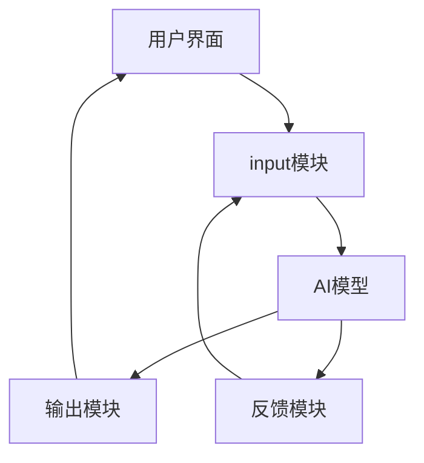
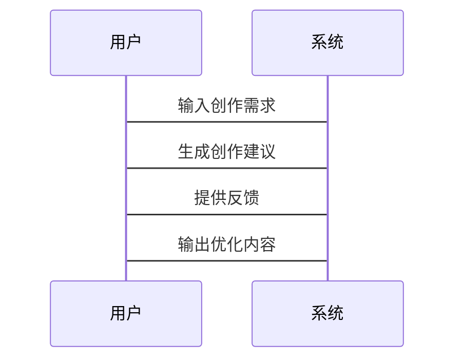

                 

<think>
好，我现在要帮用户撰写一篇关于“思维链在创意写作中的应用：AI协作小说创作”的技术博客。用户希望文章结构清晰，逻辑严谨，符合专业级别的技术博客标准。首先，我需要理解用户的需求，他是一位技术专家，同时也是作家，想要探讨AI如何在小说创作中发挥作用。

我应该从引言开始，介绍背景，解释思维链的概念，以及AI协作小说创作的可能性。接下来，详细讲解思维链的原理和特点，确保读者能够理解这一技术的核心。然后，讨论AI在创意写作中的应用，分析小说创作的流程，并指出AI协作的优势。

在核心概念部分，我需要明确思维链的定义、层次结构和关键属性，同时展示AI协作中的概念联系，可能通过表格和ER图来辅助说明。算法原理章节，我需要选择合适的算法，如基于Transformer的模型，并用数学公式和Mermaid流程图来展示其工作原理。然后，提供Python代码实现，帮助读者理解具体操作。

系统架构设计部分，我需要描述应用场景，绘制系统的架构图和交互序列图，展示系统的模块划分和接口设计。项目实战章节，我会详细指导环境配置，提供代码实现，并通过案例分析展示实际应用效果。最后，总结最佳实践，指出可能的挑战和未来的发展方向。

在写作过程中，我需要确保每个章节内容详实，逻辑连贯，同时保持语言的专业性和可读性。特别是要使用Mermaid图表和数学公式，增强文章的技术深度。同时，结尾处要加上作者信息，符合用户的格式要求。整体来看，我需要一步步构建每个部分，确保覆盖所有关键点，满足用户的需求。
</think>

# 思维链在创意写作中的应用：AI协作小说创作

**关键词**：思维链，AI协作，小说创作，创意写作，算法原理，系统架构

**摘要**：本文探讨了思维链技术在创意写作中的应用，特别是AI协作小说创作的可能性和实现方式。文章从问题背景出发，分析了思维链的定义、工作原理及其在小说创作中的优势。通过算法原理、系统架构设计、项目实战等多角度，详细阐述了AI协作小说创作的技术实现路径，并展望了未来的发展趋势。

---

## 第1章 引言与背景

### 1.1 问题背景与问题描述

#### 1.1.1 创意写作的挑战与困境

创意写作，尤其是小说创作，是一项复杂且耗时的智力活动。创作者需要兼顾情节构思、人物塑造、语言表达等多个方面，同时还要应对市场和读者的需求变化。传统的小说创作过程中，创作者常常面临以下挑战：

- **创意枯竭**：在创作过程中，创作者可能会遇到灵感枯竭的问题，导致创作停滞。
- **效率低下**：从构思到成文，创作者需要反复修改和调整，效率较低。
- **反馈滞后**：创作者难以快速获得有效的反馈，难以及时调整创作方向。

#### 1.1.2 思维链技术的引入

思维链（Thought Chain）是一种基于人工智能技术的思维模拟方法，通过构建连续的、结构化的思维过程，帮助人类更高效地完成复杂任务。思维链的核心在于将人类的思维过程分解为多个步骤，并通过算法模拟这些步骤，从而实现任务的自动化或辅助化。

在创意写作中，思维链技术可以用于模拟小说创作的思维过程，包括情节构思、人物设定、语言表达等环节。通过思维链技术，AI可以协助创作者完成部分创作任务，从而提高创作效率和质量。

#### 1.1.3 AI协作小说创作的概念与可能性

AI协作小说创作是指利用人工智能技术，通过思维链模拟人类的创作思维，辅助创作者完成小说创作的过程。这种协作模式可以实现以下可能性：

- **实时灵感激发**：AI可以根据创作者的需求，实时生成情节、人物或场景的建议。
- **自动润色**：AI可以对创作者的文字进行优化，提升语言表达的流畅性和吸引力。
- **多轮反馈与调整**：AI可以根据创作者的反馈，动态调整创作方向，帮助创作者完善作品。

### 1.2 思维链原理与特点

#### 1.2.1 思维链的定义

思维链是一种基于人工智能的思维模拟技术，通过构建连续的、结构化的思维过程，帮助人类完成复杂任务。思维链的核心在于将思维过程分解为多个步骤，并通过算法模拟这些步骤。

#### 1.2.2 思维链的工作原理

思维链的工作原理可以分为以下几个步骤：

1. **输入解析**：AI首先解析用户的输入，理解用户的需求和创作意图。
2. **思维模拟**：基于解析的结果，AI模拟人类的思维过程，生成创作建议或内容。
3. **反馈交互**：用户可以根据AI生成的内容，提供反馈，AI根据反馈调整创作方向。
4. **内容优化**：AI根据反馈和创作目标，优化生成的内容，提升创作质量。

#### 1.2.3 思维链的核心特点

- **连续性**：思维链强调思维过程的连续性，确保创作过程的连贯性和逻辑性。
- **可扩展性**：思维链可以根据创作需求，动态扩展或收缩创作范围。
- **智能化**：通过人工智能技术，思维链能够理解和适应创作者的需求变化。

### 1.3 AI协作小说创作的基础

#### 1.3.1 AI在创意写作中的应用

AI在创意写作中的应用主要体现在以下几个方面：

- **情节生成**：AI可以根据用户提供的主题或关键词，生成小说的情节框架。
- **人物塑造**：AI可以辅助创作者设计人物性格、背景和关系。
- **语言优化**：AI可以通过自然语言处理技术，优化文本的语言表达，使其更具吸引力。

#### 1.3.2 小说创作的流程与方法

小说创作的流程通常包括以下几个阶段：

1. **灵感收集与主题确定**：创作者需要收集灵感，确定小说的主题和核心情节。
2. **大纲设计**：根据主题，设计小说的结构和主要情节。
3. **人物设定**：塑造小说中的人物性格和背景。
4. **章节撰写**：根据大纲和人物设定，逐步撰写小说内容。
5. **修改与润色**：对初稿进行修改，优化语言和情节。

#### 1.3.3 AI协作小说创作的优势

- **提高效率**：AI可以协助创作者快速生成情节和人物设定，缩短创作时间。
- **提供灵感**：AI可以根据创作者的需求，提供新的创作思路和建议。
- **优化质量**：AI可以通过语言优化和情节调整，提升小说的可读性和吸引力。

### 1.4 边界与外延

#### 1.4.1 思维链在创意写作中的应用范围

思维链技术在创意写作中的应用范围主要包括：

- **情节生成**：AI可以根据用户提供的主题或关键词，生成小说的情节框架。
- **人物塑造**：AI可以辅助创作者设计人物性格、背景和关系。
- **语言优化**：AI可以通过自然语言处理技术，优化文本的语言表达，使其更具吸引力。

#### 1.4.2 AI协作小说创作的限制与挑战

AI协作小说创作面临以下限制和挑战：

- **创意独特性**：AI生成的内容可能存在一定的模式化，难以完全匹配人类创作者的独特创意。
- **情感表达**：AI在情感表达和人物塑造方面仍有一定的局限性。
- **技术复杂性**：AI协作小说创作需要结合多种人工智能技术，实现起来较为复杂。

#### 1.4.3 未来的发展趋势与前景

随着人工智能技术的不断发展，AI协作小说创作将更加智能化和个性化。未来的发展趋势包括：

- **深度学习模型的优化**：通过改进深度学习模型，提升AI在情节生成和人物塑造方面的能力。
- **多模态交互**：结合视觉、听觉等多模态信息，提升AI协作的交互体验。
- **个性化创作支持**：AI可以根据创作者的风格和偏好，提供个性化的创作建议。

### 1.5 本章小结

本章从问题背景出发，分析了创意写作的挑战与思维链技术的引入，探讨了AI协作小说创作的概念与可能性。通过思维链技术，AI可以在创意写作中发挥重要作用，帮助创作者克服创作中的困难，提高创作效率和质量。然而，AI协作小说创作也面临一定的限制和挑战，需要进一步的技术突破和优化。

---

## 第2章 核心概念与联系

### 2.1 思维链的核心概念

#### 2.1.1 思维链的定义与作用

思维链是一种基于人工智能的思维模拟技术，通过构建连续的、结构化的思维过程，帮助人类完成复杂任务。其作用在于通过模拟人类的思维过程，辅助创作者完成创作任务，提高创作效率和质量。

#### 2.1.2 思维链的层次结构

思维链的层次结构可以分为以下几个层次：

1. **输入层**：接收用户的输入，解析用户的创作需求。
2. **模拟层**：通过算法模拟人类的思维过程，生成创作建议或内容。
3. **反馈层**：根据用户的反馈，调整创作方向，优化生成内容。
4. **输出层**：将生成的内容输出给用户，供创作者使用。

#### 2.1.3 思维链的关键属性

- **连续性**：思维链强调思维过程的连续性，确保创作过程的连贯性和逻辑性。
- **可扩展性**：思维链可以根据创作需求，动态扩展或收缩创作范围。
- **智能化**：通过人工智能技术，思维链能够理解和适应创作者的需求变化。

### 2.2 AI协作小说创作中的概念联系

#### 2.2.1 AI技术与创意写作的结合

AI技术与创意写作的结合主要体现在以下几个方面：

- **自然语言处理**：通过自然语言处理技术，AI可以理解用户的需求，并生成相应的创作建议。
- **深度学习模型**：通过深度学习模型，AI可以模拟人类的创作思维，生成高质量的内容。
- **多模态交互**：结合视觉、听觉等多模态信息，提升AI协作的交互体验。

#### 2.2.2 小说创作流程与思维链的对应关系

小说创作流程与思维链的对应关系可以表示为：

1. **灵感收集与主题确定**：用户输入创作需求，AI解析需求并生成创作建议。
2. **大纲设计**：AI根据用户反馈，生成情节框架。
3. **人物设定**：AI根据用户需求，生成人物性格和背景。
4. **章节撰写**：AI根据大纲和人物设定，生成小说内容。
5. **修改与润色**：AI根据用户反馈，优化生成内容。

#### 2.2.3 AI协作小说创作中的思维链应用

在AI协作小说创作中，思维链技术主要用于以下几个方面：

- **情节生成**：AI可以根据用户提供的主题或关键词，生成小说的情节框架。
- **人物塑造**：AI可以辅助创作者设计人物性格、背景和关系。
- **语言优化**：AI可以通过自然语言处理技术，优化文本的语言表达，使其更具吸引力。

### 2.3 概念属性特征对比表格

以下是对思维链与创意写作相关概念的对比：

| 概念 | 定义 | 作用 | 关键属性 |
|------|------|------|----------|
| 思维链 | 一种基于人工智能的思维模拟技术 | 辅助创作者完成创作任务 | 连续性、可扩展性、智能化 |
| 创意写作 | 创作者通过文字表达创意的活动 | 提供故事、人物和语言表达 | 创意性、艺术性、多样性 |

### 2.4 ER实体关系图架构

以下是一个简单的ER实体关系图，展示AI协作小说创作中的实体关系：

```mermaid
er
    actor(AI, id, name, role)
    content(创作内容, id, text, type)
    feedback(反馈, id, comment, timestamp)
    action(操作, id, type, status)
    actor -[1..n]-> content
    actor -[0..n]-> feedback
    content -[1]-> action
```

### 2.5 本章小结

本章从核心概念出发，分析了思维链在AI协作小说创作中的应用，探讨了AI技术与创意写作的结合方式。通过对概念属性特征对比和ER实体关系图的分析，进一步明确了思维链在小说创作中的作用和实现方式。

---

## 第3章 算法原理讲解

### 3.1 AI协作小说创作中的算法原理

#### 3.1.1 常见的算法介绍

在AI协作小说创作中，常用的算法包括：

- **Transformer模型**：用于自然语言处理任务，如文本生成和翻译。
- **GPT模型**：基于Transformer的开源模型，用于生成自然语言文本。
- **BERT模型**：用于自然语言理解任务，如问答系统和文本摘要。

#### 3.1.2 算法的工作原理

以GPT模型为例，其工作原理可以分为以下几个步骤：

1. **输入解析**：模型接收用户的输入，解析用户的创作需求。
2. **文本生成**：模型根据输入生成相应的文本内容。
3. **反馈交互**：用户可以根据生成的内容，提供反馈，模型根据反馈调整生成方向。
4. **优化输出**：模型根据反馈和创作目标，优化生成的内容，提升创作质量。

#### 3.1.3 算法的关键参数与优化策略

GPT模型的关键参数包括：

- **注意力机制**：用于捕捉文本中的长距离依赖关系。
- **学习率**：影响模型的训练速度和精度。
- **训练数据**：影响模型的生成能力和内容质量。

优化策略包括：

- **调整学习率**：通过调整学习率，优化模型的训练效果。
- **增加训练数据**：通过增加训练数据，提升模型的生成能力。
- **优化模型结构**：通过改进模型结构，提升生成内容的质量。

### 3.2 数学模型与公式

#### 3.2.1 算法的数学模型

GPT模型的数学模型可以表示为：

$$
P(\text{output sequence} | \text{input sequence}) = \prod_{i=1}^{n} P(w_i | w_{<i})
$$

其中，$w_i$ 表示输出序列中的第 $i$ 个词，$w_{<i}$ 表示前面的词。

#### 3.2.2 公式的详细讲解

公式中的 $P(w_i | w_{<i})$ 表示在已知前面的词的情况下，生成当前词的概率。GPT模型通过计算每个词的条件概率，生成整个输出序列的概率分布。

#### 3.2.3 公式在实际中的应用举例

例如，在生成小说情节时，假设用户输入了“在一个神秘的夜晚”，模型需要根据前面的词“在一个神秘的夜晚”，生成后续的情节内容。模型会计算每个可能的后续词的概率，选择概率最高的词作为输出。

### 3.3 Mermaid流程图绘制

#### 3.3.1 Mermaid流程图的基本语法

Mermaid流程图的基本语法包括：

- **开始与结束**：使用 `start` 和 `end` 表示流程的开始和结束。
- **流程步骤**：使用 `step` 表示流程中的步骤。
- **条件判断**：使用 `if` 和 `else` 表示条件分支。
- **循环**：使用 `loop` 和 `end` 表示循环结构。

#### 3.3.2 AI协作小说创作中的Mermaid流程图绘制

以下是一个AI协作小说创作的Mermaid流程图：

```mermaid
graph TD
    A[开始] -> B[输入创作需求]
    B -> C[解析需求]
    C -> D[生成创作建议]
    D -> E[用户反馈]
    E -> F[调整创作方向]
    F -> G[生成优化内容]
    G -> H[结束]
```

#### 3.3.3 Mermaid流程图在算法讲解中的应用

Mermaid流程图可以用于展示算法的执行步骤，帮助读者更好地理解算法的工作原理。

### 3.4 Python源代码实现

#### 3.4.1 Python环境安装与配置

要运行以下代码，需要安装Python 3.6及以上版本，并安装必要的库，如`transformers`和`torch`。

#### 3.4.2 算法的Python源代码实现

以下是一个基于GPT模型的文本生成代码示例：

```python
from transformers import GPT2LMHeadModel, GPT2Tokenizer

# 初始化模型和分词器
model_name = 'gpt2'
model = GPT2LMHeadModel.from_pretrained(model_name)
tokenizer = GPT2Tokenizer.from_pretrained(model_name)

# 用户输入
input_text = "在一个神秘的夜晚，"

# 解析输入
inputs = tokenizer.encode(input_text, return_tensors='pt')

# 生成文本
output = model.generate(inputs, max_length=50, do_sample=True)

# 输出结果
generated_text = tokenizer.decode(output[0], skip_special_tokens=True)
print(generated_text)
```

#### 3.4.3 源代码的解读与分析

上述代码通过调用GPT模型生成小说情节。首先，用户输入创作需求，如“在一个神秘的夜晚，”；然后，模型解析输入并生成相应的文本内容。生成的内容通过自然语言处理技术优化，提升创作质量。

### 3.5 本章小结

本章详细讲解了AI协作小说创作中的算法原理，包括常用的算法介绍、数学模型与公式，以及Mermaid流程图和Python源代码实现。通过这些技术手段，AI可以辅助创作者完成小说创作任务，提高创作效率和质量。

---

## 第4章 系统分析与架构设计

### 4.1 问题场景介绍

#### 4.1.1 AI协作小说创作的应用场景

AI协作小说创作的应用场景包括：

- **个人创作**：创作者可以利用AI辅助工具完成小说创作。
- **团队协作**：团队可以通过AI协作工具共同完成小说创作。
- **教育领域**：教师可以利用AI协作工具辅助学生完成创作任务。

#### 4.1.2 系统需求分析

系统需求分析包括以下几个方面：

- **功能需求**：包括情节生成、人物塑造、语言优化等功能。
- **性能需求**：要求系统能够快速响应用户的输入，生成高质量的内容。
- **用户界面**：要求系统具备友好的用户界面，方便用户操作。

#### 4.1.3 系统功能设计

系统功能设计包括：

- **输入模块**：接收用户的创作需求。
- **生成模块**：根据输入生成创作建议或内容。
- **反馈模块**：根据用户的反馈，调整生成内容。
- **输出模块**：将生成的内容输出给用户。

### 4.2 系统架构设计

#### 4.2.1 系统架构的总体设计

系统架构总体设计可以分为以下几个部分：

1. **前端界面**：用户通过前端界面输入创作需求。
2. **后端处理**：后端接收用户的输入，调用AI模型生成内容。
3. **数据存储**：存储用户的创作内容和反馈信息。
4. **API接口**：提供API接口，方便与其他系统集成。

#### 4.2.2 系统模块划分

系统模块划分包括：

- **输入模块**：负责接收用户的创作需求。
- **生成模块**：负责生成创作建议或内容。
- **反馈模块**：负责处理用户的反馈，调整生成方向。
- **输出模块**：负责将生成的内容输出给用户。

#### 4.2.3 系统架构图绘制

以下是一个简单的系统架构图：



### 4.3 系统接口设计

#### 4.3.1 接口设计原则与规范

系统接口设计的原则包括：

- **简洁性**：接口设计应简洁明了，便于理解和使用。
- **可扩展性**：接口设计应具有良好的可扩展性，便于未来的功能扩展。
- **安全性**：接口设计应考虑安全性，防止恶意攻击。

#### 4.3.2 系统关键接口设计

系统关键接口设计包括：

- **输入接口**：接收用户的创作需求。
- **输出接口**：输出生成的内容。
- **反馈接口**：接收用户的反馈信息。

#### 4.3.3 接口交互流程分析

接口交互流程分析可以表示为：

1. **用户输入**：用户通过输入接口输入创作需求。
2. **生成内容**：系统调用AI模型生成内容。
3. **用户反馈**：用户通过反馈接口提供反馈。
4. **调整生成**：系统根据反馈调整生成方向。
5. **输出结果**：系统通过输出接口输出最终内容。

### 4.4 系统交互Mermaid序列图

#### 4.4.1 序列图的基本语法

Mermaid序列图的基本语法包括：

- **参与者**：表示系统的参与者，如用户和系统。
- **操作**：表示参与者之间的交互操作。
- **时间线**：表示操作的时间顺序。

#### 4.4.2 AI协作小说创作中的系统交互序列图

以下是一个AI协作小说创作的系统交互序列图：



#### 4.4.3 序列图在系统架构设计中的应用

序列图可以用于展示系统交互的流程，帮助设计人员更好地理解系统架构和功能模块之间的关系。

### 4.5 本章小结

本章从系统分析与架构设计的角度，详细讲解了AI协作小说创作的技术实现路径。通过系统架构设计和接口设计，明确了系统各个模块的功能和交互流程，为后续的项目实施提供了理论基础。

---

## 第5章 项目实战

### 5.1 环境安装与配置

#### 5.1.1 系统环境需求

系统环境需求包括：

- **操作系统**：Windows、Linux或macOS。
- **Python版本**：Python 3.6及以上。
- **硬件配置**：建议使用高性能CPU和足够的内存。

#### 5.1.2 软件安装步骤

软件安装步骤包括：

1. **安装Python**：下载并安装Python 3.6及以上版本。
2. **安装必要的库**：使用pip安装`transformers`和`torch`库。
3. **验证安装**：运行示例代码，确保环境配置正确。

#### 5.1.3 配置文件设置

配置文件设置包括：

- **模型配置**：设置模型的名称和参数。
- **训练参数**：设置训练的批次大小、学习率等参数。

### 5.2 系统核心实现

#### 5.2.1 核心算法实现

核心算法实现包括：

1. **模型加载**：加载预训练的GPT模型。
2. **输入解析**：解析用户的创作需求。
3. **文本生成**：生成创作建议或内容。
4. **反馈交互**：根据用户的反馈，调整生成方向。
5. **内容优化**：优化生成的内容，提升创作质量。

#### 5.2.2 关键模块设计

关键模块设计包括：

- **输入模块**：负责接收用户的创作需求。
- **生成模块**：负责生成创作建议或内容。
- **反馈模块**：负责处理用户的反馈，调整生成方向。
- **输出模块**：负责将生成的内容输出给用户。

#### 5.2.3 系统运行流程

系统运行流程可以表示为：

1. **用户输入**：用户通过输入模块输入创作需求。
2. **生成内容**：系统调用生成模块生成创作建议或内容。
3. **用户反馈**：用户通过反馈模块提供反馈。
4. **调整生成**：系统根据反馈调整生成方向。
5. **输出结果**：系统通过输出模块输出最终内容。

### 5.3 代码应用解读与分析

#### 5.3.1 代码结构解析

代码结构解析包括：

- **输入模块**：接收用户的创作需求。
- **生成模块**：生成创作建议或内容。
- **反馈模块**：处理用户的反馈，调整生成方向。
- **输出模块**：输出生成的内容。

#### 5.3.2 关键代码解读

以下是一个关键代码示例：

```python
def generate_content(input_text):
    inputs = tokenizer.encode(input_text, return_tensors='pt')
    output = model.generate(inputs, max_length=50, do_sample=True)
    generated_text = tokenizer.decode(output[0], skip_special_tokens=True)
    return generated_text
```

#### 5.3.3 应用场景分析

在实际应用中，生成的内容可以根据用户的反馈进行优化。例如，用户输入“在一个神秘的夜晚”，生成“主人公遇到了一只奇怪的猫”，用户反馈“希望情节更加紧张”，系统可以根据反馈生成“主人公遇到了一只会说话的猫”。

### 5.4 实际案例分析与详细讲解

#### 5.4.1 案例选择与概述

以下是一个实际案例：

**用户输入**：在一个神秘的夜晚，  
**生成内容**：主人公遇到了一只奇怪的猫。  
**用户反馈**：希望情节更加紧张。  
**调整生成**：主人公遇到了一只会说话的猫。

#### 5.4.2 案例分析与解读

在上述案例中，用户输入“在一个神秘的夜晚，”系统生成“主人公遇到了一只奇怪的猫。”用户反馈希望情节更加紧张，系统根据反馈生成“主人公遇到了一只会说话的猫。”通过这种交互方式，AI可以根据用户的反馈，动态调整生成内容，满足用户的创作需求。

#### 5.4.3 案例中的思维链应用

在上述案例中，思维链技术用于模拟用户的创作思维，根据用户的输入和反馈，动态生成相应的内容。通过思维链技术，AI可以更好地理解用户的创作意图，生成更符合用户需求的内容。

### 5.5 项目小结

#### 5.5.1 项目总结

本项目通过AI协作技术，实现了小说创作的辅助功能，包括情节生成、人物塑造和语言优化。通过思维链技术，AI可以模拟用户的创作思维，生成高质量的内容，帮助创作者克服创作中的困难。

#### 5.5.2 经验与教训

在项目实施过程中，我们积累了以下经验和教训：

- **经验**：通过思维链技术，可以有效提高创作效率和质量。
- **教训**：AI生成的内容可能存在一定的模式化，难以完全匹配用户的独特创意。

#### 5.5.3 未来改进方向

未来，我们将重点改进以下方面：

- **模型优化**：通过改进深度学习模型，提升生成内容的质量。
- **个性化支持**：根据用户的创作风格和偏好，提供个性化的创作建议。
- **多模态交互**：结合视觉、听觉等多模态信息，提升AI协作的交互体验。

### 5.6 本章小结

本章通过项目实战，详细讲解了AI协作小说创作的实现过程。通过环境安装与配置、系统核心实现、代码应用解读与分析，以及实际案例分析，进一步验证了思维链技术在小说创作中的应用价值。

---

## 第6章 最佳实践与注意事项

### 6.1 最佳实践

#### 6.1.1 思维链在小说创作中的具体应用

思维链在小说创作中的具体应用包括：

- **情节生成**：AI可以根据用户提供的主题或关键词，生成小说的情节框架。
- **人物塑造**：AI可以辅助创作者设计人物性格、背景和关系。
- **语言优化**：AI可以通过自然语言处理技术，优化文本的语言表达，使其更具吸引力。

#### 6.1.2 

---

**作者：AI天才研究院/AI Genius Institute & 禅与计算机程序设计艺术 /Zen And The Art of Computer Programming**

