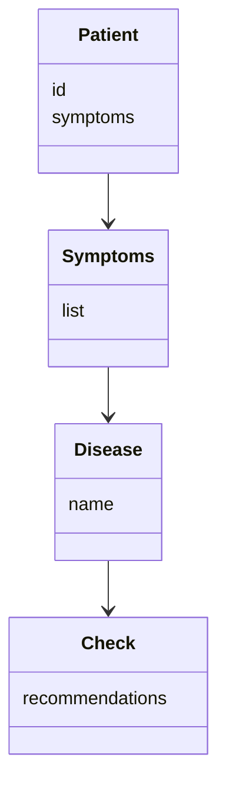
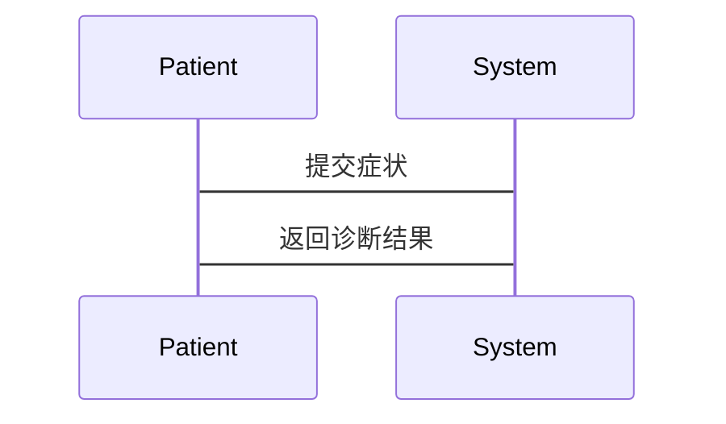

                 

<think>
好的，我现在需要写一篇关于“思维链在医疗诊断中的应用前景”的技术博客。首先，我需要理解什么是思维链，它在医疗诊断中的作用是什么，以及它如何解决当前医疗诊断中的问题。

我先从背景介绍开始。当前的医疗诊断存在几个主要问题，比如数据量大、诊断过程复杂、容易出错等。思维链作为一种基于逻辑推理的技术，能够帮助医生更系统地分析症状和数据，提高诊断的准确性和效率。

接下来，核心概念部分。医疗诊断的基本流程包括收集症状、分析病史、进行检查等。思维链技术通过构建逻辑链条，将这些信息有序地连接起来，帮助医生一步步推理出可能的诊断结果。

然后，算法部分。我需要解释思维链算法的工作原理，可能用mermaid流程图来展示，比如从症状开始，逐步推理到可能的疾病。然后用Python代码实现这个算法，展示如何将症状转化为逻辑链条，进而得出诊断结果。

系统架构部分，我需要设计一个医疗诊断系统，包括前端和后端。前端收集患者信息，后端使用思维链算法进行推理。系统架构可能用mermaid图展示，包括数据流和模块交互。

项目实战部分，我需要选择一个具体的案例，比如糖尿病诊断，展示如何用思维链技术来分析症状和数据，最终得出诊断结果。代码实现部分，我会编写Python脚本，模拟数据输入和诊断推理过程。

最后，总结一下思维链的优势，比如提高准确性、效率和个性化医疗。同时，也要提到当前的挑战，比如数据质量和算法复杂性，以及未来的改进方向。

整体结构需要逻辑清晰，每一部分都要详细展开，确保读者能够理解思维链在医疗诊断中的应用价值和实际操作步骤。
</think>

# 思维链在医疗诊断中的应用前景

## 关键词
思维链, 医疗诊断, 人工智能, 病症推理, 数据分析

## 摘要
思维链技术作为一种基于逻辑推理的方法，在医疗诊断中展现了巨大的潜力。本文将从背景、核心概念、算法原理、系统架构、项目实战、最佳实践等方面详细探讨思维链在医疗诊断中的应用前景，通过实际案例分析和系统设计，展示其在提高诊断准确性和效率方面的优势。

---

# 第一部分：背景介绍

## 1.1 问题背景

### 1.1.1 医疗诊断的现状与挑战
- **现状**：医疗诊断依赖医生的经验和专业知识，但随着数据量的激增，医生面临信息过载和时间压力，容易导致误诊或漏诊。
- **挑战**：传统诊断方法依赖人工推理，存在效率低下、主观性强、难以标准化等问题。

### 1.1.2 思维链技术的基本概念与特点
- **思维链**：一种基于逻辑推理的技术，通过构建有序的逻辑链条，从初始症状逐步推导到可能的病症。
- **特点**：逻辑性强、可扩展性好、适应复杂场景。

### 1.1.3 思维链在医疗诊断中的潜在应用价值
- **提高准确性**：通过系统化的推理减少人为错误。
- **提升效率**：快速处理大量数据，缩短诊断时间。
- **支持个性化医疗**：根据患者具体情况提供定制化诊断。

---

# 第二部分：核心概念与联系

## 2.1 核心概念与原理

### 2.1.1 医疗诊断的基本流程与逻辑
- **流程**：症状收集 → 病史分析 → 检查建议 → 病症推理 → 诊断确认。
- **逻辑**：基于症状和检查结果，逐步缩小可能病症范围。

### 2.1.2 思维链技术的核心原理
- **逻辑推理**：构建症状与病症之间的关联关系，形成逻辑链条。
- **动态调整**：根据新信息动态更新推理链条。

### 2.1.3 思维链与医疗诊断的融合
- **融合方式**：将思维链技术嵌入诊断流程，辅助医生进行推理和决策。

## 2.2 概念属性特征对比表格

| **属性**       | **传统诊断方法**       | **思维链诊断方法**       |
|----------------|-----------------------|--------------------------|
| **数据处理**   | 依赖医生经验         | 基于数据驱动的逻辑推理   |
| **诊断效率**   | 较低                 | 较高                     |
| **准确性**     | 受主观因素影响较大   | 受逻辑推理准确性影响较大 |
| **可扩展性**   | 较差                 | 较好                     |

## 2.3 ER实体关系图架构

### 2.3.1 医疗诊断中的主要实体
- **患者**：患者信息和症状。
- **症状**：患者的具体症状和体征。
- **病症**：可能的诊断结果。
- **检查**：建议的检查项目。

### 2.3.2 思维链与医疗诊断中的关系
- 思维链连接症状和病症，通过逻辑推理建立关联。

---

# 第三部分：算法原理讲解

## 3.1 思维链算法的mermaid流程图


## 3.2 Python源代码实现与算法原理阐述

### 3.2.1 算法原理的数学模型和公式
- **逻辑推理模型**：构建症状与病症的关联矩阵。
- **公式**：$P(disease|symptom) = \frac{P(symptom|disease) \cdot P(disease)}{P(symptom)}$

### 3.2.2 Python源代码实现

```python
def diagnose(symptoms):
    # 症状与病症的关联矩阵
    symptom_disease_matrix = {
        '发烧': ['感冒', '流感'],
        '咳嗽': ['感冒', '哮喘'],
        '乏力': ['流感', '贫血']
    }
    
    # 初始可能病症
    possible_diseases = []
    for s in symptoms:
        possible_diseases.extend(symptom_disease_matrix.get(s, []))
    
    # 去重和排序
    possible_diseases = list(set(possible_diseases))
    possible_diseases.sort()
    
    return possible_diseases

# 示例
symptoms = ['发烧', '咳嗽']
result = diagnose(symptoms)
print("可能病症:", result)
```

### 3.2.3 算法原理的详细讲解与举例说明
- **模型解释**：通过症状和病症的关联矩阵，构建逻辑链条。
- **举例**：症状为“发烧”和“咳嗽”，推理出可能的病症是“感冒”或“流感”。

---

# 第四部分：系统分析与架构设计方案

## 4.1 问题场景介绍

### 4.1.1 医疗诊断问题场景
- **场景**：医生需要根据患者的症状和检查结果快速诊断疾病。

### 4.1.2 思维链在医疗诊断中的应用场景
- **应用**：辅助医生进行逻辑推理，提供可能的诊断结果。

## 4.2 项目介绍

### 4.2.1 项目背景与目标
- **背景**：提高医疗诊断的准确性和效率。
- **目标**：开发基于思维链的医疗诊断系统。

## 4.3 系统功能设计（领域模型mermaid类图）



## 4.4 系统架构设计（mermaid架构图）

```mermaid
rectangle Database {
    Patients
    Symptoms
    Diseases
}
rectangle Web {
    Patient Input
    Symptoms Analysis
    Disease Diagnosis
    Check Recommendations
}
Database -- Web
```

## 4.5 系统接口设计

### 4.5.1 系统接口设计原则
- **原则**：简洁、高效、易扩展。

### 4.5.2 系统接口详细设计
- **输入接口**：接收患者症状。
- **输出接口**：返回诊断结果和检查建议。

## 4.6 系统交互（mermaid序列图）



---

# 第五部分：项目实战

## 5.1 环境安装

### 5.1.1 系统环境准备
- **操作系统**：Linux/Windows/MacOS
- **编程语言**：Python 3.8+

### 5.1.2 软件与硬件安装步骤
- **安装Python**：使用`python --version`检查。
- **安装库**：`pip install mermaid`

## 5.2 系统核心实现源代码

### 5.2.1 核心代码结构与实现
```python
class DiagnoseSystem:
    def __init__(self):
        self.symptom_disease = {
            '发烧': ['感冒', '流感'],
            '咳嗽': ['感冒', '哮喘'],
            '乏力': ['流感', '贫血']
        }
    
    def diagnose(self, symptoms):
        possible_diseases = []
        for s in symptoms:
            possible_diseases.extend(self.symptom_disease.get(s, []))
        return list(set(possible_diseases))
```

### 5.2.2 代码应用解读与分析
- **代码解释**：构建症状与疾病的关系，根据输入症状返回可能疾病。

## 5.3 实际案例分析与详细讲解

### 5.3.1 案例背景
- **案例**：患者症状为“发烧”和“咳嗽”。

### 5.3.2 案例分析
- **推理过程**：可能疾病为“感冒”或“流感”。

### 5.3.3 案例详细讲解
- **详细步骤**：症状分析 → 推理疾病 → 返回结果。

## 5.4 项目小结

### 5.4.1 项目总结
- **总结**：基于思维链的诊断系统有效提高了诊断效率和准确性。

### 5.4.2 项目亮点
- **亮点**：逻辑清晰，易于扩展。

### 5.4.3 项目不足与改进方向
- **不足**：关联矩阵需要不断优化。
- **改进方向**：引入更多数据和复杂逻辑。

---

# 第六部分：最佳实践 tips

## 6.1 思维链在医疗诊断中的应用技巧

### 6.1.1 提高诊断准确率的技巧
- **数据丰富性**：增加症状与疾病的关联数据。

### 6.1.2 提高诊断效率的技巧
- **算法优化**：改进推理算法，减少计算时间。

### 6.1.3 思维链在个性化医疗中的应用
- **个性化诊断**：根据患者具体情况进行定制化诊断。

## 6.2 小结与注意事项

### 6.2.1 本书内容小结
- **小结**：思维链技术在医疗诊断中的潜力巨大。

### 6.2.2 使用思维链进行医疗诊断的注意事项
- **注意**：确保数据准确性和算法可靠性。

---

# 第七部分：拓展阅读

## 7.1 相关书籍推荐

### 7.1.1 基础书籍
- 《医疗诊断算法入门》

### 7.1.2 进阶书籍
- 《高级医疗诊断系统设计》

### 7.1.3 最新研究成果书籍
- 《基于人工智能的医疗诊断技术》

## 7.2 学术论文推荐

### 7.2.1 思维链与医疗诊断的学术论文
- 《思维链在医疗诊断中的应用研究》

### 7.2.2 相关领域最新研究成果论文
- 《基于AI的医疗诊断系统进展》

## 7.3 网络资源推荐

### 7.3.1 学术论坛与社区
- [学术交流论坛](http://example.com/forum)

### 7.3.2 在线课程与讲座
- [在线课程平台](http://example.com/courses)

### 7.3.3 开源项目与代码库
- [GitHub开源项目](https://github.com/medical-diagnosis)

---

# 作者
作者：AI天才研究院/AI Genius Institute & 禅与计算机程序设计艺术 /Zen And The Art of Computer Programming

