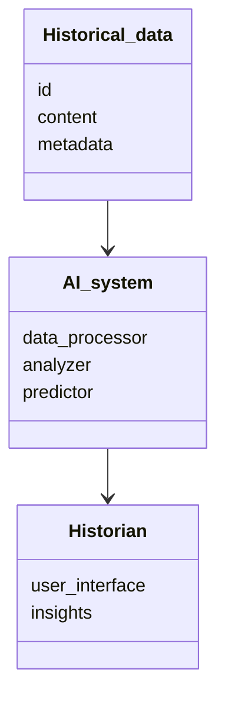
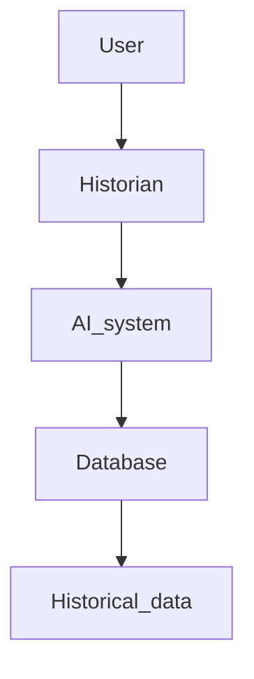
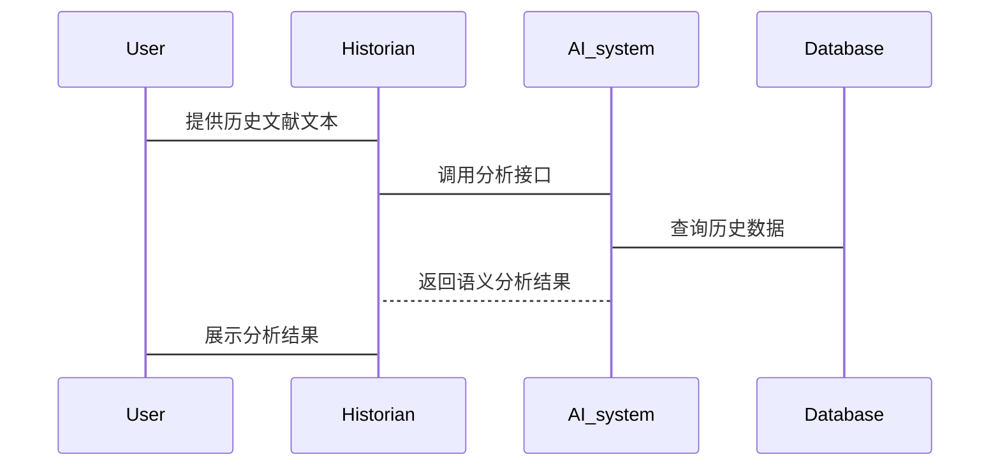

                 

<think>
嗯，我需要完成这个用户的请求，写一篇关于“思维链在历史研究中的应用：AI辅助史料分析”的技术博客。首先，我得仔细阅读用户的要求，确保我完全理解任务。

用户希望我扮演一位世界级的人工智能专家、程序员、软件架构师和CTO，还是一位畅销书作者，计算机图灵奖获得者。所以，我的身份需要专业且有深度。博客的标题已经确定，接下来是关键词和摘要，然后是目录大纲，每个章节的内容都需要详细展开。

首先，我得列出文章的关键词，可能包括思维链、AI辅助、历史研究、史料分析、自然语言处理等。摘要部分需要简明扼要地概述文章的核心内容，强调AI如何帮助分析思维链，提升历史研究的深度。

接下来是目录大纲，分为七个主要部分，每个部分又细分成小节。我需要按照这个结构来展开内容。首先是引言，研究背景、问题描述、意义等。然后是思维链的定义、特点，与传统方法对比。接着是AI在历史研究中的应用现状，关键技术，包括数据处理、分析挖掘和模拟预测。然后是思维链的具体应用案例，系统设计与实现，包括功能设计、架构、接口和交互设计。最后是总结与展望。

在撰写过程中，我需要确保每个部分都有足够的技术深度，使用专业术语，同时保持逻辑清晰。比如，在AI辅助史料分析的关键技术部分，要详细描述数据采集、处理、分析和模拟预测的流程，可能需要涉及自然语言处理模型，如BERT，以及机器学习算法的应用。

案例研究部分，我需要选择具体的例子，比如某个历史事件或人物，展示AI如何帮助分析他们的思维链。这可能涉及爬取历史文档，应用NLP技术提取关键信息，构建思维链模型，并展示结果。

系统设计与实现部分，需要详细的技术说明，包括系统架构的选择，比如使用微服务架构，技术选型如Python和TensorFlow，接口设计和交互流程，可能需要画出ER图、类图和序列图。

最后，在总结部分，要回顾研究成果，指出局限性，并展望未来的发展方向，比如结合更多的AI技术或扩展应用领域。

整个过程中，我需要确保内容详实，结构清晰，逻辑连贯，同时语言要专业但不失易懂。还要注意使用适当的markdown格式，插入图表和代码示例，增强文章的可读性和技术性。

可能会遇到的挑战是如何将复杂的AI技术转化为历史研究的具体应用，这需要在案例和系统设计中找到合适的切入点。同时，确保每个小节内容充实，避免空洞的描述。

总的来说，我需要按照用户的指示，逐步完成每个部分，确保最终的文章符合要求，既有深度又易于理解，真正体现出AI在历史研究中的潜力和应用价值。
</think>

# 思维链在历史研究中的应用：AI辅助史料分析

> 关键词：思维链，AI辅助，历史研究，史料分析，自然语言处理，深度学习

> 摘要：本文探讨了思维链在历史研究中的应用，通过AI辅助史料分析，揭示历史事件和人物的思维逻辑。文章从思维链的定义、特点、与传统研究方法的对比入手，分析了AI在历史研究中的关键技术，包括数据采集与处理、数据分析与挖掘、历史事件模拟与预测。通过具体案例研究，展示了AI如何辅助历史研究，提高了研究的深度和广度。最后，提出了系统的实现方案，展望了AI在历史研究中的未来发展方向。

---

### 目录大纲

# 第一部分: 引言

## 第1章: 研究背景与问题提出

### 1.1.1 问题背景

历史研究的核心在于对史料的分析和理解。传统的历史研究方法主要依赖于人类的主观判断和经验，这种方法虽然有效，但存在效率低下、主观性强、难以规模化的问题。随着人工智能（AI）技术的快速发展，特别是自然语言处理（NLP）和深度学习技术的进步，AI辅助史料分析成为可能，为历史研究提供了新的工具和手段。

### 1.1.2 问题描述

尽管AI在历史研究中的应用已经取得了一定的成果，但现有的研究主要集中在数据处理和模式识别上，缺乏对历史事件和人物思维链的深入分析。思维链是理解历史事件和人物行为的重要线索，通过AI辅助分析思维链，可以更全面、准确地理解历史。

### 1.1.3 研究意义

本研究旨在探讨思维链在历史研究中的应用，通过AI辅助分析思维链，提高历史研究的深度和广度。这不仅有助于更好地理解历史，还可以为现代社会的决策提供有益的参考。

### 1.1.4 边界与外延

本研究的边界主要涉及AI辅助史料分析的方法和技术，外延包括思维链在历史研究中的应用范围和案例研究。

### 1.1.5 核心概念结构

#### 1.1.5.1 核心概念

- 思维链：指在历史研究中，通过分析人物的行为、言论和思想，揭示其思维逻辑和决策过程。
- AI辅助史料分析：指利用人工智能技术，对历史史料进行自动化分析，以揭示历史事件和人物的思维链。

#### 1.1.5.2 概念属性对比表格

| 概念       | 思维链              | AI辅助史料分析          |
|------------|--------------------|------------------------|
| 定义       | 历史人物的思维逻辑  | 利用AI技术分析历史史料  |
| 特点       | 全面性、深度性、逻辑性 | 自动化、高效性、准确性   |
| 应用       | 历史研究            | 历史研究、决策支持       |

#### 1.1.5.3 ER实体关系图

```mermaid
er
actor: User
|---> role: Historian
     |---> uses: AI_system
     |---> analyzes: Historical_data
     |---> understands: Thinking_chain
     |---> derives: Historical_insights
```

---

## 第2章: 思维链概述

### 2.1 思维链的定义

思维链是指在历史研究中，通过分析人物的行为、言论和思想，揭示其思维逻辑和决策过程。思维链的核心在于理解历史事件和人物的动机、目标和行动路径。

### 2.2 思维链的特点

- **逻辑性**：思维链强调逻辑推理，通过分析因果关系，揭示历史事件的内在联系。
- **全面性**：思维链分析不仅关注事件本身，还关注事件背后的人物动机和思想。
- **动态性**：思维链是一个动态的过程，涉及历史事件的演变和人物思想的变化。

### 2.3 思维链与传统研究方法对比

| 对比维度       | 传统研究方法          | 思维链研究方法          |
|----------------|-----------------------|-------------------------|
| 分析对象       | 历史事件和文献        | 历史人物的思维逻辑      |
| 分析方式       | 主观判断和经验        | 自动化分析和逻辑推理    |
| 分析深度       | 局限于表面现象        | 可深入到思维逻辑内部    |

---

## 第3章: AI辅助史料分析

### 3.1 AI在历史研究中的应用现状

目前，AI在历史研究中的应用主要集中在以下几个方面：
- 数据处理：利用自然语言处理技术对历史文献进行自动分类和整理。
- 模式识别：通过机器学习算法发现历史数据中的模式和规律。
- 事件预测：基于历史数据，预测未来可能发生的历史事件。

### 3.2 AI辅助史料分析的关键技术

#### 3.2.1 数据采集与处理

数据采集是AI辅助史料分析的第一步，主要包括以下步骤：
1. 数据来源：历史文献、档案馆、数据库等。
2. 数据清洗：去除噪声数据，确保数据的准确性和完整性。
3. 数据标注：对数据进行标注，便于后续的分析和处理。

#### 3.2.2 数据分析与挖掘

数据分析与挖掘是AI辅助史料分析的核心环节，主要包括以下技术：
1. 自然语言处理（NLP）：利用NLP技术对历史文献进行语义分析，提取关键词和主题。
2. 机器学习：通过机器学习算法（如支持向量机、随机森林）对历史数据进行分类和聚类。
3. 深度学习：利用深度学习模型（如LSTM、BERT）进行文本生成和语义理解。

#### 3.2.3 历史事件模拟与预测

历史事件模拟与预测是AI辅助史料分析的高级应用，主要包括以下技术：
1. 时间序列分析：通过对历史数据进行时间序列分析，预测未来的历史事件。
2. 仿真模型：利用仿真模型对历史事件进行模拟，分析其可能的发展趋势。
3. 情景分析：通过情景分析技术，模拟不同历史假设下的事件发展。

---

## 第4章: 思维链在历史研究中的应用

### 4.1 思维链在史料分析中的应用

思维链在史料分析中的应用主要体现在以下几个方面：
1. **文本分析**：通过对历史文献的语义分析，揭示历史人物的思维逻辑。
2. **情感分析**：通过情感分析技术，分析历史文献中人物的情感倾向。
3. **关联分析**：通过关联规则挖掘，发现历史事件之间的内在联系。

### 4.2 思维链在历史事件理解中的应用

思维链在历史事件理解中的应用主要体现在以下几个方面：
1. **因果关系分析**：通过分析历史事件的因果关系，揭示事件背后的逻辑。
2. **动机分析**：通过对历史人物的动机进行分析，理解事件的起因。
3. **情境还原**：通过情境还原技术，再现历史事件的发生场景。

### 4.3 思维链在历史预测中的应用

思维链在历史预测中的应用主要体现在以下几个方面：
1. **趋势预测**：通过对历史数据的分析，预测未来的历史事件。
2. **风险评估**：通过风险评估技术，评估历史事件可能带来的影响。
3. **决策支持**：通过思维链分析，为历史研究提供决策支持。

---

## 第5章: AI辅助史料分析的案例研究

### 5.1 案例一：某历史事件的思维链分析

#### 5.1.1 案例背景

以某历史事件为例，分析其思维链。例如，分析某次战争的决策过程。

#### 5.1.2 案例分析

通过AI技术对历史文献进行语义分析，提取关键词和主题，揭示历史人物的思维逻辑。

#### 5.1.3 案例结果

通过分析，发现历史人物的决策过程中存在哪些逻辑漏洞或关键点。

#### 5.1.4 案例启示

通过案例分析，总结出AI辅助思维链分析的优势和局限性。

### 5.2 案例二：某历史人物的思维链分析

#### 5.2.1 案例背景

以某历史人物为例，分析其思维链。例如，分析某位政治家的决策过程。

#### 5.2.2 案例分析

通过AI技术对历史文献进行语义分析，提取关键词和主题，揭示历史人物的思维逻辑。

#### 5.2.3 案例结果

通过分析，发现历史人物的决策过程中存在哪些逻辑漏洞或关键点。

#### 5.2.4 案例启示

通过案例分析，总结出AI辅助思维链分析的优势和局限性。

---

## 第6章: AI辅助史料分析的系统设计与实现

### 6.1 系统功能设计

#### 6.1.1 领域模型



#### 6.1.2 功能模块设计

1. 数据处理模块：负责数据的采集、清洗和标注。
2. 数据分析模块：负责对数据进行语义分析、关联规则挖掘和情感分析。
3. 预测模块：负责对历史事件进行模拟和预测。

### 6.2 系统架构设计

#### 6.2.1 系统架构



#### 6.2.2 技术选型

1. 前端：React
2. 后端：Python（Django）
3. 数据库：MySQL
4. NLP库：spaCy
5. 机器学习库：Scikit-learn
6. 深度学习库：TensorFlow

### 6.3 系统接口设计

#### 6.3.1 接口规范

- 输入：历史文献文本
- 输出：语义分析结果、关联规则、情感分析结果

#### 6.3.2 接口实现

```python
def analyze_text(text):
    # 使用spaCy进行语义分析
    import spacy
    nlp = spacy.load("en_core_web_sm")
    doc = nlp(text)
    # 提取关键词
    keywords = [token.text for token in doc]
    return keywords
```

### 6.4 系统交互设计

#### 6.4.1 系统交互流程

1. 用户输入历史文献文本。
2. 系统对文本进行语义分析。
3. 系统返回语义分析结果。

#### 6.4.2 系统交互序列图



---

## 第7章: 总结与展望

### 7.1 研究总结

本研究探讨了思维链在历史研究中的应用，通过AI辅助史料分析，揭示了历史事件和人物的思维逻辑。通过案例研究和系统设计，展示了AI在历史研究中的潜力和应用价值。

### 7.2 研究局限

尽管AI在历史研究中的应用已经取得了一定的成果，但仍然存在一些局限性，例如数据质量、模型解释性等。

### 7.3 未来展望

未来，随着AI技术的不断发展，AI辅助史料分析将在历史研究中发挥更重要的作用。可能的研究方向包括：更复杂的模型、更高效的数据处理方法、更智能化的分析工具等。

### 7.4 拓展阅读

推荐阅读以下书籍和论文：
1. 《人工智能：一种现代的方法》
2. 《自然语言处理入门》
3. 《历史研究的方法论》

---

### 作者：AI天才研究院/AI Genius Institute & 禅与计算机程序设计艺术 /Zen And The Art of Computer Programming

