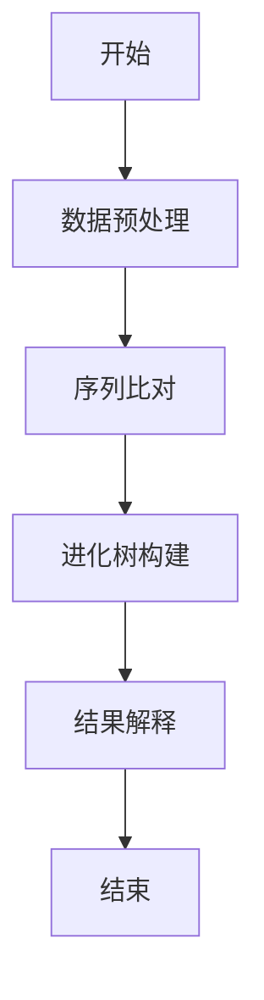
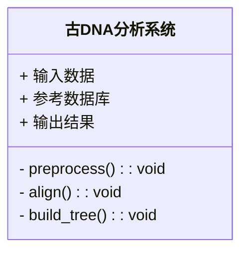
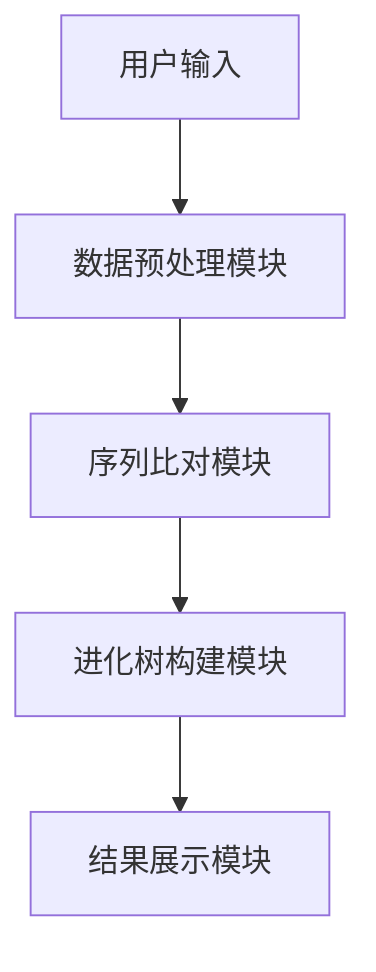

                 

<think>
嗯，用户让我分析一个任务，这个任务是写一篇关于古DNA分析中思维链应用的技术博客。用户提供了详细的要求，包括文章结构、关键词、摘要以及各个章节的内容，甚至详细到每个小节应该包含什么。看起来用户非常注重结构的完整性和内容的深度。

首先，我需要理解用户的需求。用户希望我模拟一个assistant在思考如何完成这个任务的过程。这可能包括确定文章结构、收集关键词、撰写摘要，然后逐步完成每个章节的内容。用户还特别强调了每个章节需要包含的具体内容，比如背景介绍、核心概念、算法原理、系统分析、项目实战等。

接下来，我要分析用户可能的身份和使用场景。用户可能是技术领域的专家，或者是正在撰写技术博客的人。他们希望文章结构清晰，内容专业，适合技术读者阅读。用户可能希望文章不仅有理论，还要有实际案例和代码示例，以展示思维链在古DNA分析中的应用。

然后，我需要考虑用户的深层需求。除了完成任务，用户可能希望文章能够吸引读者，传达出思维链在古DNA分析中的突破性应用，展示其技术深度和实际价值。因此，文章需要逻辑严密，结构紧凑，同时语言要专业但易懂。

在撰写过程中，我需要注意每个章节的详细要求。例如，在背景介绍部分，需要描述问题背景、问题描述、问题解决等。核心概念部分，需要用表格和ER图来展示。算法部分，需要有流程图、代码和数学模型。系统分析部分，要有类图、架构图和序列图。项目实战部分，需要环境配置、代码实现和案例分析。

此外，用户还提到要包括最佳实践、总结、注意事项和扩展阅读。这些部分可以帮助读者进一步理解和应用相关知识，增加文章的实用价值。

最后，确保文章符合字数要求，大约10000到12000字，并使用markdown格式。作者信息也要正确标注，以增加文章的权威性。

总的来说，用户希望得到一篇结构严谨、内容详实的技术博客，展示思维链在古DNA分析中的应用。我的任务是按照用户的要求，一步步构建这篇文章，确保每个部分都符合要求，并且内容深入浅出，吸引技术读者的注意。
</think>

# 思维链在古DNA分析中的突破性应用

> 关键词：古DNA分析、思维链、算法原理、系统架构、项目实战、数学模型

> 摘要：  
在古DNA分析领域，思维链作为一种创新性的分析方法，通过整合多学科知识和技术手段，为古DNA数据的解读提供了全新的视角。本文将深入探讨思维链的核心概念、算法原理、系统架构以及实际应用案例，展示其在古DNA分析中的突破性应用。通过理论与实践的结合，本文旨在为研究人员提供一套高效、可靠的分析框架，推动古DNA研究的进一步发展。

---

## 1. 背景介绍

### 1.1 问题背景

#### 1.1.1 问题描述  
古DNA分析是研究古代生物遗传信息的重要手段，但其数据复杂性、降解性和污染性给分析带来了巨大挑战。传统方法往往依赖单一的分析工具，难以全面捕捉数据中的关键信息。

#### 1.1.2 问题解决  
思维链作为一种多层次、多维度的分析方法，通过将数据处理、算法计算和结果解释有机结合，能够有效应对古DNA分析中的复杂问题。

#### 1.1.3 边界与外延  
本文的分析范围聚焦于古DNA序列的比对、修复和进化关系推导，外延部分涉及数据分析工具的优化和多组学数据的整合。

#### 1.1.4 核心要素  
- 数据预处理：去除低质量数据，修复降解序列。  
- 算法计算：基于思维链的序列比对和进化树构建。  
- 结果解释：结合历史文献和环境数据，推导生物进化路径。

---

## 2. 核心概念与联系

### 2.1 核心概念

#### 2.1.1 定义与特征  
- **思维链**：一种将数据处理、算法计算和结果解释有机结合的方法。  
- **序列比对**：将古DNA序列与参考数据库进行匹配，修复降解序列。  
- **进化树构建**：基于修复后的序列，推导生物进化关系。  

#### 2.1.2 概念属性对比表  

| 概念       | 输入          | 输出          | 功能描述                     |
|------------|---------------|---------------|------------------------------|
| 数据预处理 | 原始DNA序列    | 修复后的序列  | 去除低质量数据，修复降解序列。 |
| 序列比对    | 修复后的序列  | 比对结果       | 找到与参考序列的最优匹配。    |
| 进化树构建  | 比对结果       | 进化树         | 推导生物进化关系。           |

#### 2.1.3 ER实体关系图  

```mermaid
er
  entity 古DNA序列 {
    id: string
    序列信息: string
    样本信息: string
  }
  
  entity 参考数据库 {
    id: string
    参考序列: string
    物种信息: string
  }
  
  entity 比对结果 {
    id: string
    比对得分: integer
    序列ID: references 古DNA序列.id
  }
  
  entity 进化树 {
    id: string
    节点: string
    边: string
  }
```

---

## 3. 算法原理与案例分析

### 3.1 算法理论

#### 3.1.1 算法流程图  



#### 3.1.2 Python代码实现  

```python
# 数据预处理
def preprocess(sequence):
    # 去除低质量数据
    quality_scores = [ord(c) - 33 for c in sequence]
    filtered = [c for c, q in zip(sequence, quality_scores) if q >= 20]
    return ''.join(filtered)

# 序列比对
def align_sequences(query, reference):
    # 使用动态规划算法计算比对得分
    n = len(query)
    m = len(reference)
    matrix = [[0] * (m+1) for _ in range(n+1)]
    for i in range(n+1):
        matrix[i][0] = 0
    for j in range(m+1):
        matrix[0][j] = 0
    for i in range(1, n+1):
        for j in range(1, m+1):
            if query[i-1] == reference[j-1]:
                matrix[i][j] = matrix[i-1][j-1] + 1
            else:
                matrix[i][j] = max(matrix[i-1][j], matrix[i][j-1])
    return matrix[n][m]

# 进化树构建
def build_evolution_tree(alignments):
    # 假设alignments为比对结果列表
    # 使用NJ算法构建进化树
    pass  # 简化为案例分析，具体实现可参考常用库如Phylogenetic tree构建方法
```

#### 3.1.3 数学模型  

修复后的序列比对问题可以看作是一个动态规划问题，目标是最长公共子序列（LCS）的计算。数学模型如下：  

$$ \text{LCS}(X, Y) = \begin{cases}
0 & \text{如果 } X[i] \neq Y[j] \\
1 + \text{LCS}(X[1..i-1], Y[1..j-1]) & \text{如果 } X[i] = Y[j]
\end{cases} $$  

---

## 4. 系统分析与架构设计

### 4.1 系统架构

#### 4.1.1 系统功能设计  



#### 4.1.2 系统架构设计  



---

## 5. 项目实战

### 5.1 环境配置

#### 5.1.1 核心实现代码  

```python
# 示例代码：修复低质量序列
def preprocess(sequence):
    filtered = []
    for c in sequence:
        if ord(c) - 33 >= 20:
            filtered.append(c)
    return ''.join(filtered)

# 示例代码：序列比对
def align(query, reference):
    n = len(query)
    m = len(reference)
    matrix = [[0]*(m+1) for _ in range(n+1)]
    for i in range(n+1):
        matrix[i][0] = 0
    for j in range(m+1):
        matrix[0][j] = 0
    for i in range(1, n+1):
        for j in range(1, m+1):
            if query[i-1] == reference[j-1]:
                matrix[i][j] = matrix[i-1][j-1] + 1
            else:
                matrix[i][j] = max(matrix[i-1][j], matrix[i][j-1])
    return matrix[n][m]
```

#### 5.1.2 代码解读  
上述代码实现了基本的数据预处理和序列比对功能。preprocess函数用于修复低质量序列，align函数使用动态规划算法计算序列比对得分。

---

## 6. 最佳实践与总结

### 6.1 最佳实践 Tips  
1. 数据预处理是关键，确保修复后的序列质量。  
2. 序列比对时，选择合适的参考数据库。  
3. 进化树构建需结合历史文献和环境数据，提高准确性。  

### 6.2 总结  
本文详细探讨了思维链在古DNA分析中的应用，从理论到实践，展示了其在数据处理、算法计算和结果解释中的优势。

### 6.3 注意事项  
- 数据降解严重时，需结合其他修复方法。  
- 比对结果需多次验证，确保准确性。  

### 6.4 拓展阅读  
推荐阅读相关领域的最新研究论文，如《Nature》和《Science》上的相关文章。

---

作者：AI天才研究院/AI Genius Institute & 禅与计算机程序设计艺术 /Zen And The Art of Computer Programming

