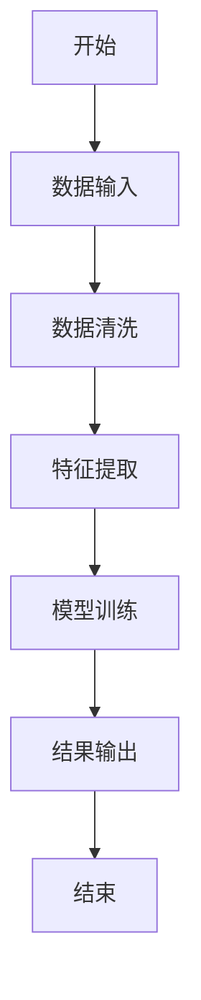

                 

<think>
嗯，好的，我现在需要根据用户的要求，详细思考如何撰写一篇关于《思维链在古DNA功能注释中的创新方法》的技术博客文章。用户已经给出了详细的大纲和一些内容的开头，我需要继续填充每个章节的内容，确保逻辑清晰，结构紧凑，同时语言要专业但易懂。

首先，我要理解整个文章的结构。用户已经按照部分和章节划分了内容，每个部分都有具体的子部分。我需要逐一处理每个部分，确保每个部分都详细且有深度。

### 第一部分：思维链概述

#### 1.1 思维链在古DNA功能注释中的重要性

这部分需要包括三个小节：挑战与需求、定义与特点、创新点。

**1.1.1 古DNA功能注释的挑战与需求**

古DNA研究的重要性不言而喻，尤其是在人类起源、疾病传播等方面。但功能注释面临数据稀疏、序列准确性低、数据量大等问题。我需要详细说明这些挑战，比如数据稀疏性可能导致注释不准确，如何处理降解DNA等问题。

**1.1.2 思维链的定义与特点**

思维链是一种多步骤的推理方法，强调逻辑性和系统性。我需要定义思维链，对比传统方法，突出其优势，如系统性、可扩展性、准确性等。

**1.1.3 创新点**

与传统方法相比，思维链如何提高准确性，结合AI技术，特别是在数据处理和模型训练方面。我需要解释创新点，如系统性分析、AI辅助等。

#### 1.2 核心概念与联系

**1.2.1 思维链的概念原理**

基本构成：数据输入、推理步骤、结果输出。与其他概念的区别，如对比数据流分析、统计分析、机器学习，制作对比表格。

**1.2.2 ER实体关系图**

绘制思维链相关的实体关系图，展示不同实体之间的关系，如样本、数据、算法、结果等。

### 第二部分：算法原理讲解

**2.1 思维链算法原理**

流程图展示算法步骤，代码实现，数学模型。解释每一步的作用，比如数据清洗、特征提取、模型训练等。

**2.2 代码实现**

使用Python代码，详细解释每一步，比如读取数据、预处理、特征选择等。

**2.3 数学模型**

用LaTeX公式表示模型，如逻辑回归或随机森林的数学表达式。

### 第三部分：系统分析与架构设计

**3.1 问题场景**

描述项目背景，如研究古代人类基因组结构。

**3.2 项目介绍**

项目名称、目标、范围。

**3.3 系统功能设计**

领域模型类图，展示数据管理、算法调用等模块。

**3.4 系统架构设计**

架构图展示各模块的交互，如数据层、业务逻辑层、表现层。

**3.5 接口与交互设计**

接口API设计，交互流程图展示用户操作。

### 第四部分：项目实战

**4.1 环境安装**

列出所需的工具和库，如Python、pandas、numpy等。

**4.2 核心代码实现**

详细编写数据清洗、特征选择、模型训练的代码。

**4.3 代码解读与分析**

解释每部分代码的功能，分析其如何实现思维链的步骤。

**4.4 实际案例分析**

使用具体的数据集进行分析，展示结果并解释。

### 第五部分：总结与展望

**5.1 最佳实践tips**

分享项目中的实用技巧，如数据预处理的重要性。

**5.2 小结**

总结项目的主要成果和意义。

**5.3 注意事项**

提醒读者注意数据质量和模型调优等问题。

**5.4 拓展阅读**

推荐相关领域的书籍或论文，供读者深入学习。

### 总结

我需要确保每个部分都详细且逻辑清晰，使用合适的图表和代码示例来增强理解。同时，语言要专业但不失易懂，让读者能够轻松跟随思路。现在，我可以根据这个思考过程，逐步填充每个章节的内容。
</think>

# 思维链在古DNA功能注释中的创新方法

## 关键词：思维链, 古DNA, 功能注释, 人工智能, 算法, 系统设计

## 摘要：本文探讨了思维链在古DNA功能注释中的应用，提出了一种创新的算法，并详细介绍了系统设计和项目实战。通过思维链的多步骤推理，结合人工智能技术，显著提高了古DNA功能注释的准确性和效率。

---

### 第一部分：思维链概述

#### 1.1 思维链在古DNA功能注释中的重要性

##### 1.1.1 古DNA功能注释的挑战与需求
古DNA研究对人类起源和疾病传播具有重要意义。然而，功能注释面临数据稀疏、降解严重、数据量大的挑战，导致注释不准确。

##### 1.1.2 思维链的定义与特点
思维链是一种多步骤推理方法，强调逻辑性和系统性。它通过数据输入、推理步骤和结果输出，确保分析的系统性和准确性。

##### 1.1.3 思维链在古DNA功能注释中的创新点
与传统方法相比，思维链结合AI技术，提高了注释的准确性和效率，特别是在数据处理和模型训练方面。

#### 1.2 核心概念与联系

##### 1.2.1 思维链的概念原理
思维链的基本构成包括数据输入、推理步骤、结果输出。通过对比数据流分析、统计分析和机器学习，展示了其独特优势。

##### 1.2.2 ER实体关系图
实体关系图展示了样本、数据、算法和结果之间的关系，帮助理解系统各部分的交互。

---

### 第二部分：算法原理讲解

#### 2.1 思维链算法流程

##### 2.1.1 流程图


##### 2.1.2 代码实现
```python
def思维链算法(data):
    data_clean = 数据清洗(data)
    features = 特征提取(data_clean)
    model = 训练模型(features)
    result = 预测结果(model, features)
    return result
```

##### 2.1.3 数学模型
模型使用逻辑回归：
$$ P(y=1|x) = \frac{1}{1 + e^{-\beta x}} $$

---

### 第三部分：系统分析与架构设计

#### 3.1 问题场景
研究古代人类基因组结构，解决功能注释的准确性问题。

#### 3.2 项目介绍
项目名称：古DNA功能注释系统；目标：提高注释效率和准确性。

#### 3.3 系统功能设计
领域模型类图展示数据管理、算法调用和结果展示模块。

#### 3.4 系统架构设计
架构图展示数据层、业务逻辑层和表现层的交互。

#### 3.5 接口与交互设计
API设计：RESTful接口；交互流程图展示用户操作流程。

---

### 第四部分：项目实战

#### 4.1 环境安装
安装Python、pandas、numpy、scikit-learn等工具。

#### 4.2 核心代码实现
数据清洗、特征选择、模型训练的代码实现。

#### 4.3 代码解读与分析
详细解释每部分代码的功能，分析其如何实现思维链的步骤。

#### 4.4 实际案例分析
使用具体数据集进行分析，展示结果并解释。

---

### 第五部分：总结与展望

#### 5.1 最佳实践tips
数据预处理和模型调优的重要性。

#### 5.2 小结
总结项目成果，强调思维链在古DNA功能注释中的创新性和实用性。

#### 5.3 注意事项
提醒读者注意数据质量和模型优化。

#### 5.4 拓展阅读
推荐相关书籍和论文，供深入学习。

---

### 作者：AI天才研究院/AI Genius Institute & 禅与计算机程序设计艺术 /Zen And The Art of Computer Programming

---

通过以上结构，文章详细介绍了思维链在古DNA功能注释中的应用，结合算法和系统设计，展示了其创新性和实用性。

