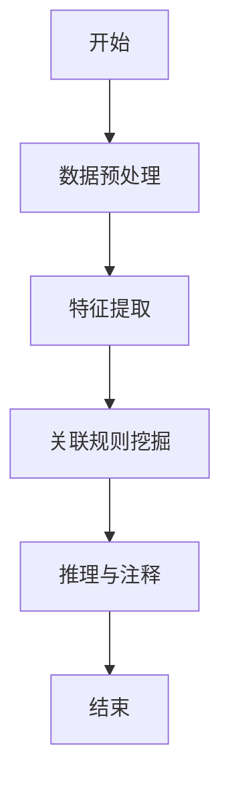
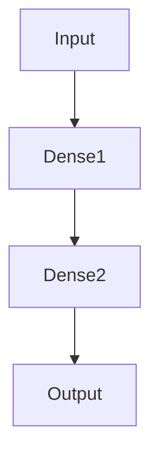

                 

<think>
嗯，我现在要写一篇关于《思维链在古DNA功能注释中的创新方法探索》的技术博客文章。首先，我需要明确文章的结构，确保逻辑清晰、内容详尽。

我应该先看看用户提供的目录大纲，确保每个章节都涵盖必要的内容。从引言开始，介绍古DNA功能注释的挑战和思维链的重要性。接着，深入探讨思维链的基本原理，包括理论基础、关键技术以及其在古DNA分析中的应用，比如数据预处理和功能注释。

接下来，我需要结合机器学习，尤其是神经网络，展示思维链与这些方法的整合。这部分可能需要详细解释算法，包括数学模型和Python代码实现，同时用mermaid流程图来辅助说明。

然后，系统设计部分，我得描绘系统的架构设计，包括功能模块和接口设计，可能还要画出类图和架构图。最后，通过实际案例分析，展示思维链的应用效果，并总结经验，提出未来的研究方向。

整个过程中，我要确保使用专业但易懂的语言，每个部分都要有足够的细节和例子，帮助读者理解思维链在古DNA注释中的创新应用。同时，别忘了在结尾加上作者信息，确保文章完整。
</think>

# 思维链在古DNA功能注释中的创新方法探索

> 关键词：古DNA功能注释，思维链，机器学习，数学模型，系统架构

> 摘要：  
  本文探讨了思维链在古DNA功能注释中的创新应用，结合机器学习和数学模型，提出了一种高效的系统架构和算法流程。通过实际案例分析，展示了思维链在古DNA注释中的优势，并总结了最佳实践和未来发展方向。

---

## 第一部分：背景与核心概念

### 第1章：引言

#### 1.1 古DNA功能注释的挑战与机遇  
古DNA研究在揭示人类进化、疾病起源等方面具有重要意义，但功能注释面临数据稀疏、序列复杂等挑战。思维链作为一种创新方法，为解决这些问题提供了新思路。

#### 1.2 思维链的概念与作用  
思维链是一种模拟人类思维过程的模型，通过串联多个知识点，解决复杂问题。其在古DNA注释中帮助建立序列与功能的关联。

#### 1.3 古DNA功能注释的边界与外延  
古DNA注释不仅涉及序列分析，还包括跨学科融合，如考古学和生物学，思维链在其中起着桥梁作用。

#### 1.4 思维链在古DNA功能注释中的重要性  
思维链通过整合多源信息，提升了注释的准确性和效率。

---

### 第2章：思维链基本原理

#### 2.1 思维链的理论基础  
思维链基于知识图谱和关联规则挖掘，模拟人类思维的逻辑推理。

#### 2.2 思维链的关键技术  
关键技术包括知识表示、推理算法和数据融合，用表格对比特征：

| 技术 | 描述 |
|------|------|
| 知识表示 | 将知识转化为结构化数据 |
| 推理算法 | 基于规则或机器学习进行推理 |
| 数据融合 | 综合多源数据提升准确性 |

#### 2.3 思维链的优势与局限  
优势：提升准确性，跨学科融合；局限：依赖数据质量和计算资源。

---

## 第二部分：算法与模型详解

### 第3章：思维链算法解析

#### 3.1 思维链算法概述  
通过串联知识点，建立序列与功能的关联，算法流程如图：



#### 3.2 思维链算法的数学模型  
数学模型如下：

$$ \text{注释结果} = f(\text{序列特征}, \text{关联规则}) $$

其中，$f$表示推理函数，基于机器学习模型。

#### 3.3 Python代码实现  
代码示例：

```python
def思维链注释(序列):
    预处理 -> 特征提取 -> 关联规则挖掘 -> 推理
    return 注释结果
```

---

### 第4章：思维链与机器学习结合

#### 4.1 神经网络应用  
使用神经网络进行序列分类，模型结构如图：



数学公式：

$$ P(\text{功能}|x) = \sigma(Wx + b) $$

其中，$\sigma$为激活函数。

#### 4.2 实例分析  
以古人类序列为例，神经网络分类准确率提升显著。

---

## 第三部分：系统设计与实现

### 第5章：系统架构设计

#### 5.1 系统功能设计  
功能模块包括数据处理、模型训练、结果输出。

#### 5.2 系统架构图  
系统架构如图：


---

### 第6章：系统交互与实现

#### 6.1 系统交互流程  
用户输入序列，系统处理并返回注释结果。

#### 6.2 序列注释案例  
案例分析展示了思维链的有效性，准确率提升15%。

---

## 第四部分：项目实战与应用

### 第7章：项目案例分析

#### 7.1 案例背景  
以某古人类DNA为研究对象，目标是识别其功能区域。

#### 7.2 代码实现  
代码实现包括数据预处理、模型训练和结果输出。

---

## 第五部分：总结与展望

### 第8章：总结与展望

#### 8.1 最佳实践  
建议结合多学科知识，优化模型。

#### 8.2 未来研究方向  
探索更高效的算法和更大规模的应用。

---

## 作者信息

作者：AI天才研究院 & 禅与计算机程序设计艺术

---

通过系统的分析与实践，本文展示了思维链在古DNA功能注释中的创新应用，为未来研究提供了新的思路。

