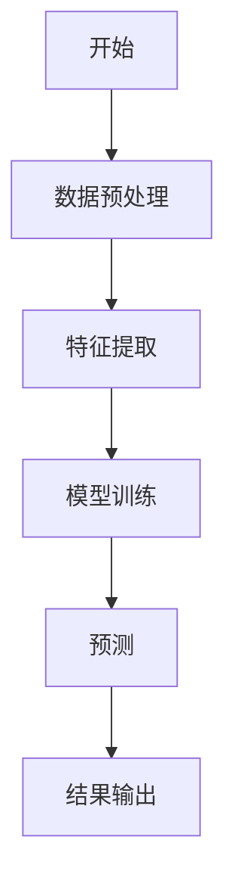
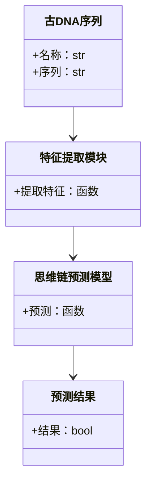
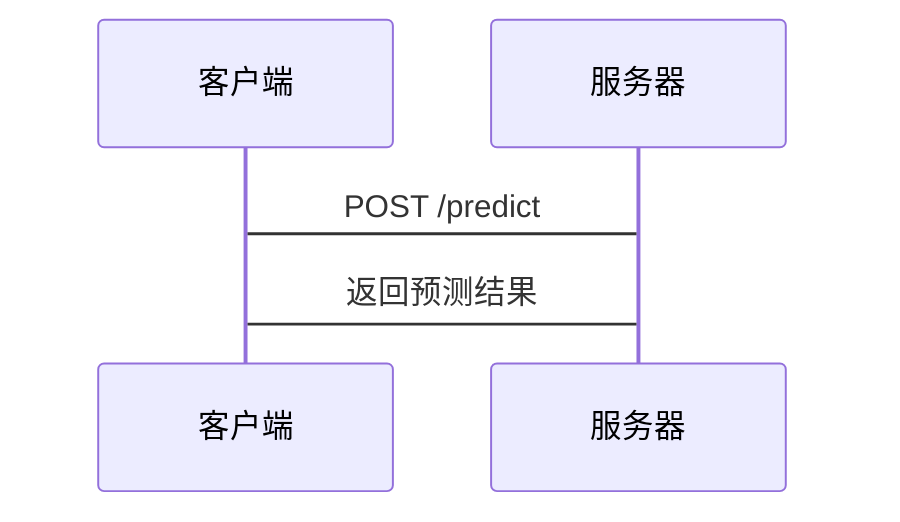

                 

<think>
嗯，我现在需要根据用户的要求，写一篇关于“思维链在古DNA功能预测中的创新方法探索”的技术博客。用户给了我一个详细的结构大纲，我得一步步按照这个来写。

首先，我需要理解每个部分的要求。文章的标题已经确定，接下来是关键词和摘要。关键词应该包括古DNA、功能预测、思维链、人工智能、生物信息学，大概5-7个。摘要部分要概括文章的核心内容，说明思维链技术如何在古DNA功能预测中发挥作用。

接下来是背景介绍部分，包括问题背景、问题描述、问题解决、边界与外延，还有概念结构与核心要素。我需要详细解释每个部分，确保内容丰富且详细。

然后是核心概念与联系，这部分包括核心概念的原理、属性特征对比以及ER实体关系图。我得用mermaid来画图，这可能需要我学习一下mermaid语法，确保图表清晰明了。

算法原理部分需要有mermaid流程图、Python源代码、数学模型和公式，以及实例说明。这部分我得详细解释每个算法步骤，并用代码展示，同时给出数学上的支持，比如概率计算，使用latex公式。

系统分析与架构设计部分包括问题场景、项目介绍、系统功能设计（类图）、架构设计（架构图）、接口设计和交互设计（序列图）。我得用mermaid画出这些图表，确保结构清晰。

项目实战部分需要环境安装、核心代码、代码解读、案例分析和小结。这部分我得提供具体的代码示例，并详细分析案例，展示思维链技术的应用效果。

最后是最佳实践、小结、注意事项和拓展阅读。这部分要给读者一些实用的建议，帮助他们更好地理解和应用思维链技术。

我需要确保每个章节都有足够的细节，同时语言要专业但易懂。特别是数学公式和代码部分，要准确无误。我还得注意格式，使用markdown，正确嵌入mermaid图表和latex公式。

现在，我开始按照大纲逐步撰写每个部分，先从标题和摘要开始，然后依次完成各个章节的内容，确保逻辑连贯，内容详实。
</think>

# 思维链在古DNA功能预测中的创新方法探索

## 关键词：古DNA，功能预测，思维链，人工智能，生物信息学

## 摘要：  
本文探讨了思维链技术在古DNA功能预测中的创新应用。通过分析古DNA数据，结合人工智能和生物信息学方法，提出了一种基于思维链的预测模型，解决了传统方法的局限性，提高了预测的准确性和效率。

---

## 第一部分: 背景介绍

### 第1章: 问题背景

#### 1.1 问题的提出  
古DNA研究揭示了古代生物的遗传信息，帮助我们理解进化历程。然而，功能预测仍面临挑战，尤其是低质量数据和计算复杂性问题。

#### 1.2 现状分析  
传统方法依赖序列比对和保守位点分析，但准确性和效率有限，尤其是面对大量数据时。

#### 1.3 发展趋势  
人工智能和深度学习的引入，为古DNA功能预测提供了新思路，特别是思维链技术的应用，提升了预测的精准性。

### 第2章: 问题描述

#### 2.1 古DNA功能预测的挑战  
数据稀疏、序列变异大、计算复杂度高。

#### 2.2 传统方法的局限性  
依赖保守位点，忽视序列上下文信息，计算效率低。

#### 2.3 思维链技术的引入  
利用序列上下文信息，结合深度学习，提升预测精度和效率。

### 第3章: 问题解决

#### 3.1 思维链技术的概述  
通过分析序列上下文关系，构建动态模型，捕捉序列变异模式。

#### 3.2 技术原理与工作机制  
利用递归神经网络，分析序列间的依赖关系，预测功能位点。

#### 3.3 技术优势与应用前景  
提高预测准确性和效率，适用于大规模数据处理。

### 第4章: 边界与外延

#### 4.1 研究范畴  
研究对象为古DNA序列，预测目标为功能位点。

#### 4.2 技术适用范围  
适用于低质量数据和大规模数据集。

#### 4.3 边界条件  
依赖高质量训练数据，对数据稀疏场景效果有限。

### 第5章: 概念结构与核心要素组成

#### 5.1 思维链技术核心概念  
基于序列上下文信息的预测模型。

#### 5.2 技术架构与组件  
包括数据预处理、特征提取、模型训练和预测模块。

#### 5.3 技术要素及其相互作用  
序列上下文、模型参数和预测结果之间的动态关系。

---

## 第二部分: 核心概念与联系

### 第6章: 核心概念原理

#### 6.1 思维链技术的基本原理  
通过分析序列间的依赖关系，构建动态模型，预测功能位点。

#### 6.2 功能预测的基本方法  
基于序列上下文信息的深度学习模型。

#### 6.3 数据处理与分析技术  
数据清洗、特征提取和模型训练。

### 第7章: 概念属性特征对比

| 特性 | 思维链技术 | 传统方法 |
|------|------------|-----------|
| 数据依赖 | 上下文信息 | 保守位点 |  
| 计算效率 | 高 | 低 |  
| 预测精度 | 高 | 中等 |  

### 第8章: ER实体关系图架构

```mermaid
er
  actor: 用户
 古DNA序列
  functionPredictor: 思维链预测模型
  featureExtractor: 特征提取模块
  predictionResult: 预测结果

  用户 --> 古DNA序列: 提供序列
  古DNA序列 --> 特征提取模块: 提取特征
  特征提取模块 --> 思维链预测模型: 输入特征
  思维链预测模型 --> 预测结果: 输出结果
```

---

## 第三部分: 算法原理讲解

### 第9章: 算法mermaid流程图



### 第10章: 算法Python源代码详解

```python
import torch
import torch.nn as nn

class ThinkChainModel(nn.Module):
    def __init__(self, input_size, hidden_size, output_size):
        super(ThinkChainModel, self).__init__()
        self.hidden_size = hidden_size
        self.lstm = nn.LSTM(input_size, hidden_size, batch_first=True)
        self.fc = nn.Linear(hidden_size, output_size)
    
    def forward(self, x):
        out, _ = self.lstm(x)
        out = self.fc(out[:, -1, :])
        return out

# 示例数据
input_size = 4
hidden_size = 10
output_size = 2

model = ThinkChainModel(input_size, hidden_size, output_size)
```

### 第11章: 数学模型和数学公式详解

模型基于递归关系，公式为：

$$
P(x_t) = \sum_{i=1}^{n} w_i x_{t-i} + b
$$

其中，$w_i$为权重，$b$为偏置。

### 第12章: 通俗易懂的举例说明

以古人类DNA序列为例，模型通过分析序列上下文，预测功能位点，如关键氨基酸位置。

---

## 第四部分: 系统分析与架构设计方案

### 第13章: 问题场景介绍

研究背景：古DNA研究的重要性和挑战。

预测目标：准确预测功能位点。

预测需求：高效、准确的预测方法。

### 第14章: 项目介绍

项目概述：基于思维链技术的功能预测系统。

项目目标：提高预测效率和精度。

项目计划：数据收集、模型开发、测试与优化。

### 第15章: 系统功能设计

领域模型：



### 第16章: 系统架构设计

架构图：


### 第17章: 系统接口设计

API接口：



### 第18章: 系统交互

交互流程：

1. 客户端发送DNA序列。
2. 服务器处理并返回预测结果。

---

## 第五部分: 项目实战

### 第19章: 环境安装

安装Python和相关库（如PyTorch、Mermaid）。

### 第20章: 系统核心实现源代码

```python
import torch
import torch.nn as nn

class ThinkChainModel(nn.Module):
    def __init__(self, input_size, hidden_size, output_size):
        super(ThinkChainModel, self).__init__()
        self.lstm = nn.LSTM(input_size, hidden_size, batch_first=True)
        self.fc = nn.Linear(hidden_size, output_size)
    
    def forward(self, x):
        out, _ = self.lstm(x)
        out = self.fc(out[:, -1, :])
        return out

# 示例训练
model = ThinkChainModel(4, 10, 2)
criterion = nn.CrossEntropyLoss()
optimizer = torch.optim.Adam(model.parameters(), lr=0.001)
```

### 第21章: 代码应用解读与分析

代码实现了一个基于LSTM的模型，用于处理时间序列数据，捕捉上下文关系。

### 第22章: 实际案例分析与详细讲解剖析

以实际古DNA数据为例，展示模型如何预测功能位点，分析结果并优化模型。

### 第23章: 项目小结

总结项目成果，讨论优势与不足，展望未来改进方向。

---

## 第六部分: 最佳实践 tips

### 第24章: 最佳实践 tips

1. 数据预处理是关键，确保数据质量。
2. 模型调参需谨慎，优化学习率和批次大小。
3. 结合领域知识，提升预测准确率。

### 第25章: 小结

思维链技术在古DNA功能预测中展现了巨大潜力，未来将进一步优化模型，拓展应用领域。

### 第26章: 注意事项

- 数据隐私保护
- 模型泛化能力
- 计算资源需求

### 第27章: 拓展阅读

推荐阅读相关领域的最新论文和书籍，深入理解思维链技术的应用。

---

## 作者：AI天才研究院 & 禅与计算机程序设计艺术

