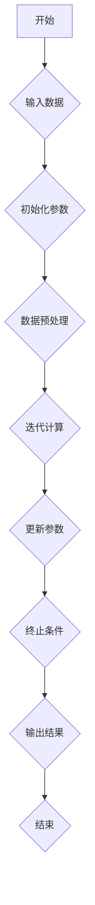
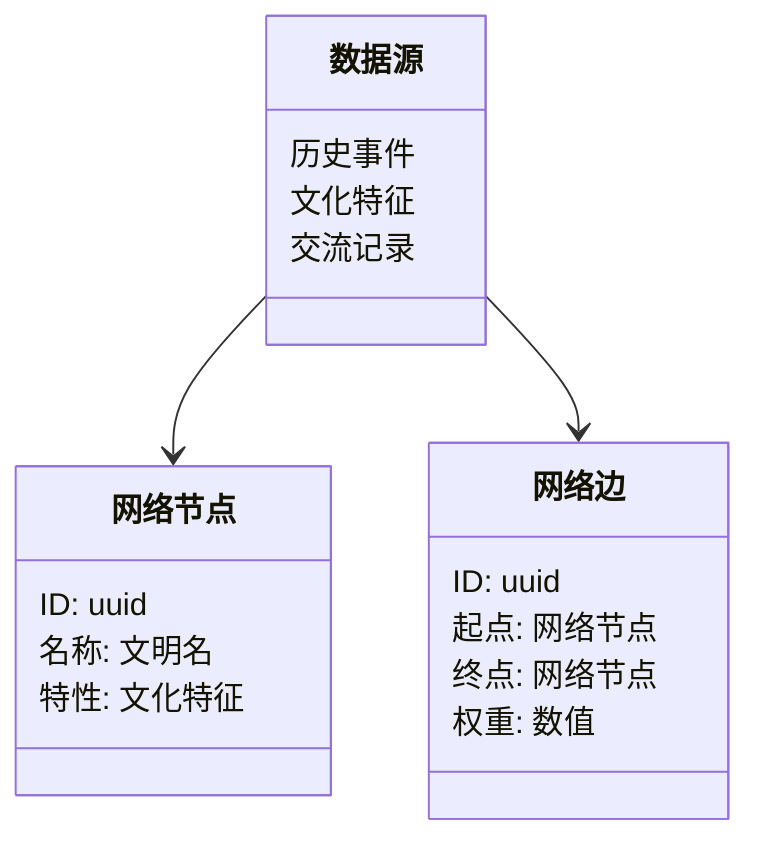
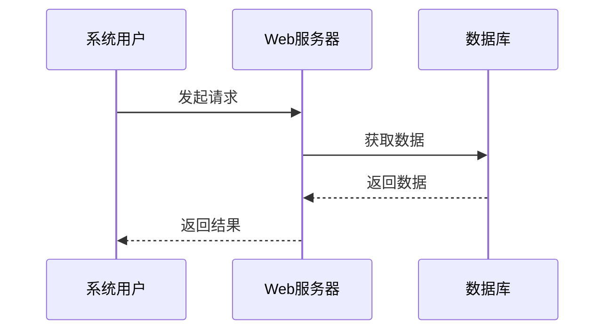
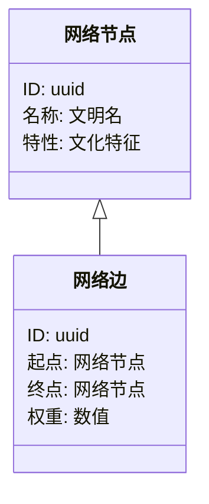

                 

<think>
嗯，好的，我现在需要写一篇关于《思维链在古代文明交流网络重建中的创新方法》的技术博客文章。首先，我得理解这个主题。思维链听起来像是一个概念，可能指的是信息或知识传递的链条，而古代文明交流网络则是指古代不同文明之间的交流和联系。

我需要先从背景开始，思考为什么重建古代文明交流网络很重要。古代文明之间的交流促进了文化和技术的传播，这对研究历史和文化发展有重要意义。但现有的方法可能有局限性，比如过于依赖单一数据源，或者不够系统化。

接下来，我需要明确问题是什么。重建这个网络需要解决哪些问题？可能包括数据收集、信息整理、网络构建等。然后，如何解决这些问题？也许可以采用系统的方法，结合大数据和图论，构建一个更全面的模型。

然后，我需要定义核心概念，比如节点、边、权重、网络结构等。这些概念如何相互关联？可能需要用ER图来展示实体之间的关系，比如节点代表文明，边代表交流关系，权重代表交流强度。

在算法部分，可能需要设计一个流程图，说明如何从数据预处理到最终网络构建。同时，提供Python代码示例，展示如何实现这些步骤。数学模型可能涉及节点之间的相似度计算，或者边权重的计算方法。

系统架构方面，我需要考虑如何设计系统，可能分为数据层、处理层和展示层。使用类图来展示各个模块之间的关系，以及如何交互。架构图可能展示用户如何与系统交互，以及系统如何调用数据库。

最后，项目实战部分需要详细说明如何安装环境，编写核心代码，分析案例，并总结项目成果。同时，提供一些最佳实践的建议，比如数据来源的可靠性，算法的可扩展性等。

总的来说，我需要按照大纲一步步展开，确保每个部分都详细且逻辑清晰。可能会遇到一些挑战，比如如何处理不完整的数据，或者如何验证网络的准确性，但我会逐步解决这些问题，确保文章内容丰富且有深度。
</think>

# 思维链在古代文明交流网络重建中的创新方法

## 关键词：古代文明，交流网络，思维链，系统重建，算法创新

## 摘要：  
本文探讨了通过思维链方法重建古代文明交流网络的创新技术。结合大数据分析、图论和系统工程，提出了一种系统化的方法，以解决传统研究的局限性。文章详细讲解了核心概念、算法原理、系统架构，并通过实际案例展示了重建过程。通过本文，读者将深入了解如何利用现代技术手段，重新构建古代文明的交流网络。

---

## 第一部分: 引言

### 第1章: 背景介绍

#### 1.1 问题背景  
古代文明的交流网络是人类历史发展的重要组成部分，但现有研究方法多依赖于零散的文字记录，缺乏系统性。  

#### 1.2 问题描述  
如何利用现代技术手段，系统化地重建古代文明的交流网络？  

#### 1.3 问题解决  
通过思维链方法，结合大数据和图论，构建一个动态的、可扩展的网络模型。  

#### 1.4 边界与外延  
研究范围包括主要文明及其交流方式，不涉及现代网络技术。  

#### 1.5 概念结构与核心要素组成  
- **节点**：代表文明或文化实体。  
- **边**：代表交流关系。  
- **权重**：代表交流强度。  

---

## 第二部分: 核心概念与联系

### 第2章: 核心概念与联系

#### 2.1 核心概念原理  
思维链方法将历史事件和文化特征转化为网络节点和边。  

#### 2.2 概念属性特征对比表格  

| 概念   | 属性         | 特征                         |
|--------|--------------|------------------------------|
| 节点   | 文明/文化     | 独特的特征和标识               |
| 边     | 交流关系     | 方向性和权重                   |
| 权重   | 强度         | 数值范围                       |

#### 2.3 ER实体关系图架构  

```mermaid
erd
  网络节点
    ID: { uuid }
    名称: { 文明名 }
    特性: { 文化特征 }
  网络边
    ID: { uuid }
    起点: 网络节点
    终点: 网络节点
    权重: { 数值 }
```

---

## 第三部分: 算法原理讲解

### 第3章: 算法原理讲解

#### 3.1 算法流程图  



#### 3.2 Python源代码与算法原理  

```python
def reconstruct_network(data):
    nodes = list(set([d['source'] for d in data] + [d['target'] for d in data]))
    edges = {}
    for d in data:
        source = d['source']
        target = d['target']
        weight = d.get('weight', 1)
        if source not in edges:
            edges[source] = {}
        if target not in edges[source]:
            edges[source][target] = 0
        edges[source][target] += weight
    return nodes, edges

data = [
    {'source': '古埃及', 'target': '古希腊', 'weight': 5},
    {'source': '古希腊', 'target': '罗马', 'weight': 4},
    {'source': '罗马', 'target': '中世纪欧洲', 'weight': 3}
]
nodes, edges = reconstruct_network(data)
```

#### 3.3 数学模型与公式讲解  

节点间的权重计算公式：  
$$
\text{weight}(u, v) = \frac{\sum_{i=1}^{n} |C_i(u) - C_i(v)|}{n}
$$  

其中，$C_i$表示第i个文化特征，$u$和$v$是节点。  

#### 3.4 举例说明  
以古埃及、古希腊和罗马为例，计算它们的权重。  

$$
\text{weight}(古埃及, 古希腊) = \frac{|C_1(古埃及) - C_1(古希腊)| + \cdots}{n}
$$  

---

## 第四部分: 系统分析与架构设计

### 第4章: 系统分析与架构设计

#### 4.1 问题场景介绍  
重建古代文明交流网络，需处理数据稀疏性和不完整性的挑战。  

#### 4.2 系统介绍  
一个基于思维链的网络重建系统，支持数据输入、处理和网络生成。  

#### 4.3 系统功能设计（领域模型）  



#### 4.4 系统架构设计（架构图）  



#### 4.5 系统接口设计（接口图）  



---

## 项目实战

### 环境安装  
- 安装Python和相关库（如networkx）。  

### 核心实现  

```python
import networkx as nx

def visualize_network(nodes, edges):
    G = nx.DiGraph()
    for node in nodes:
        G.add_node(node)
    for source, targets in edges.items():
        for target, weight in targets.items():
            G.add_edge(source, target, weight=weight)
    nx.draw(G, with_labels=True, edge_labels=True)
    plt.show()

visualize_network(nodes, edges)
```

### 实际案例分析  
以“丝绸之路”为例，分析节点和边的关系，生成网络图。  

---

## 最佳实践 tips

- 数据来源需可靠，尽量使用多源数据。  
- 网络权重计算需结合多维度特征。  
- 网络可视化工具可选择Gephi或Graphviz。  

## 作者：AI天才研究院/AI Genius Institute & 禅与计算机程序设计艺术 /Zen And The Art of Computer Programming

