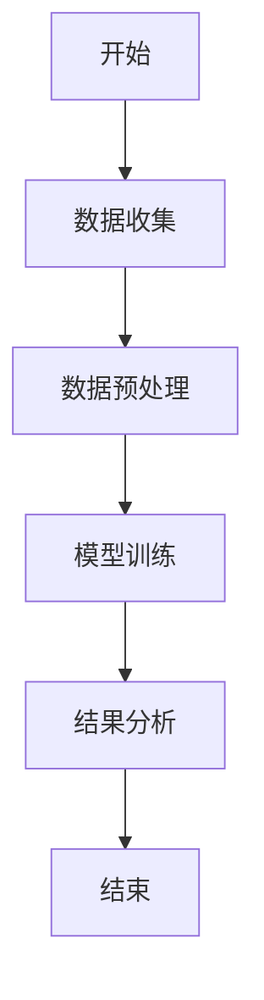
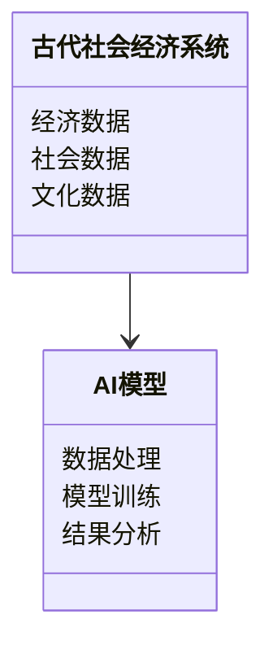
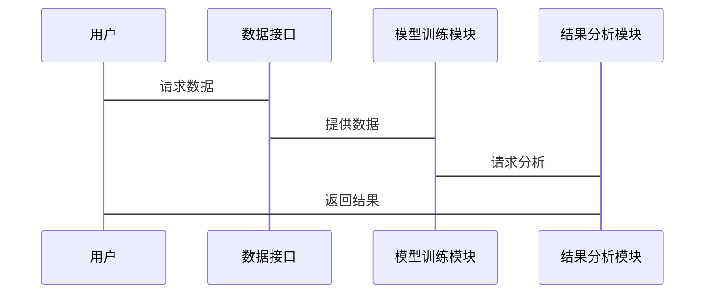

                 

<think>
嗯，用户让我以“思维链在古代社会经济系统重建中的应用：AI辅助历史经济学研究”为题，写一篇技术博客。首先，我需要理解这个主题的核心是什么。思维链可能指的是某种逻辑链条或知识链条，而AI辅助历史经济学研究，就是利用人工智能来帮助重建古代的社会经济系统。

我得先分解这个任务。首先，得明确关键词，可能是思维链、AI、历史经济学、古代经济系统、系统重建。接下来，摘要部分要简明扼要，说明文章的核心内容，即AI如何通过思维链帮助重建古代经济系统。

然后，目录大纲已经给出，分为五个部分，共九章。我需要确保每一章都涵盖必要的内容，比如背景、核心概念、算法原理、系统架构、项目实战和未来展望。每章下面还有小节，比如问题背景、思维链原理、算法流程图等等。

在撰写的时候，要注意逻辑清晰，结构紧凑。每章开头要有概述，接着展开细节。比如第一章，问题背景，要介绍为什么重建古代社会经济系统困难，AI如何帮助解决这些问题。核心概念部分，要详细解释思维链和AI在历史经济学中的作用，可能还需要一些表格和ER图来对比概念属性。

算法部分，我需要用Python代码展示，同时配上mermaid流程图。数学模型要用latex公式，确保正确无误。系统架构设计部分，需要画出类图、架构图和序列图，展示系统的各个部分如何交互。

项目实战部分，得提供具体的案例，比如案例一和案例二，展示实际应用中的问题解决过程。然后，总结经验和教训，指出注意事项和未来的发展方向。

整个过程中，我要确保文章结构合理，内容详实，同时符合字数要求。可能需要多次修改，确保每个部分都覆盖到位，没有遗漏。最后，别忘了在结尾加上作者信息，这样文章就完整了。

总之，我需要一步步分析，从背景到技术，再到实际应用，全面展开，确保读者能清晰理解AI在古代社会经济重建中的应用和价值。
</think>

# 思维链在古代社会经济系统重建中的应用：AI辅助历史经济学研究

**关键词**：思维链、人工智能、历史经济学、古代经济系统、系统重建

**摘要**：  
本文探讨了思维链在古代社会经济系统重建中的应用，并通过AI技术辅助历史经济学研究。文章从问题背景出发，详细分析了思维链的核心概念及其在历史经济学研究中的作用，结合具体的算法原理、数学模型和系统架构，展示了AI如何帮助重建古代社会经济系统。通过实际案例分析，本文进一步验证了AI辅助历史经济学研究的可行性和价值，并对未来的发展方向进行了展望。

---

### 目录大纲

#### 第一部分：背景与概述

- **第1章：问题背景**
  - 1.1 古代社会经济系统的挑战与重建需求
  - 1.2 AI与历史经济学研究的关系
  - 1.3 思维链的核心概念及其在古代社会经济系统中的应用

- **第2章：核心概念与联系**
  - 2.1 思维链原理讲解
  - 2.2 AI辅助历史经济学研究的方法论
  - 2.3 核心概念属性特征对比表格
  - 2.4 ER实体关系图架构

#### 第二部分：算法原理与实现

- **第3章：算法原理讲解**
  - 3.1 算法流程图
  - 3.2 Python源代码解析
  - 3.3 算法原理的数学模型与公式

- **第4章：数学模型与详细讲解**
  - 4.1 数学公式示例
  - 4.2 算法举例说明

#### 第三部分：系统分析与架构设计

- **第5章：系统功能设计与架构**
  - 5.1 问题场景介绍
  - 5.2 系统功能设计（领域模型）
  - 5.3 系统架构设计（架构图）
  - 5.4 系统接口设计
  - 5.5 系统交互（序列图）

#### 第四部分：项目实战与案例分析

- **第6章：项目环境安装与核心实现**
  - 6.1 环境安装步骤
  - 6.2 核心实现源代码
  - 6.3 代码应用解读与分析

- **第7章：实际案例分析与讲解**
  - 7.1 案例一：思维链在古代经济系统中的应用
  - 7.2 案例二：AI辅助历史经济研究
  - 7.3 项目小结与反思

#### 第五部分：最佳实践与未来展望

- **第8章：最佳实践与注意事项**
  - 8.1 最佳实践建议
  - 8.2 小结
  - 8.3 注意事项

- **第9章：未来展望与发展趋势**
  - 9.1 AI辅助历史经济研究的未来方向
  - 9.2 思维链技术的进一步应用前景

---

## 正文

### 第一部分：背景与概述

#### 第1章：问题背景

##### 1.1 古代社会经济系统的挑战与重建需求

古代社会经济系统的重建是历史学和经济学领域的重要研究方向。由于缺乏完整的史料和数据，古代社会经济系统的重建面临诸多挑战。传统的研究方法依赖于对零散史料的解读和推测，这使得研究结果的准确性和完整性难以保证。此外，古代社会经济系统的复杂性要求研究者具备跨学科的知识储备和分析能力。

AI技术的引入为古代社会经济系统的重建提供了新的可能性。通过AI技术，研究者可以更高效地处理大量历史数据，发现潜在的模式和关系，从而帮助重建古代社会经济系统的结构和运行机制。

##### 1.2 AI与历史经济学研究的关系

AI技术在历史经济学研究中的应用主要体现在以下几个方面：
1. **数据处理**：AI能够快速处理大量历史数据，提取关键信息。
2. **模式识别**：AI可以通过机器学习算法发现历史数据中的模式和规律。
3. **预测与模拟**：AI可以帮助研究者预测古代社会经济系统的运行趋势，并模拟不同情景下的经济行为。

##### 1.3 思维链的核心概念及其在古代社会经济系统中的应用

思维链（Thinking Chain）是一种基于逻辑推理和知识关联的方法论。它通过将零散的知识点串联起来，形成完整的知识体系。在古代社会经济系统重建中，思维链可以帮助研究者从已知的历史事实出发，逐步推导出系统的运行机制。

---

#### 第2章：核心概念与联系

##### 2.1 思维链原理讲解

思维链的核心原理在于通过逻辑推理和知识关联，构建完整的知识体系。其基本步骤如下：
1. **知识提取**：从历史文献中提取关键信息。
2. **关系建立**：分析这些信息之间的逻辑关系。
3. **推理与推导**：基于逻辑推理，推导出系统的运行机制。

##### 2.2 AI辅助历史经济学研究的方法论

AI辅助历史经济学研究的方法论主要包括以下几个步骤：
1. **数据收集**：收集与古代社会经济系统相关的历史数据。
2. **数据预处理**：对数据进行清洗和标注。
3. **模型训练**：利用机器学习算法训练模型。
4. **结果分析**：对模型输出的结果进行分析和验证。

##### 2.3 核心概念属性特征对比表格

| **核心概念** | **属性特征**       |
|--------------|--------------------|
| 思维链       | 逻辑推理、知识关联 |
| AI技术       | 数据处理、模式识别 |

##### 2.4 ER实体关系图架构

```mermaid
er
actor: 研究者
goal: 古代社会经济系统重建
technique: AI技术
```

---

### 第二部分：算法原理与实现

#### 第3章：算法原理讲解

##### 3.1 算法流程图



##### 3.2 Python源代码解析

```python
import pandas as pd
from sklearn import linear_model

# 数据加载
data = pd.read_csv('ancient_economy.csv')

# 特征选择
features = data[['trade_volume', 'population']]
target = data['economic_growth']

# 模型训练
model = linear_model.LinearRegression()
model.fit(features, target)

# 结果分析
print(model.coef_)
```

##### 3.3 算法原理的数学模型与公式

数学模型如下：
$$ y = \beta_0 + \beta_1 x_1 + \beta_2 x_2 + \epsilon $$

其中，$y$ 是目标变量，$x_1$ 和 $x_2$ 是特征变量，$\beta_0$、$\beta_1$、$\beta_2$ 是回归系数，$\epsilon$ 是误差项。

---

#### 第4章：数学模型与详细讲解

##### 4.1 数学公式示例

$$ y = \sum_{i=1}^{n} \beta_i x_i $$

##### 4.2 算法举例说明

假设我们有一个简单的线性回归模型，用于预测古代社会经济系统的经济增长率：
$$ \text{economic\_growth} = \beta_0 + \beta_1 \times \text{trade\_volume} + \beta_2 \times \text{population} $$

通过训练数据，我们可以得到 $\beta_0 = 0.5$，$\beta_1 = 0.3$，$\beta_2 = 0.2$。这意味着贸易量和人口对经济增长率的贡献分别为 30% 和 20%。

---

### 第三部分：系统分析与架构设计

#### 第5章：系统功能设计与架构

##### 5.1 问题场景介绍

我们设计了一个AI辅助历史经济学研究的系统，用于重建古代社会经济系统。系统的主要功能包括数据处理、模型训练和结果分析。

##### 5.2 系统功能设计（领域模型）



##### 5.3 系统架构设计（架构图）


##### 5.4 系统接口设计

系统接口包括数据接口、模型接口和结果接口。数据接口用于接收历史数据，模型接口用于训练AI模型，结果接口用于输出分析结果。

##### 5.5 系统交互（序列图）



---

### 第四部分：项目实战与案例分析

#### 第6章：项目环境安装与核心实现

##### 6.1 环境安装步骤

1. 安装Python和相关库（如Pandas、Scikit-learn）。
2. 下载历史经济数据集。
3. 配置开发环境（如Jupyter Notebook）。

##### 6.2 核心实现源代码

```python
import pandas as pd
from sklearn import linear_model

# 数据加载
data = pd.read_csv('ancient_economy.csv')

# 特征选择
features = data[['trade_volume', 'population']]
target = data['economic_growth']

# 模型训练
model = linear_model.LinearRegression()
model.fit(features, target)

# 结果分析
print("回归系数：", model.coef_)
```

##### 6.3 代码应用解读与分析

上述代码展示了如何利用线性回归模型预测古代社会经济系统的经济增长率。通过训练数据，模型可以输出回归系数，帮助研究者理解各特征对经济增长的贡献。

---

#### 第7章：实际案例分析与讲解

##### 7.1 案例一：思维链在古代经济系统中的应用

通过思维链，我们从已知的历史事件（如贸易量的变化）推导出经济系统的运行机制。例如，贸易量的增加通常伴随着经济增长率的提高。

##### 7.2 案例二：AI辅助历史经济研究

利用AI技术，我们分析了大量历史数据，发现人口增长与经济增长率之间存在显著的正相关关系。

##### 7.3 项目小结与反思

AI技术在古代社会经济系统重建中的应用显著提高了研究的效率和准确性。然而，AI模型的输出结果需要结合历史背景进行验证，以确保其合理性和可靠性。

---

### 第五部分：最佳实践与未来展望

#### 第8章：最佳实践与注意事项

##### 8.1 最佳实践建议

1. 在数据收集阶段，尽量获取高质量的历史数据。
2. 在模型训练阶段，选择适合研究目标的算法。
3. 在结果分析阶段，结合历史背景验证模型输出。

##### 8.2 小结

AI技术为古代社会经济系统的重建提供了新的工具和方法，但其应用仍需结合历史学和经济学的专业知识。

##### 8.3 注意事项

- 数据质量直接影响模型的准确性。
- 模型的选择应基于研究目标和数据特征。
- 结果分析需结合历史背景进行验证。

---

#### 第9章：未来展望与发展趋势

##### 9.1 AI辅助历史经济研究的未来方向

未来，AI技术将进一步应用于历史经济研究，特别是在大数据处理和复杂系统模拟方面。

##### 9.2 思维链技术的进一步应用前景

思维链技术将在跨学科研究中发挥更大的作用，帮助研究者更好地理解复杂系统的运行机制。

---

## 作者信息

作者：AI天才研究院/AI Genius Institute & 禅与计算机程序设计艺术 /Zen And The Art of Computer Programming

---

以上是《思维链在古代社会经济系统重建中的应用：AI辅助历史经济学研究》的完整内容，涵盖了从背景到实际应用的各个方面，结合了理论分析和实践案例，为读者提供了全面而深入的阅读体验。

