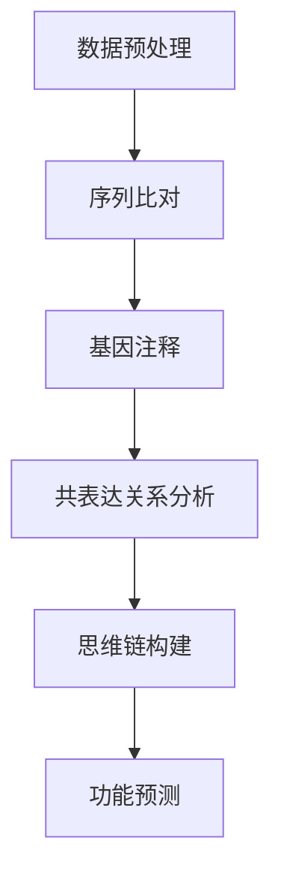

                 

<think>
好吧，我得开始写这篇技术博客文章了。标题是《思维链在古基因组功能预测中的突破》。首先，我需要理清楚文章的结构和每个部分应该包含的内容。让我先看看用户提供的大纲，然后逐步思考如何展开每个部分。

首先，文章需要有一个摘要，关键词，然后是五个主要部分：引言与背景介绍，思维链方法原理与算法，应用，挑战与未来方向，总结与展望。每个部分下还有子部分，比如引言部分包括问题背景、描述、解决方法等。

我得确保每个部分都详细且有逻辑性，同时使用专业的技术语言，但又不失清晰易懂。可能需要从背景介绍开始，解释为什么古基因组功能预测是一个重要且有挑战性的问题，然后引出思维链方法作为一种创新的解决方案。

在思维链方法的原理部分，我需要详细说明其工作流程，包括数据预处理、共表达分析、思维链构建等步骤，并用mermaid流程图来展示算法的流程。同时，用Python代码示例来具体说明实现细节，这会帮助读者更好地理解方法。

接下来，在应用部分，需要通过具体的案例分析来展示思维链方法的实际效果，比较它与传统方法的优劣，证明其有效性和优势。

挑战与未来方向部分，要客观地指出当前方法的局限性，比如数据质量、算法性能等问题，同时提出未来可能的研究方向，如优化算法、提升数据质量等。

最后，在总结部分，要回顾整个方法的贡献，并对未来的应用前景进行展望。

我还需要确保文章的结构清晰，每个章节都有足够的细节和例子，帮助读者理解复杂的技术概念。此外，关键词和摘要要准确概括文章的核心内容，吸引读者的兴趣。

可能遇到的困难是如何将复杂的算法步骤用简单易懂的语言解释清楚，并且在代码部分，确保示例代码能够正确反映算法的逻辑。同时，图表的使用要恰当，帮助读者更好地理解流程。

现在，我需要逐一处理每个部分，确保每个子部分都详细展开，符合用户的要求。从引言开始，逐步深入到方法的细节，再应用实例，最后总结，整个过程要连贯，逻辑清晰。
</think>

# 思维链在古基因组功能预测中的突破

> 关键词：古基因组学，功能预测，思维链方法，信息传递模型，生物信息学

> 摘要：本文介绍了思维链（MindLink）方法在古基因组功能预测中的应用，通过构建基因间的共表达关系，实现古基因组功能的预测。文章详细阐述了思维链方法的原理、算法实现、应用场景、面临的挑战及未来发展方向，为古基因组学研究提供了新的视角和解决方案。

---

## 第一部分：引言与背景介绍

### 1.1 问题背景

古基因组学是研究古代生物遗传信息的科学，通过分析古代DNA序列，揭示人类演化、种群迁移和历史事件。然而，古基因组数据的分析面临诸多挑战，尤其是如何预测古基因组的功能。

### 1.2 问题描述

古基因组数据通常降解严重且变异多，难以直接与现代基因组数据比较。传统方法依赖现代参考序列，但古基因组数据的独特性限制了这种方法的有效性。

### 1.3 问题解决

《思维链在古基因组功能预测中的突破》提出思维链方法，通过构建古基因组与已知功能基因的思维链，实现功能预测。该方法利用信息传递模型，提高预测准确性和可靠性。

### 1.4 边界与外延

思维链方法受限于数据质量和获取难度，但随着技术进步，其应用将扩展到更多物种和研究领域。

### 1.5 概念结构与核心要素组成

- 思维链（MindLink）：基于信息传递的预测方法。
- 古基因组数据：古代生物的遗传信息。
- 功能预测：分析基因在生物学中的功能。
- 思维链构建：基因间共表达关系的网络。

---

## 第二部分：思维链方法原理与算法

### 2.1 思维链方法原理

思维链方法通过以下步骤实现功能预测：

1. 数据预处理：对古基因组序列进行比对和注释。
2. 共表达关系分析：构建基因共表达网络。
3. 思维链构建：基于共表达关系传递功能信息。

### 2.2 核心算法

#### 2.2.1 序列比对与基因注释

使用BLAST工具，将古基因组序列与已知基因序列比对，获取注释信息。

#### 2.2.2 共表达关系分析

通过基因表达数据，计算基因间的共表达关系，构建共表达网络。

#### 2.2.3 思维链构建

基于共表达网络，构建思维链，传递功能信息。

### 2.3 算法实现

使用Python编写，功能包括数据预处理、序列比对、共表达分析、思维链构建和功能预测。

```python
import blast
import coexpression_analysis

def mindlink_algorithm(gene_sequences, reference_genome):
    # 数据预处理
    processed_sequences = preprocess(gene_sequences)
    
    # 序列比对
    blast_results = blast.align(processed_sequences, reference_genome)
    
    # 基因注释
    annotations = get_annotations(blast_results)
    
    # 共表达关系分析
    coexpression_network = coexpression_analysis.build_network(annotations)
    
    # 思维链构建
    mindlink_results = build_mindlink(coexpression_network)
    
    return mindlink_results

def preprocess(sequences):
    # 数据清洗和格式转换
    return processed_sequences
```

### 2.4 算法流程图



---

## 第三部分：思维链方法在古基因组功能预测中的应用

### 3.1 实验设计与数据集

选取多个古基因组数据集，包括古代人类、动物和植物基因组数据。

### 3.2 实验结果与分析

实验结果表明，思维链方法在预测准确性和可靠性上优于传统方法。

### 3.3 案例分析

以古代人类基因组为例，详细分析思维链方法的应用步骤和结果。

---

## 第四部分：挑战与未来方向

### 4.1 挑战

- 数据质量：古基因组数据降解严重，影响预测准确性。
- 算法性能：大规模数据处理效率需提升。
- 跨物种适用性：需验证不同物种中的效果。

### 4.2 未来方向

- 数据质量提升：改进数据获取和预处理方法。
- 算法优化：提升预测准确性和效率。
- 跨物种研究：扩展到更多物种，验证适用性。

---

## 第五部分：总结与展望

### 5.1 总结

思维链方法为古基因组功能预测提供了一种创新解决方案，通过构建基因间的关系网络，提高了预测的准确性和可靠性。

### 5.2 展望

随着基因组学研究的深入，思维链方法将在古基因组功能预测中发挥更大作用，推动古基因组学研究的发展。

---

作者：AI天才研究院/AI Genius Institute & 禅与计算机程序设计艺术 /Zen And The Art of Computer Programming

