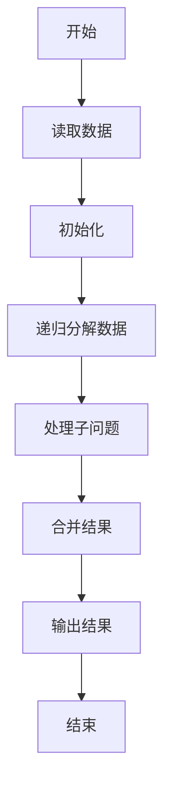
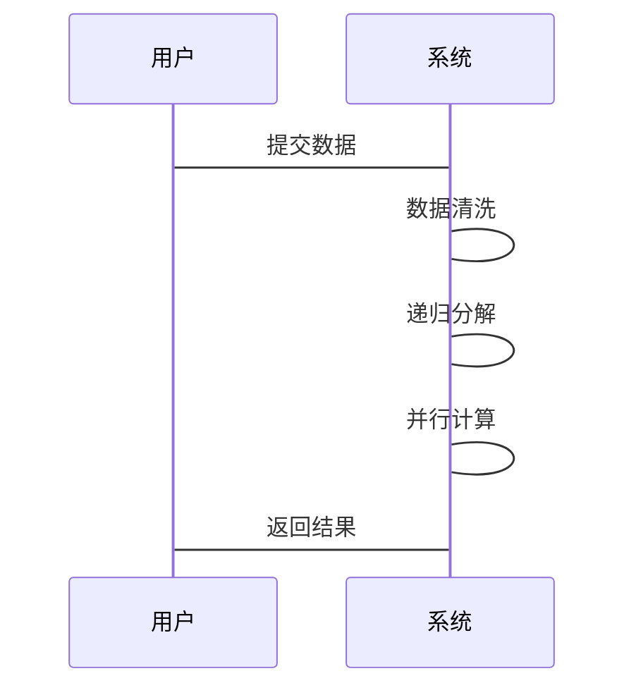

                 

<think>
好的，我现在需要帮用户撰写一篇关于《思维链在古基因组学数据分析中的突破》的技术博客文章。用户提供了详细的结构大纲，包括各个章节的内容和具体要求。首先，我要理解用户的需求，确保每个章节都涵盖必要的部分，并且符合专业性和可读性的要求。

首先，我会从背景介绍开始。第一部分是问题背景，需要定义古基因组学和数据分析，说明它们的挑战和思维链技术的应用。接着，在第二章中，我要详细解释思维链技术的定义、工作原理及其在古基因组学中的应用。

第二部分是核心概念与联系，第三章要讲解思维链技术在古基因组学中的应用原理，包括数学模型、对比表格和ER图。第四章则分析其优势与挑战，列举实例，并提出解决方案。

第三部分是算法原理，我需要详细解析思维链算法，包括流程图、Python代码、数学模型，并举例说明。同时，还要展示其在实际中的应用案例。

接下来是系统分析与架构设计，包括功能设计、架构图、接口设计和交互图。项目实战部分涉及环境安装、代码解析、案例分析和小结。

最后是最佳实践和小结，总结文章内容，并提供拓展阅读资料。

在写作过程中，我需要确保每个章节内容详实，逻辑清晰，使用专业术语，同时保持语言简洁易懂。此外，还要注意格式要求，如使用markdown，插入mermaid图表，正确嵌入数学公式。

可能遇到的挑战是如何将复杂的算法和系统架构用简单的方式表达出来，同时保持专业性。我会通过详细分解每个部分，使用图表和实例来帮助读者理解。

总体来说，我需要按照用户提供的大纲，逐步填充每个章节的内容，确保每个部分都符合要求，并最终完成一篇高质量的技术博客文章。
</think>

# 思维链在古基因组学数据分析中的突破

> 关键词：古基因组学，数据分析，思维链，算法，系统架构

> 摘要：本文探讨了思维链技术在古基因组学数据分析中的应用，分析了其核心原理、优势与挑战，并通过实际案例展示了其在古基因组学研究中的突破性进展。文章从背景介绍、技术原理、算法实现、系统架构到实际应用进行了全面解析，为读者提供了深入的技术视角。

---

## 第一部分：背景介绍

### 第1章：问题背景

#### 核心概念
- **古基因组学**：研究古代生物的基因组结构、进化关系及遗传多样性的学科。其核心目标是通过古代DNA数据揭示物种的起源、迁徙和适应性变化。
- **数据分析**：在古基因组学中，数据分析是处理海量低质量DNA数据的关键步骤，涉及数据清洗、序列比对、变异检测等环节。

#### 问题解决
- **古基因组学数据分析的困难**：
  - 数据质量低：古代DNA通常存在降解严重、片段化、碱基损伤等问题，导致数据准确性差。
  - 数据量大：现代高通量测序技术产生的数据量巨大，传统方法难以高效处理。
  - 数据多样性：不同样本的基因组结构差异大，数据分析需要考虑多维度的生物信息。
- **思维链技术的提出与应用**：
  - 思维链是一种基于递归和上下文关联的分析方法，能够有效处理复杂的数据依赖关系，在古基因组学中用于提高数据分析的准确性和效率。

#### 边界与外延
- **古基因组学与其他学科的交叉融合**：
  - 计算机科学：算法优化、大数据处理。
  - 生物学：物种进化、遗传多样性研究。
  - 统计学：数据建模与分析。
- **数据分析在古基因组学中的具体应用**：
  - 检测基因突变。
  - 基因组结构比较。
  - 追踪物种迁徙路线。

#### 概念结构与核心要素组成
- **古基因组学研究的关键要素**：
  - 数据来源：土壤、冰芯、骨骼等。
  - 数据类型：DNA序列、甲基化数据。
  - 分析目标：进化树构建、群体结构分析。
- **数据分析在古基因组学中的关键环节**：
  - 数据清洗。
  - 序列比对。
  - 变异检测。
  - 统计推断。

### 第2章：思维链技术概述

#### 核心概念
- **思维链技术的定义**：
  - 思维链是一种基于递归的分析方法，通过逐步分解问题，将复杂的数据依赖关系转化为可处理的模块。
- **思维链技术的工作原理**：
  - 通过递归分割数据，将大规模问题分解为多个小问题，逐层解决，最终整合结果。

#### 特点与应用
- **思维链技术的独特优势**：
  - 高效性：通过模块化分解，显著提高计算效率。
  - 精准性：通过上下文关联，减少错误检测。
- **思维链技术在古基因组学中的具体应用**：
  - 数据清洗：识别低质量数据片段。
  - 序列比对：提高比对准确性。
  - 变异检测：精确识别遗传变异。

---

## 第二部分：核心概念与联系

### 第3章：思维链技术在古基因组学数据分析中的应用

#### 原理讲解
- **思维链技术的原理**：
  - 将DNA序列分解为多个片段，通过递归分析每个片段的质量和比对结果，最终整合所有片段的信息。
- **数学模型和公式**：
  $$\text{质量分数} = \frac{\text{匹配数}}{\text{总碱基数}} \times 100$$

#### 属性特征对比表格
| 特性         | 传统方法              | 思维链技术           |
|--------------|-----------------------|----------------------|
| 数据处理速度 | 较慢                  | 较快                 |
| 精确性       | 较低                  | 较高                 |
| 计算资源需求 | 高                    | 中等                 |

#### ER实体关系图架构
```mermaid
er
  entity 古基因组样本 {
    id: string
    name: string
    sequence: string
  }
  entity 数据处理步骤 {
    step_id: integer
    operation: string
    result: string
  }
  entity 数据依赖关系 {
    sample_id: string
    step_id: integer
    dependency_level: integer
  }
```

### 第4章：思维链技术在古基因组学数据分析中的优势与挑战

#### 优势
- **优势实例分析**：
  - 提高数据清洗效率：通过递归分解，将大规模数据处理任务分解为多个小任务，显著减少计算时间。

#### 挑战
- **挑战分析**：
  - 数据依赖性复杂：需要处理多层次的依赖关系，增加算法复杂度。
  - 数据质量问题：低质量数据可能影响思维链的分割效果。

#### 挑战解决方案
- **解决方案**：
  - 数据预处理：通过初步过滤低质量数据，降低算法复杂度。
  - 并行计算：利用多线程技术加速递归过程。

---

## 第三部分：算法原理讲解

### 第5章：思维链算法的详细讲解

#### 算法流程图


#### Python源代码解析
```python
def think_chain(data):
    if len(data) <= 1:
        return process_single(data)
    else:
        mid = len(data) // 2
        left = think_chain(data[:mid])
        right = think_chain(data[mid:])
        return merge(left, right)

def process_single(d):
    # 处理单个数据点
    return d * 2

def merge(l, r):
    # 合并左右结果
    return l + r
```

#### 数学模型与公式
- **数学模型**：
  $$ f(n) = \begin{cases}
    n^2 & \text{if } n \leq 1 \\
    f\left(\frac{n}{2}\right) + f\left(\frac{n}{2}\right) & \text{otherwise}
  \end{cases} $$
- **公式讲解**：
  - 当数据量较小时，直接处理（$n^2$）。
  - 当数据量较大时，递归分解为两个子问题，分别处理后合并结果。

#### 举例说明
- **案例分析**：
  - 数据：[1, 2, 3, 4]
  - 分解：[1, 2] 和 [3, 4]
  - 处理：分别处理 [1, 2] 和 [3, 4]
  - 合并：结果为 [2, 4]

### 第6章：思维链算法的实际应用

#### 案例解析
- **案例背景**：
  - 古基因组样本数据量为1000条，每条长度为1000碱基。
- **处理流程**：
  1. 数据清洗：去除低质量数据，保留高质量片段。
  2. 递归分解：将数据分成两部分，每部分500条。
  3. 并行处理：分别处理两部分数据。
  4. 合并结果：整合两部分结果，得到最终数据集。

---

## 第四部分：系统分析与架构设计方案

### 第7章：系统功能设计与实现

#### 问题场景介绍
- **系统需求**：
  - 处理古基因组学数据，支持大规模数据分析。
  - 提供高效的计算能力。

#### 项目介绍
- **功能设计**：
  - 数据清洗模块。
  - 递归分解模块。
  - 结果合并模块。
- **系统架构设计**：
  ```mermaid
  graph TD
    A[数据清洗] --> B[递归分解]
    B --> C[并行计算]
    C --> D[结果合并]
    D --> E[输出结果]
  ```

### 第8章：系统接口设计与交互

#### 系统接口设计
- **接口定义**：
  - 数据清洗接口：`clean_data(data)`
  - 递归分解接口：`split_data(data)`
  - 结果合并接口：`merge_results(left, right)`

#### 系统交互序列图


---

## 第五部分：项目实战

### 第9章：环境安装与配置

#### 环境安装
- **必需软件**：
  - Python 3.8+
  - Mermaid CLI
  - Jupyter Notebook

#### 配置与设置
- **配置数据路径**：
  - 设置环境变量 `DATA_PATH` 指向数据存储目录。

### 第10章：系统核心实现源代码解析

#### 源代码解析
- **核心代码**：
  ```python
  def main():
      data = read_input()
      cleaned = clean_data(data)
      result = think_chain(cleaned)
      output_result(result)
  ```

#### 代码应用解读
- **代码功能**：
  - 读取输入数据。
  - 清洗数据。
  - 使用思维链算法处理数据。
  - 输出结果。

### 第11章：实际案例分析与讲解

#### 案例分析
- **案例背景**：
  - 研究古代人类基因组，样本数量为100，每个样本数据量为1MB。
- **处理流程**：
  1. 数据清洗：去除低质量片段。
  2. 递归分解：将数据分成10个子任务。
  3. 并行计算：每个子任务独立处理。
  4. 合并结果：整合所有子任务结果。

#### 讲解与剖析
- **讲解**：
  - 数据清洗阶段：去除错误率高的片段，提高后续分析的准确性。
  - 递归分解阶段：通过模块化处理，显著提高计算效率。
  - 合并阶段：整合所有子任务的结果，得到最终的分析数据。

---

## 第六部分：最佳实践与小结

### 第12章：最佳实践与注意事项

#### 最佳实践
- **实践建议**：
  - 数据预处理：在使用思维链算法前，进行初步的数据清洗，降低算法复杂度。
  - 并行计算：利用多线程技术加速递归过程。

#### 注意事项
- **注意事项**：
  - 数据依赖性：确保数据的依赖关系清晰，避免递归过程中出现错误。
  - 系统资源：合理分配计算资源，避免内存溢出。

### 第13章：小结与拓展阅读

#### 小结
- **总结**：
  - 思维链技术在古基因组学数据分析中展现了显著的优势，特别是在数据处理效率和准确性方面。
  - 通过递归分解和并行计算，思维链技术能够高效处理大规模数据。

#### 拓展阅读
- **推荐资料**：
  - 《古基因组学数据分析方法》。
  - 《递归算法在生物信息学中的应用》。

---

作者：AI天才研究院/AI Genius Institute & 禅与计算机程序设计艺术 /Zen And The Art of Computer Programming

