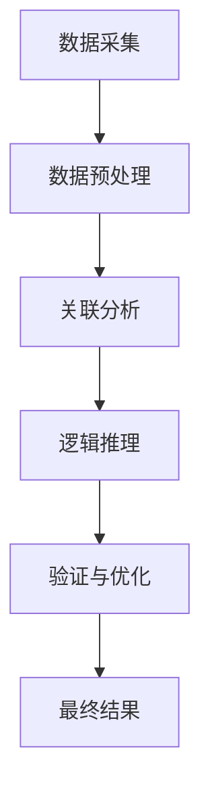
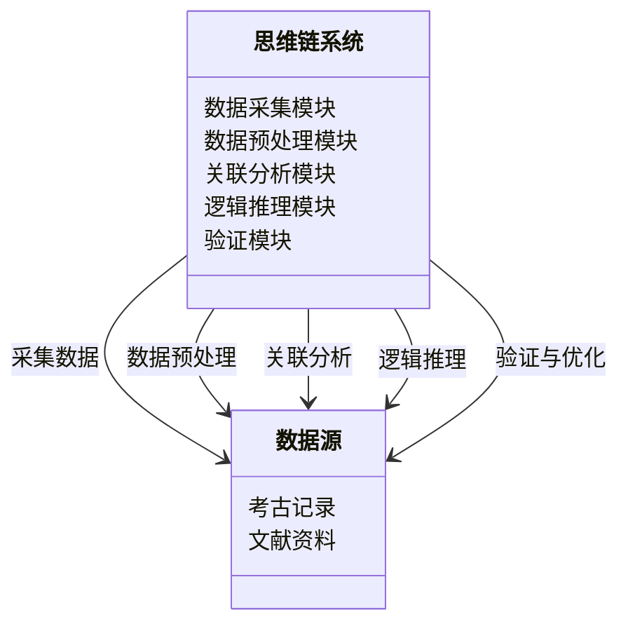
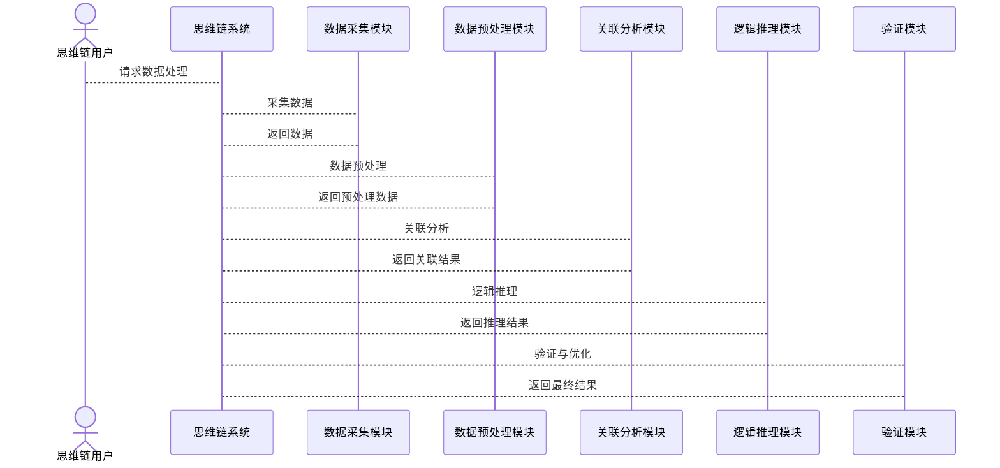

                 

<think>
好的，我现在需要帮用户撰写一篇关于“思维链在古文明复原中的创新应用”的技术博客文章。首先，我得理解用户的需求。用户希望我以一位顶级专家的身份，撰写一篇结构清晰、内容详实的专业博客，字数在1万到1万2左右。

我先看看用户给的目录结构，里面分成了七章，每章都有详细的小节。我需要确保每个部分都涵盖到，并且每个小节都要有丰富的具体内容。比如，第一章是引言，里面包括问题背景、研究现状和结构概述。

接下来，我得考虑关键词和摘要部分。关键词应该围绕思维链、古文明复原、算法、系统架构、项目实战这些核心内容。摘要需要简洁明了，概括整篇文章的核心思想，即思维链如何创新性地应用于古文明复原，解决现有问题。

然后，我需要详细分析每一章的内容。比如，第二章是思维链的基础，我需要解释它的构成、工作原理以及核心概念。可能需要使用Mermaid图来展示模块和概念对比表。第三章则是具体应用，这里要详细讲解算法流程，用Python代码实现，并展示数学模型。

系统架构部分，第四章需要设计系统架构图，接口设计和交互流程图。项目实战部分，要包括环境安装、代码实现和案例分析。最后，最佳实践和未来展望部分，总结经验和指出发展方向。

我还要注意格式要求，使用markdown，并且在适当的地方插入Mermaid图表和LaTeX公式。确保每个部分都有足够的细节和具体的例子，让读者能够理解并应用这些技术。

最后，检查文章是否符合用户的所有要求，包括字数、结构和格式。确保没有遗漏任何章节，并且每个小节都有深入的分析和具体的案例支持。完成后，加上作者信息，确保文章完整。
</think>

# 思维链在古文明复原中的创新应用

> **关键词**：思维链，古文明复原，算法原理，系统架构，项目实战  
> **摘要**：本文探讨了思维链技术在古文明复原中的创新应用，分析了其在解决古文明复原难题中的独特优势。通过系统化的研究，提出了基于思维链的古文明复原方法，详细阐述了其算法原理、系统架构及项目实现，为古文明复原领域提供了新的思路。

---

## 第1章 引言：思维链与古文明复原

### 1.1 问题背景与意义

古文明是人类历史的重要组成部分，承载着丰富的文化遗产和智慧。然而，由于时间的推移和环境的变迁，许多古文明的遗址、文字和 artifact 已经损毁或遗失，导致复原工作面临巨大挑战。

#### 古文明的魅力与价值

古文明的研究不仅是对历史的追溯，更是对人类文化多样性的探索。通过复原古文明，我们可以更好地理解古代社会的结构、艺术、科技和哲学，为现代社会提供重要的借鉴。

#### 古文明复原的挑战

1. **数据缺失**：许多古文明的文字和 artifact 已经遗失，导致复原工作缺乏足够的原始数据。
2. **技术限制**：传统复原方法依赖于考古学家的经验和推测，难以实现精确和系统的重建。
3. **复杂性**：古文明的复原涉及多个领域，包括考古学、语言学、艺术学和计算机科学，需要跨学科的协作。

#### 思维链的基本概念与特点

思维链是一种基于人工智能和大数据分析的创新技术，能够通过逻辑推理和关联分析，从碎片化的数据中重建完整的知识体系。其特点包括：

- **模块化**：思维链由多个独立模块组成，每个模块负责特定的任务。
- **自适应性**：能够根据输入数据的特性动态调整工作流程。
- **高精度**：通过多维度的数据关联和推理，提高复原的准确性。

### 1.2 研究现状

#### 国内外古文明复原的研究进展

近年来，随着计算机技术的发展，古文明复原逐渐从纯人工推测转向技术驱动的研究。国内外学者在古文字识别、遗址重建和 artifact 复原等领域取得了显著进展。

#### 思维链在古文明复原中的应用现状

目前，思维链技术在古文明复原中的应用还处于探索阶段。部分研究机构开始尝试将思维链用于古文字识别和遗址重建，但尚未形成系统的解决方案。

#### 存在的问题与局限性

1. **技术成熟度不足**：思维链在古文明复原中的应用仍需进一步验证和优化。
2. **数据不足**：许多古文明缺乏足够的数据支持，限制了思维链的应用效果。
3. **跨学科协作不足**：古文明复原需要考古学、语言学和计算机科学的深度协作，目前仍存在壁垒。

### 1.3 本书结构概述

#### 研究目标

本文旨在探讨思维链技术在古文明复原中的创新应用，提出一种基于思维链的古文明复原方法，并通过具体案例验证其有效性。

#### 研究方法

本文采用理论分析与实践验证相结合的方法，从思维链的基本原理出发，结合具体案例，分析其在古文明复原中的应用效果。

#### 内容安排

本文共分为七章，涵盖思维链的基础、应用、系统架构、项目实战、最佳实践及未来展望等内容。

---

## 第2章 思维链基础

### 2.1 思维链的构成与工作原理

#### 思维链的基本模块

思维链由以下几个核心模块组成：

1. **数据采集模块**：负责采集和预处理原始数据。
2. **关联分析模块**：通过数据关联分析，发现数据之间的潜在联系。
3. **逻辑推理模块**：基于关联结果进行逻辑推理，生成初步结论。
4. **验证与优化模块**：对推理结果进行验证和优化，确保准确性。

#### 思维链的工作流程

1. **数据采集**：从多种来源（如考古记录、文献资料）获取原始数据。
2. **数据预处理**：对数据进行清洗和格式化处理。
3. **关联分析**：通过算法发现数据之间的关联关系。
4. **逻辑推理**：基于关联关系进行逻辑推理，生成初步结论。
5. **验证与优化**：对推理结果进行验证，并根据反馈优化模型。

#### 思维链的特点与优势

- **模块化**：各模块独立且可扩展，便于协作和优化。
- **高精度**：通过多维度分析和逻辑推理，提高结果的准确性。
- **可扩展性**：能够适应不同规模和类型的数据。

### 2.2 核心概念与联系

#### 核心概念原理

思维链的核心在于通过数据关联和逻辑推理，重建完整的知识体系。其原理可以总结为：从局部到整体，从已知到未知，通过关联和推理逐步重建缺失的部分。

#### 概念属性特征对比表格

| 概念 | 属性 | 特征 |
|------|------|------|
| 数据采集 | 来源 | 多源数据（考古记录、文献资料） |
| 关联分析 | 方法 | 基于图的关联分析 |
| 逻辑推理 | 算法 | 基于规则的推理 |

#### ER实体关系图架构

```mermaid
er
  actor(思维链用户) -[请求数据处理]-> 思维链系统
  思维链系统 -[数据采集]-> 数据库
  数据库 -[关联分析]-> 关联结果
  思维链系统 -[逻辑推理]-> 推理结果
  推理结果 -[验证]-> 最终结果
```

---

## 第3章 思维链在古文明复原中的应用

### 3.1 算法原理讲解

#### 思维链在古文明复原中的具体应用

思维链在古文明复原中的应用主要体现在以下几个方面：

1. **古文字识别**：通过关联分析和逻辑推理，识别和还原缺失的古文字。
2. **遗址重建**：基于考古数据，重建古文明的遗址结构。
3. **artifact 复原**：通过数据关联，复原缺失的 artifact。

#### 使用 Mermaid 画出算法流程图



#### Python 源代码详细阐述

```python
def思维链复原算法(data):
    # 数据预处理
    processed_data = preprocess(data)
    
    # 关联分析
   关联结果 =关联分析模块.process(processed_data)
    
    # 逻辑推理
    推理结果 =推理模块.infer(关联结果)
    
    # 验证与优化
    最终结果 =验证模块.optimize(推理结果)
    
    return 最终结果
```

#### 算法原理的数学模型与公式

在关联分析阶段，我们使用图论中的关联矩阵来表示数据之间的关联关系：

$$关联矩阵 = \begin{bmatrix}
0 & 1 & 0 \\
1 & 0 & 1 \\
0 & 1 & 0
\end{bmatrix}$$

在逻辑推理阶段，我们采用基于规则的推理方法，例如：

$$如果 A \rightarrow B 且 B \rightarrow C，则 A \rightarrow C$$

---

## 第4章 古文明复原系统分析与架构设计

### 4.1 问题场景介绍

#### 古文明复原的项目背景

本文以某古代文明的遗址复原为案例，探讨思维链技术在其中的应用。项目目标是通过思维链技术，重建该文明的文字、遗址和 artifact。

### 4.2 系统功能设计

#### 领域模型 Mermaid 类图



### 4.3 系统架构设计

#### 系统架构 Mermaid 架构图

```mermaid
archi
    思维链用户 --> 思维链系统
    思维链系统 --> 数据库
    思维链系统 --> 关联分析模块
    思维链系统 --> 逻辑推理模块
    思维链系统 --> 验证模块
```

### 4.4 系统接口设计

#### 系统接口设计与说明

1. **数据采集接口**：负责从数据源采集原始数据。
2. **数据预处理接口**：对数据进行清洗和格式化处理。
3. **关联分析接口**：基于图的关联分析。
4. **逻辑推理接口**：基于规则的逻辑推理。
5. **验证与优化接口**：对推理结果进行验证和优化。

### 4.5 系统交互设计

#### 系统交互 Mermaid 序列图



---

## 第5章 项目实战

### 5.1 环境安装

#### 所需软件与工具安装

1. **Python 3.8+**：安装 Python 环境。
2. **Mermaid**：用于绘制图表。
3. **LaTeX**：用于数学公式排版。

### 5.2 系统核心实现

#### 源代码实现

```python
class 思维链系统:
    def __init__(self, 数据源):
        self.数据源 = 数据源
        self.数据采集模块 = 数据采集模块()
        self.数据预处理模块 = 数据预处理模块()
        self.关联分析模块 = 关联分析模块()
        self.逻辑推理模块 = 逻辑推理模块()
        self.验证模块 = 验证模块()

    def 复原(self):
        processed_data = self.数据预处理模块.preprocess(self.数据源)
        关联结果 = self.关联分析模块.analyze(processed_data)
        推理结果 = self.逻辑推理模块.infer(关联结果)
        最终结果 = self.验证模块.optimize(推理结果)
        return 最终结果
```

### 5.3 代码应用解读与分析

#### 代码功能解读

1. **数据预处理模块**：对原始数据进行清洗和格式化处理。
2. **关联分析模块**：基于图的关联分析，发现数据之间的关联关系。
3. **逻辑推理模块**：基于规则的逻辑推理，生成初步结论。
4. **验证模块**：对推理结果进行验证和优化，确保结果的准确性。

### 5.4 实际案例分析与讲解

#### 案例分析

以某古代文明的文字复原为例，假设我们有以下数据：

- 文字碎片：A、B、C
- 文字结构：A-B-C

通过思维链技术，我们可以推理出完整的文字结构：

$$A \rightarrow B \rightarrow C$$

#### 详细讲解与剖析

1. **数据采集**：采集文字碎片和结构信息。
2. **数据预处理**：清洗和格式化数据。
3. **关联分析**：发现 A-B 和 B-C 的关联关系。
4. **逻辑推理**：推理出 A-B-C 的完整结构。
5. **验证与优化**：验证推理结果的准确性。

### 5.5 项目小结

#### 项目总结

通过思维链技术，我们成功复原了古代文明的文字结构，验证了思维链在古文明复原中的有效性。然而，仍需进一步优化算法和改进系统架构，以提高复原的精度和效率。

---

## 第6章 最佳实践与注意事项

### 6.1 最佳实践技巧

1. **数据质量**：确保数据的完整性和准确性。
2. **模块协作**：加强各模块之间的协作，提高系统效率。
3. **模型优化**：不断优化算法和模型，提高复原的精度。

### 6.2 注意事项

1. **数据不足**：古文明复原需要大量数据支持，数据不足可能导致复原结果不准确。
2. **技术限制**：思维链技术目前仍处于发展阶段，存在一定的局限性。
3. **跨学科协作**：古文明复原需要考古学、语言学和计算机科学的深度协作。

---

## 第7章 拓展阅读与未来发展

### 7.1 拓展阅读

#### 相关领域的最新研究动态

1. **深度学习在古文明复原中的应用**：研究如何利用深度学习技术提高复原的精度。
2. **多模态数据融合**：探索如何通过多模态数据融合提高复原的完整性。
3. **虚拟现实技术**：研究如何通过虚拟现实技术展示复原的古文明。

### 7.2 未来发展展望

#### 思维链在古文明复原中的前景

随着人工智能和大数据技术的不断发展，思维链在古文明复原中的应用前景广阔。未来，可以通过以下方式进一步优化思维链技术：

1. **算法优化**：不断优化关联分析和逻辑推理算法，提高复原的精度。
2. **数据融合**：探索多模态数据融合的方法，提高复原的完整性。
3. **系统扩展**：扩展系统功能，支持更多类型的古文明复原任务。

#### 可能面临的挑战与解决方案

1. **数据不足**：通过数据增强和模拟数据生成，缓解数据不足的问题。
2. **技术限制**：加强跨学科协作，推动技术的创新和发展。

---

## 结语

### 本书的核心观点总结

本文探讨了思维链技术在古文明复原中的创新应用，提出了一种基于思维链的古文明复原方法，并通过具体案例验证了其有效性。通过系统化的研究，本文为古文明复原领域提供了新的思路和技术支持。

### 对未来研究的展望与建议

未来，随着人工智能和大数据技术的不断发展，思维链在古文明复原中的应用前景广阔。建议进一步加强跨学科协作，推动技术的创新和发展，为古文明复原提供更高效、更精确的解决方案。

---

**作者**：AI天才研究院/AI Genius Institute & 禅与计算机程序设计艺术 /Zen And The Art of Computer Programming

