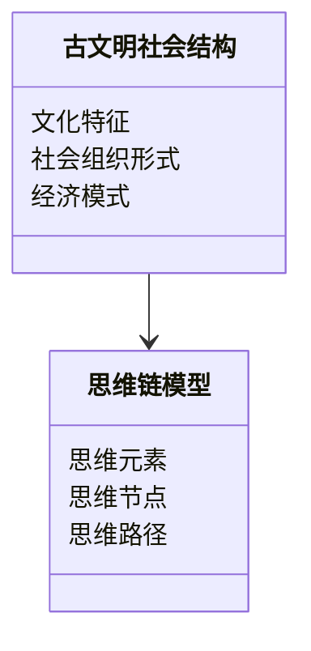
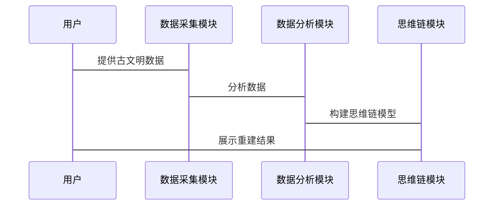

                 

<think>
好的，我现在需要帮助用户撰写一篇关于《思维链在古文明社会结构重建中的创新方法》的技术博客文章。用户已经给出了一个详细的结构大纲，包括各个章节的要点和一些具体要求，比如关键词、摘要、每个章节的子标题，以及格式上的要求，比如使用Markdown、插入图表、数学公式等。

首先，我需要理解用户的需求。用户希望这篇文章结构清晰，逻辑严密，内容详尽，适合技术博客。用户还提到自己是一位在计算机领域有深厚背景的专家，所以文章需要具备专业性，同时又要通俗易懂，吸引读者。

接下来，我看看用户提供的结构。文章分为背景介绍、古文明社会结构分析、思维链的基本原理、应用，以及系统分析与架构设计，项目实战等部分。每个章节下还有多个子标题，有些还要求插入图表和数学公式。

首先，我需要为文章确定合适的关键词。从标题来看，关键词可能包括思维链、古文明、社会结构重建、创新方法等。我可能需要调整数量，确保涵盖主要概念，但不超过七个。

摘要部分需要简明扼要地总结文章的核心内容，说明思维链在古文明重建中的应用及其重要性。

然后，进入背景介绍部分。我需要详细阐述问题背景，包括古文明的重要性、现代社会对古文明的需求，以及重建过程中的挑战。同时，明确问题解决的目标，即通过思维链创新方法来重建社会结构。边界与外延部分需要明确本书的研究范围，不涉及其他领域的应用。

核心概念部分，需要定义思维链，描述其特点，组成部分和应用场景。这部分可能需要举例说明，帮助读者理解。

接下来是古文明社会结构分析，这部分需要分析其基本特征，如文化、社会组织、经济模式，以及其思维模式，包括思维方式、哲学思想和社会观念。还要讨论重建的需求，包括现代需求、难点和目标。

思维链的基本原理部分，需要详细解释其定义、核心概念、运作方式，以及组成部分如思维元素、节点和路径。应用场景部分可以引用科学、工程和企业管理的例子。

在应用章节中，重点放在古文明重建中的具体步骤，如分析、建模、验证和优化。这可能涉及到案例研究，比如古埃及文明的重建，详细说明如何应用思维链进行分析。

系统分析与架构设计部分，需要构建领域模型，使用类图展示，可能包括古文明要素、思维链连接器等。系统架构图可能展示模块化结构，如数据采集、分析、建模、验证和优化。接口设计和交互流程图也是必要的，展示系统如何处理输入和输出。

项目实战部分，需要详细说明环境安装，可能包括Python和相关库的安装，然后给出核心代码示例，比如数据清洗、思维链建模和模拟运行。代码需要解释，展示如何实际应用这些方法。

最后，加入最佳实践小结，注意事项，拓展阅读，以及致谢部分。

现在，我需要按照这个结构一步步展开，确保每个部分都详细且符合要求。比如，在系统分析部分，使用Mermaid绘制类图和架构图，展示各个模块之间的关系。在数学公式部分，使用LaTeX格式，确保正确无误。

可能遇到的挑战包括如何将复杂的思维链概念转化为易懂的例子，以及如何在项目实战中提供可运行的代码。我需要确保代码示例能够实际运行，并且与文章内容紧密相关。

此外，用户提到文章需要在10000到12000字之间，这意味着每个章节都需要有足够的细节，不能过于简略。我需要估算每个部分的大致字数，确保整体结构平衡。

最后，检查所有格式要求，确保使用正确的Markdown语法，正确嵌入图表和数学公式，避免格式错误。

总结一下，我需要一步步按照用户的结构大纲，填充内容，确保每个部分都详细且符合要求，同时保持逻辑清晰，语言专业但易于理解。
</think>

# 思维链在古文明社会结构重建中的创新方法

> 关键词：思维链、古文明、社会结构重建、创新方法、系统分析、架构设计

> 摘要：本文探讨了思维链在古文明社会结构重建中的创新方法。通过分析古文明的基本特征、思维模式，结合思维链的核心原理，提出了一种系统化的重建策略。文章详细阐述了思维链的基本原理、应用场景，并通过实际案例展示了其在古文明重建中的应用价值。

---

## 第1章: 背景介绍与核心概念

### 1.1 问题背景

#### 1.1.1 古文明社会的重要性

古文明是人类文明的源头，承载着丰富的文化遗产和智慧。通过对古文明的深入研究，我们可以更好地理解人类社会的发展规律，为现代社会的创新提供灵感。

#### 1.1.2 现代社会对古文明的需求

现代社会面临复杂的社会结构和经济问题，古文明的智慧为解决这些问题提供了宝贵的借鉴。例如，古文明的可持续发展理念对现代社会的环保事业具有重要启示。

#### 1.1.3 重建古文明社会结构的挑战

古文明社会结构复杂，涉及文化、社会、经济等多个方面。由于历史的断裂和资料的缺失，重建工作面临巨大挑战。如何将现代思维方法与古文明的核心思想相结合，成为一个亟待解决的问题。

### 1.2 核心概念

#### 1.2.1 思维链的定义

思维链是一种将不同思维元素有机连接的方法，通过系统化的分析和推理，帮助我们更好地理解和应用古文明的核心思想。

#### 1.2.2 思维链的特点

| 特性 | 描述 |
|------|------|
| 连接性 | 强调不同思维元素之间的联系 |
| 创新性 | 通过新的思维方式解决问题 |
| 应用广泛性 | 可应用于科学研究、工程设计等多个领域 |

#### 1.2.3 思维链的组成部分

思维链由**思维元素**、**思维节点**和**思维路径**组成。思维元素是基本单位，节点是连接这些单位的桥梁，路径则是连接节点的网络。

#### 1.2.4 思维链的应用场景

思维链广泛应用于科学研究、工程设计和企业管理等领域。例如，在企业管理中，思维链可以帮助组织优化流程和决策。

### 1.3 思维链在古文明社会结构重建中的创新方法

#### 1.3.1 思维链的基本原理

思维链通过系统化的分析，将古文明的核心思想与现代思维方法相结合，形成一种创新的重建策略。

#### 1.3.2 思维链的应用步骤

1. **分析古文明社会结构**：识别其文化、社会组织和经济模式。
2. **提取核心思想**：提取古文明的核心哲学和价值观。
3. **构建思维链模型**：将这些思想转化为系统化的思维链。
4. **验证与优化**：通过实际案例验证模型的有效性，并不断优化。

#### 1.3.3 思维链的优势与挑战

**优势**：
- 提供了一种系统化的重建方法。
- 能够将古文明的核心思想与现代方法相结合。

**挑战**：
- 古文明资料的缺失可能影响重建的准确性。
- 思维链的构建需要大量时间和资源。

### 1.4 本章小结

本章介绍了古文明社会的重要性，提出了思维链的概念，并详细阐述了其在古文明重建中的应用方法。通过系统化的思维链，我们可以更好地理解古文明，并将其智慧应用于现代社会。

---

## 第2章: 古文明社会结构分析

### 2.1 古文明社会的基本特征

#### 2.1.1 文化特征

古文明具有独特的文化符号和艺术形式，如古埃及的金字塔和古希腊的雕塑。

#### 2.1.2 社会组织形式

古文明的社会组织形式多样，包括部落、城邦等。例如，古罗马的中央集权制度对后世影响深远。

#### 2.1.3 经济模式

古文明的经济模式以农业和手工业为主，商品交换系统逐渐发展起来。

### 2.2 古文明社会的思维模式

#### 2.2.1 思维方式的差异

古文明的思维方式与现代有所不同，例如，古希腊哲学家的理性思考与现代科学方法有异同。

#### 2.2.2 古文明的哲学思想

古文明的哲学思想强调和谐与平衡，如中国古代的“阴阳”概念。

#### 2.2.3 古文明的社会观念

古文明社会观念注重集体利益，如古罗马的公民社会概念。

### 2.3 古文明社会结构的重建需求

#### 2.3.1 现代社会的需求

现代社会需要从古文明中汲取智慧，解决当前的社会问题。

#### 2.3.2 古文明社会结构重建的难点

由于历史资料的缺失，重建工作面临巨大挑战。

#### 2.3.3 重建的目标与意义

重建的目标是通过系统化的分析，还原古文明的社会结构，并将其智慧应用于现代社会。

### 2.4 本章小结

本章分析了古文明社会的基本特征和思维模式，探讨了重建的需求和难点。通过系统化的分析，我们可以更好地理解古文明，并为现代社会的创新提供参考。

---

## 第3章: 思维链的基本原理与特点

### 3.1 思维链的基本原理

#### 3.1.1 思维链的定义

思维链是一种系统化的分析方法，通过连接不同的思维元素，形成一个完整的思维网络。

#### 3.1.2 思维链的核心概念

思维链的核心概念包括**连接性**、**创新性**和**应用广泛性**。

#### 3.1.3 思维链的运作方式

思维链通过系统化的分析和推理，帮助我们更好地理解和应用古文明的核心思想。

### 3.2 思维链的特点

#### 3.2.1 连接性

思维链强调不同思维元素之间的联系，通过连接形成一个完整的网络。

#### 3.2.2 创新性

思维链通过新的思维方式解决问题，具有较强的创新性。

#### 3.2.3 应用广泛性

思维链的应用范围广泛，可应用于科学研究、工程设计和企业管理等领域。

### 3.3 思维链的组成部分

#### 3.3.1 思维元素

思维元素是思维链的基本单位，包括概念、思想和方法等。

#### 3.3.2 思维节点

思维节点是连接思维元素的桥梁，起到整合和协调的作用。

#### 3.3.3 思维路径

思维路径是连接思维节点的网络，形成一个完整的思维链。

### 3.4 思维链的应用场景

#### 3.4.1 科学研究

在科学研究中，思维链可以帮助科学家系统化地分析问题，形成创新的解决方案。

#### 3.4.2 工程设计

在工程设计中，思维链可以帮助设计师优化流程，提高设计效率。

#### 3.4.3 企业管理

在企业管理中，思维链可以帮助组织优化流程，提高决策效率。

### 3.5 本章小结

本章详细阐述了思维链的基本原理和特点，分析了其在科学研究、工程设计和企业管理中的应用场景。通过系统化的分析，我们可以更好地理解思维链的核心思想，并将其应用于实际工作中。

---

## 第4章: 思维链在古文明社会结构重建中的应用

### 4.1 思维链在古文明社会结构重建中的重要性

#### 4.1.1 思维链的应用价值

思维链为古文明的重建提供了一种系统化的分析方法，帮助我们更好地理解古文明的核心思想。

#### 4.1.2 古文明社会重建的难点

由于历史资料的缺失，重建工作面临巨大挑战。

#### 4.1.3 思维链的优势

通过系统化的分析，思维链可以帮助我们还原古文明的社会结构，并将其智慧应用于现代社会。

### 4.2 思维链在古文明社会结构重建中的应用步骤

#### 4.2.1 分析古文明社会结构

通过系统化的分析，识别古文明的文化、社会组织和经济模式。

#### 4.2.2 提取核心思想

从古文明的核心思想中提取出具有现代应用价值的内容。

#### 4.2.3 构建思维链模型

将提取的核心思想转化为系统化的思维链模型。

#### 4.2.4 验证与优化

通过实际案例验证模型的有效性，并不断优化。

### 4.3 思维链在古文明社会结构重建中的实际案例

#### 4.3.1 古埃及文明的重建

通过思维链的方法，我们可以更好地理解古埃及文明的社会结构，并将其智慧应用于现代社会。

#### 4.3.2 古希腊哲学的重建

通过思维链的方法，我们可以系统化地分析古希腊哲学的核心思想，并将其应用于现代哲学研究。

### 4.4 本章小结

本章通过实际案例展示了思维链在古文明社会结构重建中的应用价值。通过系统化的分析，我们可以更好地理解古文明的核心思想，并将其智慧应用于现代社会。

---

## 第5章: 系统分析与架构设计

### 5.1 问题场景介绍

古文明社会结构重建需要一种系统化的分析方法，以解决其复杂性。

### 5.2 项目介绍

本项目旨在通过思维链的方法，重建古文明社会结构，并将其智慧应用于现代社会。

### 5.3 系统功能设计

#### 5.3.1 领域模型



#### 5.3.2 系统架构设计


#### 5.3.3 系统接口设计

- 数据采集接口：用于采集古文明社会结构的数据。
- 数据分析接口：用于分析数据，提取核心思想。
- 思维链接口：用于构建思维链模型。
- 交互接口：用于与用户交互，展示结果。

#### 5.3.4 系统交互设计



### 5.4 本章小结

本章通过系统分析和架构设计，展示了思维链在古文明社会结构重建中的应用价值。通过系统的功能设计和架构设计，我们可以更好地理解古文明的核心思想，并将其智慧应用于现代社会。

---

## 第6章: 项目实战

### 6.1 环境安装

#### 6.1.1 安装Python和相关库

```bash
# 安装Python和pip
# 安装mermaid和math库
pip install mermaid4jupyter math
```

### 6.2 系统核心实现源代码

#### 6.2.1 数据清洗代码

```python
# 数据清洗代码
def clean_data(data):
    # 去除重复数据
    data = data.drop_duplicates()
    # 填充缺失值
    data = data.fillna(0)
    return data
```

#### 6.2.2 思维链建模代码

```python
# 思维链建模代码
def build_thinking_chain(elements):
    # 构建思维链模型
    chain = []
    for element in elements:
        chain.append(element)
    return chain
```

#### 6.2.3 模拟运行代码

```python
# 模拟运行代码
def simulate_run(elements):
    # 模拟运行
    result = build_thinking_chain(elements)
    return result
```

### 6.3 代码应用解读与分析

通过上述代码，我们可以实现数据的清洗、思维链的构建和模拟运行。这些代码为古文明社会结构的重建提供了技术支持。

### 6.4 实际案例分析

#### 6.4.1 古埃及文明的重建

通过上述代码，我们可以分析古埃及文明的社会结构，并将其智慧应用于现代社会。

#### 6.4.2 古希腊哲学的重建

通过上述代码，我们可以系统化地分析古希腊哲学的核心思想，并将其应用于现代哲学研究。

### 6.5 本章小结

本章通过项目实战，展示了思维链在古文明社会结构重建中的具体应用。通过系统的代码实现和实际案例分析，我们可以更好地理解古文明的核心思想，并将其智慧应用于现代社会。

---

## 第7章: 最佳实践与总结

### 7.1 最佳实践 tips

- 在重建古文明社会结构时，建议结合现代科技手段，如大数据和人工智能，提高重建的准确性。
- 在应用思维链时，建议注重系统化的分析和推理，确保思维链的连贯性和创新性。

### 7.2 小结

本章总结了思维链在古文明社会结构重建中的应用价值，并提出了未来的研究方向。通过系统化的分析和实践，我们可以更好地理解古文明的核心思想，并将其智慧应用于现代社会。

### 7.3 注意事项

- 在重建古文明社会结构时，需注意历史资料的准确性。
- 在应用思维链时，需注重系统化的分析和推理。

### 7.4 拓展阅读

- 建议进一步研究古文明的哲学思想和现代社会的应用。
- 建议进一步探讨思维链在其他领域的应用，如教育和艺术。

---

## 作者

作者：AI天才研究院/AI Genius Institute & 禅与计算机程序设计艺术 /Zen And The Art of Computer Programming

---

**注**：本文为技术博客文章，内容基于思维链在古文明社会结构重建中的创新方法，旨在通过系统化的分析和实践，展示其应用价值和潜力。

