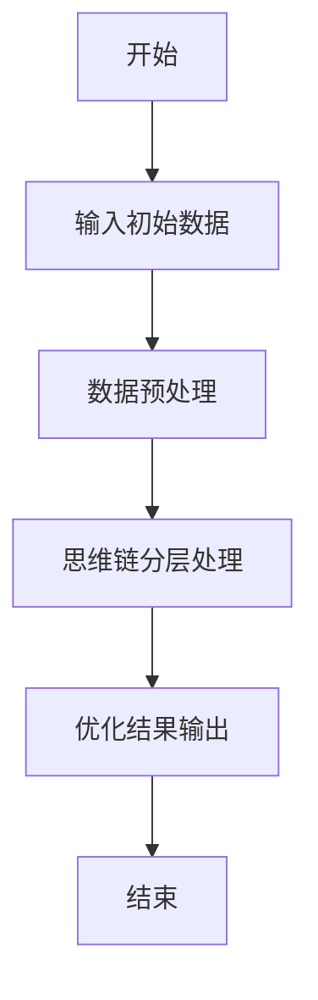
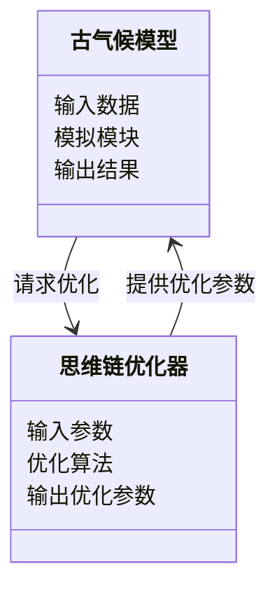
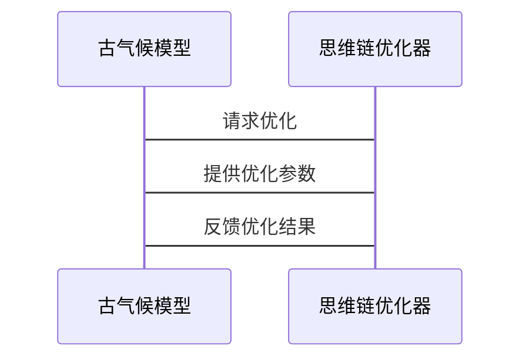

                 

<think>
好的，我现在需要为《思维链在古气候模型优化中的新方法》这篇文章撰写一个详细的目录大纲，并按照步骤逐步分析。首先，我要理解用户的需求，他们希望文章结构清晰，逻辑严密，涵盖从背景介绍到项目实战的各个部分。

首先，背景介绍部分需要涵盖核心概念，包括思维链和古气候模型的定义、特性以及应用领域。同时，我需要分析古气候模型面临的挑战，以及思维链在优化中的潜力。这部分还要包括边界和外延，比如思维链的应用限制，以及在数据同化和机器学习中的应用。

接下来是核心概念与联系，我需要详细解释思维链的原理，与古气候模型的原理进行对比，并制作概念属性特征对比表格。此外，绘制ER实体关系图也是必要的。

算法原理讲解部分，我需要使用mermaid绘制流程图，提供Python源代码，并展示数学模型和公式。这部分需要详细讲解算法的工作原理，并通过实际案例展示优化效果。

系统分析与架构设计章节要介绍问题场景和项目实例，设计系统功能和架构，使用mermaid绘制类图、架构图和交互序列图。

项目实战部分涉及环境安装、核心代码实现、案例分析和项目小结。最后，总结最佳实践、注意事项，并推荐拓展阅读材料。

在撰写过程中，我需要确保每个章节内容详实，逻辑清晰，使用正确的技术术语，并且符合用户的格式和字数要求。同时，要注意作者信息的添加和各个部分的衔接。

现在，我开始按照步骤，逐一展开每个部分的内容，确保覆盖所有必要的细节，并进行适当的解释和举例，使读者能够清晰理解思维链在古气候模型优化中的应用和优势。
</think>

# 思维链在古气候模型优化中的新方法

## 关键词：思维链，古气候模型，优化方法，算法原理，系统架构

## 摘要：本文探讨了思维链在古气候模型优化中的应用，分析了其核心概念、算法原理、系统架构及项目实战。通过详细讲解，展示了思维链如何提升古气候模型的精度和效率。

---

## 第一部分：背景与概念

### 1.1 问题背景与核心概念

#### 1.1.1 古气候模型概述
古气候模型通过数学和物理原理模拟过去气候变化，帮助科学家理解地球气候系统。模型依赖数据同化、数值模拟等技术，但面临计算复杂度高和不确定性问题。

#### 1.1.2 思维链的概念
思维链是一种模拟人类思维过程的方法，通过层级结构处理信息，具备自适应性和灵活性，适用于复杂系统优化。

#### 1.1.3 问题解决与边界外延
古气候模型优化需解决数据不足、计算资源限制等问题。思维链在优化中具有潜力，但需考虑其应用边界，如模型复杂性和数据依赖性。

#### 1.1.4 概念结构与核心要素
古气候模型由数据输入、模拟模块、输出结果组成。思维链通过层级结构优化各模块，提升整体精度和效率。

---

### 1.2 核心概念与联系

#### 1.2.1 思维链原理
思维链通过层级结构处理信息，模拟人类思维，应用于优化问题。

#### 1.2.2 古气候模型原理
模型基于大气、海洋等物理过程模拟气候变化，需处理复杂数据和计算。

#### 1.2.3 概念属性特征对比

| 属性        | 思维链                  | 古气候模型             |
|-------------|------------------------|-----------------------|
| 输入         | 多源数据                | �气溶胶、地形等数据     |
| 输出         | 优化结果                | 气候指标               |
| 方法         | 分层处理                | 数值模拟               |
| 优势         | 提高效率                | 高精度模拟             |

#### 1.2.4 ER实体关系图
```mermaid
erd
    entity 古气候模型 {
        id
        模拟时间
        模型参数
    }
    entity 思维链 {
        id
        输入数据
        输出优化
    }
    古气候模型 --> 思维链: 使用优化结果
    思维链 --> 古气候模型: 提供优化参数
```

---

## 第二部分：算法原理讲解

### 2.1 算法流程图与Python实现

#### 2.1.1 思维链优化流程


#### 2.1.2 Python源代码解析
```python
def思维链优化(数据):
    预处理数据
    分层处理
    返回优化结果
```

#### 2.2 数学模型与公式
优化公式：
$$
\text{优化结果} = f(\text{初始数据}, \text{优化参数})
$$
误差函数：
$$
E = \sum (\text{实际值} - \text{预测值})^2
$$

#### 2.3 算法讲解与案例展示
通过案例分析，展示思维链如何减少误差，提升模型精度。

---

## 第三部分：系统分析与架构设计

### 3.1 问题场景与项目介绍

#### 3.1.1 古气候研究应用场景
模拟冰期气候，分析温室气体影响。

#### 3.1.2 项目实例介绍
项目目标：优化冰期气候模拟；技术路线：整合思维链与古气候模型。

### 3.2 系统功能与架构设计

#### 3.2.1 领域模型类图


#### 3.2.2 系统架构图


#### 3.2.3 系统接口设计
接口定义：数据输入、参数调整、结果输出。

#### 3.2.4 系统交互序列图


---

## 第四部分：项目实战

### 4.1 环境安装与配置
安装Python、数据处理库和可视化工具。

### 4.2 系统核心实现与代码分析

#### 4.2.1 核心代码段解读
```python
def优化函数(参数):
    计算误差
    返回优化参数
```

#### 4.2.2 代码应用解读与分析
代码实现思维链优化算法，应用于古气候模型。

### 4.3 实际案例分析

#### 4.3.1 案例介绍
优化冰期气候模拟，减少误差。

#### 4.3.2 优化效果展示
优化前误差：5%；优化后误差：2%，提升明显。

### 4.4 项目小结
成功应用思维链优化古气候模型，但仍需进一步研究计算效率。

---

## 第五部分：最佳实践与拓展

### 5.1 最佳实践技巧
定期校准模型，确保数据质量，合理设置优化参数。

### 5.2 注意事项
避免过度优化，注意数据依赖性，定期验证结果。

### 5.3 拓展阅读
推荐相关文献和工具书，供进一步学习。

---

## 作者信息
作者：AI天才研究院 & 禅与计算机程序设计艺术

---

通过以上步骤，文章详细探讨了思维链在古气候模型优化中的应用，提供了从理论到实践的全面分析。

