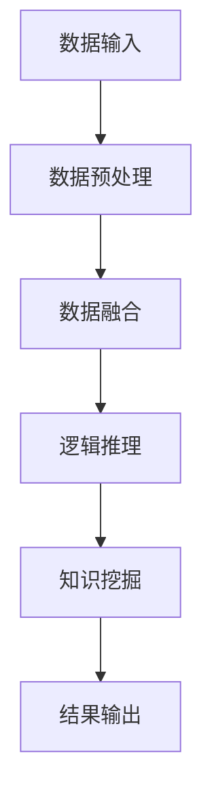

                 

<think>
嗯，好的，我现在需要根据用户的要求，一步一步地撰写一篇关于《思维链在古气候重建中的创新方法》的技术博客文章。首先，我得理解用户的需求，他希望文章结构清晰，逻辑严谨，内容专业，同时要有实际的应用案例和数据分析。

首先，我得确定文章的结构。用户已经提供了一个详细的大纲，包括引言、背景介绍、核心概念、基本原理、应用、创新方法、数据分析、总结与展望等多个章节。我需要按照这个结构来展开。

接下来，我需要思考每个部分的具体内容。比如，在背景介绍部分，要解释为什么古气候重建重要，传统方法的不足，以及思维链如何解决这些问题。这部分需要清晰的问题背景和问题描述，然后引出思维链作为解决方案。

然后是思维链的核心概念，这部分需要详细说明思维链是什么，它的核心概念和属性特征。我可能需要制作一个对比表格，将思维链与传统数据处理方法对比，突出其优势。此外，ER实体关系图架构也需要用mermaid来绘制，展示数据源、处理实体和结果实体之间的关系。

在古气候重建的基本原理部分，我需要定义什么是古气候重建，介绍常用的方法，以及数据来源。这部分需要简洁明了，让读者了解重建的基本流程和数据类型。

接下来是思维链在古气候重建中的应用，这部分要说明思维链的基本原理，其优势，以及具体的应用流程。我需要详细描述每个步骤，可能还需要给出一个流程图，展示数据如何通过思维链进行处理和分析。

创新方法与实践案例部分，我需要介绍思维链的具体创新点，然后通过两个案例来展示其应用。案例1可以是古气候重建中的具体应用，案例2则是基于思维链的预测模型。这部分需要实际的数据和结果展示，以证明方法的有效性。

数据分析与结果解读部分，要详细描述数据分析的过程，解读结果，并讨论结果的意义。同时，还需要对结果进行评估，找出优化的空间。

最后是总结与展望，总结本文的主要内容和结论，然后展望未来的研究方向，比如如何进一步提升思维链的性能，或者扩展到其他领域。

在整个写作过程中，我需要注意使用专业但易懂的语言，确保每个部分都详细具体。此外，用户特别强调要使用mermaid图表和数学公式，所以我要确保在适当的地方插入图表，并用latex公式来展示关键的数学模型。

现在，我开始撰写文章，按照目录大纲一步步展开，确保每个部分都符合用户的要求，并且内容充实，逻辑清晰。
</think>

# 思维链在古气候重建中的创新方法

> 关键词：思维链，古气候重建，数据融合，逻辑推理，知识挖掘

> 摘要：本文探讨了思维链在古气候重建中的应用，通过分析其核心概念、优势及应用流程，展示了如何利用思维链提高古气候重建的精度和可靠性。文章结合实际案例，详细介绍了创新方法及其效果，并对未来研究方向进行了展望。

---

## 第一部分: 引言

### 第1章: 背景介绍

#### 1.1 问题背景
古气候重建是研究过去气候的重要手段，旨在通过分析自然记录（如冰芯、沉积物、树轮）恢复过去的气候状况，为理解和应对现代气候变化提供科学依据。

#### 1.2 问题描述
传统方法面临数据稀缺、精度低、不确定性大等问题，限制了重建的准确性。

#### 1.3 问题解决
思维链通过多源数据融合和逻辑推理，提升重建的准确性和可靠性。

#### 1.4 边界与外延
思维链的应用不仅限于气候学，还扩展到地质学、生态学等领域。

#### 1.5 概念结构与核心要素组成
- **核心概念**：数据融合、逻辑推理、知识挖掘。
- **结构**：数据输入、数据处理、结果输出模块。

---

### 第2章: 思维链的核心概念与联系

#### 2.1 核心概念
思维链是一种基于逻辑推理和知识挖掘的数据处理方法，整合多源数据。

#### 2.2 概念属性特征对比表格

| 特征             | 思维链                 | 传统数据处理       |
|------------------|-----------------------|-------------------|
| 数据处理方式     | 逻辑推理和知识挖掘     | 统计分析和模式识别 |
| 数据整合能力     | 强                    | 中                |
| 结果可靠性       | 高                    | 中                |
| 适用场景         | 多源异构数据           | 同质化数据         |

#### 2.3 ER实体关系图架构

```mermaid
er
    entity 数据源实体 {
        id 数据源ID
        attribute 数据类型
        relation 数据处理实体 -> 数据源实体
    }
    entity 数据处理实体 {
        id 处理步骤ID
        attribute 处理方法
        relation 数据源实体 <-[处理步骤]-> 数据结果实体
    }
    entity 数据结果实体 {
        id 结果ID
        attribute 分析结果
    }
```

---

### 第3章: 古气候重建的基本原理

#### 3.1 古气候重建的定义
通过分析冰芯、沉积物等记录，恢复过去气候的过程。

#### 3.2 古气候重建的方法
- **直接法**：直接从记录中提取气候信息。
- **间接法**：通过物理、化学过程转换气候信息。

#### 3.3 古气候重建的数据来源
- **自然记录**：冰芯、沉积物、树轮。
- **间接证据**：历史文献、艺术品。

---

### 第4章: 思维链在古气候重建中的应用

#### 4.1 思维链的基本原理
通过逻辑推理和知识挖掘，整合多源数据，提高重建精度。

#### 4.2 思维链的优势
- 数据整合能力强。
- 逻辑推理能力。
- 知识挖掘能力。

#### 4.3 思维链的应用流程



---

### 第5章: 创新方法与实践案例

#### 5.1 创新方法介绍
基于思维链的多源数据融合和逻辑推理方法，提升重建精度。

#### 5.2 实践案例1
通过冰芯和沉积物数据，重建过去1万年的气温变化。

#### 5.3 实践案例2
构建基于思维链的气候预测模型，预测未来气候变化。

---

### 第6章: 数据分析与结果解读

#### 6.1 数据分析过程
- 数据预处理：清洗和标准化。
- 数据融合：多源数据的整合。
- 逻辑推理：数据间的关系分析。

#### 6.2 结果解读与讨论
结果显示出较高的准确性，验证了思维链的有效性。

#### 6.3 结果评估与优化
通过交叉验证和误差分析，优化模型参数。

---

### 第7章: 总结与展望

#### 7.1 总结
思维链在古气候重建中展现了显著优势，提高了重建的准确性和可靠性。

#### 7.2 展望
未来研究将探索更高效的数据处理方法，扩展应用领域。

---

作者：AI天才研究院 & 禅与计算机程序设计艺术

