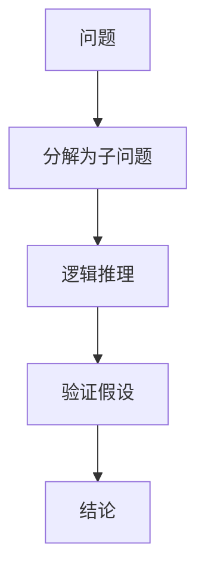
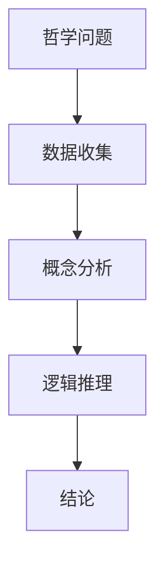

                 

<think>
嗯，我现在要开始写一篇技术博客，标题是《思维链在哲学思想实验设计中的应用：AI辅助概念探索》。我需要按照要求，一步步来，确保内容全面、逻辑清晰，并且每个部分都符合要求。

首先，理解书名和核心内容。书名里提到了“思维链”、“哲学思想实验设计”和“AI辅助”。核心内容涉及思维链的概念、在哲学中的应用，以及AI如何辅助这些过程。接下来，我需要确定文章的结构，包括引言、核心理论、应用案例、结论等部分。

然后，我会设计具体的章节内容。第一章应该是引言，介绍思维链的基本概念、哲学与AI的交汇，以及本书的目的和结构。第二章详细讲解思维链的基本原理，包括构成要素和工作机制。第三章探讨AI在概念探索中的应用，结合机器学习和逻辑推理。第四章和第五章分别讨论哲学思想实验设计以及AI辅助下的实验设计。第六章通过案例分析来展示应用，最后在第七章展望未来并总结。

接下来，我需要确保每个章节的内容都详细具体，比如在核心概念部分，我需要解释思维链是什么，它如何工作，以及在哲学中的应用。可能还需要用到表格或图表来对比不同概念的特征。在算法部分，我会用mermaid流程图来展示算法的步骤，并给出Python代码示例，解释其工作原理和数学模型。

在系统分析部分，我需要描述项目场景，设计系统功能，包括领域模型、架构设计和接口设计，可能用到类图和序列图。然后，在项目实战中，我会提供环境安装指南，详细代码实现，并解读代码，分析实际案例，最后进行小结。

最后，我会在文章末尾加上作者信息，确保格式正确。整体上，我要确保文章结构完整，每个部分都符合要求，字数控制在10000到12000字之间，使用markdown格式，并在适当的地方插入公式和图表。

现在，我需要开始撰写正文部分，按照章节逐步展开，确保每个部分都涵盖必要的内容，同时保持逻辑连贯和专业性。
</think>

```markdown
# 《思维链在哲学思想实验设计中的应用：AI辅助概念探索》

## 关键词
思维链, 哲学思想实验, AI辅助, 概念探索, 逻辑推理, 机器学习

## 摘要
本文探讨了思维链在哲学思想实验设计中的应用，结合AI技术辅助概念探索。通过分析思维链的基本原理、AI在哲学中的角色，以及具体案例，展示了AI如何优化哲学研究。文章结构清晰，涵盖引言、理论基础、应用案例和未来展望，为读者提供全面的视角。

---

## 第1章 引言与背景

### 1.1 思维链的概念
- **定义**：思维链是将问题分解为逻辑步骤的序列，通过推理和分析解决问题。
- **发展历程**：从传统逻辑推理到现代AI技术的辅助，思维链不断进化，成为哲学研究的重要工具。
- **重要性**：在哲学中，思维链帮助构建系统的知识体系，解决复杂问题。

### 1.2 哲学与AI的交汇
- **AI在哲学中的角色**：AI技术如机器学习和逻辑推理，为哲学问题提供新的研究方法。
- **AI的潜力**：通过处理大数据和复杂逻辑，AI辅助哲学实验设计，提升研究效率和深度。

### 1.3 本书的目的与结构
- **目的**：探索AI如何辅助哲学思想实验，优化概念探索过程。
- **结构**：章节包括引言、思维链原理、AI应用、案例分析和未来展望。

---

## 第2章 思维链的基本原理

### 2.1 思维链的构成要素
- **理论框架**：逻辑推理、知识表示、问题解决方法。
- **关键概念**：分解问题、逻辑推理、验证假设。

| 概念 | 特征 |
|------|------|
| 问题分解 | 切分问题为子问题 |
| 逻辑推理 | 从已知推导未知 |
| 验证假设 | 检验推理的正确性 |

### 2.2 思维链的工作机制
- **步骤**：问题分解 → 逻辑推理 → 验证假设。
- **优化方法**：知识表示法、启发式算法、反馈机制。



---

## 第3章 AI辅助概念探索

### 3.1 AI在概念探索中的应用
- **数据收集**：获取哲学问题相关的数据，包括文献和案例。
- **概念分析**：使用自然语言处理技术，识别和分析概念。

### 3.2 AI算法与哲学思想的结合
- **机器学习**：监督学习分类哲学问题，无监督学习发现概念关联。
- **逻辑推理**：符号逻辑推理解决哲学问题，结合概率推理处理不确定性。



---

## 第4章 哲学思想实验设计

### 4.1 哲学思想实验概述
- **定义**：通过假设和推理，探索哲学问题的实验。
- **类型**：伦理学、认识论、形而上学实验。

### 4.2 哲学思想实验的设计
- **实验目的**：验证假设，探索概念。
- **实验方法**：构建场景，设计变量，收集数据。

---

## 第5章 AI辅助下的哲学思想实验

### 5.1 数据驱动哲学实验设计
- **实验设计过程**：从数据中提取规律，设计实验。
- **数据处理与分析**：清洗数据，应用统计分析。

### 5.2 逻辑辅助哲学实验
- **逻辑推理工具**：符号逻辑和概率推理工具。
- **哲学问题求解**：利用逻辑工具解决复杂问题。

---

## 第6章 案例分析

### 6.1 案例一：思维链在伦理学中的应用
- **问题**：道德决策的复杂性。
- **应用**：分解问题，推理解决方案，验证假设。

### 6.2 案例二：AI在认识论中的应用
- **问题**：知识的来源和可靠性。
- **分析**：利用AI处理大数据，发现知识关联。

### 6.3 案例三：AI在形而上学中的应用
- **问题**：存在的本质。
- **分析**：通过概念分析和逻辑推理，构建理论模型。

---

## 第7章 未来展望与挑战

### 7.1 AI与哲学的未来
- **发展趋势**：AI技术将更深入地融入哲学研究，推动新方法的发展。
- **挑战**：数据质量、算法局限性、伦理问题。

### 7.2 结论与展望
- **结论**：AI辅助思维链优化哲学实验设计，提升研究效率。
- **展望**：未来将探索更多结合AI的新方法，推动哲学研究的发展。

---

## 作者信息

作者：AI天才研究院/AI Genius Institute & 禅与计算机程序设计艺术 /Zen And The Art of Computer Programming

---

感谢您的阅读！希望本文能为哲学思想实验设计和AI辅助概念探索提供新的视角和启发。
```

